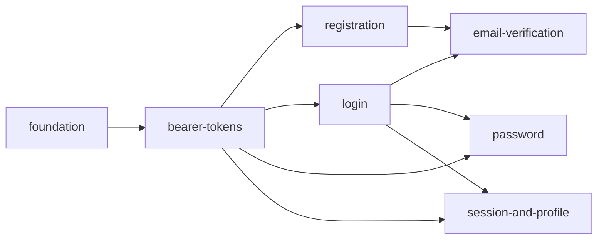

# Auth Backend API — Índice de specs

**Escopo do módulo:** backend Laravel em `backend/modules/Auth/` — endpoints `/api/v1` de identidade, credenciais e sessão Bearer.

**Fora do escopo:** BFF Next.js, UI, cookies, CSRF, comandos do módulo `Operations`.

**Fase alvo:** Fase 1 (Auth + BFF) — este índice cobre somente a API Laravel.

---

## Como usar

1. Desenvolver **uma fatia por vez**, na ordem sugerida abaixo.
2. Cada fatia tem sua própria pasta com `spec.md` (e, quando avançar, `design.md`, `tasks.md`, `validation.md`).
3. Só abrir a próxima fatia depois que a anterior tiver critérios de aceite atendidos e testes do escopo passando.
4. IDs `AUTH-XX` são estáveis neste índice; specs filhas referenciam esses IDs para rastreabilidade.

---

## Mapa de fatias

| Ordem | Fatia | Pasta | Status | Depende de | Endpoints / entrega |
| --- | --- | --- | --- | --- | --- |
| 1 | Fundação do módulo | [foundation](./foundation/spec.md) | Rascunho | Fase 0 (Docker, quality gates) | Scaffold hexagonal, migrations, domínio compartilhado |
| 2 | Tokens Bearer | [bearer-tokens](./bearer-tokens/spec.md) | Pendente | foundation | Middleware, emissão, revogação, TTL e idle |
| 3 | Registro por convite | [registration](./registration/spec.md) | Pendente | bearer-tokens | `POST /api/v1/auth/register` |
| 4 | Login | [login](./login/spec.md) | Pendente | bearer-tokens | `POST /api/v1/auth/login` |
| 5 | Verificação de e-mail | [email-verification](./email-verification/spec.md) | Pendente | registration, login | `POST …/email/verify`, `POST …/email/verification-notification` |
| 6 | Senha (alterar e recuperar) | [password](./password/spec.md) | Pendente | bearer-tokens, login | `POST …/password/change`, `…/reset-request`, `…/reset` |
| 7 | Sessão e perfil | [session-and-profile](./session-and-profile/spec.md) | Pendente | bearer-tokens, login | `POST …/logout`, `…/logout-all`, `GET/PATCH /api/v1/me` |

---

## Catálogo de features (AUTH-XX)

Referência única — detalhes ficam na spec da fatia correspondente.

| ID | Feature | Fatia |
| --- | --- | --- |
| AUTH-01 | Allowlist de e-mail (convite) | registration |
| AUTH-02 | Resposta anti-enumeração no registro | registration |
| AUTH-03 | Cadastro com aceite de termos | registration |
| AUTH-04 | Estado inicial `pending_verification` | registration |
| AUTH-05 | Emissão de token `verification` no registro | registration |
| AUTH-06 | Política de comprimento de senha (12–128) | foundation |
| AUTH-07 | Política de complexidade de senha | foundation |
| AUTH-08 | Hash Argon2id | foundation |
| AUTH-09 | Login por credencial | login |
| AUTH-10 | Token por estado da conta | login |
| AUTH-11 | Bloqueio por `suspended` / `deletion_pending` | login |
| AUTH-12 | Novo login obrigatório após verificação | email-verification |
| AUTH-13 | Tipos de token `verification` e `session` | bearer-tokens |
| AUTH-14 | Armazenamento de token por hash | bearer-tokens |
| AUTH-15 | TTL absoluto por tipo | bearer-tokens |
| AUTH-16 | Expiração por inatividade | bearer-tokens |
| AUTH-17 | Throttle de `last_used_at` (15 min) | bearer-tokens |
| AUTH-18 | Autenticação `Authorization: Bearer` | bearer-tokens |
| AUTH-19 | Restrição de endpoint por `token_kind` | bearer-tokens |
| AUTH-20 | Envio de verificação via Resend (job) | email-verification |
| AUTH-21 | Token de e-mail de verificação (60 min, uso único) | email-verification |
| AUTH-22 | Verificação somente por `POST` explícito | email-verification |
| AUTH-23 | Reenvio de verificação | email-verification |
| AUTH-24 | Ativação pós-verificação + revogação do token restrito | email-verification |
| AUTH-25 | Privacidade de URL com token de e-mail | email-verification |
| AUTH-26 | Solicitação de reset com resposta uniforme `202` | password |
| AUTH-27 | Token de reset (30 min, uso único) | password |
| AUTH-28 | Reset com revogação de todos os tokens | password |
| AUTH-29 | Envio de recuperação via Resend (job) | password |
| AUTH-30 | Logout do token atual | session-and-profile |
| AUTH-31 | Logout global com confirmação de senha | session-and-profile |
| AUTH-32 | Alteração de senha com revogação total | password |
| AUTH-33 | Revogação em massa em fluxos sensíveis | bearer-tokens + password + session-and-profile |
| AUTH-34 | `GET /api/v1/me` | session-and-profile |
| AUTH-35 | `PATCH /api/v1/me` (somente `name`) | session-and-profile |
| AUTH-36 | Representação pública do `User` | session-and-profile |
| AUTH-37 | Identidade autenticada para outros módulos | bearer-tokens |
| AUTH-38 | Policies de ownership (`404` uniforme) | bearer-tokens |
| AUTH-39 | Interface operacional (Operations) | — (Fase 4; fora das fatias MVP) |
| AUTH-40 | Revogação por suspensão | — (Fase 4 / Operations) |

---

## Modelo persistente (visão geral)

Migrations em `backend/database/migrations/` — introduzidas progressivamente:

| Tabela | Fatia que introduz |
| --- | --- |
| `users` | foundation |
| `auth_tokens` | bearer-tokens |
| `email_action_tokens` | email-verification (verificação); password (reset reutiliza a mesma tabela) |

Detalhes de campos: `docs/data-model.md` §3.

---

## Rate limiting (por fatia)

Cada spec filha inclui os limites da sua superfície. Referência global: `docs/api.md` §8 e `docs/security.md` §11.

| Superfície | Limite inicial | Fatia |
| --- | --- | --- |
| Registro | 5/h por IP | registration |
| Login | 5/min e-mail+IP; 30/min IP | login |
| Reset request | 3/h e-mail+IP | password |
| Reset conclusão | 5/h IP+token | password |
| Reenvio verificação | 3/h conta | email-verification |
| Verificação e-mail | 5/h conta | email-verification |
| Escritas privadas Auth | 120/min conta | demais fatias |
| Leituras privadas Auth | 300/min token | session-and-profile |

---

## Critérios de saída do módulo (completo)

Quando **todas** as fatias 1–7 estiverem implementadas e verificadas:

- Usuário convidado registra, verifica e-mail, faz login e gerencia sessão somente via API.
- Enumeração, tokens, TTL, revogação e status de conta comportam-se conforme `docs/testing.md` §6.1 (backend).
- OpenAPI (`docs/openapi.yaml`) sincronizada com os endpoints entregues.
- Cobertura mínima do módulo Auth: 80% linhas / 80% branches (`docs/testing.md` §4).

---

## Fora do escopo (todas as fatias)

| Item | Motivo |
| --- | --- |
| BFF, cookies, CSRF | Camada Next.js |
| UI | Frontend |
| Tokens de integração, MFA | Pós-MVP |
| Comandos `Operations` (suspend, delete) | Fase 4 |
| Swagger / client TS | Infra transversal Fase 0 |

---

## Referências do projeto

| Documento | Uso |
| --- | --- |
| `docs/product.md` §3 | Regras de produto |
| `docs/api.md` §3 | Contrato HTTP Auth |
| `docs/openapi.yaml` | Design-first |
| `docs/security.md` §4, §6 | Segurança de conta e tokens |
| `docs/data-model.md` §3 | Esquema persistente |
| `docs/testing.md` §6.1 | Casos de teste backend |
| `docs/architecture.md` §4.1 | Papel do módulo Auth |
| `LARAVEL_CODE_DESIGN.md` | Padrões hexagonais |
