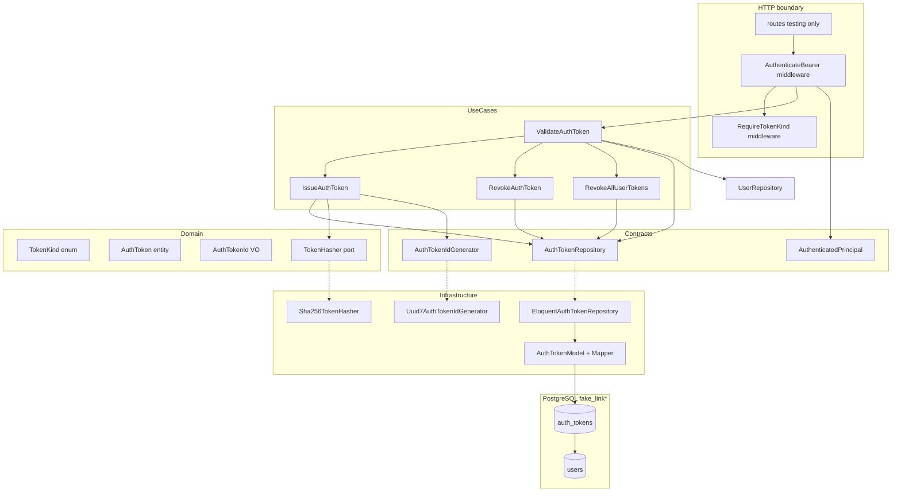
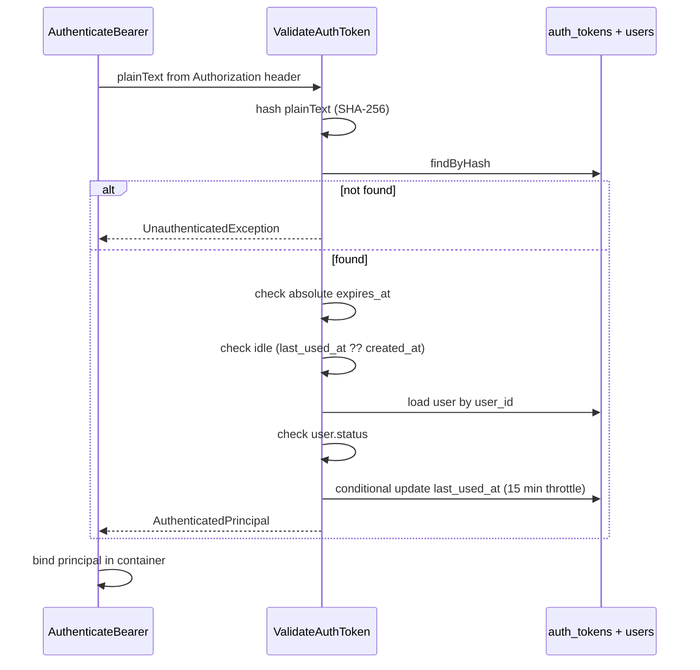

# Auth — Tokens Bearer — Design

**Spec:** `.specs/features/auth/bearer-tokens/spec.md`  
**Status:** Approved — 2026-07-23

---

## Abordagens consideradas

### 1. Persistência e lookup de token

| Abordagem | Prós | Contras | Veredicto |
| --- | --- | --- | --- |
| **A — Tabela `auth_tokens` custom + hash SHA-256** | Alinha `docs/data-model.md`, TTL/idle/kind explícitos, sem Sanctum/Passport | Implementação própria | **Recomendada** |
| B — Laravel Sanctum Personal Access Tokens | Menos código | Schema e abilities diferentes do produto; acoplamento ao pacote | Rejeitada |
| C — JWT stateless | Sem lookup por request | Revogação, idle throttle e `last_used_at` ficam complexos | Rejeitada |

### 2. Identidade autenticada para outros módulos

| Abordagem | Prós | Contras | Veredicto |
| --- | --- | --- | --- |
| **A — Contract `AuthenticatedPrincipal` + binding request-scoped** | Hexagonal; Links importa só Contracts | Uma interface + DTO readonly | **Recomendada** |
| B — `Auth::user()` global com Eloquent | Idiomático Laravel | Viola modular monolith; expõe infra | Rejeitada |
| C — Atributos soltos no `Request` (`user_id`, `token_kind`) | Simples | Sem tipo; propaga strings mágicas | Rejeitada |

### 3. Restrição de `token_kind`

| Abordagem | Prós | Contras | Veredicto |
| --- | --- | --- | --- |
| **A — Middleware `RequireTokenKind:session,verification`** | Declarativo nas rotas; composável com `auth.bearer` | Dois middlewares na cadeia | **Recomendada** |
| B — Atributo PHP 8 `#[RequireTokenKind]` | Moderno | Menos familiar no ecossistema Laravel deste projeto | Adiado |
| C — Checagem manual em cada controller | Flexível | Duplicação; fácil esquecer | Rejeitada |

### 4. Geração de UUID v7 para `auth_tokens.id`

| Abordagem | Prós | Contras | Veredicto |
| --- | --- | --- | --- |
| **A — Port `AuthTokenIdGenerator` espelhando `UserIdGenerator`** | Paridade com fundação; sem refactor da fatia 1 | Duplicação de contrato | **Recomendada nesta fatia** |
| B — Generalizar `Uuid7Generator` único agora | DRY | Refactor em código já verificado da foundation | Follow-up opcional |
| C — PK composta / omitir `id` público | Menos colunas | Revogação e principal precisam de surrogate; spec exige `tokenId` | Rejeitada |

**Decisão:** Abordagem A nos quatro eixos.

---

## Architecture Overview

Segunda fatia do módulo **Auth**: persistência de Bearer tokens, use cases de emissão/validação/revogação, middleware HTTP e contrato exportável de identidade. **Sem endpoints de negócio** — apenas infraestrutura consumida pelas fatias 3–7 e rota(s) de teste em `APP_ENV=testing`.



### Fluxo de validação (`ValidateAuthToken`)



### Ordem de entrega sugerida (Execute)

1. **Migration + domain** — `auth_tokens`, `TokenKind`, `AuthTokenId`, `AuthToken` (BT-01, BT-02)
2. **Ports + infra** — `TokenHasher`, repository, generator, model/mapper (BT-03, BT-17)
3. **Use cases** — emit, validate, revoke (BT-04, BT-05, BT-11, BT-12)
4. **HTTP** — middlewares, exception mapping, test routes (BT-06–BT-10, BT-16)
5. **Exportável** — `AuthenticatedPrincipal`, ownership base (BT-13, BT-14)
6. **Testes + gates** — unit/integration/feature; `make lint`, `make test-backend` (BT-15, BT-18)

---

## Layout de artefatos

```txt
backend/
├── bootstrap/app.php                         # + middleware aliases auth.bearer, token.kind
├── database/migrations/
│   └── YYYY_MM_DD_HHMMSS_create_auth_tokens_table.php
├── routes/
│   └── api.php                               # + require testing routes (conditional)
├── modules/Auth/
│   ├── Contracts/
│   │   ├── Authentication/
│   │   │   └── AuthenticatedPrincipal.php
│   │   ├── Repositories/
│   │   │   ├── UserRepository.php            # existente
│   │   │   └── AuthTokenRepository.php
│   │   └── Services/
│   │       ├── UserIdGenerator.php           # existente
│   │       ├── AuthTokenIdGenerator.php
│   │       └── TokenHasher.php
│   ├── Domain/
│   │   ├── Entities/
│   │   │   └── AuthToken.php
│   │   ├── Enums/
│   │   │   └── TokenKind.php
│   │   ├── ValueObjects/
│   │   │   ├── UserId.php                    # existente
│   │   │   └── AuthTokenId.php
│   │   └── Services/
│   │       └── BearerTokenGenerator.php      # random_bytes + base64url (domain-safe)
│   ├── DTOs/
│   │   ├── Input/
│   │   │   └── IssueAuthTokenDto.php
│   │   └── Output/
│   │       └── IssuedAuthTokenDto.php
│   ├── Exceptions/
│   │   ├── AuthDomainException.php           # existente
│   │   ├── AuthTokenException.php
│   │   └── ResourceNotFoundException.php     # ownership → 404
│   ├── UseCases/
│   │   ├── IssueAuthToken.php
│   │   ├── ValidateAuthToken.php
│   │   ├── RevokeAuthToken.php
│   │   └── RevokeAllUserTokens.php
│   ├── Infrastructure/
│   │   ├── Hashing/
│   │   │   └── Sha256TokenHasher.php
│   │   ├── Http/
│   │   │   ├── Middleware/
│   │   │   │   ├── AuthenticateBearer.php
│   │   │   │   └── RequireTokenKind.php
│   │   │   ├── Controllers/
│   │   │   │   └── TestingAuthProbeController.php
│   │   │   └── Responses/
│   │   │       └── AuthErrorResponseFactory.php
│   │   ├── Authorization/
│   │   │   └── AuthorizesOwnedResource.php
│   │   ├── Identity/
│   │   │   ├── Uuid7UserIdGenerator.php      # existente
│   │   │   └── Uuid7AuthTokenIdGenerator.php
│   │   └── Persistence/Eloquent/
│   │       ├── Models/
│   │       │   ├── UserModel.php             # existente
│   │       │   └── AuthTokenModel.php
│   │       ├── Mappers/
│   │       │   └── AuthTokenMapper.php
│   │       ├── Repositories/
│   │       │   └── EloquentAuthTokenRepository.php
│   │       └── Factories/
│   │           └── AuthTokenModelFactory.php
│   ├── ServiceProviders/
│   │   └── AuthServiceProvider.php           # + bindings, middleware, test routes
│   └── Tests/
│       ├── Unit/
│       ├── Integration/
│       └── Feature/
```

Pastas vazias antecipadas **não** devem ser criadas (`LARAVEL_CODE_DESIGN.md` §6.2).

---

## Code Reuse Analysis

### Componentes existentes a reutilizar

| Componente | Local | Uso |
| --- | --- | --- |
| `UserId` VO | `Domain/ValueObjects/UserId.php` | FK `user_id`; padrão de validação UUID v7 para `AuthTokenId` |
| `UserStatus` enum | `Domain/Enums/UserStatus.php` | Checagem de status em `ValidateAuthToken` |
| `UserRepository` | `Contracts/Repositories/UserRepository.php` | Carregar conta na validação |
| `Uuid7UserIdGenerator` | `Infrastructure/Identity/` | Modelo para `Uuid7AuthTokenIdGenerator` |
| `AuthServiceProvider` | `ServiceProviders/` | Registrar novos bindings e middleware |
| `DatabaseSafetyGuard` | `Tests/Support/` | Integration tests em `fake_link_testing` |
| `UserModelFactory` | `Infrastructure/Persistence/Eloquent/Factories/` | Criar users nos testes de token |
| Pest Arch rules | `backend/tests/Architecture/` | Garantir consumidores sem Eloquent Auth |

### Pontos de integração

| Sistema | Método |
| --- | --- |
| PostgreSQL | Migration `auth_tokens`; FK `users.id` UUID v7 |
| Laravel middleware | Aliases `auth.bearer`, `token.kind` em `bootstrap/app.php` |
| Container | `AuthenticatedPrincipal` bound per-request após auth |
| Fatias 3–7 | Injetam `IssueAuthToken`, `RevokeAuthToken`, middleware nas rotas |
| Módulo Links (futuro) | Importa `AuthenticatedPrincipal` + `AuthorizesOwnedResource` |

---

## Components

### Migration `auth_tokens`

- **Purpose:** Persistir metadados de Bearer; nunca plaintext.
- **Location:** `backend/database/migrations/`
- **Schema:**

```sql
CREATE TABLE auth_tokens (
    id         UUID PRIMARY KEY,
    user_id    UUID NOT NULL REFERENCES users(id) ON DELETE RESTRICT,
    token_hash CHAR(64) NOT NULL UNIQUE,
    token_kind TEXT NOT NULL CHECK (token_kind IN ('verification', 'session')),
    expires_at TIMESTAMPTZ NOT NULL,
    last_used_at TIMESTAMPTZ NULL,
    created_at TIMESTAMPTZ NOT NULL
);
CREATE INDEX auth_tokens_user_id_index ON auth_tokens (user_id);
```

- **IDs:** `id` e `user_id` gerados/validados na aplicação como UUID v7 (AD-012).
- **Reuses:** Padrão migration `users` da foundation.

### Domain — `TokenKind`, `AuthTokenId`, `AuthToken`

- **Purpose:** Vocabulário tipado de kinds e entidade sem segredo.
- **Location:** `modules/Auth/Domain/`
- **`AuthTokenId`:** Copia o contrato de `UserId` (regex UUID v7 RFC 9562, lowercase).
- **`AuthToken`:** Factory estática `issue(...)`; métodos `isExpiredAt(CarbonInterface)`, `isIdleExpiredAt(CarbonInterface, Duration idle)`, `markUsedAt` (retorna cópia ou mutação controlada no UseCase).
- **Idle TTL:** constantes no enum `TokenKind` — `verification`: 3600s, `session`: 86400s.
- **Absolute TTL:** constantes — `verification`: 24h, `session`: 7d.

### `BearerTokenGenerator` (domain service)

- **Purpose:** Gerar plaintext 256-bit.
- **Interface:** `generatePlainText(): string` — `random_bytes(32)` → `rtrim(strtr(base64_encode($bytes), '+/', '-_'), '=')`.
- **Location:** `Domain/Services/BearerTokenGenerator.php` — sem facades Laravel.

### Port `TokenHasher`

```php
interface TokenHasher
{
    public function hash(string $plainText): string;

    public function verify(string $plainText, string $hash): bool;
}
```

- **Implementation:** `Sha256TokenHasher` — `hash('sha256', $plainText)` retorna hex lowercase 64 chars.
- **Reuses:** Padrão de port/adaptador de `PasswordHasher`.

### Port `AuthTokenRepository`

```php
interface AuthTokenRepository
{
    public function save(AuthToken $token, string $tokenHash): void;

    public function findByHash(string $tokenHash): ?AuthToken;

    public function deleteById(AuthTokenId $id): void;

    public function deleteByHash(string $tokenHash): void;

    public function deleteAllForUser(UserId $userId): int;

    public function touchLastUsedAtIfStale(AuthTokenId $id, DateTimeImmutable $now, int $minIntervalSeconds): bool;
}
```

- **`touchLastUsedAtIfStale`:** Executa UPDATE … WHERE `id = ? AND (last_used_at IS NULL OR last_used_at < ?)`; retorna se houve write.
- **Implementation:** `EloquentAuthTokenRepository` + `AuthTokenMapper`.

### Use cases

| Use case | Input | Output | Notas |
| --- | --- | --- | --- |
| `IssueAuthToken` | `IssueAuthTokenDto(userId, tokenKind)` | `IssuedAuthTokenDto` | Persiste hash; DTO contém **plaintext** |
| `ValidateAuthToken` | `string $plainText` | `AuthenticatedPrincipal` | Ordem spec; best-effort touch |
| `RevokeAuthToken` | hash ou id | `void` | Idempotente se ausente |
| `RevokeAllUserTokens` | `UserId` | `int` deleted | AUTH-33 parcial |

### Contract `AuthenticatedPrincipal`

```php
interface AuthenticatedPrincipal
{
    public function userId(): UserId;

    public function userStatus(): UserStatus;

    public function tokenKind(): TokenKind;

    public function tokenId(): AuthTokenId;

    public function expiresAt(): DateTimeImmutable;
}
```

- **Implementation:** `readonly class AuthenticatedPrincipalRecord implements AuthenticatedPrincipal` em `Infrastructure/Authentication/`.
- **Binding:** `AuthenticateBearer` faz `$this->app->instance(AuthenticatedPrincipal::class, $principal)` após validação.

### Middleware `AuthenticateBearer`

- **Purpose:** Parse `Authorization: Bearer <token>`; rejeita esquemas inválidos.
- **Parse rules:** Header deve iniciar com `Bearer ` (case-sensitive); token = trim do restante; vazio → 401.
- **On success:** Propaga request; on failure: JSON `AuthErrorResponseFactory`.
- **Alias:** `auth.bearer`.

### Middleware `RequireTokenKind`

- **Purpose:** Enforce kinds permitidos **após** autenticação.
- **Signature:** `RequireTokenKind:session` ou `RequireTokenKind:verification,session`.
- **Failure:** 403 `TOKEN_RESTRICTED`.
- **Alias:** `token.kind`.
- **Extra rule:** `session` token + `pending_verification` user → 403 `TOKEN_RESTRICTED` (estado inconsistente).

### `AuthErrorResponseFactory`

- **Purpose:** Respostas JSON alinhadas a `docs/openapi.yaml`.
- **Mappings:**

| Condição | HTTP | code |
| --- | --- | --- |
| Token ausente/inválido/expirado | 401 | `UNAUTHENTICATED` |
| Kind não permitido | 403 | `TOKEN_RESTRICTED` |
| User suspended | 403 | `ACCOUNT_SUSPENDED` |
| User deletion_pending | 403 | `ACCOUNT_PENDING_DELETION` |
| Ownership mismatch | 404 | `RESOURCE_NOT_FOUND` |

- **Headers:** `Cache-Control: private, no-store`, `X-Request-ID` (quando middleware global existir; stub aceitável nesta fatia).

### `AuthorizesOwnedResource`

- **Purpose:** Trait para policies/controllers futuros.
- **Method:** `ensureOwnedBy(AuthenticatedPrincipal $principal, UserId $ownerId): void`
- **On mismatch:** `ResourceNotFoundException` → handler/middleware converte em 404 uniforme.
- **Location:** `Infrastructure/Authorization/`

### Rota de teste (BT-16)

Registrada somente quando `app()->environment('testing')`:

| Método | Path | Middleware | Resposta |
| --- | --- | --- | --- |
| `GET` | `/api/v1/_test/auth/probe` | `auth.bearer` | 200 `{ "data": { "user_id", "token_kind" } }` |
| `GET` | `/api/v1/_test/auth/session-only` | `auth.bearer`, `token.kind:session` | 200 ou 403 |

---

## Data Models

### `auth_tokens` (persistência)

| Campo | Tipo PG | Domínio |
| --- | --- | --- |
| `id` | `uuid` | `AuthTokenId` |
| `user_id` | `uuid` | `UserId` |
| `token_hash` | `char(64)` | string (não expor ao domínio como VO) |
| `token_kind` | `text` | `TokenKind` |
| `expires_at` | `timestamptz` | `DateTimeImmutable` |
| `last_used_at` | `timestamptz?` | `?DateTimeImmutable` |
| `created_at` | `timestamptz` | `DateTimeImmutable` |

**Relationships:** N:1 com `users`; revogação em massa por `user_id`.

### DTO `IssuedAuthTokenDto`

| Campo | Tipo | Exposto após emissão |
| --- | --- | --- |
| `plainTextToken` | string | Sim — única vez |
| `tokenKind` | `TokenKind` | Sim |
| `expiresAt` | `DateTimeImmutable` | Sim |
| `userId` | `UserId` | Sim |
| `tokenId` | `AuthTokenId` | Opcional interno |

---

## Error Handling Strategy

| Cenário | Tratamento | Impacto HTTP |
| --- | --- | --- |
| Bearer malformado | `AuthenticateBearer` short-circuit | 401 `UNAUTHENTICATED` |
| Hash não encontrado | Mesma resposta que inválido (anti-oracle) | 401 |
| Expirado absoluto/idle | Antes de touch `last_used_at` | 401 |
| Conta suspensa / exclusão | Após token válido | 403 |
| Kind restrito | `RequireTokenKind` | 403 |
| Owner divergente | `ResourceNotFoundException` | 404 |
| Falha UPDATE `last_used_at` | Log interno; request continua autenticado | 200 ao caller |
| Plaintext em exceção | Proibir em factories de exceção; teste sentinela | N/A |

Exceções de domínio **não** incluem o plaintext do token nas mensagens (`BT-15`).

---

## Risks & Concerns

| Concern | Location | Impact | Mitigation |
| --- | --- | --- | --- |
| Sem exception handler global JSON | `bootstrap/app.php` | Middleware deve retornar `JsonResponse` diretamente nesta fatia | `AuthErrorResponseFactory`; handler global na Fase 0 transversal |
| `UserRepository.findById` pode não existir | `Contracts/Repositories/UserRepository.php` | Validate não carrega status | Adicionar `findById(UserId): ?User` se ausente |
| Duplicação UUID v7 generators | `Uuid7UserIdGenerator` vs token | Dois ports similares | Aceito nesta fatia; extrair `Uuid7Generator` depois |
| Pest descoberta de novos testes | `phpunit.xml` | Testes ignorados | Confirmar suite inclui `modules/Auth/Tests` |
| Timing oracle em validação | `ValidateAuthToken` | Diferença inválido vs expirado | Resposta 401 uniforme para ambos |
| Rota `_test` exposta | `routes/api.php` | Superfície extra | Guard `app()->environment('testing')` obrigatório |
| FK RESTRICT user+tokens | Migration | Delete user com tokens falha | Esperado; exclusão assíncrona revoga tokens antes (fatia futura) |

---

## Tech Decisions

| Decision | Choice | Rationale |
| --- | --- | --- |
| PK/FK `auth_tokens` | UUID v7 (`uuid`) | AD-012; paridade com `users` e demais entidades |
| Plaintext encoding | base64url de 32 bytes | Spec; compacto no header |
| Hash | SHA-256 hex | `docs/data-model.md`; compatível com padrão Laravel |
| Revogação | DELETE físico | Spec; sem `revoked_at` |
| Idle reference | `last_used_at ?? created_at` | Primeiro uso conta desde emissão |
| Idle boundary | Expira quando `> idle_ttl` (exclusive) | Edge case spec |
| Principal binding | `$app->instance(AuthenticatedPrincipal::class, …)` | Resolução tipada em controllers/use cases |
| Token kind enforcement | Middleware separado | Composição clara `auth.bearer` + `token.kind` |
| Test HTTP | Rotas `_test/auth/*` | Prova middleware sem endpoints de negócio |
| Clock em testes | `Carbon::setTestNow()` | Idle/TTL determinísticos |

### Decisões de projeto

Conforme **AD-012** (`.specs/STATE.md`): nenhuma tabela usa ULID; `auth_tokens.id` é UUID v7.

---

## Requirement → Design Mapping

| ID | Componente(s) principal(is) |
| --- | --- |
| BT-01 | Migration `auth_tokens` |
| BT-02 | `TokenKind`, `AuthTokenId`, `AuthToken` |
| BT-03 | `TokenHasher`, `Sha256TokenHasher`, `BearerTokenGenerator` |
| BT-04 | `IssueAuthToken`, `IssuedAuthTokenDto` |
| BT-05 | `ValidateAuthToken` |
| BT-06 | `AuthenticateBearer`, `bootstrap/app.php` alias |
| BT-07 | Status check em `ValidateAuthToken` |
| BT-08 | `AuthTokenRepository::touchLastUsedAtIfStale` |
| BT-09 | `RequireTokenKind` |
| BT-10 | `AuthErrorResponseFactory` → `TOKEN_RESTRICTED` |
| BT-11 | `RevokeAuthToken` |
| BT-12 | `RevokeAllUserTokens` |
| BT-13 | `AuthenticatedPrincipal` contract + record |
| BT-14 | `AuthorizesOwnedResource`, `ResourceNotFoundException` |
| BT-15 | Disciplina de mensagens + teste sentinela |
| BT-16 | `TestingAuthProbeController`, rotas testing |
| BT-17 | `EloquentAuthTokenRepository`, factory |
| BT-18 | Verificação doc `docs/data-model.md` §3 |
| AUTH-13 … AUTH-19 | Cobertos pelos componentes acima |
| AUTH-33 | `RevokeAllUserTokens` |
| AUTH-37 | `AuthenticatedPrincipal` |
| AUTH-38 | `AuthorizesOwnedResource` |

---

## Referências

- `.specs/features/auth/bearer-tokens/spec.md`
- `.specs/features/auth/foundation/design.md`
- `.specs/STATE.md` — AD-010, AD-011, AD-012
- `docs/data-model.md` §3
- `docs/api.md` §3.1, §7
- `docs/security.md` §6, §7
- `docs/openapi.yaml` — `UuidV7`, `Unauthenticated`, `Forbidden`
- `LARAVEL_CODE_DESIGN.md` §17, §23, §25
