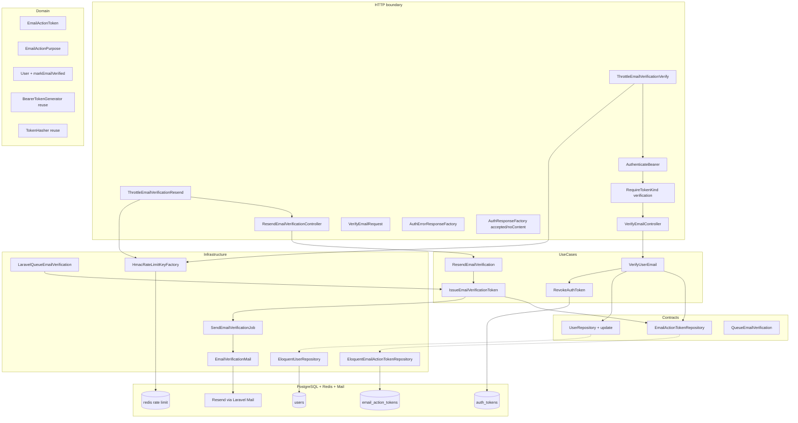
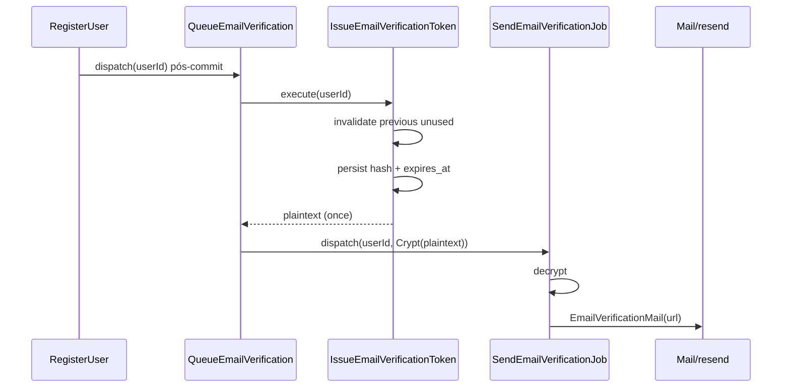
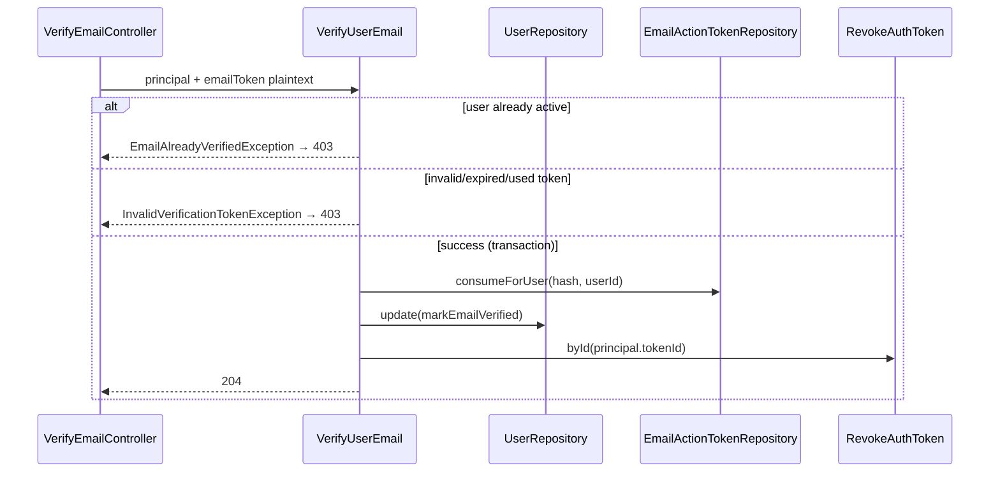

# Auth — Verificação de e-mail — Design

**Spec:** `.specs/features/auth/email-verification/spec.md`  
**Status:** Approved — 2026-07-27

---

## Abordagens consideradas

### 1. Emissão e entrega do token de e-mail

| Abordagem | Prós | Contras | Veredicto |
| --- | --- | --- | --- |
| **A — Use case `IssueEmailVerificationToken` + job com payload cifrado** | Token criado antes do enqueue; registro/reenvio compartilham pipeline; plaintext só no job decriptado | Job serializa ciphertext | **Recomendada** |
| B — Job gera token no `handle()` | Menor payload | Duplica lógica registro vs reenvio; race se job duplicado | Rejeitada |
| C — Plaintext no job sem cifrar | Simples | Viola `docs/data-model.md` §3 e AUTH-25 | Rejeitada |

### 2. Invalidação no reenvio

| Abordagem | Prós | Contras | Veredicto |
| --- | --- | --- | --- |
| **A — `UPDATE used_at = now()` em tokens anteriores não usados (mesmo `user_id` + purpose)** | Histórico preservado; alinha spec | Linhas “invalidadas” parecem consumidas | **Recomendada** |
| B — `DELETE` tokens anteriores | Menos linhas | Perde auditoria mínima | Rejeitada |
| C — Múltiplos tokens válidos | Sem invalidação | Contraria decisão de revisão | Rejeitada |

### 3. Consumo atômico no verify

| Abordagem | Prós | Contras | Veredicto |
| --- | --- | --- | --- |
| **A — Transação DB com `SELECT … FOR UPDATE` na linha do token + update user + revoke bearer** | Concorrência segura; 1 vencedor | Requer método repository dedicado | **Recomendada** |
| B — Optimistic lock sem lock | Mais simples | Dupla ativação possível | Rejeitada |
| C — Delete-on-consume | Simples | Perde `used_at` trail | Rejeitada |

### 4. Atualização de `User`

| Abordagem | Prós | Contras | Veredicto |
| --- | --- | --- | --- |
| **A — Entidade imutável `User::markEmailVerified()` + `UserRepository::update()`** | Paridade com domínio existente | Novo método no port | **Recomendada** |
| B — Update direto no Eloquent no UseCase | Menos código | Viola hexagonal | Rejeitada |

### 5. Rate limiting (3/h reenvio vs 5/h verify)

| Abordagem | Prós | Contras | Veredicto |
| --- | --- | --- | --- |
| **A — Dois middlewares `ThrottleEmailVerificationResend` e `ThrottleEmailVerificationVerify` + chaves HMAC por `user_id`** | Limites distintos; conta todas POST; espelha login/registro | Dois aliases | **Recomendada** |
| B — Middleware único com limite máximo | Menos arquivos | Não distingue 3 vs 5 | Rejeitada |
| C — Rate limit só no UseCase | — | Não conta falhas antes do controller | Rejeitada |

### 6. Integração Resend

| Abordagem | Prós | Contras | Veredicto |
| --- | --- | --- | --- |
| **A — Laravel `Mailable` + transport `resend`; testes com `Mail::fake()`** | Config existente; sem SDK novo | Depende de `RESEND_API_KEY` em prod | **Recomendada** |
| B — SDK Resend direto | Controle fino | Nova dependência | Rejeitada |

**Decisão:** Abordagem A nos seis eixos.

---

## Architecture Overview

Quinta fatia do módulo **Auth**: tokens de e-mail de uso único (`email_action_tokens`), pipeline Resend, endpoints protegidos por Bearer `verification`, transição `pending_verification` → `active` e revogação do bearer apresentado.



### Fluxo registro → e-mail (sequência)



### Fluxo verify (sequência)



### Ordem de entrega sugerida (Execute)

1. **Schema + domínio** — migration, enums/entity, contracts
2. **Persistência** — Eloquent repository; `User::markEmailVerified` + `UserRepository::update`
3. **Emissão + mail** — config, issue use case, Mailable, job, adapter queue
4. **Verify + resend** — use cases + integration tests
5. **HTTP** — middlewares, controllers, rotas, factories
6. **Feature E2E + gates** — `EmailVerificationTest`, regressão registro, OpenAPI, lint/test

---

## Layout de artefatos

```txt
backend/
├── config/
│   └── auth.php                              # + email_verification, rate_limits resend/verify
├── database/migrations/
│   └── *_create_email_action_tokens_table.php
├── modules/Auth/
│   ├── Contracts/
│   │   └── Repositories/
│   │       ├── EmailActionTokenRepository.php
│   │       └── UserRepository.php            # + update()
│   │   └── Services/
│   │       └── EmailActionTokenIdGenerator.php
│   ├── Domain/
│   │   ├── Enums/
│   │   │   └── EmailActionPurpose.php        # email_verification (+ password_reset reserved)
│   │   ├── Entities/
│   │   │   ├── EmailActionToken.php
│   │   │   └── User.php                      # + markEmailVerified()
│   │   └── ValueObjects/
│   │       └── EmailActionTokenId.php
│   ├── DTOs/
│   │   ├── Input/
│   │   │   └── VerifyUserEmailDto.php
│   │   └── Output/
│   │       └── IssuedEmailActionTokenDto.php # plainText once
│   ├── Exceptions/
│   │   ├── InvalidVerificationTokenException.php
│   │   └── EmailAlreadyVerifiedException.php
│   ├── UseCases/
│   │   ├── IssueEmailVerificationToken.php
│   │   ├── VerifyUserEmail.php
│   │   └── ResendEmailVerification.php
│   ├── Infrastructure/
│   │   ├── Http/
│   │   │   ├── Controllers/
│   │   │   │   ├── VerifyEmailController.php
│   │   │   │   └── ResendEmailVerificationController.php
│   │   │   ├── Middleware/
│   │   │   │   ├── ThrottleEmailVerificationResend.php
│   │   │   │   └── ThrottleEmailVerificationVerify.php
│   │   │   ├── Requests/
│   │   │   │   └── VerifyEmailRequest.php
│   │   │   ├── Responses/
│   │   │   │   ├── AuthErrorResponseFactory.php  # + invalidVerificationToken, emailAlreadyVerified
│   │   │   │   └── AuthResponseFactory.php       # + accepted(), noContent()
│   │   │   └── routes/
│   │   │       └── auth.php                    # + verify, verification-notification
│   │   ├── Jobs/
│   │   │   └── SendEmailVerificationJob.php    # replace stub
│   │   ├── Mail/
│   │   │   └── EmailVerificationMail.php
│   │   ├── Notifications/
│   │   │   └── LaravelQueueEmailVerification.php # calls Issue + job
│   │   ├── Persistence/Eloquent/
│   │   │   ├── Models/EmailActionTokenModel.php
│   │   │   ├── Mappers/EmailActionTokenMapper.php
│   │   │   ├── Repositories/EloquentEmailActionTokenRepository.php
│   │   │   └── Factories/EmailActionTokenModelFactory.php
│   │   ├── Identity/
│   │   │   └── Uuid7EmailActionTokenIdGenerator.php
│   │   └── RateLimit/
│   │       └── HmacRateLimitKeyFactory.php     # + forEmailVerificationResend/Verify
│   ├── ServiceProviders/
│   │   └── AuthServiceProvider.php
│   └── Tests/
│       ├── Unit/ …
│       ├── Integration/
│       │   ├── EmailActionTokensSchemaContractTest.php
│       │   ├── EloquentEmailActionTokenRepositoryTest.php
│       │   ├── IssueEmailVerificationTokenTest.php
│       │   ├── VerifyUserEmailTest.php
│       │   └── ResendEmailVerificationTest.php
│       └── Feature/
│           └── EmailVerificationTest.php
```

Rotas em `auth.php` com middleware stack:

| Rota | Middleware |
| --- | --- |
| `POST email/verification-notification` | `throttle.email_verification.resend`, `auth.bearer`, `token.kind:verification` |
| `POST email/verify` | `throttle.email_verification.verify`, `auth.bearer`, `token.kind:verification` |

---

## Code Reuse Analysis

### Componentes existentes a reutilizar

| Componente | Local | Uso |
| --- | --- | --- |
| `BearerTokenGenerator` | `Domain/Services/BearerTokenGenerator.php` | Plaintext CSPRNG base64url |
| `TokenHasher` / `Sha256TokenHasher` | Infrastructure | Hash 64 hex do token de e-mail |
| `Uuid7*IdGenerator` pattern | `Infrastructure/Identity/` | `EmailActionTokenId` |
| `IssueAuthToken` pattern | UseCases | Modelo transacional para `IssueEmailVerificationToken` |
| `RevokeAuthToken::byId` | UseCases | Revogar bearer após verify |
| `AuthenticatedPrincipal` | Contracts | `userId`, `tokenId`, `userStatus` nos controllers |
| `AuthenticateBearer` + `RequireTokenKind` | Middleware | Proteção endpoints |
| `AuthErrorResponseFactory` | Infrastructure | Estender erros 403 |
| `ApiFormRequest` | `app/Http/` | Base `VerifyEmailRequest` |
| `DatabaseSafetyGuard` | Tests/Support | Integration/Feature PG |
| `QueueEmailVerification` port | Contracts | Adapter refatorado |
| `RegisterUser` pós-commit dispatch | UseCases | Sem alteração de contrato público |

### Pontos de integração

| Sistema | Método |
| --- | --- |
| PostgreSQL | Nova tabela `email_action_tokens`; update em `users` |
| Redis | Rate limit HMAC por `user_id` |
| Fila `notifications` | Job existente com implementação real |
| Laravel Mail / Resend | `config/mail.php` transport `resend`; `Mail::fake()` em testes |
| OpenAPI | Novos códigos `INVALID_VERIFICATION_TOKEN`, `EMAIL_ALREADY_VERIFIED` |

---

## Components

### Migration `email_action_tokens`

```sql
CREATE TABLE email_action_tokens (
    id UUID PRIMARY KEY,
    user_id UUID NOT NULL REFERENCES users(id) ON DELETE RESTRICT,
    token_hash CHAR(64) NOT NULL UNIQUE,
    purpose TEXT NOT NULL CHECK (purpose IN ('email_verification')),
    expires_at TIMESTAMPTZ NOT NULL,
    used_at TIMESTAMPTZ NULL,
    created_at TIMESTAMPTZ NOT NULL
);
CREATE INDEX email_action_tokens_user_id_idx ON email_action_tokens (user_id);
```

> `password_reset` entra no CHECK na fatia `password` via migration alter.

### Domain — `EmailActionPurpose`

```php
enum EmailActionPurpose: string
{
    case EmailVerification = 'email_verification';
    // PasswordReset = 'password_reset' — password slice
}
```

TTL helper: `absoluteTtlSeconds(): int` → `3600`.

### Domain — `EmailActionToken`

- Campos: `EmailActionTokenId`, `UserId`, `purpose`, `expiresAt`, `?usedAt`, `createdAt`
- Helpers: `isExpiredAt(DateTimeImmutable)`, `isUsed(): bool`

### Domain — `User::markEmailVerified(DateTimeImmutable $at): self`

Retorna nova instância com `status: Active`, `emailVerifiedAt: $at`; demais campos inalterados.

### Port `EmailActionTokenRepository`

```php
interface EmailActionTokenRepository
{
    public function save(EmailActionToken $token, string $tokenHash): void;

    public function findByHash(string $tokenHash): ?EmailActionToken;

    public function invalidateUnusedForUser(UserId $userId, EmailActionPurpose $purpose, DateTimeImmutable $now): int;

    /**
     * Atomically marks token used if valid for user; returns false if not consumable.
     */
    public function consumeForUser(string $tokenHash, UserId $userId, EmailActionPurpose $purpose, DateTimeImmutable $now): bool;
}
```

Implementação `consumeForUser`: transação + `lockForUpdate()` na linha; valida `used_at IS NULL`, `expires_at > now`, `purpose`, `user_id`; set `used_at`.

### Port `UserRepository::update(User $user): void`

`UserModel::query()->where('id', …)->update($mapper->toPersistenceUpdate($user))` — **somente** campos mutáveis (`status`, `email_verified_at`, `updated_at` implícito Eloquent).

### Use case `IssueEmailVerificationToken`

```php
final class IssueEmailVerificationToken
{
    public function execute(UserId $userId): IssuedEmailActionTokenDto;
}
```

1. `invalidateUnusedForUser($userId, EmailVerification, now)`
2. `$plain = BearerTokenGenerator->generate()`
3. `$hash = TokenHasher->hash($plain)`
4. Persist entity TTL 3600s
5. Return DTO with plaintext (never logged)

### Use case `VerifyUserEmail`

```php
final class VerifyUserEmail
{
    public function execute(VerifyUserEmailDto $input): void;
}
```

Input: `AuthenticatedPrincipal`, `plainTextEmailToken`.

1. Load user by principal.userId; if `Active` → `EmailAlreadyVerifiedException`
2. If status not `PendingVerification` → treat as already verified or blocked per spec (suspended/deletion blocked at middleware)
3. `consumeForUser(hash, userId, EmailVerification, now)` — false → `InvalidVerificationTokenException`
4. Transaction (if not fully inside consume):
   - `UserRepository::update($user->markEmailVerified(now))`
   - `RevokeAuthToken::byId(principal.tokenId())`

### Use case `ResendEmailVerification`

```php
final class ResendEmailVerification
{
    public function execute(AuthenticatedPrincipal $principal): void;
}
```

1. User `Active` → `EmailAlreadyVerifiedException`
2. `IssueEmailVerificationToken::execute(userId)`
3. Enqueue job with encrypted plaintext (same as adapter)

### `LaravelQueueEmailVerification` (refatorado)

```php
public function dispatch(UserId $userId): void
{
    $issued = $this->issueEmailVerificationToken->execute($userId);
    SendEmailVerificationJob::dispatch(
        $userId->value(),
        Crypt::encryptString($issued->plainTextToken),
    )->onQueue('notifications');
}
```

Registro continua chamando `dispatch($userId)` — passa a criar token + mail.

### Job `SendEmailVerificationJob`

```php
public function __construct(
    public readonly string $userId,
    public readonly string $encryptedToken,
) {}
```

`handle()`:
1. `$plain = Crypt::decryptString($encryptedToken)` — falha → fail job (sem log do token)
2. Load user email/name via `UserRepository::findById`
3. Build URL: `rtrim(config('auth.email_verification.frontend_base_url'), '/').config('auth.email_verification.path').'?token='.urlencode($plain)`
4. `Mail::to($email)->send(new EmailVerificationMail($name, $url))`

**Proibido:** logar URL completa, plaintext, ou exceções contendo token.

### Mailable `EmailVerificationMail`

- Subject: pt-BR fixo sem token (ex.: `Confirme seu e-mail — Fake Link`)
- View Markdown simples em `modules/Auth/resources/views/mail/email-verification.blade.php` (ou `lang` path padrão Laravel)
- Body: link + instrução POST explícito (texto UX, não implementa GET)

### Config — `config/auth.php`

```php
'email_verification' => [
    'frontend_base_url' => env('APP_URL', 'https://app.localhost'),
    'path' => '/verify-email',
    'token_ttl_seconds' => 3600,
],

'rate_limits' => [
    // … existing …
    'email_verification_resend' => [
        'max_attempts' => 3,
        'decay_seconds' => 3600,
    ],
    'email_verification_verify' => [
        'max_attempts' => 5,
        'decay_seconds' => 3600,
    ],
],
```

### HTTP — `VerifyEmailRequest`

- Extends `ApiFormRequest`
- Rules: `token` required string min:1; `$this->replace($this->only(['token']))`
- `toDto(AuthenticatedPrincipal $principal): VerifyUserEmailDto`

### HTTP — Controllers

**VerifyEmailController** — map:
- `InvalidVerificationTokenException` → `invalidVerificationToken()` 403
- `EmailAlreadyVerifiedException` → `emailAlreadyVerified()` 403
- success → `AuthResponseFactory::noContent()` 204

**ResendEmailVerificationController** — map:
- `EmailAlreadyVerifiedException` → 403
- success → `accepted()` 202

Ambos resolvem `AuthenticatedPrincipal` do container após middleware.

### `AuthErrorResponseFactory` (extensões)

| Método | HTTP | code | message |
| --- | --- | --- | --- |
| `invalidVerificationToken()` | 403 | `INVALID_VERIFICATION_TOKEN` | `The verification token is invalid or has expired.` |
| `emailAlreadyVerified()` | 403 | `EMAIL_ALREADY_VERIFIED` | `The email address is already verified.` |

### Rate limit — `HmacRateLimitKeyFactory`

```php
public function forEmailVerificationResend(UserId $userId): string
{
    return hash_hmac('sha256', 'email-verification:resend:'.$userId->value(), $key);
}

public function forEmailVerificationVerify(UserId $userId): string
{
    return hash_hmac('sha256', 'email-verification:verify:'.$userId->value(), $key);
}
```

Middlewares leem `AuthenticatedPrincipal` do container **após** `auth.bearer` — ordem nas rotas: throttle **antes** de auth contaria 401 sem principal. **Correção:** throttle **depois** de `auth.bearer` + `token.kind`, usando `userId` do principal.

Stack corrigida:

| Rota | Middleware order |
| --- | --- |
| `verification-notification` | `auth.bearer` → `token.kind:verification` → `throttle.email_verification.resend` → controller |
| `verify` | `auth.bearer` → `token.kind:verification` → `throttle.email_verification.verify` → controller |

Rate limit conta tentativas autenticadas (401/403 de auth não passam pelo throttle de conta — consistente com “por conta”).

---

## Data Models

### `email_action_tokens` (persistência)

| Campo | Tipo | Regra |
| --- | --- | --- |
| `id` | uuid PK | UUID v7 app-generated |
| `user_id` | uuid FK | RESTRICT → `users.id` |
| `token_hash` | char(64) UNIQUE | SHA-256 hex |
| `purpose` | text CHECK | `email_verification` (MVP) |
| `expires_at` | timestamptz | now + 3600s on issue |
| `used_at` | timestamptz nullable | set on consume/invalidate |
| `created_at` | timestamptz | UTC |

### DTOs

| DTO | Campos |
| --- | --- |
| `IssuedEmailActionTokenDto` | `EmailActionTokenId $id`, `string $plainTextToken`, `DateTimeImmutable $expiresAt` |
| `VerifyUserEmailDto` | `AuthenticatedPrincipal $principal`, `string $plainTextEmailToken` |

---

## Error Handling Strategy

| Cenário | Handling | HTTP |
| --- | --- | --- |
| Bearer ausente/inválido | `AuthenticateBearer` | 401 |
| Bearer `session` | `RequireTokenKind` | 403 TOKEN_RESTRICTED |
| Conta suspensa / deletion_pending | `ValidateAuthToken` | 403 ACCOUNT_* |
| Token e-mail inválido/expirado/usado | `InvalidVerificationTokenException` | 403 INVALID_VERIFICATION_TOKEN |
| Usuário já active | `EmailAlreadyVerifiedException` | 403 EMAIL_ALREADY_VERIFIED |
| Body inválido | `VerifyEmailRequest` | 422 VALIDATION_FAILED |
| Rate limit | Middleware | 429 + Retry-After |
| Falha enqueue job pós-issue | Log interno; reenvio HTTP falha 500 se sync dispatch throws | 500 / 202 best-effort |
| Falha Mail no job | Retry Laravel queue | — |

---

## Risks & Concerns

| Concern | Location | Impact | Mitigation |
| --- | --- | --- | --- |
| `UserRepository::save()` só `create()` | `EloquentUserRepository.php:63-70` | Verify não persiste `active` | T5 adiciona `update()` + testes |
| Job stub sem token | `SendEmailVerificationJob.php:22-25` | Registro não envia e-mail | T9–T10 substituem stub |
| OpenAPI sem códigos novos | `docs/openapi.yaml` | Drift contrato | T19 documenta exemplos Forbidden |
| Concorrência verify | novo repository | Double activation | `consumeForUser` com `lockForUpdate` |
| Plaintext em `failed_jobs` | queue | AUTH-25 | Ciphertext no payload; job não serializa plaintext |
| Throttle antes de auth | design inicial | Chave user indisponível | Stack: auth antes de throttle |

---

## Tech Decisions

| Decision | Choice | Rationale |
| --- | --- | --- |
| Gerador plaintext e-mail | Reutilizar `BearerTokenGenerator` | Entropia/formato já validados |
| Invalidação reenvio | `used_at = now()` em unused | Preserva histórico; spec confirmada |
| Cifra job payload | `Crypt::encryptString` | Laravel nativo AES-256-GCM |
| Mail transport | Laravel `resend` | Sem SDK; config existente |
| Revogação pós-verify | Só bearer apresentado | AUTH-12 |
| Middleware order | auth → kind → throttle | Rate limit por conta autenticada |

> Decisões feature-local; nenhum AD-NNN novo necessário (AD-010/012 UUID v7 já cobrem PK/FK).

---

## Referências

| Documento | Uso |
| --- | --- |
| `.specs/features/auth/email-verification/spec.md` | ACs EV/AUTH |
| `.specs/features/auth/registration/design.md` | Job stub, queue port |
| `.specs/features/auth/bearer-tokens/design.md` | Token hash, revoke |
| `LARAVEL_CODE_DESIGN.md` | Camadas hexagonais |
| `docs/data-model.md` §3 | Schema canônico |
