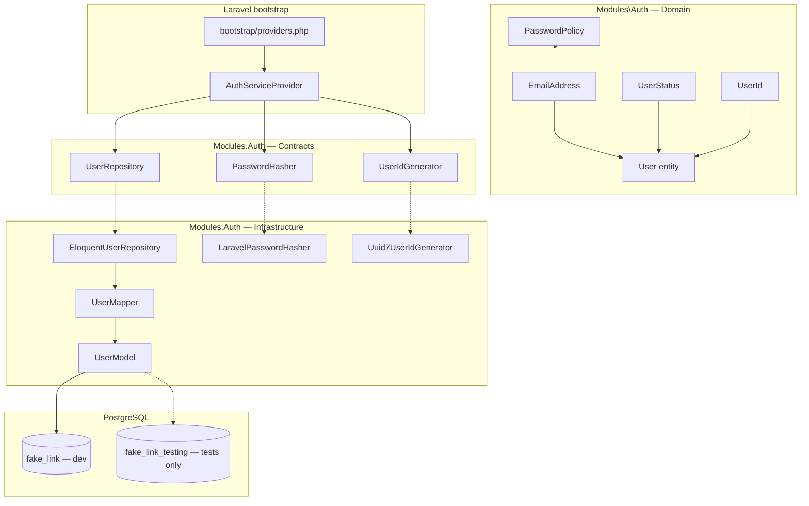

# Auth — Fundação do módulo — Design

**Spec:** `.specs/features/auth/foundation/spec.md`  
**Status:** Draft — aguardando aprovação antes de Tasks  
**Confirmada:** 2026-07-23

---

## Abordagens consideradas

### 1. Estrutura do módulo Auth

| Abordagem | Prós | Contras | Veredicto |
| --- | --- | --- | --- |
| **A — Hexagonal completa desde a fundação** (`Domain` + `Contracts` + `Infrastructure` + mapper) | Alinha `LARAVEL_CODE_DESIGN.md`, Pest Arch e fatias seguintes; sem refactor posterior | Mais arquivos iniciais | **Recomendada** |
| B — Eloquent “rápido” em `App\Models` até registro | Menos boilerplate hoje | Viola gates modulares; retrabalho garantido | Rejeitada |
| C — Domain anémico + regras em Form Requests | Menos classes de domínio | Viola spec (política de senha encapsulada); Form Requests ainda não existem | Rejeitada |

### 2. Banco dedicado para testes

| Abordagem | Prós | Contras | Veredicto |
| --- | --- | --- | --- |
| **A — Postgres `fake_link_testing` + init script + Makefile com dependência de `postgres`** | Constraints reais; isolamento dev/prod; alinha spec FND-10/11 | Suite mais lenta que SQLite in-memory | **Recomendada** |
| B — SQLite in-memory (estado atual do Makefile) | Rápido | Não prova CHECK/UNIQUE PostgreSQL; viola spec confirmada | Rejeitada |
| C — Transações rollback por teste no banco `fake_link` | Um banco só | Risco de interferência com dev; não isola dados locais | Rejeitada |

### 3. Geração de UUID v7

| Abordagem | Prós | Contras | Veredicto |
| --- | --- | --- | --- |
| **A — Port `UserIdGenerator` na infra + validação v7 em `UserId` VO** | Domain sem `Illuminate\*`; testável com fake | Uma interface a mais | **Recomendada** |
| B — `UserId::generate()` chamando `Str::uuid7()` no Domain | Menos arquivos | Domain importa Laravel; viola §16.1 do guia | Rejeitada |
| C — `gen_random_uuid()` no PostgreSQL | Simples no SQL | UUID v4, não v7; perde ordenação temporal | Rejeitada |

**Decisão:** Abordagem A nos três eixos.

---

## Architecture Overview

Primeira fatia do monólito modular **Auth**: camada de domínio pura (Value Objects, enum, serviço de política), portas de saída (`UserRepository`, `PasswordHasher`, `UserIdGenerator`), adaptadores Eloquent/Hash, migration `users` canônica, e infra transversal de **banco de testes isolado**. Sem HTTP, sem UseCases de negócio (reservados às fatias 3–7).



### Ordem de entrega sugerida (Execute)

1. **Infra de testes** — init Postgres, `.env.testing`, Makefile, guard (FND-10, FND-11)
2. **Migration** — schema `users` UUID v7; remoção legado (FND-04, FND-05)
3. **Domain** — VOs, enum, `PasswordPolicy` (FND-07, AUTH-06/07, FND-08)
4. **Infrastructure** — hasher, generator, model, mapper, repository (FND-06, AUTH-08)
5. **Composição** — provider, PHPStan paths, remoção skeleton (FND-01–03)
6. **Testes + docs** — Pest unit/integration, `docs/testing.md`, `docs/data-model.md` (cobertura 80/80)

---

## Layout de artefatos

```txt
backend/
├── bootstrap/providers.php              # + AuthServiceProvider
├── config/hashing.php                   # publicado; driver argon2id
├── database/migrations/
│   └── 0001_01_01_000000_create_users_table.php   # reescrita
├── modules/Auth/
│   ├── Contracts/
│   │   ├── Repositories/UserRepository.php
│   │   └── Services/
│   │       ├── PasswordHasher.php
│   │       └── UserIdGenerator.php
│   ├── Domain/
│   │   ├── Entities/User.php
│   │   ├── Enums/UserStatus.php
│   │   ├── Enums/PasswordViolationCode.php
│   │   ├── Services/PasswordPolicy.php
│   │   └── ValueObjects/
│   │       ├── EmailAddress.php
│   │       └── UserId.php
│   ├── Exceptions/
│   │   ├── AuthDomainException.php      # e-mail inválido, UserId inválido
│   │   └── PasswordPolicyException.php  # códigos estáveis
│   ├── Infrastructure/
│   │   ├── Hashing/LaravelPasswordHasher.php
│   │   ├── Identity/Uuid7UserIdGenerator.php
│   │   └── Persistence/Eloquent/
│   │       ├── Models/UserModel.php
│   │       ├── Mappers/UserMapper.php
│   │       ├── Repositories/EloquentUserRepository.php
│   │       └── Factories/UserModelFactory.php
│   ├── ServiceProviders/AuthServiceProvider.php
│   └── Tests/
│       ├── Unit/...
│       ├── Integration/...
│       └── Support/DatabaseSafety.php   # guard DB_DATABASE
├── phpstan.neon                         # + modules/Auth
├── phpunit.xml                          # PG testing + suite Auth
└── .env.testing                         # fake_link_testing

docker/postgres/init/
└── 01-create-testing-database.sql

Makefile                                 # test-backend → postgres + testing DB
docs/testing.md                          # §2 banco dedicado
docs/data-model.md                       # users.id → UUID v7
```

**Removidos / limpos:**

- `backend/app/Models/User.php`
- `backend/database/factories/UserFactory.php` (realocado)
- Referências a `App\Models\User` em `DatabaseSeeder` (seeder vazio ou comentado até `registration`)

---

## Code Reuse Analysis

### Existing Components to Leverage

| Component | Location | How to Use |
| --- | --- | --- |
| Autoload `Modules\` | `backend/composer.json` | Já mapeia `modules/`; `composer dump-autoload` após scaffold |
| Pest Arch modular | `backend/tests/Architecture/ModularMonolithTest.php` | Regras já incluem `Auth`; passam a aplicar de fato |
| Gates qualidade | `Makefile`, `backend/composer.json` scripts | `make lint`, `make test-backend` como gate por task |
| Larastan baseline | `backend/phpstan.neon` | Estender `paths` com `modules/Auth` |
| Padrão Identity (guia) | `LARAVEL_CODE_DESIGN.md` §6–19 | Repository + Mapper + PasswordHasher — módulo renomeado para `Auth` |
| Compose Postgres | `docker-compose.yml` `postgres` service | Healthcheck + volume init scripts |
| AD-003 Makefile | `.specs/STATE.md` | Interface única para testes |
| AD-009 qualidade | `.specs/STATE.md` | Pint/Larastan/PHPMD/Pest Arch inalterados |

### Integration Points

| System | Integration Method |
| --- | --- |
| Laravel container | `AuthServiceProvider` registra bindings de ports |
| PostgreSQL dev | `fake_link` — migrations via `make migrate` / `make up` |
| PostgreSQL test | `fake_link_testing` — migrations via `RefreshDatabase` / `migrate` em Integration |
| Pest | `phpunit.xml` inclui `modules/Auth/Tests`; trait `DatabaseSafety` |
| CI (backend-quality) | Workflow existente passa a herdar Makefile com PG testing |

---

## Components

### `AuthServiceProvider`

- **Purpose:** Composição do módulo — bindings de ports, sem rotas de negócio.
- **Location:** `backend/modules/Auth/ServiceProviders/AuthServiceProvider.php`
- **Interfaces:** N/A (classe concreta Laravel)
- **Registrations:**
  - `UserRepository` → `EloquentUserRepository`
  - `PasswordHasher` → `LaravelPasswordHasher`
  - `UserIdGenerator` → `Uuid7UserIdGenerator`
- **Dependencies:** Container Laravel
- **Reuses:** Padrão §7 `LARAVEL_CODE_DESIGN.md`

### Domain — `EmailAddress`

- **Purpose:** Normalizar (trim + lowercase) e validar e-mail; igualdade por valor.
- **Location:** `backend/modules/Auth/Domain/ValueObjects/EmailAddress.php`
- **Interfaces:**
  - `fromString(string $raw): self`
  - `value(): string`
  - `equals(self $other): bool`
- **Dependencies:** PHP `filter_var(FILTER_VALIDATE_EMAIL)`; exceção `AuthDomainException` se inválido
- **Reuses:** Padrão `Email` do guia (§16.3), renomeado conforme spec

### Domain — `UserId`

- **Purpose:** Encapsular identificador UUID v7 canônico (RFC 9562).
- **Location:** `backend/modules/Auth/Domain/ValueObjects/UserId.php`
- **Interfaces:**
  - `fromString(string $uuid): self` — valida formato e versão 7
  - `value(): string`
  - `equals(self $other): bool`
- **Dependencies:** Nenhuma do Laravel
- **Reuses:** Contrato `UserRepository::nextIdentity()` do guia; validação v7 via regex/parse RFC (versão nibble `7`)

### Domain — `UserStatus`

- **Purpose:** Conjunto fechado de estados de conta.
- **Location:** `backend/modules/Auth/Domain/Enums/UserStatus.php`
- **Interfaces:** backed enum `string`: `PendingVerification`, `Active`, `Suspended`, `DeletionPending` (valores snake_case no banco)
- **Dependencies:** Nenhuma
- **Reuses:** `docs/decisions.md` identidade

### Domain — `User` (entity)

- **Purpose:** Agregado mínimo de conta — identidade, credencial hasheada, status, termos, verificação.
- **Location:** `backend/modules/Auth/Domain/Entities/User.php`
- **Interfaces:** factory estática `create(...)` com todos os campos obrigatórios; getters; **sem** setter de e-mail
- **Fields:** `UserId`, `name`, `EmailAddress`, `passwordHash`, `UserStatus`, `?emailVerifiedAt`, `termsVersion`, `termsAcceptedAt`
- **Dependencies:** VOs e enum do domínio
- **Reuses:** Entity pattern §16.2 (adaptado ao modelo Fake Link)

### Domain — `PasswordPolicy`

- **Purpose:** Validar comprimento e complexidade ASCII; retornar violações tipadas.
- **Location:** `backend/modules/Auth/Domain/Services/PasswordPolicy.php`
- **Interfaces:**
  - `validate(string $plainText): void` — lança `PasswordPolicyException` com código
  - `violations(string $plainText): list<PasswordViolationCode>` — opcional para testes
- **Dependencies:** `PasswordViolationCode` enum
- **Reuses:** AUTH-06, AUTH-07; símbolo = ASCII imprimível não alfanumérico

### Domain — `PasswordViolationCode`

- **Purpose:** Códigos estáveis para mapeamento HTTP futuro.
- **Location:** `backend/modules/Auth/Domain/Enums/PasswordViolationCode.php`
- **Values:** `TooShort`, `TooLong`, `MissingLowercase`, `MissingUppercase`, `MissingDigit`, `MissingSymbol` (serialização snake_case: `too_short`, …)

### Contracts — `UserRepository`

- **Purpose:** Porta de persistência orientada ao domínio.
- **Location:** `backend/modules/Auth/Contracts/Repositories/UserRepository.php`
- **Interfaces:**
  - `nextIdentity(): UserId`
  - `existsByEmail(EmailAddress $email): bool`
  - `save(User $user): void`
- **Dependencies:** Domain types only
- **Reuses:** §15.2 guia (adaptado)

### Contracts — `PasswordHasher`

- **Purpose:** Hash e verificação de senha sem expor driver.
- **Location:** `backend/modules/Auth/Contracts/Services/PasswordHasher.php`
- **Interfaces:**
  - `hash(string $plainText): string`
  - `verify(string $plainText, string $hash): bool`
- **Dependencies:** Nenhuma no contrato
- **Reuses:** §15.3 guia (+ `verify` explícito para testes/login futuro)

### Contracts — `UserIdGenerator`

- **Purpose:** Gerar UUID v7 sem acoplar Domain ao Laravel.
- **Location:** `backend/modules/Auth/Contracts/Services/UserIdGenerator.php`
- **Interfaces:** `generate(): UserId`
- **Dependencies:** Nenhuma no contrato
- **Reuses:** Inversão de dependência §5.2

### Infrastructure — `Uuid7UserIdGenerator`

- **Purpose:** Adaptador que chama `Illuminate\Support\Str::uuid7()` e envolve em `UserId`.
- **Location:** `backend/modules/Auth/Infrastructure/Identity/Uuid7UserIdGenerator.php`
- **Dependencies:** Laravel `Str`
- **Reuses:** API Laravel 13.x documentada (`Str::uuid7`)

### Infrastructure — `LaravelPasswordHasher`

- **Purpose:** Adaptador sobre `Hash` facade / `HashManager` com driver `argon2id`.
- **Location:** `backend/modules/Auth/Infrastructure/Hashing/LaravelPasswordHasher.php`
- **Dependencies:** `config/hashing.php`, `HASH_DRIVER=argon2id`
- **Config alvo:**

```php
// config/hashing.php (valores iniciais — calibrar time em dev)
'driver' => env('HASH_DRIVER', 'argon2id'),
'argon' => [
    'memory' => env('ARGON_MEMORY', 65536),  // 64 MiB
    'threads' => env('ARGON_THREADS', 1),
    'time' => env('ARGON_TIME', 4),
],
```

- **Reuses:** `docs/security.md` §4.2; AUTH-08

### Infrastructure — `UserModel` + `UserMapper` + `EloquentUserRepository`

- **Purpose:** Persistência Eloquent isolada; conversão Domain ↔ banco.
- **Location:** `backend/modules/Auth/Infrastructure/Persistence/Eloquent/...`
- **UserModel highlights:**
  - `$table = 'users'`
  - `$keyType = 'string'`, `$incrementing = false`
  - `$fillable` restrito; `$hidden = ['password']`
  - Casts: `status` → enum/string, timestamps datetime
- **Mapper:** `toDomain(UserModel): User`, `toPersistence(User): array`
- **Repository:** `nextIdentity()` delega a `UserIdGenerator`; `save()` usa mapper; propaga `UniqueConstraintViolationException` / query exception em duplicata de e-mail
- **Reuses:** §18.3–18.4 guia

### Infrastructure — `UserModelFactory`

- **Purpose:** Dados determinísticos para integration tests e fatias futuras.
- **Location:** `backend/modules/Auth/Infrastructure/Persistence/Eloquent/Factories/UserModelFactory.php`
- **Rules:** Senha via `PasswordHasher` ou hash fixture conhecido; e-mail normalizado; status explícito; UUID v7 via generator
- **Reuses:** Política `docs/testing.md` §2 (sem segredos reais)

### Testing — `DatabaseSafety`

- **Purpose:** Guard: abort/fail se `DB_DATABASE` ≠ `fake_link_testing` em testes Integration/Feature com DB.
- **Location:** `backend/modules/Auth/Tests/Support/DatabaseSafety.php` (trait ou base case)
- **Allowed databases:** allowlist `['fake_link_testing']` quando `APP_ENV=testing`
- **Reuses:** Spec guard contra wipe de dev

### Migration — `create_users_table`

- **Purpose:** Schema canônico; remove legado Laravel session/reset.
- **Location:** `backend/database/migrations/0001_01_01_000000_create_users_table.php`
- **DDL (conceitual):**

```php
Schema::create('users', function (Blueprint $table) {
    $table->uuid('id')->primary();
    $table->string('name', 120);
    $table->string('email', 254)->unique();
    $table->string('password');
    $table->string('status'); // + CHECK via raw SQL ou blueprint custom
    $table->timestampTz('email_verified_at')->nullable();
    $table->string('terms_version');
    $table->timestampTz('terms_accepted_at');
    $table->timestamps();
});
// CHECK (status IN (...)) via DB::statement pós-create
```

- **Reuses:** Spec migration table; PostgreSQL `uuid` nativo

### Postgres init — testing database

- **Purpose:** Criar `fake_link_testing` automaticamente no primeiro boot.
- **Location:** `docker/postgres/init/01-create-testing-database.sql`
- **Content:**

```sql
SELECT 'CREATE DATABASE fake_link_testing OWNER fake_link'
WHERE NOT EXISTS (SELECT FROM pg_database WHERE datname = 'fake_link_testing')\gexec
GRANT ALL PRIVILEGES ON DATABASE fake_link_testing TO fake_link;
```

- **Compose:** montar `./docker/postgres/init:/docker-entrypoint-initdb.d:ro` no serviço `postgres`
- **Nota:** Init roda apenas em volume vazio; documentar `docker volume rm` ou script de bootstrap para devs existentes

---

## Data Models

### Tabela `users` (PostgreSQL)

| Coluna | Tipo PG | Domínio |
| --- | --- | --- |
| `id` | `uuid` PK | `UserId` (UUID v7) |
| `name` | `varchar(120)` | `string` |
| `email` | `varchar(254)` UNIQUE | `EmailAddress` → string normalizada |
| `password` | `varchar` | hash Argon2id (string opaca) |
| `status` | `text` + CHECK | `UserStatus` |
| `email_verified_at` | `timestamptz` nullable | `?DateTimeImmutable` |
| `terms_version` | `varchar` | `string` |
| `terms_accepted_at` | `timestamptz` | `DateTimeImmutable` |
| `created_at` / `updated_at` | `timestamptz` | timestamps UTC |

**Relationships:** Nenhuma FK nesta fatia. Fatias posteriores referenciam `users.id` como UUID.

### Entidade `User` (Domain)

```php
final class User
{
    // id: UserId
    // name: string (max 120 — validado na borda HTTP futura; repository assume pré-validado)
    // email: EmailAddress
    // passwordHash: string
    // status: UserStatus
    // emailVerifiedAt: ?DateTimeImmutable
    // termsVersion: string
    // termsAcceptedAt: DateTimeImmutable
}
```

---

## Error Handling Strategy

| Error Scenario | Handling | User/API Impact (futuro) |
| --- | --- | --- |
| E-mail inválido | `AuthDomainException` em `EmailAddress::fromString` | 422 com mensagem genérica (fatia HTTP) |
| UUID inválido / não v7 | `AuthDomainException` em `UserId::fromString` | 500 interno / nunca exposto se gerado internamente |
| Senha fora da política | `PasswordPolicyException` + `PasswordViolationCode` | 422 mapeável por código |
| E-mail duplicado | DB unique violation → `AuthDomainException::emailAlreadyInUse` no repository | 422 genérico no registro |
| `status` inválido | Enum PHP impede; CHECK PG como última linha | — |
| Senha em log/exceção | Nunca incluir `$plainText` em `message`/`context` | — |
| Teste apontando para DB dev | `DatabaseSafety` aborta com mensagem clara | Falha no CI/local antes de migrate |

---

## Test Strategy (design-level)

| Camada | Tipo | Local | Comando |
| --- | --- | --- | --- |
| `PasswordPolicy`, VOs | Unit | `modules/Auth/Tests/Unit/` | `make test-backend` |
| `LaravelPasswordHasher` | Unit (real config) | `modules/Auth/Tests/Unit/` | idem |
| `EloquentUserRepository` | Integration (PG) | `modules/Auth/Tests/Integration/` | idem — **`fake_link_testing`** |
| Pest Arch Auth | Architecture | `tests/Architecture/` | `make lint` / pest architecture |
| Gates globais | Feature existentes | `tests/Feature/` | idem |

**Makefile (alvo):**

```makefile
test-backend:
	$(COMPOSE) run --rm \
		-e APP_ENV=testing \
		-e DB_CONNECTION=pgsql \
		-e DB_HOST=postgres \
		-e DB_DATABASE=fake_link_testing \
		-e DB_USERNAME=fake_link \
		-e DB_PASSWORD=change-me \
		backend php artisan test
```

`depends_on: postgres (healthy)` — remover `--no-deps` para testes com I/O real.

**phpunit.xml:** substituir defaults SQLite por PG testing (Makefile env sobrescreve, mas defaults devem ser seguros).

**Cobertura:** incluir `modules/Auth` em `<source><include>`; meta 80/80 linhas/branches.

---

## Risks & Concerns

| Concern | Location | Impact | Mitigation |
| --- | --- | --- | --- |
| Makefile usa SQLite + `--no-deps` | `Makefile:59–87` | Integration impossível; viola spec | Task dedicada FND-10/11 antes de repository tests |
| Init Postgres só em volume vazio | `docker/postgres/init/` | Devs com volume existente sem `fake_link_testing` | Documentar recreate ou script `make test-db-ensure` |
| `DatabaseSeeder` referencia `App\Models\User` | `database/seeders/DatabaseSeeder.php` | Quebra após remoção do model | Limpar seeder nesta fatia (sem seed de User até registration) |
| `docs/data-model.md` ainda diz ULID | `docs/data-model.md` §3 | Drift documental | Task de sync no Execute; AD-010 |
| `backend-quality-tooling` design citava SQLite gate | `.specs/features/backend-quality-tooling/design.md` | Contradição aparente | Supersedido por decisão confirmada na spec foundation; atualizar `docs/testing.md` |
| Argon2id lento em CI | `config/hashing.php` | Suite mais lenta | Manter params documentados; `ARGON_TIME` menor só em `.env.testing` se necessário (documentar trade-off) |
| Pest não descobre `modules/Auth/Tests` | `phpunit.xml` | Zero testes do módulo | Adicionar directory na testsuite |
| PHPStan ignora `modules/` | `phpstan.neon:8–10` | Regressões de tipo no módulo | Incluir `modules/Auth` nos paths |

---

## Tech Decisions

| Decision | Choice | Rationale |
| --- | --- | --- |
| Identificador de `User` | UUID v7 (PostgreSQL `uuid`) | Confirmado pelo mantenedor; ordenação temporal; substitui ULID nesta entidade |
| Geração UUID | Port `UserIdGenerator` + `Str::uuid7()` na infra | Domain permanece livre de Laravel |
| Nome do VO de e-mail | `EmailAddress` (não `Email`) | Consistência com spec e OpenAPI |
| Política de senha | Domain service, não Form Request | Spec: regra não vaza para HTTP |
| Hash | `argon2id`, memory 65536 KiB default | `docs/security.md` §4.2; AUTH-08 |
| Publicar config | `php artisan config:publish hashing` | Params versionados; `.env` `HASH_DRIVER=argon2id` |
| Banco de testes | `fake_link_testing` obrigatório | Isolamento dev/prod confirmado |
| Testes Architecture | Podem rodar sem DB (sem migrate) | Suite rápida; regras Pest Arch não exigem PG |
| Rotas Auth | Nenhuma registrada | Provider sem `RouteServiceProvider` até fatia 3 |
| Exceções agrupadas | `AuthDomainException`, `PasswordPolicyException` | Padrão §19 guia — métodos estáticos factory |

### Decisões de projeto (registrar em `.specs/STATE.md` no Execute)

| ID proposto | Decisão |
| --- | --- |
| **AD-010** | `users.id` e identidade Auth usam **UUID v7** (PostgreSQL `uuid`); ULID deixa de ser o padrão para contas |
| **AD-011** | Testes backend com I/O de banco usam exclusivamente PostgreSQL **`fake_link_testing`**; proibido `fake_link` (dev) e produção |

---

## Requirement → Design Mapping

| ID | Componente(s) principal(is) |
| --- | --- |
| FND-01 | `AuthServiceProvider`, `bootstrap/providers.php` |
| FND-02 | Estrutura modular + Pest Arch existente |
| FND-03 | `phpstan.neon` paths |
| FND-10 | `docker/postgres/init`, compose volume |
| FND-11 | `Makefile`, `.env.testing`, `phpunit.xml`, `DatabaseSafety`, `docs/testing.md` |
| FND-04 | Migration `users` UUID v7 |
| FND-05 | Migration — remoção sessions/reset/remember |
| FND-06 | `EmailAddress`, `EloquentUserRepository`, UNIQUE |
| FND-07 | `EmailAddress`, `UserStatus` |
| AUTH-06/07 | `PasswordPolicy`, `PasswordViolationCode` |
| AUTH-08 | `LaravelPasswordHasher`, `config/hashing.php` |
| FND-08 | `PasswordPolicyException` + enum codes |
| FND-09 | Disciplina de mensagens (sem plaintext) em policy/hasher/exceções |

---

## Referências

- `.specs/features/auth/foundation/spec.md`
- `LARAVEL_CODE_DESIGN.md` §6–19, §26
- `docs/architecture.md` §4
- `docs/security.md` §4.2
- `docs/testing.md` §2–§4
- [Laravel 13 — Hashing](https://laravel.com/docs/13.x/hashing)
- [Laravel 13 — `Str::uuid7()`](https://api.laravel.com/docs/13.x/Illuminate/Support/Str.html)
