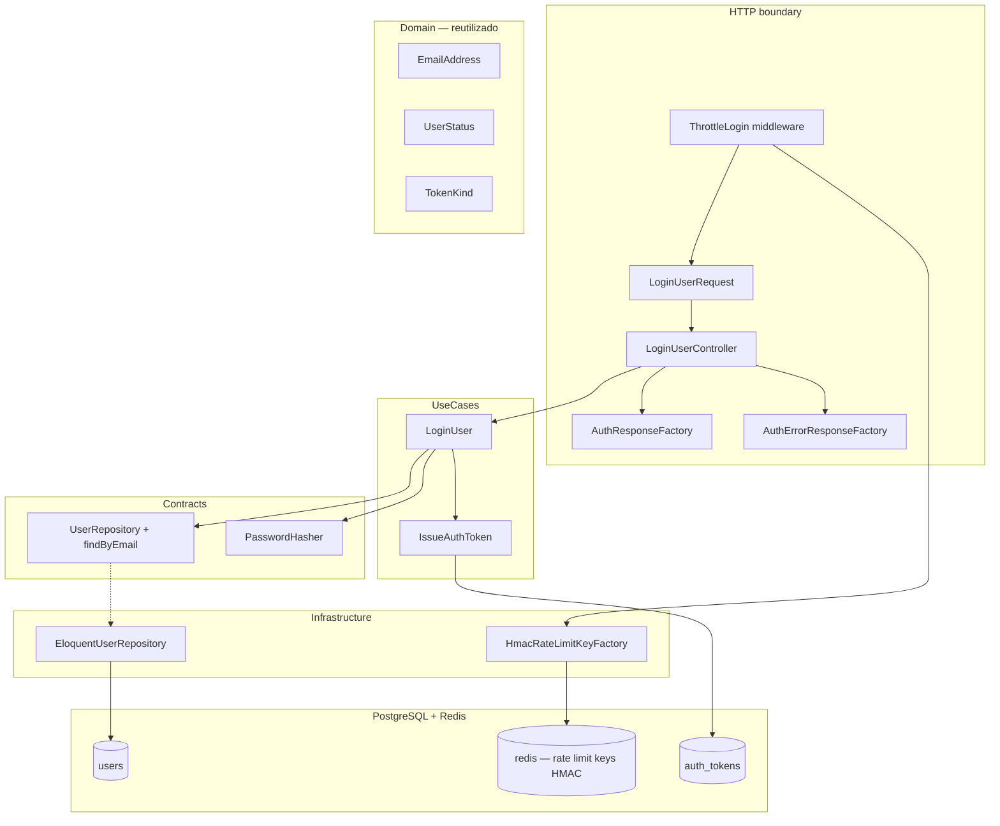
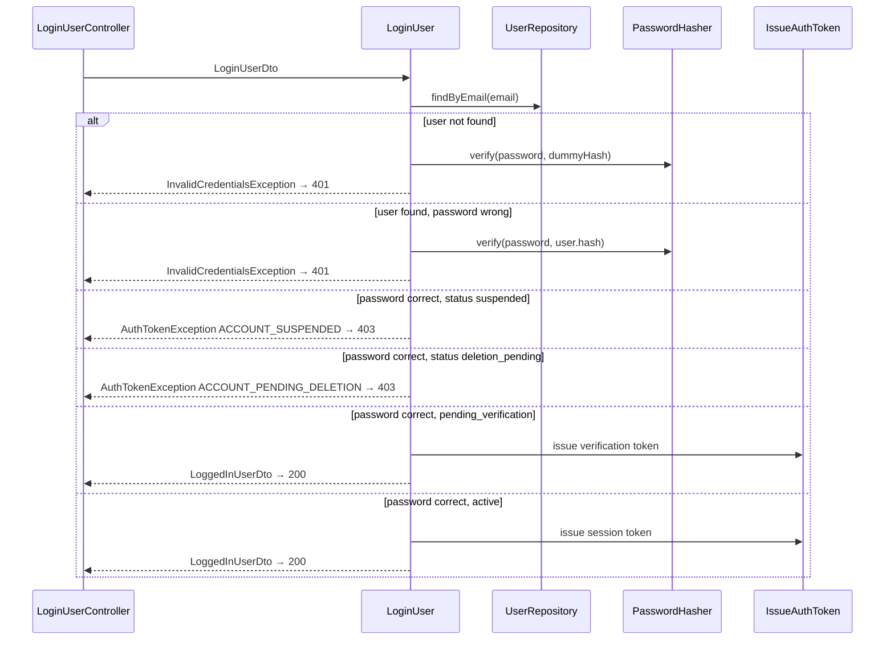

# Auth — Login — Design

**Spec:** `.specs/features/auth/login/spec.md`  
**Status:** Approved — 2026-07-27

---

## Abordagens consideradas

### 1. Lookup de usuário

| Abordagem | Prós | Contras | Veredicto |
| --- | --- | --- | --- |
| **A — `UserRepository::findByEmail(EmailAddress)` no port** | Hexagonal; testável; alinha registro (`existsByEmail`) | Um método novo | **Recomendada** |
| B — Query Eloquent direto no UseCase | Menos código | Viola camadas; acopla persistência | Rejeitada |
| C — Laravel `Auth::attempt()` | Idiomático | Guard/session fora do MVP Bearer; opaca domínio | Rejeitada |

### 2. Rate limiting dual (5/min e-mail+IP + 30/min IP)

| Abordagem | Prós | Contras | Veredicto |
| --- | --- | --- | --- |
| **A — Middleware único `ThrottleLogin` checando ambos limites antes do controller** | Conta toda POST; reutiliza `RateLimiter` + HMAC; espelha `ThrottleRegistration` | Precisa ler e-mail bruto do body para chave composta | **Recomendada** |
| B — Dois middlewares encadeados | Separação literal | Ordem/hit duplo mais frágil | Rejeitada |
| C — Rate limit só no UseCase | Sem middleware | Não conta 422 antes do UseCase; viola spec | Rejeitada |

### 3. Mitigação de timing oracle

| Abordagem | Prós | Contras | Veredicto |
| --- | --- | --- | --- |
| **A — `PasswordHasher::verify` sempre; hash dummy Argon2id pré-computado em `config('auth.dummy_password_hash')` quando usuário ausente** | Simples; testável via spy; alinha `docs/testing.md` §6.1 | Latência ainda pode variar marginalmente | **Recomendada** |
| B — Sleep fixo artificial | Uniformiza tempo | Frágil; anti-pattern | Rejeitada |
| C — Pular verify se usuário ausente | Rápido | Timing oracle | Rejeitada |

### 4. DTO de saída e resposta HTTP

| Abordagem | Prós | Contras | Veredicto |
| --- | --- | --- | --- |
| **A — `LoggedInUserDto` + `AuthResponseFactory::authenticated()` retornando `200`** | Semântica clara; registro permanece `201`/`issued()` | DTO quase idêntico a `RegisteredUserDto` | **Recomendada** |
| B — Reutilizar `RegisteredUserDto` + flag HTTP | Menos tipos | Nome enganoso no login | Rejeitada |
| C — Retornar só token sem user | Menor payload | Viola OpenAPI `AuthResponse` | Rejeitada |

### 5. Ordem credencial vs status bloqueado

| Abordagem | Prós | Contras | Veredicto |
| --- | --- | --- | --- |
| **A — Verificar senha primeiro; status bloqueado só após senha correta** | Senha errada em conta suspensa → `401` uniforme (LOG-12) | Revela status só com credencial correta (aceito pelo produto) | **Recomendada** |
| B — Checar status antes da senha | Menos work Argon2id | Senha errada em suspensa poderia vazar status via timing/work | Rejeitada |

**Decisão:** Abordagem A nos cinco eixos.

---

## Architecture Overview

Quarta fatia do módulo **Auth**: segundo endpoint público (`POST /api/v1/auth/login`), use case `LoginUser`, throttle dual HMAC, extensão de repositório e factories HTTP — reutilizando `IssueAuthToken`, `PasswordHasher` e padrões da fatia `registration`.



### Fluxo `LoginUser` (sequência)



### Ordem de entrega sugerida (Execute)

1. **Port + persistência** — `findByEmail`, exceção `InvalidCredentialsException`, config login + dummy hash
2. **Rate limit** — `HmacRateLimitKeyFactory` login keys + `ThrottleLogin` middleware
3. **Use case** — `LoginUser` + DTOs + integration tests
4. **HTTP** — FormRequest, factories, controller, rota, provider
5. **Feature E2E** — `LoginTest.php` + factory states
6. **Gates** — `make lint`, `make test-backend`

---

## Layout de artefatos

```txt
backend/
├── bootstrap/
│   └── app.php                                 # + alias throttle.login
├── config/
│   └── auth.php                                # + rate_limits.login, dummy_password_hash
├── modules/Auth/
│   ├── Contracts/
│   │   └── Repositories/
│   │       └── UserRepository.php              # + findByEmail
│   ├── DTOs/
│   │   ├── Input/
│   │   │   └── LoginUserDto.php
│   │   └── Output/
│   │       └── LoggedInUserDto.php
│   ├── Exceptions/
│   │   └── InvalidCredentialsException.php
│   ├── UseCases/
│   │   └── LoginUser.php
│   ├── Infrastructure/
│   │   ├── Http/
│   │   │   ├── Controllers/
│   │   │   │   └── LoginUserController.php
│   │   │   ├── Middleware/
│   │   │   │   └── ThrottleLogin.php
│   │   │   ├── Requests/
│   │   │   │   └── LoginUserRequest.php
│   │   │   ├── Responses/
│   │   │   │   ├── AuthResponseFactory.php     # + authenticated() → 200
│   │   │   │   └── AuthErrorResponseFactory.php # + invalidCredentials()
│   │   │   └── routes/
│   │   │       └── auth.php                    # + POST login
│   │   ├── Persistence/Eloquent/
│   │   │   ├── Repositories/
│   │   │   │   └── EloquentUserRepository.php  # + findByEmail
│   │   │   └── Factories/
│   │   │       └── UserModelFactory.php        # + active/suspended/deletionPending/withPassword
│   │   └── RateLimit/
│   │       └── HmacRateLimitKeyFactory.php     # + forLoginEmailIp, forLoginIp
│   ├── ServiceProviders/
│   │   └── AuthServiceProvider.php             # + LoginUser binding
│   └── Tests/
│       ├── Unit/
│       │   ├── HmacRateLimitKeyFactoryTest.php # estender
│       │   ├── ThrottleLoginTest.php
│       │   └── AuthResponseFactoryTest.php     # estender 200
│       ├── Integration/
│       │   ├── EloquentUserRepositoryTest.php  # findByEmail
│       │   └── LoginUserTest.php
│       └── Feature/
│           └── LoginTest.php
```

---

## Code Reuse Analysis

### Componentes existentes a reutilizar

| Componente | Local | Uso |
| --- | --- | --- |
| `IssueAuthToken` | `UseCases/IssueAuthToken.php` | Emissão `verification` / `session` |
| `IssuedAuthTokenDto` | `DTOs/Output/` | Montagem de `AuthResponse` |
| `PasswordHasher` | `Contracts/Services/PasswordHasher.php` | Verificação Argon2id |
| `EmailAddress` | `Domain/ValueObjects/EmailAddress.php` | Normalização |
| `UserStatus` | `Domain/Enums/UserStatus.php` | Mapeamento token / bloqueio |
| `TokenKind` | `Domain/Enums/TokenKind.php` | TTL absoluto na resposta |
| `AuthUserResource` | `Infrastructure/Http/Resources/` | Serialização `user` |
| `AuthErrorResponseFactory` | `Infrastructure/Http/Responses/` | + `invalidCredentials()`; reutiliza `accountSuspended` / `accountPendingDeletion` |
| `AuthResponseFactory` | `Infrastructure/Http/Responses/` | + `authenticated()` HTTP 200 |
| `ApiFormRequest` | `app/Http/Requests/` | Base de `LoginUserRequest` |
| `HmacRateLimitKeyFactory` | `Infrastructure/RateLimit/` | Estender com prefixos login |
| `ThrottleRegistration` | `Infrastructure/Http/Middleware/` | Padrão middleware HMAC |
| `AuthTokenException` | `Exceptions/AuthTokenException.php` | `accountSuspended`, `accountPendingDeletion` |
| `UserModelFactory` | `Infrastructure/Persistence/Eloquent/Factories/` | Cenários de status + senha |
| `DatabaseSafetyGuard` | `Tests/Support/` | Feature tests PG isolado |

### Pontos de integração

| Sistema | Método |
| --- | --- |
| PostgreSQL | `users` lookup; `auth_tokens` insert via `IssueAuthToken` |
| Redis | Chaves HMAC dual login |
| OpenAPI | `LoginRequest`, `AuthIssued` (200), `InvalidCredentials`, `AccountUnavailable` |
| `bootstrap/app.php` | Alias `throttle.login` |

---

## Components

### Port — `UserRepository::findByEmail`

```php
public function findByEmail(EmailAddress $email): ?User;
```

- **Implementation:** `EloquentUserRepository` — `where('email', $email->value())->first()` → mapper.
- **Tests:** Integration `EloquentUserRepositoryTest` — found / not found / normalização.

### Exceção — `InvalidCredentialsException`

```php
final class InvalidCredentialsException extends AuthDomainException
{
    public const INVALID_CREDENTIALS = 'INVALID_CREDENTIALS';
    public static function invalid(): self;
}
```

- Controller mapeia → `AuthErrorResponseFactory::invalidCredentials()` → `401`.
- Mensagem fixa OpenAPI: `The provided credentials are invalid.`

### Config — `config/auth.php` (extensão)

```php
'rate_limits' => [
    'registration' => [ /* existente */ ],
    'login' => [
        'email_ip' => [
            'max_attempts' => 5,
            'decay_seconds' => 60,
        ],
        'ip' => [
            'max_attempts' => 30,
            'decay_seconds' => 60,
        ],
    ],
],

// Precomputed Argon2id hash for timing mitigation (never matches real passwords)
'dummy_password_hash' => env('AUTH_DUMMY_PASSWORD_HASH', '$argon2id$v=19$m=65536,t=4,p=1$...'),
```

- Hash dummy gerado offline (fixture estável versionada); `PasswordHasher::verify` sempre executado quando usuário ausente.

### `HmacRateLimitKeyFactory` (extensão)

```php
public function forLoginEmailIp(string $canonicalIp, string $normalizedOrSentinelEmail): string
{
    return hash_hmac('sha256', 'login:email-ip:'.$canonicalIp.':'.$normalizedOrSentinelEmail, ...);
}

public function forLoginIp(string $canonicalIp): string
{
    return hash_hmac('sha256', 'login:ip:'.$canonicalIp, ...);
}
```

- **E-mail na chave composta:** tentar `EmailAddress::fromString(trim($raw))`; em falha sintática usar sentinel `_invalid_` (determinístico; não vaza e-mail bruto na chave Redis além do HMAC digest).
- IP/e-mail bruto never aparecem na chave exposta.

### Middleware — `ThrottleLogin`

- **Alias:** `throttle.login`
- **Comportamento (antes do controller):**
  1. `$ip = (string) $request->ip()`
  2. `$emailKeyPart` = normalizado ou `_invalid_` do input `email`
  3. `$keyEmailIp = forLoginEmailIp($ip, $emailKeyPart)`
  4. `$keyIp = forLoginIp($ip)`
  5. Se `tooManyAttempts` em **qualquer** chave → `429` + `Retry-After` (menor `availableIn`)
  6. Senão `RateLimiter::hit` em **ambas** chaves com decay 60s
  7. Delegar ao controller
- Conta 422/401/403/200 (toda POST).

### Use case — `LoginUser`

```php
final class LoginUser
{
    public function execute(LoginUserDto $input): LoggedInUserDto;
}
```

**Algoritmo (ordem fixa):**

1. `$email = EmailAddress::fromString($input->email)` — defesa; FormRequest já validou.
2. `$user = UserRepository::findByEmail($email)`.
3. Se `$user === null`:
   - `PasswordHasher::verify($input->plainTextPassword, config('auth.dummy_password_hash'))`
   - `throw InvalidCredentialsException::invalid()`
4. Se `! PasswordHasher::verify($input->plainTextPassword, $user->passwordHash())`:
   - `throw InvalidCredentialsException::invalid()` (inclui suspended/deletion_pending + senha errada → LOG-12)
5. Switch `$user->status()`:
   - `Suspended` → `throw AuthTokenException::accountSuspended()`
   - `DeletionPending` → `throw AuthTokenException::accountPendingDeletion()`
   - `PendingVerification` → `IssueAuthToken(Verification)`
   - `Active` → `IssueAuthToken(Session)`
6. Retorna `LoggedInUserDto($user, $issuedToken)`.
7. **Não** chama `QueueEmailVerification`; **não** revoga tokens existentes; **não** altera `User`.

Falha em `IssueAuthToken` após passo 5 → propaga exceção; controller → `500 INTERNAL_ERROR` genérico (handler existente ou catch explícito).

### DTOs

| DTO | Campos |
| --- | --- |
| `LoginUserDto` | `email` (string), `plainTextPassword` |
| `LoggedInUserDto` | `User $user`, `IssuedAuthTokenDto $token` |

### HTTP — `LoginUserRequest`

- **Extends:** `ApiFormRequest`
- **Rules:** `email` required email max:254; `password` required string max:128 (**sem** `PasswordPolicyRule`); `$this->replace($this->only(['email','password']))` em `prepareForValidation`.
- **`toDto()`:** `LoginUserDto`

### HTTP — `LoginUserController`

```php
final readonly class LoginUserController
{
    public function __invoke(LoginUserRequest $request): JsonResponse;
}
```

| Exceção | Resposta |
| --- | --- |
| `InvalidCredentialsException` | `401 INVALID_CREDENTIALS` |
| `AuthTokenException::accountSuspended` | `403 ACCOUNT_SUSPENDED` |
| `AuthTokenException::accountPendingDeletion` | `403 ACCOUNT_PENDING_DELETION` |
| Outras / falha emissão | `500 INTERNAL_ERROR` |

Sucesso → `AuthResponseFactory::authenticated($loggedIn)` → `200`.

### `AuthResponseFactory::authenticated`

- Mesmo envelope JSON que `issued()` (`data.token`, `token_type`, `token_kind`, `expires_at`, `user`).
- Status HTTP **`200`** (não `201`).
- Headers: `Cache-Control: private, no-store`, `X-Request-ID`.

### `AuthErrorResponseFactory::invalidCredentials`

| HTTP | code | message |
| --- | --- | --- |
| 401 | `INVALID_CREDENTIALS` | `The provided credentials are invalid.` |

### `UserModelFactory` states (testes)

| State | Uso |
| --- | --- |
| `active()` | `status=active`, `email_verified_at` set |
| `suspended()` | `status=suspended` |
| `deletionPending()` | `status=deletion_pending` |
| `withPassword(string $plain)` | `Hash::make($plain)` via `PasswordHasher` ou Hash facade |

---

## Data Models

Nenhuma migration nova. Reutiliza `users` e `auth_tokens`.

Login **não** persiste alterações em `users`; apenas insere row em `auth_tokens` via `IssueAuthToken`.

---

## Error Handling Strategy

| Cenário | Camada | HTTP | Body |
| --- | --- | --- | --- |
| Payload inválido | FormRequest | 422 | `VALIDATION_FAILED` |
| JSON malformado / Content-Type | Laravel / ApiFormRequest | 400 | `MALFORMED_REQUEST` |
| Rate limit (qualquer dimensão) | Middleware | 429 | `RATE_LIMIT_EXCEEDED` + `Retry-After` |
| E-mail ausente / senha errada / senha errada em bloqueado | LoginUser | 401 | `INVALID_CREDENTIALS` |
| Credencial correta + suspended / deletion_pending | LoginUser | 403 | `ACCOUNT_SUSPENDED` / `ACCOUNT_PENDING_DELETION` |
| Falha `IssueAuthToken` pós-auth | Controller/handler | 500 | `INTERNAL_ERROR` |
| Erro inesperado | Handler | 500 | sem senha/token/e-mail |

---

## Risks & Concerns

| Concern | Location | Impact | Mitigation |
| --- | --- | --- | --- |
| `AuthResponseFactory::issued()` hardcoded `201` | `AuthResponseFactory.php` | Login retornaria 201 | Novo método `authenticated()` com `200`; `issued()` intacto para registro |
| `UserRepository` sem `findByEmail` | Port atual | Login não compila | T1 — extensão port + adapter |
| E-mail inválido na chave rate limit | `ThrottleLogin` | Chaves instáveis | Sentinel `_invalid_` determinístico |
| Factory senha fixture estática | `UserModelFactory` | Testes não batem senha real | State `withPassword()` + senha conhecida nos Feature tests |
| `403` em credencial correta revela existência | Produto | Trade-off aceito | Documentado na spec; senha errada permanece `401` |
| Dummy hash inválido/corrupto | config | `verify` falha rápido | Hash Argon2id válido versionado; teste unitário de config |
| Middleware lê body antes de FormRequest | `ThrottleLogin` | Duplica parse JSON | Aceitável; `$request->input('email')` lazy |

---

## Tech Decisions

| Decision | Choice | Rationale |
| --- | --- | --- |
| Lookup | `findByEmail` no port | Spec assumption confirmada |
| Ordem auth | Senha → status | LOG-12 — senha errada nunca `403` |
| Multi-sessão | Sem revogação no login | Revisão spec 2026-07-27 |
| Sem reenvio e-mail | Não chamar `QueueEmailVerification` | Revisão spec 2026-07-27 |
| Rate limit scope | Todas POST | Consistente com registro |
| Dual limit | Middleware único, hit em ambas chaves | Atomicidade por request |
| Login validation | Bounds only | OpenAPI `LoginRequest` |
| DTO saída | `LoggedInUserDto` | Semântica distinta de registro |
| HTTP sucesso | `200` via `authenticated()` | OpenAPI `login` |
| Dummy hash | Config estática Argon2id | Timing mitigation testável |
| Rotas | Mesmo `auth.php` + `throttle.login` | Modular monolith |

Nenhuma nova entrada `AD-NNN` — conforma AD-010…AD-012.

---

## Requirement → Design Mapping

| ID | Componente(s) principal(is) |
| --- | --- |
| AUTH-09 | `LoginUser`, `InvalidCredentialsException`, `PasswordHasher` |
| AUTH-10 | `LoginUser` → `TokenKind` por `UserStatus` |
| AUTH-11 | `LoginUser` → `AuthTokenException` blocked statuses |
| LOG-01…03 | `LoginUserController`, `AuthResponseFactory::authenticated`, `IssueAuthToken` |
| LOG-04…05, LOG-12 | `LoginUser` ordem senha/status + dummy verify |
| LOG-06 | `AuthErrorResponseFactory` account unavailable |
| LOG-07 | `LoginUserRequest`, `ApiFormRequest` |
| LOG-08…09 | `ThrottleLogin`, `HmacRateLimitKeyFactory` |
| LOG-10…11 | Controller, rota, `LoginTest.php` |

---

## Referências

- `.specs/features/auth/login/spec.md`
- `.specs/features/auth/registration/design.md`
- `.specs/features/auth/bearer-tokens/design.md`
- `.specs/STATE.md` — AD-010…AD-012
- `docs/openapi.yaml` — `login`, `LoginRequest`, `InvalidCredentials`
- `docs/security.md` §4.1–4.2, §11, §13
- `docs/api.md` §3.1–3.2, §8
- `LARAVEL_CODE_DESIGN.md` §13, §17, §25
