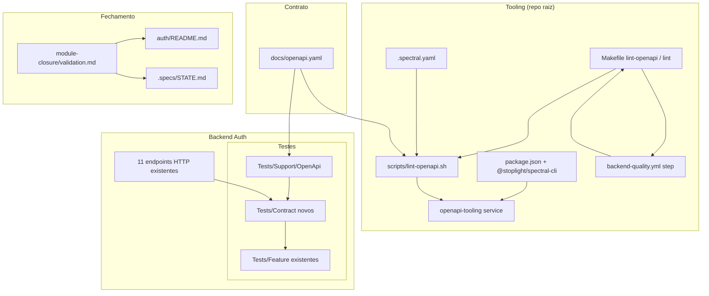

# Auth — Fechamento oficial do módulo backend — Design

**Spec:** `.specs/features/auth/module-closure/spec.md`  
**Status:** Approved — 2026-08-11 (Design confirmado pelo usuário)  
**Date:** 2026-08-11

---

## Abordagens consideradas

### 1. Lint OpenAPI (Spectral)

| Abordagem | Prós | Contras | Veredicto |
| --- | --- | --- | --- |
| **A — Spectral CLI no monorepo raiz (`package.json` + serviço Docker `openapi-tooling`)** | Regras customizáveis; paridade CI/local via Makefile; alinha decisão do usuário | Nova dep npm; serviço Compose adicional | **Recomendada** |
| B — `swagger-cli validate` | Zero config | Só sintaxe; sem regras de convenção do projeto | Rejeitada |
| C — Lint manual em CI via action third-party sem pin | Rápido de adicionar | Drift de versão; fora do Docker | Rejeitada |

### 2. Contract tests Auth

| Abordagem | Prós | Contras | Veredicto |
| --- | --- | --- | --- |
| **A — Pest Feature + helper PHP que lê `docs/openapi.yaml` (Symfony Yaml) e asserta estrutura** | Sem pacote PHP novo; reutiliza Feature stack; L-024/L-035 | Validador subset (não JSON Schema completo) | **Recomendada** (decisão SPEC) |
| B — Pacote PHP JSON Schema / OpenAPI validator | Validação completa | Nova dep; perguntar antes | Rejeitada |
| C — Duplicar shapes em arrays PHP hardcoded | Simples | Drift garantido | Rejeitada |

### 3. Onde executar Spectral

| Abordagem | Prós | Contras | Veredicto |
| --- | --- | --- | --- |
| **A — Serviço Compose `openapi-tooling` (Node slim, mount repo raiz `.:/repo`)** | AD-003 Makefile; AD-009 Docker-only; acesso a `docs/` e `package.json` raiz | Mais um serviço no compose | **Recomendada** |
| B — Container `frontend` com volume extra ad hoc | Reusa imagem existente | Frontend monta só `./frontend`; override frágil | Rejeitada |
| C — Host local `pnpm exec` | Rápido no dev | Viola regra Docker-only do projeto | Rejeitada |

### 4. Organização dos contract tests

| Abordagem | Prós | Contras | Veredicto |
| --- | --- | --- | --- |
| **A — `modules/Auth/Tests/Contract/` registrado na suite Feature do `phpunit.xml`** | Descoberto por `make test-backend`; separação clara vs Feature existente | Suite Feature fica maior | **Recomendada** |
| B — Mesclar asserts de contrato nos Feature tests atuais | Menos arquivos | Duplicação ou inflação de LoginTest etc. | Rejeitada |
| C — Suite PHPUnit separada `Contract` não invocada por padrão | Isolamento | Viola ABMC-05 (precisa rodar em `make test-backend`) | Rejeitada |

**Decisão:** Abordagem A em todos os eixos. Conformidade com AD-003, AD-009, AD-011 (PG testing), AD-012 (UUID v7 nos asserts de contrato).

---

## Architecture Overview

Fatia transversal de **fechamento**: não altera UseCases nem controllers (exceto P2 mínimo em validação HTTP). Adiciona **tooling de contrato**, **suíte Contract Pest**, **gates Makefile/CI** e **artefatos de gestão**.



---

## Code Reuse Analysis

### Existing Components to Leverage

| Component | Location | How to Use |
| --- | --- | --- |
| Feature tests Auth (factories, helpers) | `modules/Auth/Tests/Feature/*.php` | Contract tests reutilizam payloads, `issueSessionBearerForMe`, `loginPayload`, `DatabaseSafetyGuard`, padrões de rate limit |
| Schema contract tests (DB) | `modules/Auth/Tests/Integration/*SchemaContractTest.php` | Padrão de nomenclatura `*ContractTest`; evidência de abordagem já aceita no módulo |
| `AuthErrorResponseFactoryTest` | `Tests/Unit/AuthErrorResponseFactoryTest.php` | Catálogo canônico de `code` + `message` OpenAPI — contract tests referenciam mesmas strings |
| `CurrentUserTest` keys exatas | `Feature/CurrentUserTest.php:100-110` | Baseline para assert `UserResponse` |
| Symfony Yaml | `vendor/symfony/yaml` (transitivo Laravel) | Parse de `docs/openapi.yaml` no helper Contract |
| Swagger UI mount | `docker-compose.yml` swagger-ui | Já monta `docs/openapi.yaml`; lint Spectral complementa (não substitui) |
| `make lint` / CI workflow | `Makefile`, `.github/workflows/backend-quality.yml` | Estender, não substituir |
| `check-auth-coverage-gate.php` | `backend/scripts/` | Permanece inalterado; Verifier confirma ≥80% |
| Verifier / validate.md | `.claude/skills/tlc-spec-driven/references/validate.md` | Verifier final pós-Execute |

### Integration Points

| System | Integration Method |
| --- | --- |
| Docker Compose | Novo serviço `openapi-tooling`; volume read-only `./docs:/var/www/docs:ro` no anchor backend |
| Makefile | `lint-openapi` → `lint` (antes de `lint-backend` ou após — ver abaixo) |
| GitHub Actions | Step `make lint-openapi` no job `backend-quality` |
| OpenAPI 3.1 | Fonte única `docs/openapi.yaml`; helper PHP resolve `$ref` locais em `components/schemas` |
| PostgreSQL testing | Contract tests usam `RefreshDatabase` + `fake_link_testing` como Feature tests |

---

## Components

### 1. Serviço Docker `openapi-tooling`

- **Purpose:** Executar Spectral e futuros scripts Node de contrato no monorepo raiz, sem poluir imagem frontend/backend.
- **Location:** `docker-compose.yml`
- **Interfaces:**
  - `docker compose run --rm --no-deps openapi-tooling <cmd>`
- **Dependencies:** Imagem `node:${NODE_VERSION}-bookworm-slim`; Corepack + pnpm pinado (`docker/versions.env`)
- **Reuses:** Versões AD-005; padrão de health/command `true` de serviços auxiliares

```yaml
openapi-tooling:
  image: node:${NODE_VERSION:-24.18.0}-bookworm-slim
  working_dir: /repo
  volumes:
    - .:/repo
  command: ["true"]
  restart: "no"
```

### 2. Spectral config

- **Purpose:** Validar sintaxe OAS 3.1, `$ref` resolvíveis e regras mínimas do projeto.
- **Location:** `.spectral.yaml` (repo raiz)
- **Interfaces:**
  - `pnpm exec spectral lint docs/openapi.yaml --ruleset .spectral.yaml`
- **Dependencies:** `@stoplight/spectral-cli` (devDependency raiz)
- **Reuses:** Extends `spectral:oas`; regras adicionais:
  - `operation-operationId-unique`
  - `operation-tag-defined`
  - `oas3-valid-media-example` (warn se ruidoso)
  - Regra custom/documentada: todo path `/api/v1/auth/*` deve ter `operationId`

### 3. Script e Makefile

- **Purpose:** Gate único invocável local e CI.
- **Location:** `scripts/lint-openapi.sh`, `Makefile`
- **Interfaces:**
  - `make lint-openapi` → exit 0/≠0
  - `make lint` inclui `lint-openapi` **antes** de `lint-backend` (fail-fast barato)
- **Dependencies:** Serviço `openapi-tooling`
- **Reuses:** AD-003; paridade com `lint-frontend`

**`scripts/lint-openapi.sh` (comportamento):**

1. `set -euo pipefail`
2. `docker compose … run --rm --no-deps openapi-tooling sh -c '…'`
3. Dentro do container: `corepack enable`, `pnpm install --frozen-lockfile`, `pnpm exec spectral lint docs/openapi.yaml`
4. Propaga exit code

### 4. Root `package.json` tooling

- **Purpose:** Pin de Spectral no monorepo (separado de `frontend/package.json`).
- **Location:** `/package.json`
- **Interfaces:** `devDependencies["@stoplight/spectral-cli"]` com versão pinada
- **Dependencies:** pnpm lockfile raiz (`pnpm-lock.yaml` — criar/atualizar na raiz se ainda não existir para deps além de husky)
- **Reuses:** `packageManager: pnpm@11.15.1` existente

### 5. Volume `docs/` no backend

- **Purpose:** Contract tests PHP leem `docs/openapi.yaml` dentro do container backend.
- **Location:** `docker-compose.yml` anchor `x-backend-common` volumes
- **Interfaces:** Mount `./docs:/var/www/docs:ro`
- **Dependencies:** Nenhuma runtime — só testes/lint backend se necessário
- **Reuses:** Mesmo arquivo servido ao Swagger UI

**Env de teste:** `OPENAPI_SPEC_PATH=/var/www/docs/openapi.yaml` em `phpunit.xml` `<php><env …/></php>`.

### 6. Support OpenAPI (`Tests/Support/OpenApi/`)

- **Purpose:** Carregar contrato e assertar respostas HTTP contra schemas OpenAPI (subset).
- **Location:** `backend/modules/Auth/Tests/Support/OpenApi/`

#### `OpenApiDocument.php`

- Carrega YAML uma vez (static cache por processo Pest)
- Resolve `$ref` relativos em `#/components/schemas/*`, `#/components/responses/*`
- API:
  - `schema(string $name): array` — ex.: `User`, `AuthData`, `ErrorResponse`
  - `responseSchema(string $responseComponent): array` — ex.: unwrap `AuthIssued` → JSON schema
  - `exampleMessage(string $code): ?string` — busca example com `code` matching

#### `OpenApiSchemaAssert.php`

- **Purpose:** Asserts estruturais derivados do schema (não validador JSON Schema completo).
- **Interfaces:**
  - `assertMatchesSchema(array $payload, array $schema, string $path = '$'): void`
  - `assertExactKeys(array $payload, array $allowedKeys): void` — para `additionalProperties: false`
  - `assertErrorEnvelope(TestResponse $r, int $status, string $code, string $message): void`
  - `assertPrivateCacheAndRequestId(TestResponse $r): void`
- **Regras suportadas (MVP):**
  - `type`: string, object, integer, boolean, null (union via `nullable`/`type` array OAS 3.1)
  - `required` keys
  - `additionalProperties: false`
  - `enum`
  - `pattern` (UUID v7, error codes)
  - `$ref` (resolvido antes)
- **Explicitamente fora do MVP:** `oneOf`, `allOf` complexos, `format` beyond regex, numeric ranges

#### `AuthOpenApiCatalog.php`

- **Purpose:** Constantes de códigos/mensagens Auth exigidos por ABMC-08 (single source para contract tests).
- **Interfaces:** `errorCodes(): array`, `messages(): array<string, string>`

### 7. Contract test suite

- **Purpose:** Uma bateria por endpoint (happy + erros representativos) validando contrato OpenAPI.
- **Location:** `backend/modules/Auth/Tests/Contract/`
- **Dependencies:** Support OpenApi; factories; mesmo bootstrap Feature (`RefreshDatabase`, guards)
- **Reuses:** Helpers de Feature (`issueSessionBearerForMe`, etc.) — extrair para `Tests/Support/AuthHttpFixtures.php` se duplicação crescer

**Arquivos propostos:**

| Arquivo | Endpoints | Cenários mínimos |
| --- | --- | --- |
| `RegisterContractTest.php` | `POST /auth/register` | 201 AuthResponse schema; 403 REGISTRATION_NOT_ALLOWED envelope |
| `LoginContractTest.php` | `POST /auth/login` | 200 session + verification kinds; 401 INVALID_CREDENTIALS |
| `EmailVerificationContractTest.php` | verify + resend | 204; 403 INVALID_VERIFICATION_TOKEN; 202 resend |
| `PasswordContractTest.php` | change, reset-request, reset | 204; 202; 422 PASSWORD_REUSED + token field |
| `SessionContractTest.php` | logout, logout-all, GET/PATCH me | 204; 200 UserResponse exact keys; 403 TOKEN_RESTRICTED |

**Descoberta:** adicionar em `phpunit.xml`:

```xml
<directory>modules/Auth/Tests/Contract</directory>
```

dentro da suite `Feature` (mantém ABMC-05).

**Princípio (L-024, L-035):** contract tests assertam **valores** (`code`, `message`, keys) iguais ao OpenAPI/examples — não só presença de chaves.

### 8. P2 — gaps menores (design por item)

| Gap | Abordagem | Arquivo alvo |
| --- | --- | --- |
| Login `IssueAuthToken` falha → 500 sem token | Feature test com mock container: `IssueAuthToken` lança `RuntimeException` após login válido; assert 500 + `INTERNAL_ERROR` + `auth_tokens` count 0 | `Tests/Feature/LoginTest.php` ou `Tests/Contract/LoginContractTest.php` |
| Email token whitespace `" "` → 422 | Adicionar regra `not_regex:/^\s+$/` ou custom rule em `VerifyEmailRequest`; Feature assert 422 + token unused | `VerifyEmailRequest.php` + `EmailVerificationTest.php` |
| Password enqueue falha pós-persist | Integration: bind `QueuePasswordReset` fake que chama `IssuePasswordResetToken` real then throws; assert token persisted + 500/202 conforme controller mapping; se controller engole, documentar em validation | `Tests/Integration/RequestPasswordResetTest.php` |
| Logout-all concorrente | Feature: duas requisições paralelas (PHP fibers ou sequential rápido com mesmo bearer+password); assert final token count 0 | `Tests/Feature/LogoutAllTest.php` |

> **Nota P2 email:** única alteração de produção permitida — validação HTTP (`VerifyEmailRequest`), alinhada ao espírito anti-scanner das fatias EV.

### 9. Fechamento documental (Execute)

- **Purpose:** Sincronizar artefatos de gestão pós-gates verdes.
- **Location:** ver ABMC-11…15
- **Checklist de arquivos:**
  - `.specs/features/auth/README.md` — fatia 8 → Verified
  - `.specs/features/auth/login/spec.md` … `session-and-profile/spec.md` — Goals `[x]`
  - `.specs/STATE.md` — Handoff: Auth Backend ✅; next BFF `session-core`
  - `README.md` raiz — §Estado atual
  - `.specs/features/auth/module-closure/validation.md` — Verifier

### 10. CI (`backend-quality.yml`)

- **Purpose:** Paridade local/CI para lint OpenAPI.
- **Steps (ordem proposta):**
  1. Checkout + `.env`
  2. Build backend (existente)
  3. **`make lint-openapi`** (novo — antes ou junto do lint backend)
  4. Demais steps existentes (Pint, PHPStan, …, `test-backend-coverage`)

Contract tests rodam dentro de `make test-backend-coverage` — sem step separado.

---

## Contract Test Matrix (ABMC-05…10)

| Endpoint | Happy status | Error statuses (amostra contract) | Schema / response component |
| --- | --- | --- | --- |
| POST register | 201 | 403 REGISTRATION_NOT_ALLOWED, 422 | `AuthIssued` |
| POST login | 200 | 401 INVALID_CREDENTIALS, 403 ACCOUNT_SUSPENDED | `AuthIssued` |
| POST email/verify | 204 | 403 INVALID_VERIFICATION_TOKEN, 403 EMAIL_ALREADY_VERIFIED | empty |
| POST email/verification-notification | 202 | 401, 403 TOKEN_RESTRICTED | `Accepted` |
| POST password/reset-request | 202 | 422 | `Accepted` |
| POST password/reset | 204 | 422 token / PASSWORD_REUSED | empty |
| POST password/change | 204 | 401, 403 TOKEN_RESTRICTED, 422 PASSWORD_REUSED | empty |
| POST logout | 204 | 401 | empty |
| POST logout-all | 204 | 401 INVALID_CREDENTIALS (wrong password) | empty |
| GET /me | 200 | 401, 403 ACCOUNT_* | `User` |
| PATCH /me | 200 | 403 TOKEN_RESTRICTED, 422 | `User` |

Headers (ABMC-09): subset em register, login, GET /me — `Cache-Control: private, no-store` + `X-Request-ID`.

---

## File Tree (delta)

```txt
fake-link/
├── .spectral.yaml                          # NEW
├── package.json                            # MOD — add spectral-cli
├── pnpm-lock.yaml                          # MOD — root lockfile
├── docker-compose.yml                      # MOD — openapi-tooling + docs mount backend
├── Makefile                                # MOD — lint-openapi; lint depends on it
├── scripts/
│   └── lint-openapi.sh                     # NEW
├── .github/workflows/
│   └── backend-quality.yml                 # MOD — lint-openapi step
├── docs/openapi.yaml                       # UNCHANGED (salvo drift encontrado)
└── backend/
    ├── phpunit.xml                         # MOD — Contract dir + OPENAPI_SPEC_PATH
    └── modules/Auth/Tests/
        ├── Support/OpenApi/
        │   ├── OpenApiDocument.php         # NEW
        │   ├── OpenApiSchemaAssert.php     # NEW
        │   └── AuthOpenApiCatalog.php      # NEW
        └── Contract/
            ├── RegisterContractTest.php    # NEW
            ├── LoginContractTest.php       # NEW
            ├── EmailVerificationContractTest.php
            ├── PasswordContractTest.php
            └── SessionContractTest.php
```

---

## Error Handling Strategy

| Error Scenario | Handling | Developer Impact |
| --- | --- | --- |
| Spectral lint failure | Exit ≠ 0; CI bloqueia merge | Mensagem Spectral com path + rule |
| `$ref` quebrado no OpenAPI | Spectral falha | Corrigir yaml antes de implementação |
| Contract test drift | Pest FAIL com diff de keys/code/message | Atualizar implementação **ou** OpenAPI (design-first) na mesma PR |
| `openapi.yaml` inacessível no container | Test bootstrap throws clara | Verificar volume `./docs` montado |
| P2 enqueue failure sem seam | Registrar ops-verified em validation.md | Não inventar teste frágil |

---

## Risks & Concerns

| Concern | Location | Impact | Mitigation |
| --- | --- | --- | --- |
| Backend container não monta `docs/` hoje | `docker-compose.yml:12` | Contract tests não acham yaml | Adicionar volume ro `./docs:/var/www/docs:ro` (Component 5) |
| Validador schema subset vs JSON Schema completo | `OpenApiSchemaAssert` | Falso verde em constructs complexos | Escopo Auth schemas é flat (`additionalProperties: false`); documentar limites; expandir se Links exigir |
| Duplicação Feature vs Contract | `Tests/Feature` vs `Contract` | Manutenção dobrada | Contract foca **forma/contrato**; Feature mantém **comportamento de domínio**; reutilizar fixtures |
| `pnpm install` lento no CI para lint | `openapi-tooling` | Pipeline mais lento | Cache pnpm no workflow (actions/setup-node + cache) ou volume nomeado entre runs |
| OpenAPI file inclui paths não implementados | `docs/openapi.yaml` Links/Analytics | Lint passa; dev confunde | Contract tests escopo Auth only; lint arquivo inteiro (decisão usuário) |
| P2 `VerifyEmailRequest` muda comportamento | `VerifyEmailRequest.php` | Whitespace antes aceito | Teste + regra explícita; alinhado a P2 aprovado |
| L-035 satisfeito por automation | session-and-profile validation gap | Reincidência em Links | AD-016 pattern reutilizável |

---

## Tech Decisions

| Decision | Choice | Rationale |
| --- | --- | --- |
| Lint tool | Spectral CLI | Aprovado pelo usuário na SPEC |
| Contract validation | Pest + PHP OpenApi helpers | Sem pacote PHP; Symfony Yaml já presente |
| Contract test location | `modules/Auth/Tests/Contract/` in Feature suite | ABMC-05 + separação clara |
| OpenAPI path in container | `/var/www/docs/openapi.yaml` | Volume dedicado; env `OPENAPI_SPEC_PATH` |
| Spectral execution | Compose service `openapi-tooling` | Repo root mount; Docker-only |
| `make lint` order | `lint-openapi` → `lint-backend` → … | Fail-fast no contrato (barato) |
| P2 scope | All 4 gaps | Decisão usuário SPEC |
| Client TS generation | Out of scope | SPEC; fatia futura Fase 0 transversal |

> **Project-level decision (proposed AD-016):** OpenAPI lint via Spectral at repo root (`make lint-openapi`); contract tests live in `modules/{Module}/Tests/Contract/`; backend containers mount `./docs:/var/www/docs:ro`. Registrar em `.specs/STATE.md` durante Execute.

---

## Gate & Verification Plan

| Gate | Command | When |
| --- | --- | --- |
| OpenAPI lint | `make lint-openapi` | Cada task de tooling; CI |
| Full lint | `make lint` | Task final tooling; CI (parcial hoje) |
| Contract + regression | `make test-backend` | Cada task Contract/P2 |
| Coverage Auth | `make test-backend-coverage` | Task final antes Verifier |
| Verifier | validate.md standalone / sub-agent | Após última task Execute |

**Sensor mutations (design intent):**

1. Alterar `message` em `AuthErrorResponseFactory` → contract test FAIL
2. Adicionar campo extra em `AuthUserResource` → UserResponse contract FAIL
3. Remover `Retry-After` assert path → rate limit contract FAIL (se coberto)

---

## Próximo passo

Após aprovação deste Design → **Tasks** (`tasks.md`) com fases:

1. **Tooling** — Spectral, compose, Makefile, CI, docs mount (~4 tasks)
2. **Support + Contract** — helpers + 5 arquivos Contract (~5 tasks)
3. **P2 gaps** — 4 testes/fixes (~4 tasks)
4. **Docs + Verifier** — fechamento ABMC-11…18 (~3 tasks)

Estimativa: **~16 tasks** → 2–3 batches Execute (~7 tasks/worker).
