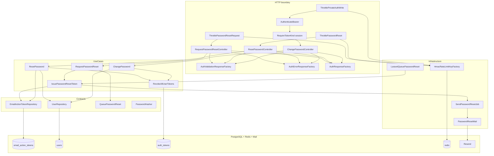
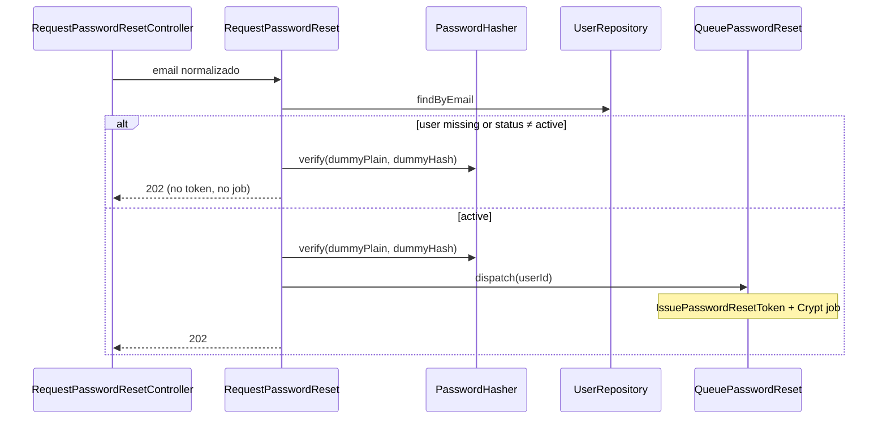
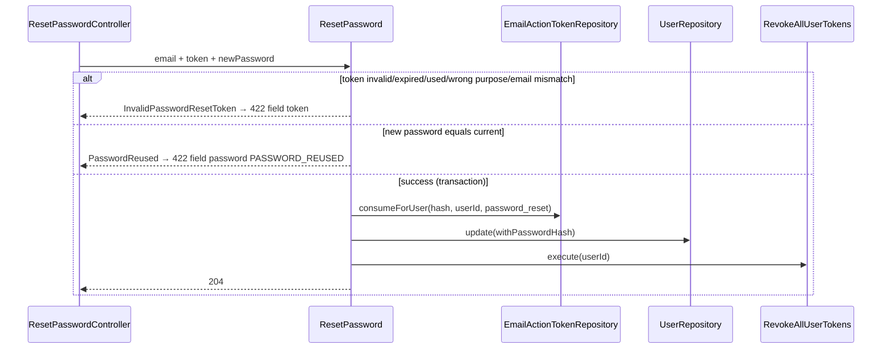
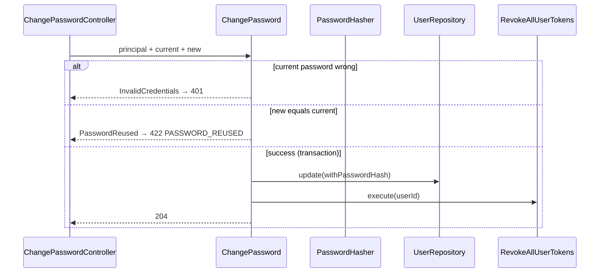

# Auth — Senha (alterar e recuperar) — Design

**Spec:** `.specs/features/auth/password/spec.md`  
**Context:** `.specs/features/auth/password/context.md`  
**Status:** Draft — awaiting approval (Design)  
**Date:** 2026-07-28

---

## Abordagens consideradas

### 1. Emissão do token `password_reset`

| Abordagem | Prós | Contras | Veredicto |
| --- | --- | --- | --- |
| **A — Use case `IssuePasswordResetToken` espelhando `IssueEmailVerificationToken`** | Reusa repository/hasher/generator; purpose distinto; invalidação por `user_id`+purpose | Um use case a mais | **Recomendada** |
| B — Generalizar um único `IssueEmailActionToken(purpose)` | Menos classes | Refactor EV em voo; risco de regressão | Rejeitada nesta fatia |
| C — Job gera o token no `handle()` | Payload menor | Race/duplicação; viola paridade EV | Rejeitada |

### 2. Envelope `422` com field codes (`PASSWORD_REUSED`, token inválido)

| Abordagem | Prós | Contras | Veredicto |
| --- | --- | --- | --- |
| **A — Use case lança exceção de domínio; controller/factory monta `ApiResponse::validationError` com `code` estável** | Não depende do `ApiFormRequest` (hoje força `INVALID`); alinhado à spec | Dois caminhos de validação (FormRequest + factory) | **Recomendada** |
| B — Estender `ApiFormRequest` para códigos por regra nesta fatia | Unifica FormRequest | Escopo global prematuro; change/reset precisam de lógica pós-lookup | Rejeitada agora (possível follow-up) |
| C — Top-level `403`/`409` | Mais simples | Contraria decisão Q2 e OpenAPI do reset | Rejeitada |

### 3. Atualização de senha no domínio

| Abordagem | Prós | Contras | Veredicto |
| --- | --- | --- | --- |
| **A — `User::withPasswordHash(string $hash): self` imutável + `UserRepository::update`** | Paridade `markEmailVerified`; hexagonal | Método novo | **Recomendada** |
| B — Update Eloquent direto no UseCase | Menos código | Viola hexagonal | Rejeitada |

### 4. Rate limiting

| Abordagem | Prós | Contras | Veredicto |
| --- | --- | --- | --- |
| **A — Três middlewares: reset-request (email+IP), reset (IP+token digest), change (escritas privadas 120/min por conta)** | Limites distintos; HMAC via factory existente | Três aliases | **Recomendada** |
| B — Só limites dedicados; change sem throttle | Menos arquivos | Viola `docs/api.md` §8 | Rejeitada |

### 5. Mail de recuperação

| Abordagem | Prós | Contras | Veredicto |
| --- | --- | --- | --- |
| **A — Port `QueuePasswordReset` + Job + Mailable; plaintext cifrado no payload; `Mail::fake()`** | Clone do pipeline EV; sem SDK | Arquivos espelhados | **Recomendada** |
| B — Reusar job de verificação com flag | Menos arquivos | Acoplamento de assuntos/URLs/purposes | Rejeitada |

**Decisão:** Abordagem A em todos os eixos. Conformidade com AD-009…012 (Docker gates, PG testing, UUID v7).

---

## Architecture Overview

Sexta fatia do módulo **Auth**: purpose `password_reset` (TTL 30 min), solicitação anti-enumeração, conclusão pública do reset, alteração autenticada com Bearer `session`, revogação total via `RevokeAllUserTokens`, field codes `PASSWORD_REUSED` / token inválido em envelope `422`.



### Fluxo reset-request (sequência)



### Fluxo reset (sequência)



### Fluxo change (sequência)



### Ordem de entrega sugerida (Execute)

1. **Schema + domínio purpose** — migration CHECK, enum TTL 1800, config
2. **Emissão + mail** — IssuePasswordResetToken, queue, job, mailable
3. **Request + reset + change use cases** — anti-enum, consume, revoke all, PW-17
4. **Rate limit + HTTP** — middlewares, requests, controllers, factories, rotas
5. **Feature E2E + OpenAPI + gates**

---

## Layout de artefatos

```txt
backend/
├── config/auth.php                         # + password_reset, rate_limits.*
├── database/migrations/
│   └── *_allow_password_reset_purpose_on_email_action_tokens.php
├── modules/Auth/
│   ├── Contracts/Services/
│   │   └── QueuePasswordReset.php
│   ├── Domain/
│   │   ├── Enums/EmailActionPurpose.php    # + PasswordReset TTL 1800
│   │   └── Entities/User.php               # + withPasswordHash()
│   ├── DTOs/Input/
│   │   ├── RequestPasswordResetDto.php
│   │   ├── ResetPasswordDto.php
│   │   └── ChangePasswordDto.php
│   ├── Exceptions/
│   │   ├── InvalidPasswordResetTokenException.php
│   │   └── PasswordReusedException.php
│   ├── UseCases/
│   │   ├── IssuePasswordResetToken.php
│   │   ├── RequestPasswordReset.php
│   │   ├── ResetPassword.php
│   │   └── ChangePassword.php
│   ├── Infrastructure/
│   │   ├── Http/
│   │   │   ├── Controllers/
│   │   │   │   ├── RequestPasswordResetController.php
│   │   │   │   ├── ResetPasswordController.php
│   │   │   │   └── ChangePasswordController.php
│   │   │   ├── Middleware/
│   │   │   │   ├── ThrottlePasswordResetRequest.php
│   │   │   │   ├── ThrottlePasswordReset.php
│   │   │   │   └── ThrottlePrivateAuthWrite.php
│   │   │   ├── Requests/
│   │   │   │   ├── RequestPasswordResetRequest.php
│   │   │   │   ├── ResetPasswordRequest.php
│   │   │   │   └── ChangePasswordRequest.php
│   │   │   ├── Responses/
│   │   │   │   └── AuthValidationResponseFactory.php
│   │   │   └── routes/auth.php
│   │   ├── Jobs/SendPasswordResetJob.php
│   │   ├── Mail/PasswordResetMail.php
│   │   ├── Notifications/LaravelQueuePasswordReset.php
│   │   └── RateLimit/HmacRateLimitKeyFactory.php  # + 3 methods
│   └── Tests/
│       ├── Unit/ …
│       ├── Integration/ …
│       └── Feature/
│           ├── PasswordResetTest.php
│           └── PasswordChangeTest.php
docs/openapi.yaml                           # + PASSWORD_REUSED example
```

### Rotas

| Rota | Middleware |
| --- | --- |
| `POST /password/reset-request` | `throttle.password_reset.request` |
| `POST /password/reset` | `throttle.password_reset.complete` |
| `POST /password/change` | `throttle.private_auth.write`, `auth.bearer`, `token.kind:session` |

Prefixo existente: `/api/v1/auth` (via `AuthServiceProvider`).

---

## Code Reuse Analysis

### Componentes existentes a reutilizar

| Componente | Local | Uso |
| --- | --- | --- |
| `IssueEmailVerificationToken` | `UseCases/` | Template para `IssuePasswordResetToken` (invalidate + save + plaintext) |
| `EmailActionTokenRepository` | Contracts + Eloquent | `invalidateUnusedForUser`, `save`, `consumeForUser` com purpose `password_reset` |
| `BearerTokenGenerator` / `Sha256TokenHasher` | Domain / Infra | Mesmo formato de token |
| `RevokeAllUserTokens` | UseCases | Change + reset pós-sucesso |
| `UserRepository::findByEmail` / `update` | Contracts + Eloquent | Lookup anti-enum; persist hash |
| `PasswordHasher` + `dummy_password_hash` | Infra / config | Timing uniforme no request; verify current/reused |
| `PasswordPolicy` / `PasswordPolicyRule` | Domain / Http Rules | Validação FormRequest change/reset |
| `LoginUser` dummy verify pattern | UseCases | Copiar timing no `RequestPasswordReset` |
| `SendEmailVerificationJob` / `EmailVerificationMail` | Infra | Clone para password reset (URL/assunto distintos) |
| `HmacRateLimitKeyFactory` | RateLimit | Novos prefixos `password-reset:*` / `private-auth:write:` |
| `AuthenticateBearer` / `RequireTokenKind` | Middleware | Change exige `session` |
| `AuthResponseFactory::accepted` / `noContent` | Responses | `202` / `204` |
| `AuthErrorResponseFactory::invalidCredentials` | Responses | Change senha atual errada |
| `ApiResponse::validationError` | `app/Http/Responses` | Envelope field codes |
| `DatabaseSafetyGuard` | Tests/Support | Integration PG only |

### Integration Points

| Sistema | Método |
| --- | --- |
| PostgreSQL `email_action_tokens` | ALTER CHECK purpose; reuso de colunas |
| Redis rate limit | Laravel RateLimiter + HMAC keys |
| Fila `notifications` | Job password reset |
| Laravel Mail / Resend | Transport existente |
| OpenAPI | Exemplo `PASSWORD_REUSED` em ValidationError |

---

## Components

### Migration — allow `password_reset`

- **Purpose**: Estender CHECK `email_action_tokens_purpose_check` para `('email_verification','password_reset')`.
- **Location**: `backend/database/migrations/` via `php artisan make:migration` no container.
- **Interfaces**: N/A
- **Dependencies**: Tabela existente (EV)
- **Reuses**: Padrão migration Auth; AD-011/012

### `EmailActionPurpose::PasswordReset`

- **Purpose**: Purpose + TTL 1800s.
- **Location**: `Domain/Enums/EmailActionPurpose.php`
- **Interfaces**: `absoluteTtlSeconds(): int` → 1800
- **Dependencies**: None
- **Reuses**: Enum EV

### `User::withPasswordHash`

- **Purpose**: Retornar cópia imutável com novo hash; status inalterado.
- **Location**: `Domain/Entities/User.php`
- **Interfaces**: `withPasswordHash(string $passwordHash): self`
- **Dependencies**: None
- **Reuses**: Padrão `markEmailVerified`

### `IssuePasswordResetToken`

- **Purpose**: Invalidar unused `password_reset` do user; emitir hash + plaintext uma vez.
- **Location**: `UseCases/IssuePasswordResetToken.php`
- **Interfaces**: `execute(UserId): IssuedEmailActionTokenDto`
- **Dependencies**: EmailActionTokenRepository, IdGenerator, BearerTokenGenerator, TokenHasher
- **Reuses**: `IssueEmailVerificationToken`

### `QueuePasswordReset` + `LaravelQueuePasswordReset` + Job + Mail

- **Purpose**: Após issue, enfileirar job com ciphertext; enviar e-mail pt-BR com URL `/reset-password?token=`.
- **Location**: Contracts + Infrastructure/Notifications|Jobs|Mail
- **Interfaces**: `dispatch(UserId): void`
- **Dependencies**: IssuePasswordResetToken, Crypt, Mail
- **Reuses**: Pipeline EV

### `RequestPasswordReset`

- **Purpose**: Anti-enumeração `202`; só `active` dispara queue; dummy verify sempre.
- **Location**: `UseCases/RequestPasswordReset.php`
- **Interfaces**: `execute(RequestPasswordResetDto): void`
- **Dependencies**: UserRepository, PasswordHasher, QueuePasswordReset, config dummy hash
- **Reuses**: `LoginUser` timing

### `ResetPassword`

- **Purpose**: Consumir token, rejeitar reused, atualizar hash, revogar todos Bearers; sem emitir token.
- **Location**: `UseCases/ResetPassword.php`
- **Interfaces**: `execute(ResetPasswordDto): void`
- **Dependencies**: UserRepository, EmailActionTokenRepository, PasswordHasher, PasswordPolicy (pré-validado no HTTP), RevokeAllUserTokens, TokenHasher
- **Reuses**: `VerifyUserEmail` consume + transaction pattern; `RevokeAllUserTokens`

### `ChangePassword`

- **Purpose**: Verificar current; rejeitar reused; update hash; revoke all.
- **Location**: `UseCases/ChangePassword.php`
- **Interfaces**: `execute(AuthenticatedPrincipal, ChangePasswordDto): void`
- **Dependencies**: UserRepository, PasswordHasher, RevokeAllUserTokens
- **Reuses**: Login credential check + RevokeAll

### Exceptions

- **`InvalidPasswordResetTokenException`**: sinaliza 422 field `token` (message fixa da spec).
- **`PasswordReusedException`**: sinaliza 422 field `password` / `PASSWORD_REUSED`.
- **`InvalidCredentialsException`**: reuso existente → 401 no change.

### `AuthValidationResponseFactory`

- **Purpose**: Montar `ApiResponse::validationError` com codes estáveis.
- **Location**: `Infrastructure/Http/Responses/AuthValidationResponseFactory.php`
- **Interfaces**:
  - `invalidPasswordResetToken(): JsonResponse` → `errors.token[]` message `The password reset token is invalid or has expired.` (code field: `INVALID` ou `INVALID_PASSWORD_RESET_TOKEN` — **default field code `INVALID`** para alinhar ApiFormRequest atual; message é o discriminador estável da spec; documentar message no OpenAPI)
  - `passwordReused(): JsonResponse` → `errors.password[]` com `code=PASSWORD_REUSED` e message da spec
- **Dependencies**: `ApiResponse`
- **Reuses**: Envelope OpenAPI ValidationError

> **Nota field code do token:** Spec exige message estável no campo `token`, não um top-level code. Usar `code=INVALID` no item (paridade FormRequest) **ou** `INVALID_PASSWORD_RESET_TOKEN` se quisermos simetria com `PASSWORD_REUSED`. **Escolha de design: `INVALID` para token** (só message estável) e **`PASSWORD_REUSED` para password** (code estável exigido pela revisão). Documentar ambos no OpenAPI.

### Middlewares de throttle

| Classe | Limite | Chave HMAC |
| --- | --- | --- |
| `ThrottlePasswordResetRequest` | 3 / 3600s | `password-reset:request:{ip}:{email}` |
| `ThrottlePasswordReset` | 5 / 3600s | `password-reset:complete:{ip}:{tokenDigest}` |
| `ThrottlePrivateAuthWrite` | 120 / 60s | `private-auth:write:{userId}` |

Contam **todas** as tentativas POST (incluindo 422/401/202/204).

### Controllers + Form Requests

- Bodies OpenAPI: `PasswordResetRequest`, `ResetPasswordRequest`, `ChangePasswordRequest`.
- `PasswordPolicyRule` + `confirmed` em change/reset.
- Controllers finos: mapear exceções → factories; sucesso → `accepted()` / `noContent()`.

---

## Data Models

### `email_action_tokens.purpose` (estendido)

```text
CHECK (purpose IN ('email_verification', 'password_reset'))
password_reset → expires_at = now + 1800s
```

### Config (`auth.php`)

```php
'password_reset' => [
    'frontend_base_url' => env('APP_URL'),
    'frontend_path' => '/reset-password',
    'absolute_ttl_seconds' => 1800,
],
'rate_limits' => [
    'password_reset_request' => ['max_attempts' => 3, 'decay_seconds' => 3600],
    'password_reset_complete' => ['max_attempts' => 5, 'decay_seconds' => 3600],
    'private_auth_write' => ['max_attempts' => 120, 'decay_seconds' => 60],
],
```

---

## Error Handling Strategy

| Scenario | Handling | Cliente vê |
| --- | --- | --- |
| Reset-request e-mail inválido / extra fields | FormRequest | `422 VALIDATION_FAILED` |
| Reset-request inexistente / não-active | Use case no-op + dummy verify | `202 Accepted` idêntico |
| Reset token inválido/expirado/usado/purpose/email | InvalidPasswordResetTokenException | `422` + `errors.token` message fixa |
| Nova senha = atual (change/reset) | PasswordReusedException | `422` + `errors.password[].code=PASSWORD_REUSED` |
| Política / confirmation | FormRequest + PasswordPolicyRule | `422` (sem consumir token) |
| Change current errada | InvalidCredentialsException | `401 INVALID_CREDENTIALS` |
| Change bearer verification | RequireTokenKind | `403 TOKEN_RESTRICTED` |
| Conta suspended no change | AuthenticateBearer / status guard | `403 ACCOUNT_*` |
| Rate limit | Middleware | `429` + `Retry-After` |
| Resend transient | Job retry | HTTP já `202` |
| Enqueue fail pós-commit | Token permanece; re-request | Paridade EV |

---

## Risks & Concerns

| Concern | Location | Impact | Mitigation |
| --- | --- | --- | --- |
| `ApiFormRequest` força `code=INVALID` | `app/Http/Requests/ApiFormRequest.php:33` | Field codes custom não saem do FormRequest | Business errors via `AuthValidationResponseFactory` + `ApiResponse::validationError` (não FormRequest) |
| CHECK purpose só `email_verification` | migration EV | Insert `password_reset` falha | T1 migration ALTER CHECK |
| Timing oracle no reset-request | Novo use case | Enumeração por latência | Dummy verify sempre (context Q1=A); testes de spy, não latência CI |
| `consumeForUser` purpose-aware | Repository EV | Consumir token errado se purpose não filtrado | Garantir purpose no consume (já no EV) + testes purpose mismatch |
| Throttle change 120/min inédito | — | Primeiro uso “escritas privadas” | Middleware dedicado reutilizável por `session-and-profile` depois |
| OpenAPI sem exemplo `PASSWORD_REUSED` | `docs/openapi.yaml` | Contrato incompleto | Task final sync OpenAPI |
| Coverage gate Auth 80/80 | `docs/testing.md` §4 | Regressão de cobertura | Feature + integration cobrindo PW ACs |

---

## Tech Decisions (feature-local)

| Decision | Choice | Rationale |
| --- | --- | --- |
| Issue use case separado | `IssuePasswordResetToken` | Evita refactor EV; clone mínimo |
| Validation business errors | Factory → `ApiResponse::validationError` | Spec exige `PASSWORD_REUSED`; FormRequest não basta |
| Token field code | `INVALID` + message estável | Spec enfatiza message; evita proliferar codes |
| Password reused field code | `PASSWORD_REUSED` | Decisão Q2 opção 1 |
| Dummy work | Sempre `PasswordHasher::verify` com dummy hash | Paridade login |
| Private write throttle | Middleware genérico por `user_id` | Reuso futuro logout-all / PATCH me |
| Mail clone | Job/Mailable próprios | Separação de URL/assunto pt-BR |

> Nenhuma decisão desta fatia eleva-se a AD-NNN novo (continua AD-009…012).

---

## Referências

| Documento | Uso |
| --- | --- |
| `.specs/features/auth/password/spec.md` | Requisitos PW/AUTH |
| `.specs/features/auth/password/context.md` | Decisões locked |
| `.specs/features/auth/email-verification/design.md` | Pipeline clone |
| `.specs/STATE.md` | AD-009…012 |
| `docs/api.md` §3, §8 | Contratos e rate limits |
| `docs/openapi.yaml` | Schemas HTTP |
| `LARAVEL_CODE_DESIGN.md` | Camadas hexagonais |
