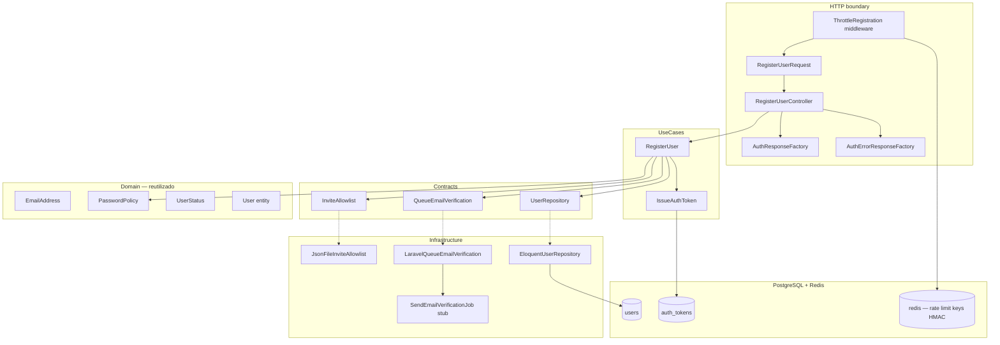
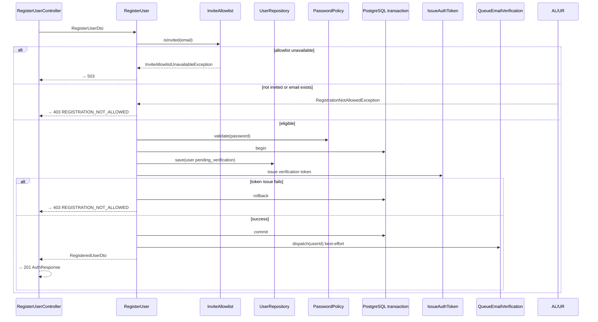

# Auth — Registro por convite — Design

**Spec:** `.specs/features/auth/registration/spec.md`  
**Status:** Approved — 2026-07-26

---

## Abordagens consideradas

### 1. Fonte da allowlist de convite

| Abordagem | Prós | Contras | Veredicto |
| --- | --- | --- | --- |
| **A — Port `InviteAllowlist` + adapter JSON (dev/test) / SOPS mount (prod)** | Hexagonal; testes determinísticos; alinha spec e `docs/security.md` | Dois adapters | **Recomendada** |
| B — Tabela `invite_emails` no PostgreSQL | CRUD operacional | Fora do escopo MVP; diverge de SOPS em prod | Rejeitada |
| C — Allowlist hardcoded em `.env` CSV | Simples | Não escala; mistura segredo com env plano | Rejeitada |

### 2. Rate limiting (5/h por IP)

| Abordagem | Prós | Contras | Veredicto |
| --- | --- | --- | --- |
| **A — Middleware dedicado + Laravel `RateLimiter` + chave HMAC Redis** | Conta toda tentativa POST; reutilizável por login/password; alinha `docs/security.md` §11 | Implementação inicial nesta fatia | **Recomendada** |
| B — `ThrottleRequests` nativo Laravel | Menos código | Chave sem HMAC; sem separação de finalidade | Rejeitada |
| C — Somente Nginx | Zero código app | Viola spec e `docs/api.md` §8 | Rejeitada |

### 3. Orquestração do registro

| Abordagem | Prós | Contras | Veredicto |
| --- | --- | --- | --- |
| **A — Use case `RegisterUser` com `DB::transaction` (user + token) + enqueue pós-commit** | Controller fino; rollback em falha de token; e-mail best-effort | Uma classe central | **Recomendada** |
| B — Controller orquestra `save` + `IssueAuthToken` | Menos UseCase | Viola hexagonal; difícil testar domínio | Rejeitada |
| C — Evento de domínio `UserRegistered` síncrono | Desacoplamento | Overhead; fila já coberta por port | Adiado |

### 4. Validação de senha e duplicidade

| Abordagem | Prós | Contras | Veredicto |
| --- | --- | --- | --- |
| **A — FormRequest (shape/bounds) + `PasswordPolicy` via rule customizada; duplicidade só no UseCase → `403` uniforme** | Sem `Rule::unique` (anti-enum); política única | Rule customizada extra | **Recomendada** |
| B — `Rule::unique('users','email')` no FormRequest | Idiomático Laravel | Vaza existência via `422` | Rejeitada |
| C — Duplicidade só por constraint SQL sem catch | Simples | Exceção interna pode virar `500` | Rejeitada |

**Decisão:** Abordagem A nos quatro eixos.

---

## Architecture Overview

Terceira fatia do módulo **Auth**: primeiro endpoint de negócio público (`POST /api/v1/auth/register`), ports de convite e fila de verificação, rate limit HMAC, bootstrap mínimo de HTTP global (`ApiFormRequest` / resposta de validação OpenAPI) e use case transacional de registro.



### Fluxo `RegisterUser` (sequência)



### Ordem de entrega sugerida (Execute)

1. **Bootstrap HTTP global** — `ApiFormRequest`, `ApiResponse` (formato OpenAPI), `PasswordPolicyRule` (REG-07, REG-09)
2. **Config** — `auth.php` (`terms`, `invite_allowlist`, `rate_limits`, `rate_limit_hmac_key`); JSON de teste (REG-01, REG-05)
3. **Ports + exceções de domínio** — `InviteAllowlist`, `QueueEmailVerification`, `RegistrationNotAllowedException` (REG-05, REG-06)
4. **Infra adapters** — JSON allowlist, job stub, rate limit hasher + middleware (REG-05, REG-08)
5. **Use case** — `RegisterUser` transacional + DTOs (REG-01…REG-04, REG-06)
6. **HTTP** — FormRequest, Resource/Factory, Controller, rotas, provider (REG-09, REG-10)
7. **Testes Feature E2E** — `RegistrationTest.php` (todos REG-*)
8. **Gates** — `make lint`, `make test-backend`

---

## Layout de artefatos

```txt
backend/
├── app/
│   └── Http/
│       ├── Requests/
│       │   └── ApiFormRequest.php              # novo — bootstrap global
│       └── Responses/
│           └── ApiResponse.php                 # novo — VALIDATION_FAILED OpenAPI
├── config/
│   ├── auth.php                                # + terms, invite_allowlist, rate_limits
│   └── invite-allowlist.testing.json           # novo — e-mails normalizados lowercase
├── modules/Auth/
│   ├── Contracts/
│   │   └── Services/
│   │       ├── InviteAllowlist.php
│   │       └── QueueEmailVerification.php
│   ├── DTOs/
│   │   ├── Input/
│   │   │   └── RegisterUserDto.php
│   │   └── Output/
│   │       └── RegisteredUserDto.php           # user + IssuedAuthTokenDto
│   ├── Exceptions/
│   │   ├── RegistrationNotAllowedException.php
│   │   └── InviteAllowlistUnavailableException.php
│   ├── UseCases/
│   │   └── RegisterUser.php
│   ├── Infrastructure/
│   │   ├── Allowlist/
│   │   │   └── JsonFileInviteAllowlist.php
│   │   ├── Jobs/
│   │   │   └── SendEmailVerificationJob.php    # stub — handler no-op nesta fatia
│   │   ├── Notifications/
│   │   │   └── LaravelQueueEmailVerification.php
│   │   ├── Http/
│   │   │   ├── Controllers/
│   │   │   │   └── RegisterUserController.php
│   │   │   ├── Middleware/
│   │   │   │   └── ThrottleRegistration.php
│   │   │   ├── Requests/
│   │   │   │   └── RegisterUserRequest.php
│   │   │   ├── Resources/
│   │   │   │   └── AuthUserResource.php
│   │   │   ├── Responses/
│   │   │   │   ├── AuthResponseFactory.php     # 201 AuthIssued
│   │   │   │   └── AuthErrorResponseFactory.php # + registrationNotAllowed, rateLimit, serviceUnavailable
│   │   │   └── Rules/
│   │   │       └── PasswordPolicyRule.php
│   │   └── RateLimit/
│   │       └── HmacRateLimitKeyFactory.php
│   ├── ServiceProviders/
│   │   └── AuthServiceProvider.php             # + bindings, routes, middleware alias
│   └── Tests/
│       ├── Unit/
│       │   ├── JsonFileInviteAllowlistTest.php
│       │   ├── RegisterUserTest.php
│       │   └── HmacRateLimitKeyFactoryTest.php
│       ├── Integration/
│       │   └── RegisterUserIntegrationTest.php
│       └── Feature/
│           └── RegistrationTest.php
└── routes/
    └── api.php                                 # ou loadRoutesFrom no provider — ver abaixo
```

Rotas de produto Auth DEVEM ser carregadas via `AuthServiceProvider::boot()` → `loadRoutesFrom(modules/Auth/Infrastructure/Http/routes/auth.php)` com prefixo `v1/auth` (Laravel já aplica prefixo `/api`).

---

## Code Reuse Analysis

### Componentes existentes a reutilizar

| Componente | Local | Uso |
| --- | --- | --- |
| `User` entity + `User::create()` | `Domain/Entities/User.php` | Persistência de conta `pending_verification` |
| `EmailAddress` | `Domain/ValueObjects/EmailAddress.php` | Normalização e validação sintática |
| `UserStatus::PendingVerification` | `Domain/Enums/UserStatus.php` | Status inicial |
| `PasswordPolicy` | `Domain/Services/PasswordPolicy.php` | Composição 12–128 + 4 categorias ASCII |
| `PasswordHasher` | `Contracts/Services/PasswordHasher.php` | Argon2id antes de `save` |
| `UserRepository` | `Contracts/Repositories/UserRepository.php` | `nextIdentity`, `existsByEmail`, `save` |
| `IssueAuthToken` | `UseCases/IssueAuthToken.php` | Emissão `verification` pós-save |
| `IssuedAuthTokenDto` | `DTOs/Output/IssuedAuthTokenDto.php` | Montagem de `AuthResponse` |
| `AuthErrorResponseFactory` | `Infrastructure/Http/Responses/` | Estender com novos mapeamentos |
| `AuthDomainException::emailAlreadyInUse()` | `Exceptions/AuthDomainException.php` | Capturado em `RegisterUser` → `403` uniforme |
| `DatabaseSafetyGuard` | `Tests/Support/` | Feature tests em `fake_link_testing` |
| `UserModelFactory` | `Infrastructure/Persistence/Eloquent/Factories/` | Cenários de duplicidade |

### Pontos de integração

| Sistema | Método |
| --- | --- |
| PostgreSQL | `users` + `auth_tokens` (sem migration nova nesta fatia) |
| Redis | Chaves HMAC para rate limit (`config/cache.php` store `redis`) |
| Fila `notifications` | Job stub `SendEmailVerificationJob` — Resend na fatia `email-verification` |
| OpenAPI | `RegisterRequest`, `AuthIssued`, `RegistrationNotAllowed`, `ValidationError`, `TooManyRequests` |
| Config SOPS (prod) | Path montado em runtime para JSON descriptografado; adapter lê mesmo contrato JSON |

---

## Components

### Bootstrap — `ApiFormRequest` + `ApiResponse`

- **Purpose:** Base única de validação HTTP e envelope `422 VALIDATION_FAILED` alinhado a OpenAPI (não o exemplo legado de `LARAVEL_CODE_DESIGN.md` com `success: true`).
- **Location:** `backend/app/Http/Requests/ApiFormRequest.php`, `backend/app/Http/Responses/ApiResponse.php`
- **`ApiResponse::validationError()`** retorna:

```json
{
  "code": "VALIDATION_FAILED",
  "message": "The given data was invalid.",
  "request_id": "<id>",
  "errors": { "field": [{ "code": "...", "message": "..." }] }
}
```

- **Headers:** `Cache-Control: private, no-store`, `X-Request-ID` (stub aceitável até middleware global Fase 0).
- **Reuses:** Padrão descrito em `LARAVEL_CODE_DESIGN.md` §13, ajustado ao contrato real de `docs/openapi.yaml`.

### Config — `config/auth.php` + JSON de teste

```php
'terms' => [
    'current_version' => env('AUTH_TERMS_CURRENT_VERSION', '2026-01'),
],

'invite_allowlist' => [
    'path' => env('AUTH_INVITE_ALLOWLIST_PATH', base_path('config/invite-allowlist.testing.json')),
],

'rate_limits' => [
    'registration' => [
        'max_attempts' => 5,
        'decay_seconds' => 3600,
    ],
],

'rate_limit_hmac_key' => env('AUTH_RATE_LIMIT_HMAC_KEY'),
```

**JSON (`invite-allowlist.testing.json`):**

```json
{
  "emails": [
    "invited@example.com"
  ]
}
```

- Entradas MUST estar normalizadas (lowercase, sem espaços); adapter valida na carga e falha boot em dev se inválido.
- Produção: `AUTH_INVITE_ALLOWLIST_PATH` aponta para arquivo montado via SOPS (conteúdo idêntico ao schema JSON).

### Port `InviteAllowlist`

```php
interface InviteAllowlist
{
    public function isInvited(EmailAddress $email): bool;
}
```

- **Implementation (esta fatia):** `JsonFileInviteAllowlist`
  - Carrega JSON uma vez (singleton); `Set` em memória de strings normalizadas.
  - Arquivo ausente / JSON inválido / IO error → `InviteAllowlistUnavailableException`.
  - Consulta MUST NOT logar o e-mail.
- **Futuro prod:** mesmo adapter lendo path SOPS; sem alteração de contrato.

### Port `QueueEmailVerification`

```php
interface QueueEmailVerification
{
    public function dispatch(UserId $userId): void;
}
```

- **Implementation:** `LaravelQueueEmailVerification` → `SendEmailVerificationJob::dispatch($userId)->onQueue('notifications')`.
- **Job stub:** `handle()` no-op (ou log interno em `local`); **sem** Resend, **sem** `email_action_tokens` (AUTH-20).
- Falha de dispatch: capturada em `RegisterUser` pós-commit; log interno; HTTP `201` mantido.

### Use case `RegisterUser`

```php
final class RegisterUser
{
    public function execute(RegisterUserDto $input): RegisteredUserDto;
}
```

**Algoritmo (ordem fixa):**

1. `EmailAddress::fromString($input->email)` — inválido já filtrado pelo FormRequest; defesa em profundidade.
2. `InviteAllowlist::isInvited()` — false → `RegistrationNotAllowedException`.
3. `UserRepository::existsByEmail()` — true → `RegistrationNotAllowedException` (mesma exceção).
4. `PasswordPolicy::validate()` — violação → `PasswordPolicyException` (controller mapeia `422` se escapar; FormRequest deve prevenir).
5. `DB::transaction`:
   - `UserId` = `UserRepository::nextIdentity()`
   - `passwordHash` = `PasswordHasher::hash(plainText)`
   - `User::create(..., status: PendingVerification, termsVersion: config, termsAcceptedAt: now UTC)`
   - `UserRepository::save($user)` — catch `EMAIL_ALREADY_IN_USE` → `RegistrationNotAllowedException`
   - `IssueAuthToken::execute(IssueAuthTokenDto(userId, TokenKind::Verification))`
   - Qualquer falha → rollback + `RegistrationNotAllowedException`
6. Pós-commit: `QueueEmailVerification::dispatch($userId)` (try/catch, não falha HTTP).
7. Retorna `RegisteredUserDto(user, issuedToken)`.

### DTOs

| DTO | Campos |
| --- | --- |
| `RegisterUserDto` | `name`, `email` (string bruta já normalizada pelo FormRequest), `plainTextPassword` |
| `RegisteredUserDto` | `User $user`, `IssuedAuthTokenDto $token` |

### HTTP — `RegisterUserRequest`

- **Extends:** `ApiFormRequest`
- **Rules:** `name` required string max:120; `email` required email max:254 (**sem** `unique`); `password` required + `PasswordPolicyRule` + `confirmed`; `accept_terms` required boolean → `accepted` rule (must be true); proibir campos extras via validação estrita ou `prepareForValidation` strip (prefer `Validator` after hook — usar `$this->replace($this->only([...]))` em `prepareForValidation`).
- **`toDto()`:** `RegisterUserDto`
- **Não consultar** allowlist nem banco — evita side effects antes de validação completa.

### HTTP — `RegisterUserController`

```php
final readonly class RegisterUserController
{
    public function __invoke(RegisterUserRequest $request, RegisterUser $registerUser): JsonResponse;
}
```

- Mapeamento de exceções → `AuthErrorResponseFactory` / `ApiResponse`.
- Sucesso → `AuthResponseFactory::issued($registered)` → `201`.

### `AuthResponseFactory`

Monta envelope OpenAPI `AuthResponse`:

```json
{
  "data": {
    "token": "<plaintext once>",
    "token_type": "Bearer",
    "token_kind": "verification",
    "expires_at": "2026-07-27T14:30:00Z",
    "user": { "...User schema..." }
  }
}
```

- `AuthUserResource` transforma `User` domain → array OpenAPI (`id` UUID v7, timestamps UTC `Z`).
- **Sem** campo `message` no topo (diferente do exemplo genérico `ApiResponse::success`).

### Extensões — `AuthErrorResponseFactory`

| Método | HTTP | code | message (OpenAPI) |
| --- | --- | --- | --- |
| `registrationNotAllowed()` | 403 | `REGISTRATION_NOT_ALLOWED` | `Registration is not available for these details.` |
| `rateLimitExceeded(int $retryAfter)` | 429 | `RATE_LIMIT_EXCEEDED` | `Too many requests.` + header `Retry-After` |
| `serviceUnavailable()` | 503 | `SERVICE_UNAVAILABLE` | `The service is temporarily unavailable.` |

### Middleware `ThrottleRegistration`

- **Alias:** `throttle.registration`
- **Aplicado em:** `POST register` only.
- **Comportamento:**
  1. Canonicalizar IP (`$request->ip()` com trusted proxies já configurados).
  2. Chave = `HmacRateLimitKeyFactory::forRegistrationIp($ip)`.
  3. Se `RateLimiter::tooManyAttempts($key, 5)` → `429` + `Retry-After: RateLimiter::availableIn($key)`.
  4. Senão `RateLimiter::hit($key, 3600)` **antes** de delegar ao controller (conta 422/403/201).
- **Store:** Redis via `RateLimiter` + cache store `redis` em prod/test com Redis disponível; `array` aceitável em testes unitários isolados.

### `HmacRateLimitKeyFactory`

```php
final class HmacRateLimitKeyFactory
{
    public function forRegistrationIp(string $canonicalIp): string
    {
        return hash_hmac(
            'sha256',
            'registration:'.$canonicalIp,
            (string) config('auth.rate_limit_hmac_key'),
        );
    }
}
```

- IP bruto never aparece na chave Redis exposta (somente digest).
- Testes usam chave fixa em `.env.testing`.

---

## Data Models

Nenhuma migration nova. Reutiliza `users` e `auth_tokens` da foundation e bearer-tokens.

### Persistência no registro

| Campo | Valor na criação |
| --- | --- |
| `users.id` | UUID v7 via `UserRepository::nextIdentity()` |
| `users.email` | Normalizado lowercase |
| `users.password` | Argon2id hash |
| `users.status` | `pending_verification` |
| `users.email_verified_at` | `null` |
| `users.terms_version` | `2026-01` (config) |
| `users.terms_accepted_at` | `now()` UTC |
| `auth_tokens.*` | Via `IssueAuthToken` (`verification`, TTL 24h) |

---

## Error Handling Strategy

| Cenário | Camada | HTTP | Body |
| --- | --- | --- | --- |
| Payload inválido / extra fields | FormRequest | 422 | `VALIDATION_FAILED` + `errors` |
| JSON malformado | Laravel | 400 | `MALFORMED_REQUEST` (handler global ou default) |
| Rate limit | Middleware | 429 | `RATE_LIMIT_EXCEEDED` + `Retry-After` |
| Convite inválido | RegisterUser | 403 | `REGISTRATION_NOT_ALLOWED` |
| E-mail duplicado | RegisterUser | 403 | idêntico acima |
| Falha token pós-save (rollback) | RegisterUser | 403 | idêntico acima |
| Allowlist indisponível | InviteAllowlist | 503 | `SERVICE_UNAVAILABLE` |
| Falha enqueue e-mail pós-201 | RegisterUser | 201 | sucesso; log interno |
| Erro inesperado | Handler | 500 | `INTERNAL_ERROR` sem senha/token/e-mail |

**Regra anti-enumeração:** `RegistrationNotAllowedException` única para convite, duplicidade e falha transacional de token — mesma factory method.

---

## Risks & Concerns

| Concern | Location | Impact | Mitigation |
| --- | --- | --- | --- |
| `ApiFormRequest` / `ApiResponse` inexistentes | `backend/app/Http/` | Registro não compila | Task 1 desta fatia — bootstrap global mínimo |
| Exemplo `ApiResponse` desalinhado do OpenAPI | `LARAVEL_CODE_DESIGN.md` | Envelope errado | `AuthResponseFactory` segue OpenAPI; não usar `success: true` |
| `AuthDomainException::emailAlreadyInUse` message interna | `AuthDomainException.php` | Vazamento se não mapeada | Catch em `RegisterUser` → `RegistrationNotAllowedException` antes do HTTP |
| Rate limit sem Redis em CI | Docker compose | Flaky ou skip | Testes Feature sobem stack com Redis; unit testa factory isoladamente |
| `AUTH_RATE_LIMIT_HMAC_KEY` ausente | `.env.testing` | Runtime error | Default fixo em `.env.testing` / `phpunit.xml` |
| Job stub sem worker | fila `notifications` | Job acumula | Aceitável nesta fatia; testes usam `Queue::fake()` |
| Rotas Auth espalhadas | `routes/api.php` vs módulo | Acoplamento | `loadRoutesFrom` no `AuthServiceProvider` |
| Exception handler global incompleto | `bootstrap/app.php` | Mapeamento manual no controller | Controller fino com try/catch explícito nesta fatia; handler global Fase 0 |

---

## Tech Decisions

| Decision | Choice | Rationale |
| --- | --- | --- |
| Allowlist dev/test | JSON versionado + path config | Decisão spec 2026-07-26 |
| Allowlist lookup | Set in-memory pós-carga | O(1); lista pequena invite-only |
| Duplicidade | UseCase + UNIQUE catch → `403` | Anti-enumeração; sem `Rule::unique` |
| Transação | User save + IssueAuthToken | Rollback token failure → `403` |
| E-mail pós-commit | Best-effort dispatch | Spec assumption confirmada |
| Rate limit scope | Todas tentativas POST | Decisão spec 2026-07-26 |
| Rate limit key | HMAC-SHA256 purpose+IP | `docs/security.md` §11 |
| Terms version | Config `2026-01` | Alinhado factories existentes |
| Resposta 201 | `AuthResponseFactory` OpenAPI | Sem wrapper `success` |
| Rotas | `loadRoutesFrom` no Auth provider | Modular monolith |
| Testes allowlist | JSON dedicado + override path em teste | Determinismo |

Nenhuma nova entrada `AD-NNN` — decisões conformam AD-010…AD-012 existentes.

---

## Requirement → Design Mapping

| ID | Componente(s) principal(is) |
| --- | --- |
| AUTH-01 | `InviteAllowlist`, `JsonFileInviteAllowlist` |
| AUTH-02 | `RegistrationNotAllowedException`, mapeamento uniforme |
| AUTH-03 | `RegisterUser`, `RegisterUserRequest` (`accept_terms`) |
| AUTH-04 | `RegisterUser` (`UserStatus::PendingVerification`) |
| AUTH-05 | `IssueAuthToken` via `RegisterUser` |
| REG-01 | `RegisterUserController`, `AuthResponseFactory` |
| REG-02 | `RegisterUser` persistência + terms |
| REG-03 | `PasswordHasher` em `RegisterUser` |
| REG-04 | `IssueAuthToken` + resposta `AuthResponse` |
| REG-05 | `JsonFileInviteAllowlist`, config JSON |
| REG-06 | Exceção única + `registrationNotAllowed()` |
| REG-07 | `RegisterUserRequest`, `PasswordPolicyRule`, `ApiFormRequest` |
| REG-08 | `ThrottleRegistration`, `HmacRateLimitKeyFactory` |
| REG-09 | Controller, Request, Resource, rotas, factory |
| REG-10 | `Tests/Feature/RegistrationTest.php` |

---

## Referências

- `.specs/features/auth/registration/spec.md`
- `.specs/features/auth/bearer-tokens/design.md`
- `.specs/features/auth/foundation/design.md`
- `.specs/STATE.md` — AD-010, AD-011, AD-012
- `docs/openapi.yaml` — `register`, schemas Auth/User/Validation
- `docs/security.md` §4.1, §11, §13
- `docs/api.md` §3.2, §8
- `LARAVEL_CODE_DESIGN.md` §13, §17, §25
