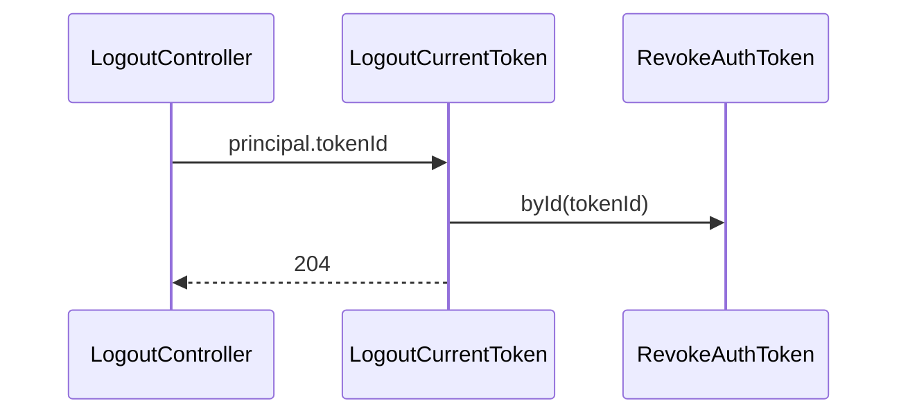
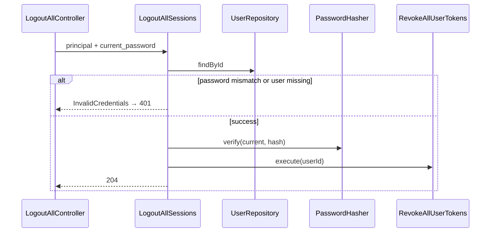
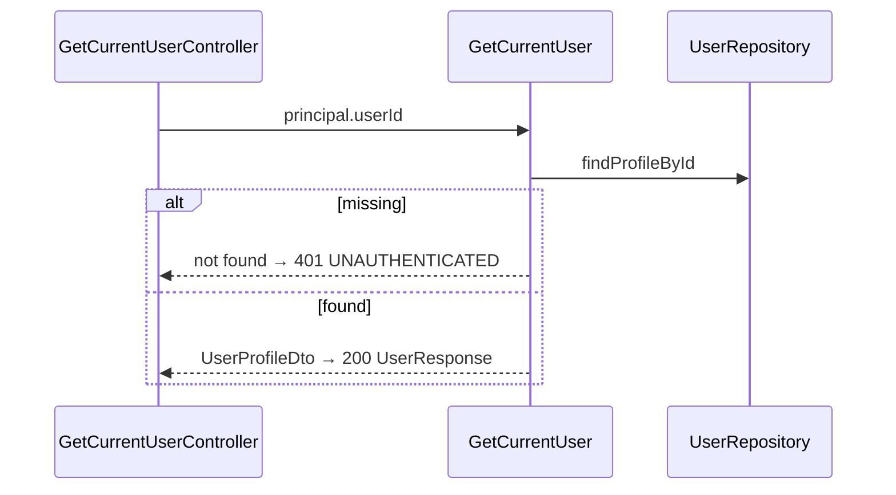
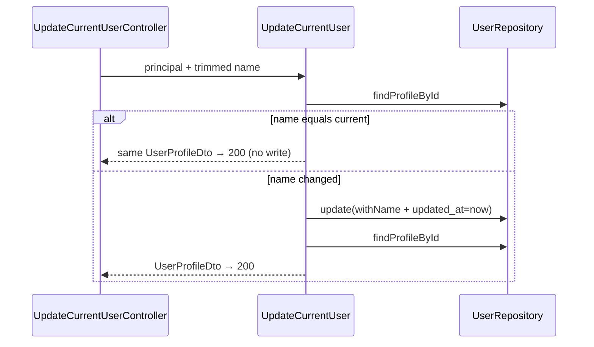

# Auth — Sessão e perfil — Design

**Spec:** `.specs/features/auth/session-and-profile/spec.md`  
**Context:** `.specs/features/auth/session-and-profile/context.md`  
**Status:** Approved — 2026-07-30 (Design)  
**Date:** 2026-07-29  
**Approved:** 2026-07-30

---

## Abordagens consideradas

### 1. Organização dos use cases

| Abordagem | Prós | Contras | Veredicto |
| --- | --- | --- | --- |
| **A — Use cases finos: `LogoutCurrentToken`, `LogoutAllSessions`, `GetCurrentUser`, `UpdateCurrentUser` + reuso de `Revoke*`** | Controllers finos; paridade password/login; testável | Quatro classes | **Recomendada** |
| B — Controllers chamam repositórios/`Revoke*` direto | Menos arquivos | Viola hexagonal / Controllers finos (AD-009 gates) | Rejeitada |
| C — Um `SessionProfileFacade` monolítico | Uma entrada | Baixa coesão; difíceis testes unitários | Rejeitada |

### 2. Timestamps `created_at` / `updated_at` no `/me`

| Abordagem | Prós | Contras | Veredicto |
| --- | --- | --- | --- |
| **A — DTO de leitura `UserProfileDto` (User + createdAt + updatedAt) via `UserRepository::findProfileById`** | Spec exige timestamps reais; domínio `User` permanece sem timestamps de persistência | Método novo no port | **Recomendada** |
| B — Embutir timestamps na entidade `User` | Um tipo só | Contamina domínio com concern de ORM; regressão ampla | Rejeitada nesta fatia |
| C — Manter fallback `terms_accepted_at` do `AuthUserResource` | Zero mudança | Viola SP-07 / AUTH-36 | Rejeitada |

### 3. Persistência de `name` + no-op

| Abordagem | Prós | Contras | Veredicto |
| --- | --- | --- | --- |
| **A — `User::withName` + `UserMapper::toPersistenceUpdate` inclui `name` e `updated_at`; use case só chama `update` se nome mudou** | No-op sem write (Q3); change/verify passam a reescrever `name` igual (inofensivo) se `update` for usado | Mapper muda | **Recomendada** |
| B — `UserRepository::updateName` dedicado | Isola PATCH | Dois caminhos de update | Aceitável; preferir A por paridade `withPasswordHash` |
| C — Sempre `touch` `updated_at` | Simples | Viola Q3 | Rejeitada |

### 4. Rate limit de leituras (`GET /me`)

| Abordagem | Prós | Contras | Veredicto |
| --- | --- | --- | --- |
| **A — `ThrottlePrivateAuthRead` + `HmacRateLimitKeyFactory::forPrivateAuthRead(AuthTokenId)` (HMAC de `private-auth:read:{tokenId}`)** | 300/min por token; principal já expõe `tokenId`; sem plaintext | Spec citou “hash do token”; usamos id da row (equivalente, sem estender principal) | **Recomendada** |
| B — Estender `AuthenticatedPrincipal` com `tokenHash` | Literal à frase da spec | Superfície maior; hash já é segredo de lookup | Rejeitada (desnecessário) |
| C — Reusar write throttle por conta | Zero middleware | Viola Q4 / `docs/api.md` §8 | Rejeitada |

### 5. Rotas `/me`

| Abordagem | Prós | Contras | Veredicto |
| --- | --- | --- | --- |
| **A — Segundo grupo no `AuthServiceProvider`: `api/v1` → `routes/me.php`; auth continua em `routes/auth.php`** | Paths OpenAPI corretos; módulos separados por arquivo | Dois `loadRoutesFrom` | **Recomendada** |
| B — Registrar `/me` dentro de `auth.php` com path absoluto | Um arquivo | Confuso sob prefixo `auth` | Rejeitada |
| C — Rotas globais em `bootstrap`/`routes/api.php` | — | Foge do módulo Auth | Rejeitada |

**Decisão:** Abordagem A em todos os eixos. Conformidade com AD-009…012 (Docker gates, PG testing, UUID v7). Sem novo AD — decisões são locais à fatia.

---

## Architecture Overview

Sétima (última) fatia da API Auth: logout do Bearer atual, logout global com senha, consulta e atualização mínima de perfil. Sem Resend, sem migration de schema nova. Reusa middlewares bearer/kind, write throttle, `RevokeAuthToken` / `RevokeAllUserTokens` e `AuthUserResource`.

```mermaid
flowchart TB
    subgraph http["HTTP boundary"]
        TPW[ThrottlePrivateAuthWrite]
        TPR[ThrottlePrivateAuthRead]
        AB[AuthenticateBearer]
        TK_S[RequireTokenKind session]
        TK_SV[RequireTokenKind session\|verification]
        LC[LogoutController]
        LAC[LogoutAllController]
        GMC[GetCurrentUserController]
        UMC[UpdateCurrentUserController]
        ARF[AuthResponseFactory]
        AEF[AuthErrorResponseFactory]
    end

    subgraph usecases["UseCases"]
        LCT[LogoutCurrentToken]
        LAS[LogoutAllSessions]
        GCU[GetCurrentUser]
        UCU[UpdateCurrentUser]
        RAT[RevokeAuthToken]
        RALL[RevokeAllUserTokens]
    end

    subgraph ports["Contracts"]
        UR[UserRepository]
        PH[PasswordHasher]
        ATR[AuthTokenRepository]
    end

    subgraph data["PostgreSQL + Redis"]
        USERS[(users)]
        AUTH_T[(auth_tokens)]
        REDIS[(redis)]
    end

    TPW --> AB
    AB --> TK_SV --> LC --> LCT --> RAT
    AB --> TK_S --> LAC --> LAS
    LAS --> PH
    LAS --> UR
    LAS --> RALL
    TPR --> AB --> TK_SV --> GMC --> GCU --> UR
    TPW --> AB --> TK_S --> UMC --> UCU --> UR
    RAT --> ATR
    RALL --> ATR
    UR --> USERS
    ATR --> AUTH_T
    TPW & TPR --> REDIS
    LC & LAC & GMC & UMC --> ARF & AEF
```

### Fluxo logout (sequência)



### Fluxo logout-all (sequência)



### Fluxo GET /me (sequência)



### Fluxo PATCH /me (sequência)



### Ordem de entrega sugerida (Execute)

1. **Domínio + persistência de perfil** — `User::withName`, `UserProfileDto`, `findProfileById`, mapper `name`/`updated_at`
2. **Use cases** — LogoutCurrentToken, LogoutAllSessions, GetCurrentUser, UpdateCurrentUser
3. **Throttle read + HTTP** — middleware, Form Requests, controllers, `AuthResponseFactory::user`, rotas auth + me
4. **Feature E2E + gates** — logout, logout-all, me, coverage Auth ≥ 80%

---

## Layout de artefatos

```txt
backend/
├── config/auth.php                         # + rate_limits.private_auth_read
├── bootstrap/app.php                       # alias throttle.private_auth.read
├── modules/Auth/
│   ├── Domain/Entities/User.php            # + withName(string): self
│   ├── DTOs/
│   │   ├── Input/
│   │   │   ├── LogoutAllSessionsDto.php    # currentPassword
│   │   │   └── UpdateCurrentUserDto.php    # name (já trimado)
│   │   └── Output/
│   │       └── UserProfileDto.php          # user + createdAt + updatedAt
│   ├── Contracts/Repositories/
│   │   └── UserRepository.php              # + findProfileById
│   ├── UseCases/
│   │   ├── LogoutCurrentToken.php
│   │   ├── LogoutAllSessions.php
│   │   ├── GetCurrentUser.php
│   │   └── UpdateCurrentUser.php
│   ├── Infrastructure/
│   │   ├── Http/
│   │   │   ├── Controllers/
│   │   │   │   ├── LogoutController.php
│   │   │   │   ├── LogoutAllController.php
│   │   │   │   ├── GetCurrentUserController.php
│   │   │   │   └── UpdateCurrentUserController.php
│   │   │   ├── Middleware/
│   │   │   │   └── ThrottlePrivateAuthRead.php
│   │   │   ├── Requests/
│   │   │   │   ├── LogoutRequest.php
│   │   │   │   ├── LogoutAllRequest.php
│   │   │   │   └── UpdateCurrentUserRequest.php
│   │   │   ├── Responses/
│   │   │   │   └── AuthResponseFactory.php  # + user(UserProfileDto)
│   │   │   └── routes/
│   │   │       ├── auth.php                 # + logout, logout-all
│   │   │       └── me.php                   # GET/PATCH /me
│   │   ├── Persistence/Eloquent/
│   │   │   ├── Mappers/UserMapper.php       # toPersistenceUpdate + name/updated_at
│   │   │   └── Repositories/EloquentUserRepository.php
│   │   └── RateLimit/HmacRateLimitKeyFactory.php  # + forPrivateAuthRead
│   ├── ServiceProviders/AuthServiceProvider.php   # rotas me + singletons
│   └── Tests/
│       ├── Unit/ …
│       ├── Integration/ …
│       └── Feature/
│           ├── LogoutTest.php
│           ├── LogoutAllTest.php
│           └── CurrentUserTest.php
```

### Rotas

| Rota | Middleware (ordem) |
| --- | --- |
| `POST /api/v1/auth/logout` | `auth.bearer`, `throttle.private_auth.write`, `LogoutRequest` |
| `POST /api/v1/auth/logout-all` | `auth.bearer`, `token.kind:session`, `throttle.private_auth.write` |
| `GET /api/v1/me` | `auth.bearer`, `throttle.private_auth.read` |
| `PATCH /api/v1/me` | `auth.bearer`, `token.kind:session`, `throttle.private_auth.write` |

Notas:

- Logout **não** restringe `token.kind` (aceita `session` e `verification`).
- GET `/me` idem — ambos kinds.
- Prefixo `api/v1/auth` existente; `/me` em grupo `api/v1` separado no mesmo provider.
- Ordem sugerida: `auth.bearer` antes do throttle de write/read (principal necessário para chave HMAC).

---

## Code Reuse Analysis

### Componentes existentes a reutilizar

| Componente | Local | Uso |
| --- | --- | --- |
| `RevokeAuthToken::byId` | `UseCases/` | LogoutCurrentToken |
| `RevokeAllUserTokens` | `UseCases/` | LogoutAllSessions |
| `ChangePassword` | `UseCases/` | Template verify + InvalidCredentials para logout-all |
| `AuthenticateBearer` / `RequireTokenKind` | Middleware | Todos os endpoints autenticados |
| `ThrottlePrivateAuthWrite` | Middleware | logout, logout-all, PATCH |
| `HmacRateLimitKeyFactory::forPrivateAuthWrite` | RateLimit | Template do read |
| `AuthErrorResponseFactory::invalidCredentials` | Responses | Senha errada no logout-all |
| `AuthResponseFactory::noContent` | Responses | logout / logout-all `204` |
| `AuthUserResource::toArray` / `formatUtc` | Resources | Envelope User com timestamps explícitos |
| `ChangePasswordRequest` pattern | Requests | LogoutAllRequest / UpdateCurrentUserRequest / LogoutRequest (extras) |
| `UserRepository::findById` / `update` | Contracts + Eloquent | Base; estender com profile |
| `DatabaseSafetyGuard` | Tests/Support | Integration PG only |
| Probe routes `_test/auth/*` | Testing | Assert pós-revogação sem acoplar a Links |

### Integration Points

| Sistema | Método |
| --- | --- |
| PostgreSQL `users` / `auth_tokens` | Sem migration; update name + delete tokens |
| Redis rate limit | Laravel RateLimiter + HMAC keys |
| OpenAPI | Já documenta endpoints; sem mudança obrigatória de schema |
| `bootstrap/app.php` | Alias `throttle.private_auth.read` |

---

## Components

### `LogoutCurrentToken`

- **Purpose:** Revogar somente o Bearer apresentado.
- **Location:** `UseCases/LogoutCurrentToken.php`
- **Interfaces:**
  - `execute(AuthenticatedPrincipal $principal): void`
- **Dependencies:** `RevokeAuthToken`
- **Reuses:** `RevokeAuthToken::byId($principal->tokenId())`

### `LogoutAllSessions`

- **Purpose:** Confirmar senha atual e revogar todos os Bearers.
- **Location:** `UseCases/LogoutAllSessions.php`
- **Interfaces:**
  - `execute(AuthenticatedPrincipal $principal, LogoutAllSessionsDto $input): void`
- **Dependencies:** `UserRepository`, `PasswordHasher`, `RevokeAllUserTokens`
- **Reuses:** Padrão `ChangePassword` (verify → exception; revoke all). **Não** altera hash/status.

### `GetCurrentUser`

- **Purpose:** Carregar perfil autenticado com timestamps reais.
- **Location:** `UseCases/GetCurrentUser.php`
- **Interfaces:**
  - `execute(AuthenticatedPrincipal $principal): UserProfileDto`
- **Dependencies:** `UserRepository::findProfileById`
- **Reuses:** — (novo). User ausente → lançar `AuthTokenException` / exceção mapeada para `401 UNAUTHENTICATED` (conta sumiu após bearer válido — edge raro).

### `UpdateCurrentUser`

- **Purpose:** Atualizar só `name` com trim já aplicado; no-op sem write.
- **Location:** `UseCases/UpdateCurrentUser.php`
- **Interfaces:**
  - `execute(AuthenticatedPrincipal $principal, UpdateCurrentUserDto $input): UserProfileDto`
- **Dependencies:** `UserRepository`, `User::withName`
- **Reuses:** `findProfileById`; se `$input->name === $profile->user->name()` retorna profile atual; senão `update(withName)` com `updated_at = now(UTC)` no mapper e reload.

### `UserProfileDto`

- **Purpose:** Transporte User + timestamps de persistência.
- **Location:** `DTOs/Output/UserProfileDto.php`
- **Interfaces:** readonly props `user`, `createdAt`, `updatedAt`
- **Dependencies:** `User`, `DateTimeImmutable`

### `User::withName`

- **Purpose:** Cópia imutável com novo nome.
- **Location:** `Domain/Entities/User.php`
- **Interfaces:** `withName(string $name): self`
- **Reuses:** Padrão `withPasswordHash` / `markEmailVerified`

### `UserRepository::findProfileById`

- **Purpose:** Uma query → domínio + `created_at`/`updated_at` do model.
- **Location:** Contract + `EloquentUserRepository`
- **Interfaces:** `findProfileById(UserId $id): ?UserProfileDto`
- **Reuses:** `UserMapper::toDomain` + Carbon → `DateTimeImmutable`

### `UserMapper::toPersistenceUpdate` (extensão)

- **Purpose:** Persistir `name` e `updated_at` além de password/status/email_verified_at.
- **Location:** `Mappers/UserMapper.php`
- **Interfaces:** inclui `'name' => $user->name()` e `'updated_at' => Carbon::instance($updatedAt)` **ou** o repositório passa array merge — preferência: método `toPersistenceUpdate(User $user, ?DateTimeImmutable $updatedAt = null)` onde `null` omite bump (para change/verify existentes) e PATCH passa `$now`.
- **Reuses:** update path atual de change/verify permanece sem bump obrigatório de `updated_at` se `$updatedAt === null`.

### `ThrottlePrivateAuthRead`

- **Purpose:** 300 req/min por token (HMAC do `AuthTokenId`).
- **Location:** `Middleware/ThrottlePrivateAuthRead.php`
- **Interfaces:** `handle(Request, Closure): Response`
- **Dependencies:** `AuthenticatedPrincipal`, `HmacRateLimitKeyFactory::forPrivateAuthRead`, `AuthErrorResponseFactory::rateLimitExceeded`
- **Reuses:** Clone estrutural de `ThrottlePrivateAuthWrite` com chave por token e config `private_auth_read` (300 / 60s)

### Controllers

| Controller | HTTP | Use case | Resposta sucesso |
| --- | --- | --- | --- |
| `LogoutController` | POST logout | `LogoutCurrentToken` | `noContent()` |
| `LogoutAllController` | POST logout-all | `LogoutAllSessions` | `noContent()`; catch `InvalidCredentialsException` → `invalidCredentials()` |
| `GetCurrentUserController` | GET me | `GetCurrentUser` | `user(UserProfileDto)` → 200 |
| `UpdateCurrentUserController` | PATCH me | `UpdateCurrentUser` | `user(UserProfileDto)` → 200 |

Todos: try/catch genérico → `INTERNAL_ERROR` (paridade ChangePasswordController); sem logar senha.

### Form Requests

| Request | ALLOWED_FIELDS | Normalização |
| --- | --- | --- |
| `LogoutRequest` | `[]` | Extras → `422`; body ausente/`{}` ok |
| `LogoutAllRequest` | `[current_password]` | max 128; → `LogoutAllSessionsDto` |
| `UpdateCurrentUserRequest` | `[name]` | `trim` em `prepareForValidation`; rules `required\|string\|min:1\|max:120` **após** trim; → `UpdateCurrentUserDto` |

### `AuthResponseFactory::user`

- **Purpose:** Envelope OpenAPI `UserResponse`.
- **Interfaces:** `user(UserProfileDto $profile, ?string $requestId = null): JsonResponse` status 200
- **Body:** `{ "data": AuthUserResource::toArray($user, $createdAt, $updatedAt) }`
- **Headers:** `Cache-Control: private, no-store`, `X-Request-ID`

---

## Data Models

Sem tabelas novas. Campos tocados:

| Tabela | Operação |
| --- | --- |
| `auth_tokens` | DELETE by id (logout); DELETE all for user_id (logout-all) |
| `users` | SELECT profile; UPDATE `name`, `updated_at` (PATCH quando mudou) |

```php
// UserProfileDto (conceitual)
final readonly class UserProfileDto
{
    public function __construct(
        public User $user,
        public DateTimeImmutable $createdAt,
        public DateTimeImmutable $updatedAt,
    ) {}
}
```

**Relationships:** 1 User → N AuthToken (já existente). Logout não cria rows.

---

## Error Handling Strategy

| Error Scenario | Handling | User Impact |
| --- | --- | --- |
| Bearer ausente/inválido/expirado/revogado | `AuthenticateBearer` → `401 UNAUTHENTICATED` | Refazer login |
| Kind `verification` em logout-all / PATCH | `RequireTokenKind` → `403 TOKEN_RESTRICTED` | Usar session |
| `suspended` / `deletion_pending` | Bearer guard → `403 ACCOUNT_*` | Conta bloqueada |
| `current_password` incorreta (logout-all) | `InvalidCredentialsException` → `401 INVALID_CREDENTIALS` | Mensagem genérica; tokens intactos |
| Campos extras / validação | FormRequest → `422 VALIDATION_FAILED` | Corrigir body |
| Rate limit | Middleware → `429 RATE_LIMIT_EXCEEDED` + `Retry-After` | Esperar |
| User sumiu após bearer válido (GET/PATCH) | Use case → `401 UNAUTHENTICATED` | Edge raro |
| Falha DB inesperada | Controller catch → `500 INTERNAL_ERROR` | Genérico; sem senha em log |

---

## Risks & Concerns

| Concern | Location | Impact | Mitigation |
| --- | --- | --- | --- |
| `AuthUserResource` fallback para `terms_accepted_at` quando timestamps omitidos | `AuthUserResource.php:31-32` | Register/login continuam com timestamps aproximados | `/me` **sempre** passa timestamps reais via `UserProfileDto`; fora de escopo corrigir register/login nesta fatia |
| `toPersistenceUpdate` hoje **não** inclui `name` | `UserMapper.php:55-64` | PATCH quebraria se esquecer extensão | Design A + teste integration de update name |
| Query builder `update()` não auto-touch `updated_at` | `EloquentUserRepository.php:72-76` | PATCH precisa setar `updated_at` explicitamente | Passar `$updatedAt` no mapper quando nome muda |
| Throttle write **depois** de bearer: principal ok; se write antes de bearer, chave falha | Rotas password usam write antes? Change: write + bearer + kind | Ordem documentada: bearer → kind → throttle **ou** bearer → throttle (write precisa principal) | `ThrottlePrivateAuthWrite` já resolve principal via container — **exige** `auth.bearer` antes. Confirmar ordem nas rotas novas = bearer primeiro |
| Spec Q4 disse “hash do token”; design usa `tokenId` | context.md | Divergência literal | Tech decision abaixo; mesma cardinalidade “por token”; sem plaintext |
| Controllers com `INTERNAL_ERROR` stub `request_id` | ChangePasswordController pattern | IDs stub em erro | Paridade existente; não expandir escopo |

---

## Tech Decisions (não óbvios)

| Decision | Choice | Rationale |
| --- | --- | --- |
| Chave rate-limit read | HMAC(`private-auth:read:{AuthTokenId}`) | Por token sem expor hash/plaintext; principal já tem `tokenId` |
| Alias middleware | `throttle.private_auth.read` | Simetria com `.write` |
| Arquivo de rotas `/me` | `routes/me.php` + grupo `api/v1` | Paths OpenAPI; Agent's Discretion |
| User ausente em GET/PATCH | `401 UNAUTHENTICATED` | Não vazar; bearer órfão |
| `updated_at` em change/verify | Sem bump obrigatório (`$updatedAt = null`) | Evitar mudança de comportamento colateral |
| Logout FormRequest | `LogoutRequest` mesmo sem campos | Enforce Q1 extras → 422 |

> **Project-level decisions:** nenhum AD novo. Decisões acima são feature-local.

---

## Test plan (ancoragem para Tasks)

| Camada | Cobertura mínima |
| --- | --- |
| Unit | `User::withName`; `ThrottlePrivateAuthRead` hit/limit; `HmacRateLimitKeyFactory::forPrivateAuthRead`; sentinel senha em logout-all errors |
| Integration | `findProfileById` timestamps; `update` name + `updated_at`; no-op sem mudança de `updated_at`; revoke by id vs all |
| Feature | `LogoutTest`, `LogoutAllTest`, `CurrentUserTest` — ACs SP/AUTH; headers Cache-Control; dual token isolation; verification boundaries; 429 |

Gates: `make lint`, `make test-backend`, coverage Auth ≥ 80% (`make test-backend-coverage` + script Auth).

---

## Referências

| Documento | Uso |
| --- | --- |
| `.specs/features/auth/session-and-profile/spec.md` | WHAT / ACs |
| `.specs/features/auth/session-and-profile/context.md` | Q1–Q4 locked |
| `.specs/features/auth/password/design.md` | Template estrutural |
| `LARAVEL_CODE_DESIGN.md` | Controllers finos, UseCases, Form Requests |
| `docs/api.md` §3, §8 | Contracts + rate limits |
| `docs/openapi.yaml` | Paths já publicados |
