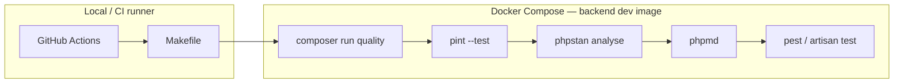

# Backend Quality Tooling Design

**Spec:** `.specs/features/backend-quality-tooling/spec.md`  
**Status:** Approved — pronto para Execute (2026-07-22)

---

## Abordagens consideradas

### Orquestração local e CI

| Abordagem | Prós | Contras | Veredicto |
| --- | --- | --- | --- |
| **A — Makefile → `composer run` → binários no container** | AD-003; paridade local/CI; um contrato (`make lint`) | Makefile cresce levemente | **Recomendada** |
| B — Script shell único `docker/scripts/quality-backend.sh` | Centraliza ordem dos gates | Terceira camada além de Makefile/composer; duplica AD-003 | Rejeitada |
| C — CI com comandos Docker inline, Makefile separado | Flexível no CI | Drift local vs CI (viola QTOOL-33) | Rejeitada |

### CI GitHub Actions

| Abordagem | Prós | Contras | Veredicto |
| --- | --- | --- | --- |
| **A — `make lint` + `make test-backend-coverage` via Docker Compose no runner** | Paridade total; zero PHP no host | Build de imagem no job (~1–2 min) | **Recomendada** |
| B — Setup PHP nativo no `ubuntu-latest` | Mais rápido | Viola política container-only de `docs/testing.md` §2 | Rejeitada |
| C — Reutilizar imagem publicada GHCR | CI mais rápido após warm | Imagem ainda não publicada na Fase 0; coupling prematuro | Adiada |

**Decisão:** Abordagem A em ambos os eixos.

---

## Architecture Overview

Camada fina de **orquestração** (Makefile + CI) invoca **scripts Composer** que executam ferramentas já instaladas em `vendor/`. Tudo roda dentro da imagem `docker/php` target `dev` (com PCOV). Prod/runtime permanece sem PCOV.



### Ordem dos gates (fail-fast)

1. **Pint** — estilo/formato (mais barato)
2. **PHPStan/Larastan** — tipos e regras Laravel (nível 6 + strict rules)
3. **PHPMD** — complexidade e acoplamento
4. **Pest** — unit + feature (+ architecture na P2)

Qualquer exit ≠ 0 interrompe a cadeia.

---

## Layout de artefatos

```txt
backend/
├── composer.json              # require-dev + scripts lint/analyse/md/quality/test:coverage
├── composer.lock
├── phpstan.neon               # level 6, paths, strict rules, Larastan extension
├── phpmd.xml                  # CyclomaticComplexity, size, CouplingBetweenObjects
├── phpunit.xml                # source + coverage reporters
└── tests/
    ├── Feature/               # existente
    └── Architecture/          # Pest Arch (P2)

docker/php/Dockerfile          # pecl install pcov no stage dev

Makefile                       # lint, lint-backend, analyse-backend, test-backend-coverage
.github/workflows/backend-quality.yml

tests/compose/backend-quality-gates.sh   # smoke: valida contrato make lint (opcional P2 doc)
```

---

## Code Reuse Analysis

### Existing Components to Leverage

| Component | Location | How to Use |
| --- | --- | --- |
| Backend dev image | `docker-compose.yml` `x-backend-image` target `dev` | Mesmo container de `make test-backend` |
| Compose env pins | `docker/versions.env` | CI usa `--env-file docker/versions.env` |
| Makefile pattern | `Makefile` `test-backend` | `COMPOSE run --rm --no-deps` + env SQLite in-memory |
| Pest bootstrap | `backend/tests/Pest.php` | Estender suite Architecture |
| Placeholder lint | `Makefile` `lint` target | Substituir implementação real |
| Testing policy | `docs/testing.md` §4, §10 | Gates e ordem |
| Modular rules | `docs/testing.md` §3.1 | Pest Arch presets/custom |
| AD-003 operação única | `.specs/STATE.md` | Makefile como interface |

### Integration Points

| System | Integration Method |
| --- | --- |
| Docker Compose | `make lint` / CI build + run backend |
| Composer | Scripts invocados por Makefile e steps CI |
| GitHub Actions | Workflow chama `make lint` e cobertura |
| Pest Arch (P2) | `phpunit.xml` testsuite + `make lint` step final |
| CI futuro (frontend/OpenAPI) | Jobs separados; não compartilham workflow desta feature |

---

## Components

### Composer scripts (`backend/composer.json`)

- **Purpose:** Contrato único de comandos para Makefile e CI.
- **Location:** `backend/composer.json` → `scripts`
- **Interfaces:**
  - `composer run lint` → `./vendor/bin/pint --test`
  - `composer run analyse` → `./vendor/bin/phpstan analyse --memory-limit=512M`
  - `composer run md` → `./vendor/bin/phpmd app text phpmd.xml`
  - `composer run quality` → `@lint` + `@analyse` + `@md` (sequencial via composer)
  - `composer run test:coverage` → `php artisan test --coverage` (text summary)
- **Dependencies:** Pacotes require-dev instalados
- **Reuses:** Script `test` existente

### Larastan config (`backend/phpstan.neon`)

- **Purpose:** Análise estática nível 6 com regras Laravel e strict rules.
- **Location:** `backend/phpstan.neon`
- **Interfaces:** `./vendor/bin/phpstan analyse -c phpstan.neon`
- **Config mínima:**

```neon
includes:
    - vendor/larastan/larastan/extension.neon
    - vendor/phpstan/phpstan-strict-rules/rules.neon

parameters:
    level: 6
    paths:
        - app
        - tests
    excludePaths:
        - bootstrap/cache/*
        - storage/*
    checkMissingIterableValueType: true
    checkGenericClassInNonGenericObjectType: true
```

- **Dependencies:** `larastan/larastan`, `phpstan/phpstan-strict-rules`
- **Reuses:** Skeleton Laravel atual (~3 arquivos em `app/`)

**Baseline:** Se nível 6 falhar em arquivos gerados/skeleton, corrigir tipos ou adicionar ignoreErrors **documentados e mínimos** — preferir fix de código a baseline amplo.

### PHPMD config (`backend/phpmd.xml`)

- **Purpose:** Limites de complexidade e acoplamento.
- **Location:** `backend/phpmd.xml`
- **Rulesets:**

| Rule | Threshold |
| --- | --- |
| `CyclomaticComplexity` | 12 por método |
| `ExcessiveMethodLength` | 40 linhas |
| `ExcessiveClassLength` | 300 linhas |
| `CouplingBetweenObjects` | 13 |
| `TooManyPublicMethods` | 10 |

- **Exclude:** `vendor/`, `storage/`, `bootstrap/cache/`
- **Dependencies:** `phpmd/phpmd`

### PCOV (`docker/php/Dockerfile`)

- **Purpose:** Driver de cobertura rápido para Pest/PHPUnit.
- **Location:** stage `dev` após extensões existentes
- **Change:**

```dockerfile
RUN pecl install pcov \
    && docker-php-ext-enable pcov
```

- **Prod:** stages `prod` / `runtime` **não** herdam PCOV (FROM base sem pcov — já correto).
- **Reuses:** Pattern `pecl install redis` existente

### Makefile targets

| Target | Comportamento |
| --- | --- |
| `lint-backend` | Container: `composer run quality` |
| `analyse-backend` | Container: `composer run analyse` |
| `md-backend` | Container: `composer run md` |
| `format-backend` | Container: `composer run lint` (alias Pint check) |
| `test-backend-coverage` | Container: `composer run test:coverage` + env test como `test-backend` |
| `lint` | **Backend slice:** `lint-backend` + Pest (feature/unit) + arch quando existir |

Variáveis reutilizadas de `test-backend`:

```makefile
BACKEND_TEST_ENV := -e DB_CONNECTION=sqlite -e DB_DATABASE=:memory: ...
```

### GitHub Actions (`.github/workflows/backend-quality.yml`)

- **Purpose:** Gates backend em PR e push `main`.
- **Triggers:** `pull_request`, `push` → `branches: [main]`
- **Steps:**
  1. `actions/checkout@v4`
  2. `cp .env.example .env`
  3. `docker compose --env-file docker/versions.env -f docker-compose.yml -f docker-compose.dev.yml build backend`
  4. `docker compose ... run --rm --no-deps backend composer install --no-interaction --prefer-dist`
  5. `make lint-backend` (Pint + PHPStan + PHPMD)
  6. `make test-backend-coverage` (Pest + PCOV)
  7. (P2) Architecture incluída em `make lint` ou step `pest tests/Architecture`
- **Artifacts:** Upload opcional de `backend/storage/coverage` ou log text — P1: stdout text suficiente
- **Paridade:** Mesmos targets Makefile que dev local

### Pest Architecture (`backend/tests/Architecture/`)

- **Purpose:** Enforce modular monolith seams de `docs/testing.md` §3.1.
- **Location:** `backend/tests/Architecture/ModularMonolithTest.php` (nome ilustrativo)
- **Rules (P2):**

| Regra | Mecanismo Pest Arch |
| --- | --- |
| Controllers finos — sem Eloquent direto | `arch()->preset('laravel')->controllers()` + `not->toUse('Illuminate\Database\Eloquent\Model')` ou equivalente |
| Módulos não importam Models de outros módulos | `expect('Modules\{Module}\Infrastructure\Persistence\Eloquent\Models\...')->toOnlyBeUsedIn('Modules\{Module}')` |
| Shared não depende de domínio | `expect('Modules\Shared\...')->not->toUse('Modules\Auth|Links|...')` |
| Form Requests para validação HTTP | Preset/custom quando módulos existirem; skeleton: regra preparatória documentada |

- **phpunit.xml:** testsuite `Architecture` → `tests/Architecture`
- **CI/Makefile:** incluído em `make lint` após P2

---

## Error Handling Strategy

| Error Scenario | Handling | User Impact |
| --- | --- | --- |
| `vendor/` ausente | `composer install` falha com mensagem Composer | Log claro no make/CI |
| Pint drift | exit 1 + lista de arquivos | Dev roda `pint` sem `--test` para fix |
| PHPStan level 6 | exit 1 + file:line | Fix tipos ou ignore documentado |
| PHPMD violation | exit 1 + rule name | Refatorar ou ajustar threshold com justificativa |
| PCOV missing | PHPUnit error explícito | Rebuild imagem dev |
| Docker daemon down (CI) | Job failed step "Set up Docker" | Log GitHub Actions |
| Gate failure | Pipeline para; steps seguintes skipped | PR blocked |

---

## Risks & Concerns

| Concern | Location | Impact | Mitigation |
| --- | --- | --- | --- |
| Larastan nível 6 no skeleton Laravel | `app/Models/User.php`, providers | Job bloqueado na T4 | Corrigir tipos; ignores mínimos documentados |
| CI build time | `.github/workflows/` | Feedback lento em PR | Cache Docker layers (BuildKit) — P2 optimization |
| `make lint` vs frontend lint | `Makefile:95` | Confusão semântica | Documentar que `lint` = backend slice até feature frontend tooling |
| Pest Arch sem módulos | `modules/` ausente | Regras vacuamente verdadeiras | Regras namespace-aware + sentinela de discriminação (QTOOL-20) |
| Strict rules + Laravel 13 | phpstan.neon | Falsos positivos | Ajuste pontual; não desligar strict rules globalmente |
| PCOV só em dev stage | `docker/php/Dockerfile:42` | CI usa dev target — OK | Confirmar compose CI usa `target: dev` |

---

## Tech Decisions

| Decision | Choice | Rationale |
| --- | --- | --- |
| Larastan level | **6** | Confirmado pelo usuário; balance strictness/skeleton |
| CI scope | Backend quality workflow único | Slice alinhado à spec; frontend job separado futuro |
| `make lint` escopo | Backend gates only (por ora) | Frontend ESLint/Prettier ainda placeholder |
| Cobertura `--min` | Desligado no P1 | Módulos ainda não existem; infra first |
| Workflow name | `backend-quality.yml` | Explícito vs monolítico `ci.yml` |
| Composer quality script | Sequência lint→analyse→md | Ordem spec; Pest fica no Makefile (precisa env test) |
| AD registro | AD-009 em `.specs/STATE.md` | Stack tooling backend + CI Docker |

> **Project-level:** AD-009 será appendado em Execute (T13).

---

## Requirement → Design Mapping

| Requirement | Design component |
| --- | --- |
| QTOOL-01–04 | Composer require-dev + scripts |
| QTOOL-05–09 | phpstan.neon, phpmd.xml, Pint default |
| QTOOL-10–14 | Dockerfile PCOV, phpunit.xml coverage |
| QTOOL-15–18 | Makefile targets |
| QTOOL-27–33 | `.github/workflows/backend-quality.yml` |
| QTOOL-19–22, 34 | tests/Architecture + wiring |
| QTOOL-23–25 | README, STATE, testing.md |
| QTOOL-26 | QualityToolingTest (P3) |
