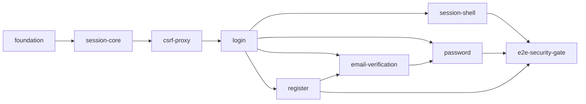

# BFF + UI Auth — Índice de specs

**Escopo do módulo:** frontend Next.js (`frontend/`) — sessão BFF (Route Handlers, cookie, Redis), CSRF/proxy e UI server-first dos fluxos de conta.

**Fora do escopo:** API Laravel Auth (já entregue em `.specs/features/auth/`), Links, Analytics, Operations, tokens de integração.

**Fase alvo:** Fase 1 (Auth + BFF) — complemento da API Auth.

**Maturidade:** cada fatia começa como **SPEC-semente** (`Status: Seed`). Antes de Design/Tasks/Execute, a fatia deve passar por **Specify deepen** (fechamento de ACs, assumptions e dimensões implícitas).

---

## Como usar

1. Aprofundar **uma fatia por vez**, na ordem sugerida abaixo (`specify feature` / deepen).
2. Cada pasta recebe, ao amadurecer: `spec.md` fechado → (`context.md`) → `design.md` → `tasks.md` → Execute → `validation.md`.
3. Só abrir a próxima fatia depois que a anterior tiver critérios de aceite atendidos e testes do escopo passando (exceto geração de seeds neste índice).
4. IDs `BFFUI-XX` são estáveis neste índice; specs filhas referenciam esses IDs e IDs locais da fatia.

**Pré-requisito:** API Auth MVP verificada (`.specs/features/auth/` fatias 1–7).

---

## Mapa de fatias

| Ordem | Fatia | Pasta | Status | Depende de | Entrega |
| --- | --- | --- | --- | --- | --- |
| 1 | Fundação frontend | [foundation](./foundation/spec.md) | Spec ✅ · Design ✅ · Tasks ✅ · Execute ✅ · Validate ✅ | API Auth + Fase 0 | Módulos, forms stack, Tailwind, primitivos, ESLint/Prettier/Husky, gates Vitest/lint |
| 2 | Núcleo de sessão BFF | [session-core](./session-core/spec.md) | Spec ✅ · Design ✅ · Tasks ✅ · Execute ✅ · Validate ✅ | foundation | Crypto, cookie, Redis, TTL/idle |
| 3 | CSRF e proxy | [csrf-proxy](./csrf-proxy/spec.md) | Spec ✅ · Design ✅ · Tasks ✅ · Execute ✅ · Validate ✅ | session-core | Origin, CSRF, allowlist, returnUrl |
| 4 | Login | [login](./login/spec.md) | Spec ✅ · Design ✅ · Tasks ✅ | csrf-proxy | BFF login + UI login |
| 5 | Cadastro | [register](./register/spec.md) | Seed | login | BFF register + UI + Terms |
| 6 | Verificação de e-mail | [email-verification](./email-verification/spec.md) | Seed | register | BFF verify/resend + UI |
| 7 | Senha | [password](./password/spec.md) | Seed | login | Forgot / reset / change |
| 8 | Sessão e shell | [session-shell](./session-shell/spec.md) | Seed | login | Logout, me, perfil, guards |
| 9 | Gate E2E de segurança | [e2e-security-gate](./e2e-security-gate/spec.md) | Seed | 4–8 | Playwright + ausência de Bearer |

---

## Catálogo de features (BFFUI-XX)

| ID | Feature | Fatia |
| --- | --- | --- |
| BFFUI-01 | Scaffold modular frontend (`auth`, `shared`) | foundation |
| BFFUI-02 | Defaults RHF + Zod documentados e testados | foundation |
| BFFUI-03 | Defaults TanStack Query (sem persistência) | foundation |
| BFFUI-04 | Gates Vitest / ESLint / TypeScript strict | foundation |
| BFFUI-05 | Shell layout pt-BR / tema claro / 360px | foundation |
| BFFUI-10 | Cifra AES-256-GCM do Bearer (chave fora do Redis) | session-core |
| BFFUI-11 | Session ID opaco 256-bit | session-core |
| BFFUI-12 | Cookie `__Host-` + HttpOnly/Secure/SameSite=Lax/Path=/ | session-core |
| BFFUI-13 | Lookup Redis via `HMAC(session_id)` | session-core |
| BFFUI-14 | TTL absoluto e idle (session vs verification) | session-core |
| BFFUI-15 | Rotação de session ID em login / mudanças sensíveis | session-core |
| BFFUI-16 | Perda/flush Redis encerra sessão sem fallback de Bearer | session-core |
| BFFUI-17 | Bearer nunca serializado ao browser | session-core (+ gate) |
| BFFUI-20 | Allowlist estática método → upstream Laravel | csrf-proxy |
| BFFUI-21 | Validação `Origin` exata (App host HTTPS) | csrf-proxy |
| BFFUI-22 | CSRF double-submit vinculado à sessão (HMAC) | csrf-proxy |
| BFFUI-23 | `returnUrl` somente caminho interno seguro | csrf-proxy |
| BFFUI-24 | `Cache-Control: private, no-store` em respostas privadas | csrf-proxy |
| BFFUI-30 | Route Handler de login + emissão de sessão BFF | login |
| BFFUI-31 | UI de login server-first | login |
| BFFUI-32 | Anti-enumeração / erros alinhados à API | login |
| BFFUI-40 | Route Handler de register + sessão `verification` | register |
| BFFUI-41 | UI de cadastro com aceite versionado de Terms | register |
| BFFUI-50 | Route Handlers verify + resend | email-verification |
| BFFUI-51 | UI de verificação (somente ação explícita) | email-verification |
| BFFUI-52 | UX de sessão restrita pré-verificação | email-verification |
| BFFUI-60 | BFF + UI forgot password (reset-request) | password |
| BFFUI-61 | BFF + UI reset password | password |
| BFFUI-62 | BFF + UI change password | password |
| BFFUI-63 | Encerrar sessões BFF após change/reset | password |
| BFFUI-70 | Logout atual (cookie + Redis + revoke best-effort) | session-shell |
| BFFUI-71 | Logout-all com confirmação de senha | session-shell |
| BFFUI-72 | `me` GET/PATCH via BFF | session-shell |
| BFFUI-73 | UI de perfil (somente nome) | session-shell |
| BFFUI-74 | Guards de rota autenticada / restrita | session-shell |
| BFFUI-80 | Playwright: Bearer ausente em browser/HTML/storage | e2e-security-gate |
| BFFUI-81 | Playwright: CSRF, Origin, cookie, returnUrl | e2e-security-gate |
| BFFUI-82 | Playwright: flush Redis / idle / absoluto | e2e-security-gate |
| BFFUI-83 | axe WCAG 2.2 AA nos fluxos Auth críticos | e2e-security-gate |

---

## Critérios de saída do pacote (completo)

Quando **todas** as fatias 1–9 estiverem implementadas e verificadas:

- Convidado registra, verifica e-mail, autentica e encerra uma ou todas as sessões **somente via browser oficial + BFF**.
- Nenhum teste de browser, HTML, storage, log ou trace encontra token Bearer.
- CSRF, cookie, `Origin`, HMAC da sessão, safe return URL, perda do Redis e expirações passam nas suítes.
- Cobertura BFF ≥ 80% linhas/branches; domínios frontend Auth ≥ 75% (`docs/testing.md` §4).

---

## Fora do escopo (todas as fatias)

| Item | Motivo |
| --- | --- |
| Endpoints Laravel Auth | Já em `.specs/features/auth/` |
| Dashboard de Links / Analytics UI | Fase 2+ |
| Tokens de integração, MFA | Pós-MVP |
| Comandos Operations | Fase 4 |
| Proxy genérico / URL upstream dinâmica | Proibido (`docs/security.md` §5.3) |

---

## Referências do projeto

| Documento | Uso |
| --- | --- |
| `docs/product.md` §3, §8 | Jornadas e UI |
| `docs/architecture.md` §8 | BFF e acesso à API |
| `docs/security.md` §5 | Sessão BFF, CSRF, cookie |
| `docs/testing.md` §3.2, §6.2 | Estratégia e casos BFF |
| `docs/roadmap.md` Fase 1 | Critérios de saída |
| `docs/api.md` / `docs/openapi.yaml` | Contratos upstream |
| `.specs/features/auth/README.md` | API Auth já entregue |
