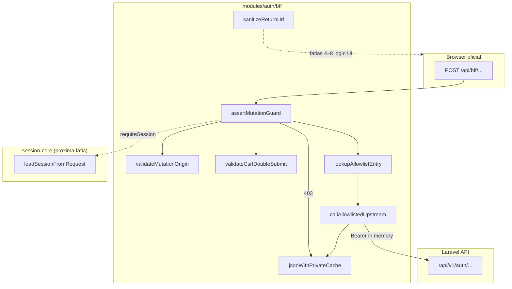

# BFF Auth — CSRF e proxy — Design

**Spec:** `.specs/features/bff-auth/csrf-proxy/spec.md`  
**Status:** Approved — 2026-08-11  
**Confirmada:** 2026-08-11 (SPEC locked; abordagens abaixo)

**Pré-requisito de runtime:** [session-core](../session-core/spec.md) — esta fatia define **contratos** (`SessionLoader`, `BffSessionRecord`) que session-core implementará; guards e upstream aceitam loader injetado para testes sem Redis.

---

## Abordagens consideradas

### 1. Transporte CSRF (double-submit)

| Abordagem | Prós | Contras | Veredicto |
| --- | --- | --- | --- |
| **A — Cookie `__Host-fl_csrf` (não HttpOnly) + header `X-CSRF-Token`** | Padrão double-submit testável; funciona com fetch client e forms | Token legível por JS (escopo limitado ao CSRF, não Bearer) | **Recomendada** (SPEC) |
| B — Synchronizer token só server-side (hidden field, sem cookie legível) | Token nunca em cookie legível | Exige HTML form por mutation; pior para fetch/API-style handlers | Rejeitada |
| C — SameSite=Strict no cookie de sessão substituindo CSRF | Menos código | Não cobre todos os vetores; contradiz `docs/security.md` §5.3 | Rejeitada |

### 2. Composição do guard

| Abordagem | Prós | Contras | Veredicto |
| --- | --- | --- | --- |
| **A — Pipeline funcional (`assertMutationGuard` + helpers puros)** | Testável unitariamente; handlers finos; alinha hexagonal frontend | Sem middleware global automático | **Recomendada** |
| B — Next.js `middleware.ts` global | Centralizado | Difícil allowlist por rota; ordem vs session; excluir `/health` | Rejeitada nesta fatia |
| C — Wrapper HOF `withBffMutation(handler)` | DRY em handlers | Menos explícito em Route Handlers App Router | Alternativa futura; A primeiro |

### 3. Allowlist upstream

| Abordagem | Prós | Contras | Veredicto |
| --- | --- | --- | --- |
| **A — `const AUTH_BFF_ALLOWLIST: readonly AllowlistEntry[] = []` + lookup `(method, path)`** | Simples; diff review claro quando fatias 4–8 adicionam entradas | O(n) lookup — irrelevante (<20 rotas Auth) | **Recomendada** |
| B — Map serializado em runtime com registro dinâmico | Lookup O(1) | Permite registro acidental em runtime; contradiz “estática” | Rejeitada |
| C — Proxy genérico com path param | Flexível | Proibido por arquitetura | Rejeitada |

**Decisão:** A nos três eixos.

---

## Architecture Overview

Biblioteca pura em `frontend/modules/auth/bff/` + Route Handler **probe** opcional (dev/test). Handlers de produto Auth **não** entram nesta fatia.



### Fluxo mutation (happy path)

1. Route Handler (futuro ou probe) chama `lookupAllowlistEntry(method, pathname)`.
2. `assertMutationGuard(request, entry, { loadSession })` valida Origin → CSRF → sessão (se `requireSession`).
3. Em falha: `forbiddenResponse()` → `403` + `private, no-store`.
4. Em sucesso: handler chama `callAllowlistedUpstream(entry, { session, body })`.
5. Resposta upstream repassada com `applyPrivateCacheHeaders`; Bearer **nunca** no JSON ao browser.

---

## Code Reuse Analysis

### Existing Components to Leverage

| Component | Location | How to Use |
| --- | --- | --- |
| Session cookie defaults | `frontend/lib/session-cookie.ts` | `buildSessionCookieOptions` para cookies CSRF/sid; **não** HttpOnly no token CSRF |
| Vitest + `@/` alias | `frontend/vitest.config.ts` | Co-located `*.test.ts`; node env para módulos puros |
| MSW / fetch mock | `frontend/modules/shared/test/msw/` | Upstream tests com `fetch` mock ou MSW |
| Health route test pattern | `frontend/app/health/route.test.ts` | Probe route handler tests |
| Makefile gates | `Makefile` | `make test-frontend`, `make lint-frontend` |
| App URL env | `.env.example` `NEXT_PUBLIC_APP_URL` | Fallback de `BFF_APP_ORIGIN` |

### Integration Points

| System | Integration Method |
| --- | --- |
| **session-core** (fatia 2) | Implementa `SessionLoader`; chama `issueCsrfForSession(sessionId)` após create/rotate |
| **login/register** (fatias 4–5) | Importam guards; **registram** entradas na `AUTH_BFF_ALLOWLIST` |
| **Docker nginx → Laravel** | `LARAVEL_INTERNAL_URL=http://nginx/api/v1` (HTTP rede interna; FastCGI via nginx) |
| **Compose frontend** | Novas env vars no `docker-compose.yml` / `.env.example` |
| **e2e-security-gate** (fatia 9) | Playwright valida CSRF/Origin em composição real |

---

## Components

### `env.ts`

- **Purpose:** Ler e validar config BFF em runtime server-side.
- **Location:** `frontend/modules/auth/bff/env.ts`
- **Interfaces:**
  - `getBffAppOrigin(): string` — `BFF_APP_ORIGIN` ?? `NEXT_PUBLIC_APP_URL`; throw se ausente em runtime server
  - `getCsrfHmacKey(): Buffer` — `BFF_CSRF_HMAC_KEY` (base64 ou hex); min 32 bytes
  - `getLaravelInternalUrl(): string` — base URL sem trailing slash
- **Dependencies:** `process.env` (server only)
- **Reuses:** `.env.example` URLs

### `crypto.ts`

- **Purpose:** HMAC CSRF e comparação segura.
- **Location:** `frontend/modules/auth/bff/crypto.ts`
- **Interfaces:**
  - `hmacSha256Base64Url(key: Buffer, message: string): string`
  - `timingSafeEqualString(a: string, b: string): boolean`
- **Dependencies:** Node `crypto`
- **Reuses:** none

### `origin.ts`

- **Purpose:** Validar `Origin` exato em mutations.
- **Location:** `frontend/modules/auth/bff/origin.ts`
- **Interfaces:**
  - `validateMutationOrigin(request: Request): { ok: true } | { ok: false }`
  - `isMutationMethod(method: string): boolean`
- **Dependencies:** `env.getBffAppOrigin()`
- **Reuses:** none

### `csrf.ts`

- **Purpose:** Emitir e validar double-submit CSRF (sessão ou pré-auth).
- **Location:** `frontend/modules/auth/bff/csrf.ts`
- **Interfaces:**
  - `deriveCsrfToken(sessionId: string): string`
  - `derivePreAuthCsrfToken(csrfSid: string): string`
  - `issueCsrfForSession(sessionId: string, response: NextResponse): NextResponse`
  - `issuePreAuthCsrf(response: NextResponse): NextResponse` — gera sid 256-bit se ausente
  - `validateCsrfDoubleSubmit(request: Request, ctx: CsrfContext): { ok: true } | { ok: false }`
- **Dependencies:** `crypto.ts`, `env.ts`, `session-cookie` helpers
- **Reuses:** `buildSessionCookieOptions` (override `httpOnly: false` no token cookie)

**Constantes cookie:**

| Nome | HttpOnly | Notas |
| --- | --- | --- |
| `__Host-fl_csrf` | false | Valor = token derivado |
| `__Host-fl_csrf_sid` | true | Nonce pré-auth; Max-Age 3600 |

### `return-url.ts`

- **Purpose:** Sanitizar redirects pós-auth.
- **Location:** `frontend/modules/auth/bff/return-url.ts`
- **Interfaces:**
  - `sanitizeReturnUrl(input: string | null | undefined, fallback?: string): string`
- **Dependencies:** none
- **Reuses:** none

### `allowlist.ts`

- **Purpose:** Tabela estática BFF → Laravel.
- **Location:** `frontend/modules/auth/bff/allowlist.ts`
- **Interfaces:**
  - `type AllowlistEntry = { method, bffPath, upstreamMethod, upstreamPath, requireSession, requireCsrf }`
  - `export const AUTH_BFF_ALLOWLIST: readonly AllowlistEntry[] = []`
  - `lookupAllowlistEntry(method: string, bffPath: string): AllowlistEntry | undefined`
  - `buildUpstreamUrl(entry: AllowlistEntry): string` — **private** ou só usado por `upstream.ts`; não exportar builder com URL livre
- **Dependencies:** `env.getLaravelInternalUrl()`
- **Reuses:** none

### `private-response.ts`

- **Purpose:** Headers de cache em respostas privadas.
- **Location:** `frontend/modules/auth/bff/private-response.ts`
- **Interfaces:**
  - `applyPrivateCacheHeaders(response: NextResponse): NextResponse`
  - `jsonWithPrivateCache(body: unknown, init?: ResponseInit): NextResponse`
  - `forbiddenResponse(): NextResponse` — `403` + `{ message: 'Forbidden.' }`
- **Dependencies:** `next/server`
- **Reuses:** none

### `mutation-guard.ts`

- **Purpose:** Orquestrar Origin + CSRF + sessão opcional.
- **Location:** `frontend/modules/auth/bff/mutation-guard.ts`
- **Interfaces:**
  - `assertMutationGuard(request, entry, deps): Promise<GuardResult>`
- **Dependencies:** origin, csrf, private-response, `SessionLoader` type
- **Reuses:** all above

### `upstream.ts`

- **Purpose:** `fetch` allowlisted para Laravel com timeout e Bearer server-side.
- **Location:** `frontend/modules/auth/bff/upstream.ts`
- **Interfaces:**
  - `callAllowlistedUpstream(entry, ctx, init?): Promise<UpstreamResult>`
- **Dependencies:** allowlist, env, private-response
- **Reuses:** MSW in tests

### `types.ts`

- **Purpose:** Contratos compartilhados com session-core.
- **Location:** `frontend/modules/auth/bff/types.ts`
- **Interfaces:**

```typescript
export type BffSessionRecord = {
  sessionId: string;
  bearerPlaintext: string;
};

export type SessionLoader = (request: Request) => Promise<BffSessionRecord | null>;

export type CsrfContext =
  | { mode: 'session'; sessionId: string }
  | { mode: 'pre-auth'; csrfSid: string };
```

### Probe route (dev/test only)

- **Purpose:** Validar guard + upstream wiring em Route Handler real.
- **Location:** `frontend/app/api/bff/_probe/mutate/route.ts`
- **Interfaces:** `POST` — usa entrada allowlist **local ao arquivo** ou re-export de test-only map; retorna `404` se `NODE_ENV === 'production'`
- **Dependencies:** mutation-guard, upstream
- **Reuses:** health route pattern

---

## Data Models

### AllowlistEntry

```typescript
export type HttpMethod = 'GET' | 'POST' | 'PATCH' | 'DELETE';

export type AllowlistEntry = {
  method: HttpMethod;
  bffPath: string;
  upstreamMethod: HttpMethod;
  upstreamPath: string;
  requireSession: boolean;
  requireCsrf: boolean;
};
```

**Relationships:** Zero entradas em produção nesta fatia; probe usa stub `(POST, /api/bff/_probe/mutate) → POST /auth/login` **somente** no handler probe ou em testes via tabela injetada — **não** adicionar ao `AUTH_BFF_ALLOWLIST` exportado.

### GuardResult

```typescript
export type GuardResult =
  | { ok: true; session: BffSessionRecord | null }
  | { ok: false; response: NextResponse };
```

---

## Error Handling Strategy

| Error Scenario | Handling | User/Browser Impact |
| --- | --- | --- |
| Origin missing/null/wrong | `forbiddenResponse()` antes de upstream | `403` JSON genérico, `private, no-store` |
| CSRF missing/mismatch | Idem | Idem |
| Session required but absent | Idem (não distinguir de CSRF) | Idem |
| Allowlist miss | Throw interno / `500` genérico em handler — **não** expor “not allowlisted” | Erro genérico; log server-side sem detalhes ao client |
| `LARAVEL_INTERNAL_URL` unset | Throw on upstream call init (server log) | `502`/`500` genérico se handler não capturar |
| Upstream timeout 10s | AbortSignal; `504` ou `502` genérico | Sem Bearer no body |
| Upstream 401/422 | Repassar status + body API (sanitizado — sem Bearer) | Mensagens API pt-BR nas fatias de produto |

---

## Risks & Concerns

| Concern | Location | Impact | Mitigation |
| --- | --- | --- | --- |
| session-core ainda não implementado | `session-core/spec.md` Seed | Guard com `requireSession: true` não testável E2E real | Interface `SessionLoader` injetada; testes usam mock; integração real na fatia login |
| `LARAVEL_INTERNAL_URL` não documentado no compose | `docker-compose.yml` frontend env | Upstream falha em dev | Task T11 documenta `http://nginx/api/v1`; adicionar env no compose |
| Cobertura global Vitest 75% vs meta BFF 80% | `vitest.config.ts` | Gate insuficiente para fatia | Threshold adicional ou override `auth/bff/**` ≥80% na task final |
| CSRF cookie legível por JS | Design intencional | XSS poderia ler CSRF (não Bearer) | Bearer permanece HttpOnly+Redis; CSP futuro; escopo mínimo no token cookie |
| Probe route em produção | `app/api/bff/_probe/` | Superfície de ataque | Guard `NODE_ENV === 'production'` → `404` no topo do handler |
| Duplicação env APP vs BFF origin | `.env.example` | Drift config | `BFF_APP_ORIGIN` opcional com fallback documentado |

---

## Tech Decisions

| Decision | Choice | Rationale |
| --- | --- | --- |
| Prefixo rotas BFF | `/api/bff/...` | Separar de `/api/v1` Laravel e `/health` Next |
| API pública do módulo | Barrel `frontend/modules/auth/bff/index.ts` | Fatias 4–8 importam `@/modules/auth/bff` |
| CSRF key material | `BFF_CSRF_HMAC_KEY` separado de `BFF_SESSION_*` | Security §14 |
| Comparação CSRF | Node `timingSafeEqual` em buffers UTF-8 | CP-06 |
| Upstream HTTP client | `fetch` nativo + `AbortSignal.timeout(10_000)` | Next 16 / Node 24; sem nova dependência |
| Probe allowlist | Entrada **local** ao probe file, não em `AUTH_BFF_ALLOWLIST` | CP-08: tabela exportada vazia |
| Session loading | Injeção `SessionLoader`, não import circular de session-core | Desacopla fatias 2 e 3 |

> **Project-level:** Prefixo `/api/bff/` registrado como **AD-017** em `.specs/STATE.md`.

---

## Verificação (design → tasks)

| Spec ID | Componente design |
| --- | --- |
| CP-01, CP-02, BFFUI-21 | `origin.ts` |
| CP-03–CP-07, BFFUI-22 | `csrf.ts`, `crypto.ts` |
| CP-08, CP-09, BFFUI-20 | `allowlist.ts` |
| CP-10, CP-11, BFFUI-23 | `return-url.ts` |
| CP-12, BFFUI-24 | `private-response.ts` |
| CP-13 | `mutation-guard.ts` |
| CP-14 | `upstream.ts` |
| CP-15 | Vitest co-located + probe route |
