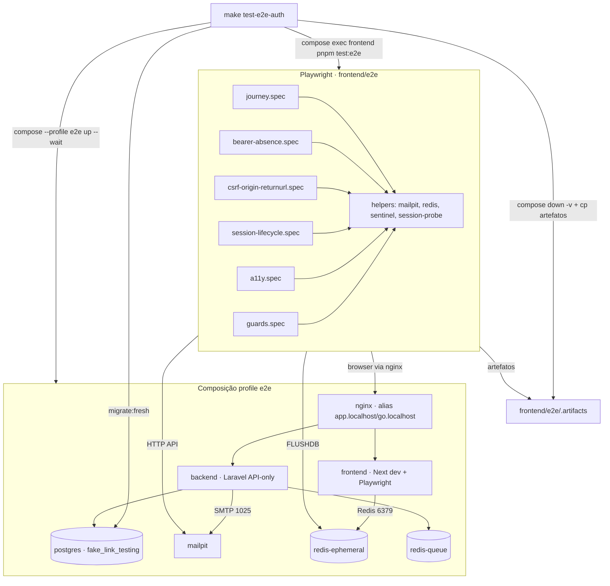

# BFF Auth — Gate E2E de segurança · Design

**Spec:** `.specs/features/bff-auth/e2e-security-gate/spec.md`
**Context:** `.specs/features/bff-auth/e2e-security-gate/context.md`
**Status:** Draft

---

## Research notes (Knowledge Verification Chain)

| Item | Fonte | Conclusão |
| --- | --- | --- |
| Mailpit REST API | Context7 `/axllent/mailpit` | `GET /api/v1/messages?start=&limit=`, `GET /api/v1/message/{id}` (corpo `Text`/`HTML`), `GET /api/v1/search?q=to:...`, `DELETE /api/v1/messages` com body `{}` = apaga tudo. Imagem `axllent/mailpit`; healthcheck oficial `mailpit readyz`; portas 1025 (SMTP) / 8025 (UI+API); env `MP_SMTP_BIND_ADDR`, `MP_UI_BIND_ADDR`, `MP_MAX_MESSAGES`. |
| Chromium e `*.localhost` | Conhecido / a confirmar na execução | Chromium resolve `*.localhost` para loopback internamente (RFC 6761), ignorando DNS da rede Compose. Contornar com `--host-resolver-rules="MAP app.localhost:443 nginx:443, MAP go.localhost:443 nginx:443"` em `launchOptions.args`. O `APIRequestContext` do Playwright usa Node (respeita DNS/hosts da rede), então o alias Compose basta para os requests diretos à API. |
| Playwright em container | `docker/node/Dockerfile` | O estágio `dev` não roda `pnpm install`; `node_modules` vem do volume nomeado `frontend_node_modules`. Para não ser sombreado, browsers vão para `PLAYWRIGHT_BROWSERS_PATH=/ms-playwright` (fora de `/app/node_modules`) e o pacote `@playwright/test` entra no `pnpm install` normal do frontend. |
| `axe` + Playwright | `@axe-core/playwright` (conhecido) | `new AxeBuilder({ page }).analyze()` → `results.violations[]` com `impact: 'minor'|'moderate'|'serious'|'critical'`. Gate filtra `serious`/`critical`. |
| TTL de sessão | `frontend/modules/auth/lib/session/ttl.ts`, `services/bff-session.ts` | Constantes `ABSOLUTE_TTL_SECONDS`/`IDLE_TTL_SECONDS` importadas direto por `bff-session.ts` (linhas 21–25, 87, 92, 104). Refactor: thread de valores via `BffSessionConfig`. |
| `/api/v1` público | `docs/security.md` §6; `backend/.../routes/auth.php` | `POST /api/v1/auth/login` acessível sem cookie → a suíte captura o Bearer plaintext da resposta como sentinel. |
| Queue | `backend/config` (default Laravel) | `QUEUE_CONNECTION` não fixado em `.env.example`; sob `e2e` fixamos `sync` para o job de e-mail rodar inline (sem timing de worker). |

---

## Architecture Overview

Dois planos: **composição `e2e`** (infra) e **suíte Playwright** (verificação). O alvo `make test-e2e-auth` orquestra ambos.



**Fluxo de um teste de jornada:** limpa mailbox → `page.goto('/register')` → preenche + aceita Termos → captura cookie `__Host-fl_session` → poll `GET /api/v1/search?q=to:e2e-auth@fake-link.test` no Mailpit → extrai `?token=` → `/verify-email` POST explícito → assert `active` → `/login` → assert rotação de cookie + destino `/` → asserts de segurança conforme a spec.

---

## Approach exploration (confirmar antes de Tasks)

As 4 gray areas grandes já foram decididas no `context.md`. Resta **como o runtime Playwright entra no container `frontend`**:

| # | Abordagem | Prós | Contras | Recomendação |
| --- | --- | --- | --- | --- |
| **A** | **Estágio `e2e` no `docker/node/Dockerfile`** (`FROM deps` + `playwright install --with-deps chromium`, `PLAYWRIGHT_BROWSERS_PATH=/ms-playwright`); `docker-compose.e2e.yml` aponta o `frontend` para `target: e2e` e mantém os bind mounts de código | Imagem hermética e cacheável; CI reproduzível; browsers fora do volume `node_modules`; um só container roda Next + Playwright (decisão do mantenedor) | +~400 MB na imagem de teste; rebuild ao mudar deps | ✅ **Recomendada** |
| B | Imagem `dev` inalterada; `make test-e2e-auth` roda `pnpm exec playwright install --with-deps chromium` a cada execução antes da suíte | Sem novo estágio de build | ~30–60 s por run; precisa de rede no CI toda vez; frágil se o mirror cair | ❌ |
| C | Serviço Playwright dedicado (`mcr.microsoft.com/playwright`) no profile `e2e` | Imagem oficial com browsers; isola deps | **Contraria a decisão do mantenedor** (reusar o container `frontend`); duplica `node_modules`/config | ❌ (rejeitada no discuss) |

Detalhamento dos componentes abaixo assume **Abordagem A**.

---

## Code Reuse Analysis

### Componentes existentes a aproveitar

| Componente | Local | Como usar |
| --- | --- | --- |
| Padrão profile + override | `docker-compose.yml`, `docker-compose.dev.yml` (AD-008) | Criar `docker-compose.e2e.yml` no mesmo formato; `mailpit` como serviço `profiles: ["e2e"]` no arquivo base (padrão de `swagger-ui`/`otel-collector`) |
| `COMPOSE`/`COMPOSE_TEST` macros | `Makefile:1-3` | Adicionar `COMPOSE_E2E := ... -f docker-compose.yml -f docker-compose.e2e.yml --profile e2e` |
| Estágios `base`/`deps` | `docker/node/Dockerfile` | `FROM deps AS e2e` reaproveita o `pnpm install --frozen-lockfile` já existente |
| Probe de sessão test-only | `frontend/app/api/_test/session/route.ts` | A suíte usa `POST/GET /api/_test/session` (habilitado por `BFF_SESSION_PROBE_ENABLED=true` no profile `e2e`) para criar/inspecionar sessões `verification`/`session` nos testes de guard e lifecycle sem depender de e-mail |
| Cliente Redis | dep `redis@4.7.1` já no `frontend/package.json` | Helper `flushEphemeralRedis()` conecta em `redis-ephemeral:6379` e roda `FLUSHDB`; também `getSessionRecord()`/`backdateSessionRecord()` para os testes de idle/absoluto sem esperar 20 s reais quando possível |
| `loadBffSessionConfig()` | `frontend/modules/auth/lib/session/config.ts` | Estender com os 4 campos de TTL (defaults = constantes atuais) |
| Helpers de TTL | `frontend/modules/auth/lib/session/ttl.ts` | Aceitar overrides de TTL; manter os mapas exportados como default |
| Smokes bash | `tests/smoke/*.sh`, `tests/compose/*.sh` | Novo `tests/compose/e2e-profile.sh` valida que o profile `e2e` compõe `mailpit` e não publica portas de datastore; padrão idêntico a `test-profile.sh` |
| Workflow CI | `.github/workflows/backend-quality.yml` | Molde para `frontend-e2e.yml` (checkout → env → `make test-e2e-auth` → upload arteffacts on failure) |
| Alias de rede | `docker-compose.yml` `networks.default` | `docker-compose.e2e.yml` adiciona `nginx.networks.default.aliases: [app.localhost, go.localhost]` |

### Pontos de integração

| Sistema | Método |
| --- | --- |
| Mailpit ↔ backend | SMTP `mailpit:1025`; `MAIL_MAILER=smtp` só no profile `e2e` |
| Suíte ↔ Mailpit | HTTP `http://mailpit:8025/api/v1/*` de dentro do container `frontend` |
| Suíte ↔ app | Chromium via `https://app.localhost` (resolver-rules → `nginx`); `APIRequestContext` via alias Compose |
| Suíte ↔ Redis efêmero | TCP `redis-ephemeral:6379` (cliente `redis` npm) |
| `make` ↔ Postgres | `docker compose ... exec backend php artisan migrate:fresh` antes da suíte |
| CI ↔ artefatos | `actions/upload-artifact` de `frontend/e2e/.artifacts/` em falha |

---

## Components

### 1. Serviço Compose `mailpit`

- **Purpose:** capturar e-mails de verificação/reset para a suíte ler por API.
- **Location:** `docker-compose.yml` (serviço `mailpit`, `profiles: ["e2e"]`).
- **Interfaces:** SMTP `:1025`; HTTP API/UI `:8025`. Env `MP_SMTP_BIND_ADDR=0.0.0.0:1025`, `MP_UI_BIND_ADDR=0.0.0.0:8025`, `MP_MAX_MESSAGES=500`. Healthcheck `CMD ["/mailpit","readyz"]`.
- **Dependencies:** nenhuma; sem volume persistente (mailbox efêmero).
- **Reuses:** padrão de serviço com profile de `swagger-ui`.
- **Pin:** `axllent/mailpit:<tag>` em `docker/versions.env` (`MAILPIT_VERSION`).

### 2. Override `docker-compose.e2e.yml`

- **Purpose:** ligar o profile `e2e` — Mailpit, SMTP no backend, TTLs curtos e probe no frontend, alias de rede, imagem `e2e`.
- **Location:** raiz.
- **Interfaces (deltas):**
  - `backend`: `MAIL_MAILER=smtp`, `MAIL_HOST=mailpit`, `MAIL_PORT=1025`, `MAIL_FROM_ADDRESS=no-reply@fake-link.test`, `QUEUE_CONNECTION=sync`, `AUTH_INVITE_ALLOWLIST_PATH=/var/www/config/invite-allowlist.e2e.json`.
  - `frontend`: `build.target: e2e`, `BFF_SESSION_PROBE_ENABLED=true`, `BFF_SESSION_ABSOLUTE_TTL_SESSION=20`, `BFF_SESSION_IDLE_TTL_SESSION=8`, `BFF_SESSION_ABSOLUTE_TTL_VERIFICATION=20`, `BFF_SESSION_IDLE_TTL_VERIFICATION=8`, `PLAYWRIGHT_BROWSERS_PATH=/ms-playwright`, `E2E_APP_ORIGIN=https://app.localhost`, `E2E_MAILPIT_URL=http://mailpit:8025`, `E2E_REDIS_URL=redis://redis-ephemeral:6379`.
  - `nginx`: `networks.default.aliases: [app.localhost, go.localhost]`.
  - `mailpit`: incluído (profile).
- **Dependencies:** `docker-compose.yml`.
- **Reuses:** formato de `docker-compose.dev.yml`.

### 3. Estágio `e2e` em `docker/node/Dockerfile`

- **Purpose:** imagem do `frontend` com Chromium + libs + `@playwright/test`.
- **Location:** `docker/node/Dockerfile`.
- **Interfaces:** `FROM deps AS e2e` → `ENV PLAYWRIGHT_BROWSERS_PATH=/ms-playwright NODE_ENV=development` → `RUN pnpm exec playwright install --with-deps chromium` → `CMD ["pnpm","dev"]`.
- **Dependencies:** `@playwright/test`, `@axe-core/playwright` em `frontend/package.json` devDeps (lockfile atualizado).
- **Reuses:** estágio `deps` (install já feito).

### 4. `frontend/package.json` — deps e script

- **Interfaces:** devDeps `@playwright/test`, `@axe-core/playwright`; script `"test:e2e": "playwright test --config e2e/playwright.config.ts"`.
- **Nota de cobertura:** `frontend/e2e/**` fica fora dos globs `include` do `vitest.config.ts` — sem impacto nos gates de cobertura Vitest existentes.

### 5. `frontend/e2e/playwright.config.ts`

- **Purpose:** config única do runner.
- **Interfaces:** `testDir: '.'`, `use: { baseURL: process.env.E2E_APP_ORIGIN, ignoreHTTPSErrors: true, trace: 'retain-on-failure', video: 'retain-on-failure', screenshot: 'only-on-failure' }`, `projects: [{ name: 'chromium', use: { ...devices['Desktop Chrome'], launchOptions: { args: ['--host-resolver-rules=MAP app.localhost:443 nginx:443, MAP go.localhost:443 nginx:443'] } } }]`, `reporter: [['list'], ['html', { outputFolder: '.artifacts/html', open: 'never' }]]`, `outputDir: '.artifacts/test-results'`, `workers: 1` (evita corrida de mailbox/allowlist com endereço fixo), `forbidOnly: !!process.env.CI`.
- **Dependencies:** env do serviço `frontend` (componente 2).

### 6. `frontend/e2e/helpers/`

| Helper | Interface | Reusa |
| --- | --- | --- |
| `mailpit.ts` | `clearMailbox()`, `waitForMessage(to, {timeoutMs})`, `extractLinkToken(msg): string` | `fetch` nativo, `E2E_MAILPIT_URL` |
| `redis.ts` | `flushEphemeralRedis()`, `readSessionRecord(sessionId)`, `backdateSessionRecord(sessionId, {createdAtDeltaS, lastActivityDeltaS})` | dep `redis`, `redis-key.ts` (`buildRedisSessionKey`), `E2E_REDIS_URL` |
| `sentinel.ts` | `captureBearerSentinel(request, creds): Promise<string>` (POST direto `/api/v1/auth/login`), `assertAbsent(sentinel, haystacks[])` | `APIRequestContext` |
| `account.ts` | `registerViaUi(page, {email,password})`, `verifyViaMailbox(page)`, `loginViaUi(page, {returnUrl?})`, `probeCreateSession(request, {kind})` | probe `/api/_test/session`, `mailpit.ts` |
| `leak-scan.ts` | `collectClientState(page): {cookies, storage, indexedDb, html, rsc}`, `scanContainerLogs(sentinel)` (via `docker logs` não disponível de dentro → ver Risco R4), `scanArtifacts(dir, needles[])` | `page.context().cookies()`, `page.evaluate` |

### 7. Suítes (`frontend/e2e/*.spec.ts`)

| Arquivo | Cobre (ACs) | Requisitos |
| --- | --- | --- |
| `journey.spec.ts` | jornada register→verify→login→logout→logout-all; forgot→reset revoga sessões | E2E-01..04, BFFUI-80 |
| `bearer-absence.spec.ts` | sentinel ausente de HTML/RSC/JS, cookies/storage/IndexedDB, respostas BFF + `private,no-store`, URL, logs, artefatos | E2E-05..08, BFFUI-80 |
| `csrf-origin-returnurl.spec.ts` | `Origin` ausente/divergente, double-submit quebrado, fluxo oficial OK, `returnUrl` externo/interno | E2E-09..11, BFFUI-81 |
| `session-lifecycle.spec.ts` | flush Redis → logout; idle TTL curto; absoluto TTL curto | E2E-12..14, BFFUI-82 |
| `a11y.spec.ts` | `axe` sem `serious`/`critical` nas 6 páginas; reflow 360 px | E2E-15..16, BFFUI-83 |
| `guards.spec.ts` | matriz `verification`×`session`; logout-all concorrente (2 contexts) | E2E-21 |

### 8. Unit test do refactor de TTL

- **Location:** `frontend/modules/auth/lib/session/config.test.ts` (estende) + `ttl.test.ts` (estende).
- **Cobre:** E2E-20 — defaults preservados quando env ausente; override quando env presente; parsing inválido (não numérico) → erro fail-fast como os demais campos de `config.ts`.

### 9. `Makefile` — alvo `test-e2e-auth`

```
test-e2e-auth: ## Run the Playwright Auth security gate (profile e2e)
	$(COMPOSE_E2E) build frontend
	$(COMPOSE_E2E) up -d --wait
	$(COMPOSE_E2E) exec -T backend php artisan migrate:fresh --force --env=testing
	-$(COMPOSE_E2E) exec -T frontend pnpm test:e2e ; status=$$? ; \
	  $(COMPOSE_E2E) cp frontend:/app/e2e/.artifacts ./frontend/e2e/.artifacts 2>/dev/null || true ; \
	  $(COMPOSE_E2E) down -v ; exit $$status
```

- **Notas:** `migrate:fresh` usa o banco `fake_link_testing` (AD-011) — nunca `fake_link`. `.PHONY` atualizado. Fora de `make test`.

### 10. `.github/workflows/frontend-e2e.yml`

- **Trigger:** `pull_request: [main]`, `push: [main]`.
- **Steps:** checkout → `cp .env.example .env` → `make trust-ca` → `make test-e2e-auth` → `actions/upload-artifact` (`frontend/e2e/.artifacts/`, `if: failure()`).
- **Reuses:** estrutura de `backend-quality.yml`.

### 11. `backend/config/invite-allowlist.e2e.json`

- **Conteúdo:** `{ "emails": ["e2e-auth@fake-link.test"] }` (mesmo formato de `invite-allowlist.testing.json`).
- **Montagem:** os containers backend já montam `./backend:/var/www`; o override aponta `AUTH_INVITE_ALLOWLIST_PATH` para o arquivo. Confirmar o shape com `JsonFileInviteAllowlist`.

### 12. `tests/compose/e2e-profile.sh`

- **Purpose:** gate estático — `docker compose --profile e2e config` inclui `mailpit`, não publica portas de datastore, projeto isolado.
- **Reuses:** `tests/compose/test-profile.sh` como molde. Adicionado ao `make test` (é barato, só `compose config`).

---

## Data Models

### `BffSessionConfig` (estendido) — `lib/session/config.ts`

```typescript
export interface BffSessionConfig {
  aesKey: Buffer;
  hmacKey: Buffer;
  aesKeyId: string;
  cookieName: string;
  redisUrl: string;
  probeEnabled: boolean;
  // novos — defaults idênticos às constantes atuais de ttl.ts
  absoluteTtlSeconds: Record<SessionKind, number>; // session:604800, verification:86400
  idleTtlSeconds: Record<SessionKind, number>;     // session:86400,  verification:3600
}
```

Env lidas (opcionais, inteiros > 0; ausência → default; valor inválido → `Error` fail-fast):
`BFF_SESSION_ABSOLUTE_TTL_SESSION`, `BFF_SESSION_IDLE_TTL_SESSION`, `BFF_SESSION_ABSOLUTE_TTL_VERIFICATION`, `BFF_SESSION_IDLE_TTL_VERIFICATION`.

### `ttl.ts` — assinatura estendida

```typescript
type TtlTable = Record<SessionKind, number>;
export function isAbsoluteExpired(r: SessionRecord, now: Date, absolute: TtlTable = ABSOLUTE_TTL_SECONDS): boolean;
export function isIdleExpired(r: SessionRecord, now: Date, idle: TtlTable = IDLE_TTL_SECONDS): boolean;
export function remainingAbsoluteSeconds(r: SessionRecord, now: Date, absolute: TtlTable = ABSOLUTE_TTL_SECONDS): number;
```

`bff-session.ts` passa `config.absoluteTtlSeconds` / `config.idleTtlSeconds`. `ABSOLUTE_TTL_SECONDS.session` usado como `maxAge` fallback (linha 104) passa a `config.absoluteTtlSeconds.session`.

### Mensagem Mailpit (forma consumida)

```typescript
// GET /api/v1/message/{id}
interface MailpitMessage { ID: string; To: {Address: string}[]; Subject: string; Text: string; HTML: string; }
// token: primeira captura de /[?&]token=([A-Za-z0-9._-]+)/ em Text || HTML
```

---

## Error Handling Strategy

| Cenário | Tratamento | Impacto |
| --- | --- | --- |
| Mailpit sem mensagem no timeout (10 s) | `waitForMessage` lança com `to`/contagem atual | Teste falha explícito; nunca segue com token vazio |
| `app.localhost` não resolve no Chromium | `--host-resolver-rules` no config; se falhar, `webServer`/health check da suíte aborta cedo | Falha de setup clara, não flake por teste |
| Sessão expira entre `goto` e assert (TTL curto) | Helpers usam espera por estado (`toHaveURL(/login/)`, cookie ausente), nunca `waitForTimeout` fixo para o resultado | Determinismo |
| `FLUSHDB` derruba outra coisa | Stack `e2e` é Auth-only; `redis-ephemeral` só guarda sessão BFF | Sem efeito colateral |
| Job de e-mail não roda | `QUEUE_CONNECTION=sync` no profile → inline no request | Sem dependência de worker/timing |
| `migrate:fresh` no banco errado | Alvo fixa `--env=testing` → `fake_link_testing`; `DatabaseSafetyGuard` do backend cobre o resto | AD-011 preservado |
| Artefato Playwright com segredo | `trace`/`video` `retain-on-failure` + `scanArtifacts()` assevera ausência de sentinel/cookie; mascaramento via `test.info().attachments` sanitizados | `docs/security.md` §13 |
| Segundo run sem `migrate:fresh` | Alvo sempre roda `migrate:fresh`; doc no `tasks.md` | Registro em `/register` sempre parte de estado limpo |

---

## Risks & Concerns

| Concern | Location | Impact | Mitigation |
| --- | --- | --- | --- |
| **R1** Refactor de TTL toca slice Verified `session-core` | `frontend/modules/auth/lib/session/ttl.ts`, `config.ts`, `services/bff-session.ts:21-25,87,92,104` | Regressão em produção se defaults mudarem | Params com default = constantes atuais; testes unitários de `session-core` re-executados no gate `quick` de cada task que toca esses arquivos; AC E2E-20 assevera defaults |
| **R2** Chromium ignora DNS Compose para `*.localhost` | `playwright.config.ts` | Suíte inteira não conecta | `--host-resolver-rules` MAP → `nginx`; task de smoke de conectividade antes das specs de negócio; documentado em Research |
| **R3** Volume `frontend_node_modules` sombreia `@playwright/test` da imagem `e2e` | `docker-compose.yml` frontend volumes | `pnpm test:e2e` falha "cannot find @playwright/test" | Estágio `e2e` roda `pnpm install` sobre o mesmo layout; se o volume estiver populado por run anterior sem playwright, o alvo faz `$(COMPOSE_E2E) build` + `pnpm install --frozen-lockfile` no `up`; alternativa registrada: remover o mount do volume no override `e2e` |
| **R4** Ler logs do container `frontend` de dentro dele | `helpers/leak-scan.ts` (AC E2E-08) | `docker logs` indisponível dentro do container | A app grava logs em stdout **e** em arquivo (`next` + rota `/health`); a suíte varre o arquivo de log montado (`/app/.next` / logger do BFF) OU o `make` faz `docker compose logs frontend > .artifacts/frontend.log` e a suíte varre esse arquivo pós-run (assert no alvo, não no spec). Decidir no Tasks; default: assert no alvo `make` após a suíte |
| **R5** `pnpm install` não roda no estágio `dev` hoje | `docker/node/Dockerfile` | Origem do `node_modules` do frontend é implícita | Estágio `e2e` é explícito (`FROM deps`); não altera `dev`; task inclui `$(COMPOSE_E2E) build frontend` no alvo |
| **R6** Flake por tempo real de espera (idle 8 s / absoluto 20 s) | `session-lifecycle.spec.ts` | Gate intermitente no CI | `backdateSessionRecord()` via Redis retrocede timestamps em vez de esperar, quando o objetivo é só cruzar o limite; espera real só quando o AC exige "sem atividade" observável; `workers: 1`; timeouts generosos |
| **R7** `axe` pode achar violação pré-existente nas páginas Auth | 6 páginas das fatias 4–8 | Gate nasce vermelho | Se aparecer `serious`/`critical` real, vira **fix task** na página correspondente (escopo desta fatia: corrigir a11y crítica dos fluxos que o gate cobre) — não suprimir a regra |
| **R8** Endereço fixo + `workers:1` limita paralelismo | suíte inteira | Suíte mais lenta | Aceito: é um gate de CI, não loop de dev; jornada + specs somam ~6 arquivos |

---

## Tech Decisions

| Decisão | Escolha | Rationale |
| --- | --- | --- |
| Runtime Playwright no container | Abordagem A — estágio `e2e` no Dockerfile | Hermético, cacheável, respeita "reusar container `frontend`" |
| Resolução de host no browser | `--host-resolver-rules` MAP `app.localhost`→`nginx` | Chromium força `*.localhost`→loopback; precisa do Origin real p/ CSRF/`__Host-` |
| Sentinel de Bearer | Bearer plaintext real via `POST /api/v1/auth/login` | Bearer e session id têm o mesmo shape base64url-43; só string exata discrimina |
| TTL configurável | Env + default = constantes; params opcionais nas fns | Backward-compatible; não reabre `session-core` |
| Queue no `e2e` | `QUEUE_CONNECTION=sync` | Remove timing de worker da jornada |
| Escopo de browser | Só Chromium | Matriz completa é pré-release BrowserStack |
| `axe` bloqueante | `serious` + `critical` | "impacto relevante conhecido" (`docs/testing.md` §3.4) |
| `make test-e2e-auth` fora de `make test` | Sim | Mantém gates rápidos separados do E2E lento (AD-014 espírito) |

> **Project-level:** propor a `.specs/STATE.md` `## Decisions` um novo **AD-018** — "Gate E2E Auth: profile Compose `e2e` + `docker-compose.e2e.yml` + `make test-e2e-auth` + workflow `frontend-e2e.yml`; Playwright roda no container `frontend` via estágio `e2e`; Mailpit para captura de e-mail; TTLs de sessão BFF configuráveis por env com defaults inalterados." Registrar no fecho da fatia (Execute/Verifier), não agora.

---

## Nenhuma alteração de contrato

OpenAPI (`docs/openapi.yaml`) inalterada — a fatia não adiciona endpoint. `/api/bff/**` continua boundary interno. `docs/testing.md` §3.3 já prevê Playwright contra composição real; nenhuma doc de contrato muda.
