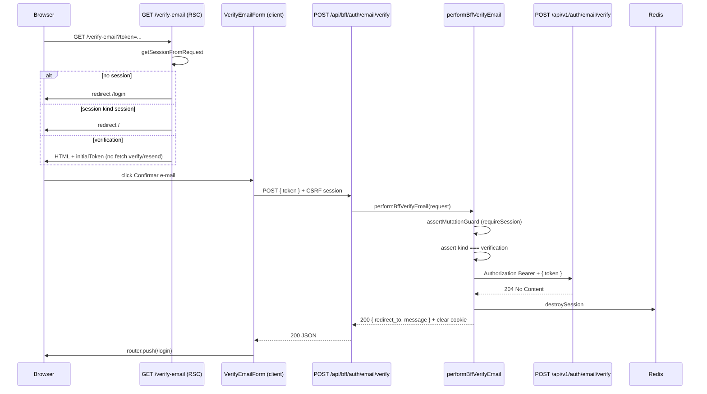
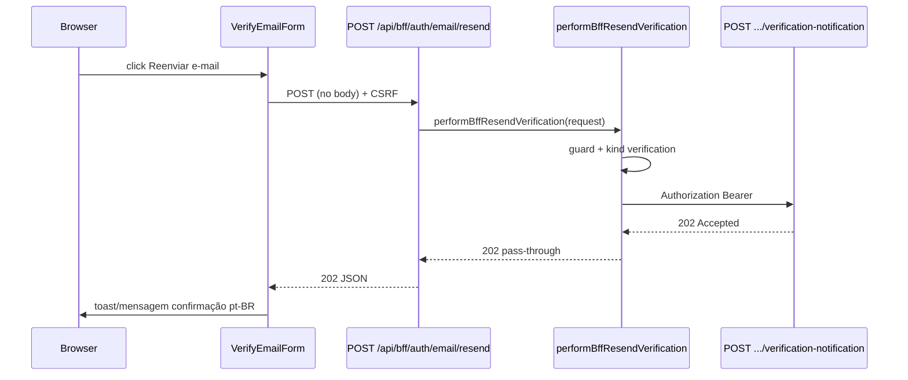

# BFF Auth — Verificação de e-mail — Design

**Spec:** `.specs/features/bff-auth/email-verification/spec.md`  
**Status:** Approved — 2026-08-18  
**Pré-requisitos de runtime:** [session-core](../session-core/spec.md) (Verified), [csrf-proxy](../csrf-proxy/spec.md) (Verified), [register](../register/spec.md) (Verified)

---

## Abordagens consideradas

### 1. Orquestração dos handlers verify/resend

| Abordagem | Prós | Contras | Veredicto |
| --- | --- | --- | --- |
| **A — Dois serviços (`performBffVerifyEmail`, `performBffResendVerification`) + helpers compartilhados** | Testável; verify destrói sessão sem acoplar resend; paridade login/register | Dois arquivos de serviço | **Recomendada** |
| B — Serviço único `performBffEmailVerification(action)` | Um arquivo | Branching verify vs resend; testes menos focados | Rejeitada |
| C — `callAllowlistedUpstream` + pós-processar | Menos código | Helper não traduz `204`→`200` nem destroy session; repasse Bearer em corpo se mal usado | Rejeitada |

### 2. Tradução de sucesso verify (`204` upstream)

| Abordagem | Prós | Contras | Veredicto |
| --- | --- | --- | --- |
| **A — BFF responde `200` JSON com `redirect_to` + `message`** | UI alinhada a login/register; corpo útil pós-sucesso | Status diferente do upstream | **Recomendada** (SPEC) |
| B — Repassar `204` sem body ao browser | Paridade HTTP upstream | UI precisa inferir sucesso sem payload | Rejeitada |
| C — Redirect `302` do Route Handler | Sem JSON | Mistura semântica redirect com mutation POST; CSRF complexo | Rejeitada |

### 3. Hidratação do token na URL

| Abordagem | Prós | Contras | Veredicto |
| --- | --- | --- | --- |
| **A — RSC lê `searchParams.token`, passa `initialToken` ao client form; client faz `replaceState`** | Server-first; GET sem side-effect; token sai da barra de endereço | Prop serializada RSC→client (aceitável — token já no browser via e-mail) | **Recomendada** |
| B — Client lê `window.location.search` só no mount | Sem prop RSC | Hidratação só client; pior para SSR de estado inicial | Rejeitada |
| C — Auto-submit quando `?token=` presente | Menos cliques | Viola AUTH-22 / scanner-safe | Rejeitada |

### 4. Guards de sessão restrita

| Abordagem | Prós | Contras | Veredicto |
| --- | --- | --- | --- |
| **A — Módulo `verification-guard.ts` com allowlist de paths + helper RSC** | Exportável para `session-shell`; testável | Aplicar manualmente por página nesta fatia | **Recomendada** |
| B — Middleware Next.js global | Centralizado | Fora do escopo csrf-proxy; ordem vs health/probe | Rejeitada |
| C — Layout autenticado único | DRY futuro | Links/dashboard inexistentes; over-engineering agora | Rejeitada |

**Decisão:** A nos quatro eixos.

---

## Architecture Overview

Fluxo verify: página RSC valida sessão `verification` → Client Form POST BFF verify → serviço carrega Bearer do Redis → Laravel consome token → upstream `204` → BFF destroy session + clear cookie → resposta `200` sanitizada → redirect `/login`.

Fluxo resend: mesma sessão → POST BFF resend → upstream `202` → repasse sem alterar sessão.

Diferenças em relação a login/register: `requireSession: true`; CSRF modo **session** (não pré-auth); upstream verify retorna **204** (não 200/201); pós-verify **destrói** sessão BFF (não cria).





### Fluxo de erro verify (4xx upstream)

1. Guard falha (Origin/CSRF/sessão ausente) → `403 Forbidden` (sem fetch).
2. `session.kind !== 'verification'` → `403 Forbidden` (sem fetch).
3. Body JSON inválido / token ausente local → `400` pt-BR (sem fetch).
4. Upstream `403 INVALID_VERIFICATION_TOKEN` / `EMAIL_ALREADY_VERIFIED` → repasse; **sessão intacta** (exceto já verificado — UI redireciona login).
5. Upstream `401` → repasse; UI trata sessão expirada.
6. Upstream `422` → repasse `errors`.
7. Upstream `429` → repasse + `Retry-After`.
8. Upstream `500/503` / timeout → genérico pt-BR / `504`.

Em **nenhum** caminho de erro verify SHALL `destroySession` ou `clearSessionCookie`.

---

## Code Reuse Analysis

### Existing Components to Leverage

| Component | Location | How to Use |
| --- | --- | --- |
| Register/login service pattern | `bff-register.ts`, `bff-login.ts` | Espelhar guards, forward 4xx, fetch dedicado (não pass-through) |
| Mutation guard (session mode) | `modules/auth/bff/mutation-guard.ts` | `assertMutationGuard` com `requireSession: true` + `loadSession` |
| Allowlist | `modules/auth/bff/allowlist.ts` | `VERIFY_ALLOWLIST_ENTRY`, `RESEND_ALLOWLIST_ENTRY` |
| Private responses | `modules/auth/bff/private-response.ts` | `jsonWithPrivateCache`, `forbiddenResponse` |
| Session facade | `modules/auth/services/bff-session.ts` | `getSession`, `destroySession`, `clearSessionCookie`, `getSessionFromRequest` |
| Auth messages | `modules/auth/lib/auth-messages.ts` | Estender com códigos verify |
| Form defaults | `modules/shared/lib/form-defaults.ts` | `shouldBlockSubmit`, `focusFirstError` |
| UI primitives | `modules/shared/components/ui/*` | Button, Input, Label, FormField |
| Client cookie reader | `modules/auth/lib/client-cookie.ts` | `readClientCookie('__Host-fl_csrf')` |
| Login/register form tests | `login-form.test.tsx`, `register-form.test.tsx` | Padrão RTL + MSW + CSRF |
| Route handler tests | `app/api/bff/auth/login/route.test.ts` | Request sintético + session mock |
| Auth fixtures | `modules/auth/lib/test/auth-fixtures.ts` | Bearer sentinel, upstream payloads |
| Login/register pages | `app/login/page.tsx`, `app/register/page.tsx` | Paridade redirect por `kind` |

### Integration Points

| System | Integration Method |
| --- | --- |
| Laravel Auth API | `POST /auth/email/verify` com Bearer + `{ token }`; `POST /auth/email/verification-notification` com Bearer only |
| Redis (session-core) | Verify: `destroySession` + `clearSessionCookie` em sucesso; Resend: touch implícito via `getSession` |
| CSRF (csrf-proxy) | Session-bound CSRF emitido no register/login (`issueCsrfForSession`); **sem** pré-auth na página verify |
| Allowlist | `AUTH_BFF_ALLOWLIST` ganha entradas verify + resend |
| Fatia `session-shell` | Consome `VERIFICATION_ALLOWED_PATHS` + `resolveVerificationSessionGuard` |
| Home `/` | Guard mínimo: sessão `verification` → `/verify-email` |

---

## Components

### `VERIFY_ALLOWLIST_ENTRY` + `RESEND_ALLOWLIST_ENTRY`

- **Purpose:** Entradas estáticas allowlisted para verify e resend.
- **Location:** `frontend/modules/auth/bff/allowlist.ts`
- **Interfaces:**

```typescript
export const VERIFY_EMAIL_ALLOWLIST_ENTRY: AllowlistEntry = {
  method: 'POST',
  bffPath: '/api/bff/auth/email/verify',
  upstreamMethod: 'POST',
  upstreamPath: '/auth/email/verify',
  requireSession: true,
  requireCsrf: true,
};

export const RESEND_VERIFICATION_ALLOWLIST_ENTRY: AllowlistEntry = {
  method: 'POST',
  bffPath: '/api/bff/auth/email/resend',
  upstreamMethod: 'POST',
  upstreamPath: '/auth/email/verification-notification',
  requireSession: true,
  requireCsrf: true,
};
```

- **Dependencies:** `AllowlistEntry` type
- **Reuses:** Padrão `LOGIN_ALLOWLIST_ENTRY`

### `loadAuthenticatedMutationContext` (helper interno compartilhado)

- **Purpose:** DRY para verify/resend — guard + sessão + kind check.
- **Location:** `frontend/modules/auth/services/bff-email-verification-shared.ts` (nome sugerido; pode ser funções exportadas de um dos serviços se preferir colocation)
- **Interfaces:**

```typescript
type AuthenticatedMutationContext = {
  sessionId: string;
  bearerPlaintext: string;
  kind: 'verification';
};

type AuthenticatedMutationResult =
  | { ok: true; ctx: AuthenticatedMutationContext }
  | { ok: false; response: NextResponse };

export async function loadVerificationMutationContext(
  request: Request,
  entry: AllowlistEntry,
  deps?: BffSessionDependencies,
): Promise<AuthenticatedMutationResult>;
```

- **Algoritmo:**
  1. `assertMutationGuard(request, entry, { loadSession })` onde `loadSession` usa `getSession` e retorna `{ sessionId, bearerPlaintext }`.
  2. Se guard falha → `{ ok: false, response: forbidden }`.
  3. Carregar `kind` via `getSession` completo (ou estender loader para incluir kind).
  4. Se `kind !== 'verification'` → `403 Forbidden` sem upstream.
  5. Retornar ctx.

- **Dependencies:** mutation-guard, bff-session
- **Reuses:** Padrão `loadSession` callback em `performBffRegister` (adaptado para `requireSession: true`)

### `verify-email-schema.ts`

- **Purpose:** Validação client Zod espelhando `VerifyEmailRequest` OpenAPI.
- **Location:** `frontend/modules/auth/schemas/verify-email-schema.ts`
- **Interfaces:**

```typescript
export const verifyEmailSchema = z.object({
  token: z.string().min(1, 'Informe o código de verificação.'),
});

export type VerifyEmailFormValues = z.infer<typeof verifyEmailSchema>;
```

- **Nota:** Sem `.trim()` — paridade API (token opaco estrito).
- **Dependencies:** `zod`
- **Reuses:** Padrão `login-schema.ts`

### `auth-messages.ts` (extensão)

- **Purpose:** Mapa pt-BR para erros de verificação.
- **Location:** `frontend/modules/auth/lib/auth-messages.ts` (modify)

| `code` | Mensagem UI (pt-BR) |
| --- | --- |
| `INVALID_VERIFICATION_TOKEN` | Link de verificação inválido ou expirado. |
| `EMAIL_ALREADY_VERIFIED` | Este e-mail já foi confirmado. Faça login para continuar. |
| `UNAUTHENTICATED` (401) | Sua sessão expirou. Faça login novamente. |

- **Reuses:** `messageForAuthError`, `formatRetryAfter` existentes

### `verification-guard.ts`

- **Purpose:** Allowlist de paths permitidos para sessão `verification` + helper RSC.
- **Location:** `frontend/modules/auth/lib/verification-guard.ts`
- **Interfaces:**

```typescript
export const VERIFICATION_ALLOWED_PATHS = [
  '/verify-email',
  '/login',
  '/terms',
] as const;

export type VerificationGuardDecision =
  | { action: 'allow' }
  | { action: 'redirect'; to: '/verify-email' | '/login' | '/' };

export function resolveVerificationSessionGuard(input: {
  pathname: string;
  sessionKind: 'session' | 'verification' | null;
}): VerificationGuardDecision;
```

- **Regras:**

| `sessionKind` | `pathname` | Decisão |
| --- | --- | --- |
| `null` | `/verify-email` | `redirect /login` |
| `session` | `/verify-email` | `redirect /` |
| `verification` | `/` ou fora da allowlist | `redirect /verify-email` |
| `verification` | allowlist | `allow` |
| `session` | qualquer | `allow` (guards finos em session-shell) |

- **Dependencies:** none
- **Reuses:** Conceito de redirect em `app/login/page.tsx`

### `bff-verify-email.ts` (serviço)

- **Purpose:** Orquestrar verify BFF (guard → upstream 204 → destroy session → 200 sanitizado).
- **Location:** `frontend/modules/auth/services/bff-verify-email.ts`
- **Interfaces:**

```typescript
export type BffVerifyEmailSuccess = {
  redirectTo: '/login';
  message: string;
};

export type BffVerifyEmailResult =
  | { ok: true; response: NextResponse; success: BffVerifyEmailSuccess }
  | { ok: false; response: NextResponse };

export async function performBffVerifyEmail(
  request: Request,
  deps?: BffVerifyEmailDependencies,
): Promise<BffVerifyEmailResult>;
```

- **Algoritmo (happy path):**
  1. `loadVerificationMutationContext(request, VERIFY_EMAIL_ALLOWLIST_ENTRY)`.
  2. Validar `Content-Type` JSON; `parseVerifyBody` → `{ token }` ou `400`.
  3. `fetch(upstream, { method: 'POST', headers: { Authorization: Bearer, Content-Type }, body: JSON.stringify({ token }) }, timeout 10s)`.
  4. Se status !== `204` → forward 4xx/5xx (mesma lógica login); **não** destroy.
  5. `destroySession(sessionId)` best-effort.
  6. Montar `200` `{ data: { redirect_to: '/login', message: 'E-mail confirmado. Faça login para continuar.' } }`.
  7. `clearSessionCookie(response)` — **não** `issueCsrfForSession`.

- **Dependencies:** shared context loader, allowlist, bff-session
- **Reuses:** Forward error helpers de `bff-login.ts` / `bff-register.ts`

### `bff-resend-verification.ts` (serviço)

- **Purpose:** Orquestrar resend BFF (guard → upstream 202 → pass-through).
- **Location:** `frontend/modules/auth/services/bff-resend-verification.ts`
- **Interfaces:**

```typescript
export async function performBffResendVerification(
  request: Request,
  deps?: BffResendVerificationDependencies,
): Promise<BffResendVerificationResult>;
```

- **Algoritmo:**
  1. `loadVerificationMutationContext` com `RESEND_ALLOWLIST_ENTRY`.
  2. `fetch(upstream, { method: 'POST', headers: { Authorization: Bearer } })` — sem body.
  3. Repassar status/body/headers (`Retry-After` se presente).
  4. **Nunca** `destroySession`.

- **Dependencies:** shared context loader
- **Reuses:** Forward 4xx pattern

### `verify-email-form.tsx` (client)

- **Purpose:** Form RHF+Zod; submit verify; botão resend; strip query token.
- **Location:** `frontend/modules/auth/components/verify-email-form.tsx`
- **Interfaces:** `VerifyEmailFormProps { initialToken?: string }`
- **Dependencies:** verify-email-schema, auth-messages, shared UI, `useRouter`
- **Reuses:** Padrão `login-form.tsx`

**Mount effect (strip query):**

```typescript
useEffect(() => {
  if (!initialToken) return;
  const url = new URL(window.location.href);
  if (!url.searchParams.has('token')) return;
  url.searchParams.delete('token');
  window.history.replaceState({}, '', url.pathname + url.search + url.hash);
}, [initialToken]);
```

**Verify submit:**

```typescript
await fetch('/api/bff/auth/email/verify', {
  method: 'POST',
  credentials: 'include',
  headers: {
    'Content-Type': 'application/json',
    'X-CSRF-Token': readClientCookie('__Host-fl_csrf'),
  },
  body: JSON.stringify({ token: values.token }),
});
```

**Resend:** `POST /api/bff/auth/email/resend` sem body; em `202` set state `resendSuccess`; em `EMAIL_ALREADY_VERIFIED` → `router.push('/login')`.

**UI copy (pt-BR):**

- Título: "Confirme seu e-mail"
- Subtítulo: "Enviamos um link para o seu e-mail. Cole o código abaixo ou use o link recebido."
- Primário: "Confirmar e-mail"
- Secundário: "Reenviar e-mail"
- Link: "Ir para login" → `/login`
- Resend success: "Se o e-mail estiver cadastrado e pendente, você receberá um novo link."

### `app/verify-email/page.tsx` (RSC)

- **Purpose:** Shell server-first; guards; passa `initialToken` decodificado.
- **Location:** `frontend/app/verify-email/page.tsx`
- **Dependencies:** `getSessionFromRequest`, `redirect`, `VerifyEmailForm`
- **Reuses:** Paridade `app/register/page.tsx`

**Redirect rules:**

| Sessão | Ação |
| --- | --- |
| `null` | `redirect('/login')` |
| `kind: session` | `redirect('/')` |
| `kind: verification` | render + `initialToken={searchParams.token ?? undefined}` |

`searchParams.token` decodificado uma vez (`decodeURIComponent` se necessário via Next).

### `app/page.tsx` (modify)

- **Purpose:** Guard mínimo BFFUI-52 — verification session não fica na landing.
- **Location:** `frontend/app/page.tsx`
- **Change:** No topo do RSC, `getSessionFromRequest` + se `kind === 'verification'` → `redirect('/verify-email')`.

### Route Handlers

- **verify:** `app/api/bff/auth/email/verify/route.ts` → `performBffVerifyEmail`
- **resend:** `app/api/bff/auth/email/resend/route.ts` → `performBffResendVerification`

---

## Data Models

### BFF verify success response (browser)

```typescript
interface BffVerifyEmailSuccessResponse {
  data: {
    redirect_to: '/login';
    message: string;
  };
}
```

**Relationships:** Sem `user`, sem `token`, sem campos auth.

### Verify upstream body (server-only)

```typescript
interface VerifyUpstreamBody {
  token: string;
}
```

### Resend upstream

Sem request body. Response `202` envelope `Accepted` repassado.

---

## Error Handling Strategy

| Error Scenario | Handling | User Impact |
| --- | --- | --- |
| Origin/CSRF/sessão inválida | `403 Forbidden` | Genérico |
| `kind !== verification` | `403 Forbidden` | Genérico |
| Body JSON inválido / token vazio local | `400` pt-BR | "Requisição inválida." |
| Upstream `INVALID_VERIFICATION_TOKEN` | Repasse `403` | Link inválido/expirado |
| Upstream `EMAIL_ALREADY_VERIFIED` | Repasse `403` | Já confirmado → login |
| Upstream `401` | Repasse | Sessão expirada |
| Upstream `429` | Repasse + `Retry-After` | Throttle |
| Upstream timeout | `504` | Retry |
| Upstream 500/503 | Genérico pt-BR | Sem detalhe |
| Verify sucesso + Redis destroy fail | Clear cookie + `200` anyway | Sucesso; órfão expira por TTL |

---

## Risks & Concerns

| Concern | Location | Impact | Mitigation |
| --- | --- | --- | --- |
| `callAllowlistedUpstream` repassa body com Bearer | `bff/upstream.ts` | Vazamento | Verify/resend usam fetch dedicado nos serviços |
| Foundation gate proíbe rotas `verify` | `foundation-gates.test.ts:34` | CI falha | Task T12 atualiza gate: permite `verify-email` page + `email/verify|resend` routes; `password` ainda proibido |
| Token em prop RSC serializada | `verify-email/page.tsx` | Exposição HTML | Aceitável — usuário já recebeu token por e-mail; testes sentinel; strip query |
| CSRF session ausente após register | Register emite `issueCsrfForSession` | Submit verify falha 403 | Register/login já emitem CSRF session-bound; testes E2E MSW cobrem |
| Destroy session em erro upstream | Implementação incorreta | Usuário perde sessão sem verify | Testes explícitos: 403/401/422 **não** chamam destroy |
| Dois tabs verify concorrentes | UX | Segundo tab 403 pós-destroy | UI trata 401/403 como sessão expirada; spec edge case documentado |
| `getSession` não expõe `kind` no guard callback | `mutation-guard.ts` | Kind check impossível no loader | Segunda leitura `getSession` no serviço ou estender retorno do loader |

---

## Tech Decisions

| Decision | Choice | Rationale |
| --- | --- | --- |
| Serviços | `performBffVerifyEmail` + `performBffResendVerification` | Separa destroy vs preserve session |
| Upstream verify success | Traduz `204` → BFF `200` JSON | UI precisa `redirect_to` + message |
| Pós-verify cookie | `clearSessionCookie` only — sem novo CSRF | Sessão encerrada; login re-bootstrap |
| BFF resend path | `/api/bff/auth/email/resend` | Nome curto; upstream mantém `verification-notification` |
| Token URL | RSC `initialToken` + client `replaceState` | Scanner-safe GET; privacidade referrer |
| Kind guard | BFF local antes upstream | Economiza round-trip; 403 genérico |
| Restricted paths | Constante exportada + guard em `/` e `/verify-email` | Contrato para session-shell |
| Shared loader | `loadVerificationMutationContext` | DRY verify/resend session+guard |

> **Project-level decisions:** Nenhuma nova AD — conforma AD-017 (`/api/bff/...`) e AD-013 (módulos frontend).
