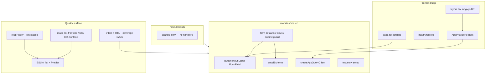

# BFF Auth — Fundação frontend — Design

**Spec:** `.specs/features/bff-auth/foundation/spec.md`  
**Context:** `.specs/features/bff-auth/foundation/context.md`  
**Status:** Approved — 2026-07-30  
**Confirmada:** 2026-07-30 (SPEC + context locked; abordagens abaixo)

---

## Abordagens consideradas

### 1. Organização do frontend

| Abordagem | Prós | Contras | Veredicto |
| --- | --- | --- | --- |
| **A — `modules/{auth,shared}` + `app/` na raiz de `frontend/`** | Alinha `AGENTS.md` e context 1A; sem migração `src/` | Alias `@/` já aponta para raiz — ok | **Recomendada** |
| B — Tudo sob `src/` | Convenção create-next-app comum | Contradiz decisão confirmada; move health/landing | Rejeitada |
| C — Feature folders só em `app/` | Menos pastas | Mistura rotas com domínio; BFF handlers futuros ficam acoplados a UI | Rejeitada |

### 2. Tailwind

| Abordagem | Prós | Contras | Veredicto |
| --- | --- | --- | --- |
| **A — Tailwind v4 CSS-first** (`@import "tailwindcss"`, `@theme`, `@tailwindcss/postcss`) | Padrão Next 16 2026; sem `tailwind.config.js` legado | Tokens em CSS | **Recomendada** |
| B — Tailwind v3 + `tailwind.config.ts` | Mais docs legadas | Stack antiga para app greenfield Next 16 | Rejeitada |

### 3. Qualidade / hooks

| Abordagem | Prós | Contras | Veredicto |
| --- | --- | --- | --- |
| **A — ESLint 9 flat em `frontend/` + Prettier + `package.json` raiz só para Husky/lint-staged** | Spec FND-12; Docker gates intactos; hooks no host | Dois `package.json` | **Recomendada** |
| B — Husky dentro de `frontend/package.json` | Um manifesto | Hooks git na raiz do monorepo quebram se cwd ≠ frontend | Rejeitada |
| C — Só Makefile, sem Husky | Menos superfície | Viola pedido explícito do mantenedor | Rejeitada |

**Decisão:** A nos três eixos.

---

## Architecture Overview

Fatia de **bootstrap**: estrutura modular, defaults de forms/query, primitivos UI, Tailwind, e rede de qualidade (Vitest/RTL/MSW + ESLint/Prettier + Makefile + Husky). Sem sessão BFF, CSRF ou páginas Auth.



### Ordem de entrega sugerida (Execute)

1. Dependências + ESLint/Prettier + Makefile lint  
2. Husky/lint-staged na raiz  
3. Scaffold `modules/` + Tailwind + shell  
4. Primitivos UI  
5. Schemas/forms defaults + QueryClient/provider  
6. Vitest jsdom/RTL/MSW + coverage gate + docs hooks  

---

## Code Reuse Analysis

### Existing Components to Leverage

| Component | Location | How to Use |
| --- | --- | --- |
| Root layout `lang=pt-BR` | `frontend/app/layout.tsx` | Estender com CSS global + providers |
| Landing | `frontend/app/page.tsx` | Aplicar Tailwind; manter copy pt-BR |
| Health route | `frontend/app/health/route.ts` | Não alterar contrato; manter testes |
| Session cookie helper | `frontend/lib/session-cookie.ts` | Lint-only; **não** expandir crypto |
| Vitest + `@/` alias | `frontend/vitest.config.ts` | Estender environment/coverage/setup |
| Makefile frontend test | `Makefile` `test-frontend` | Espelhar padrão para `lint-frontend` |
| Docker node image | `docker/node/Dockerfile` | Continuar `pnpm` no container; deps via `frontend/package.json` |
| Stack pins | `docker/versions.env` AD-005 | Next/Node/pnpm pinned; versões de libs novas compatíveis |

### Integration Points

| System | Integration Method |
| --- | --- |
| Docker Compose `frontend` | `make lint-frontend` / `test-frontend` via `$(COMPOSE) run --rm --no-deps frontend …` |
| Git hooks (host) | Root `pnpm install` → Husky `prepare`; lint-staged só `frontend/**` |
| Backend lint | `make lint` = `lint-backend` then `lint-frontend` (fail-fast) |
| Future Auth BFF | Consome `modules/shared` + Query/forms; handlers em fatias 2+ |

---

## Components

### Module scaffold (`auth`, `shared`)

- **Purpose**: Âncora de imports para fatias BFF/UI; `auth` sem Route Handlers nesta fatia.
- **Location**: `frontend/modules/auth/`, `frontend/modules/shared/`
- **Interfaces**: exports públicos via barrel opcional (`index.ts`) só se necessário para testes; preferir imports diretos `@/modules/shared/...`
- **Dependencies**: none beyond React/Next
- **Reuses**: padrão modular de `AGENTS.md`

### Tailwind theme + global CSS

- **Purpose**: Tema claro único; tokens mínimos; utilitários para shell/primitivos.
- **Location**: `frontend/app/globals.css`, `frontend/postcss.config.mjs`
- **Interfaces**: `@import "tailwindcss"`; bloco `@theme` com cores/spacing mínimos (claro only — sem `.dark`)
- **Dependencies**: `tailwindcss`, `@tailwindcss/postcss`
- **Reuses**: `layout.tsx` importa `globals.css`

### UI primitives

- **Purpose**: Base acessível para forms Auth futuros.
- **Location**: `frontend/modules/shared/components/ui/{button,input,label,form-field}.tsx`
- **Interfaces**:
  - `Button({ variant, type, disabled, children, ...props })`
  - `Input({ id, type, invalid?, ...props })`
  - `Label({ htmlFor, children })`
  - `FormField({ name, label, error?, children })` — associa label/erro; integra com RHF via `Controller` ou `register` no harness
- **Dependencies**: React; Tailwind classes; sem Radix
- **Reuses**: none (greenfield)

### `emailSchema` (Zod âncora)

- **Purpose**: Prova stack Zod + bounds alinhados OpenAPI (e-mail ≤254).
- **Location**: `frontend/modules/shared/schemas/email.ts`
- **Interfaces**: `emailSchema` — `z.string().trim().email()…` com max 254
- **Dependencies**: `zod`
- **Reuses**: OpenAPI/`docs` bounds

### Form defaults harness

- **Purpose**: Defaults documentados: foco no 1º erro, bloqueio de submit repetido, mapeamento erro server-side.
- **Location**: `frontend/modules/shared/lib/form-defaults.ts` (+ harness de teste `form-defaults.test.tsx`)
- **Interfaces**:
  - `focusFirstError(errors)` / `shouldBlockSubmit(isSubmitting)`
  - Harness de teste com RHF + `zodResolver(emailSchema)` (não é página de produto)
- **Dependencies**: `react-hook-form`, `@hookform/resolvers`, Zod, primitivos UI
- **Reuses**: `FormField`, `emailSchema`

### Query client factory + provider

- **Purpose**: Defaults TanStack Query sem persistência.
- **Location**: `frontend/modules/shared/lib/query-client.ts`, `frontend/modules/shared/components/app-providers.tsx`
- **Interfaces**:
  - `createAppQueryClient(): QueryClient` — staleTime 30s, gcTime 5min, retry GET transitório=1, mutations=0
  - `createVisibleRefetchInterval(ms = 60_000): (query) => number | false` — respeita `document.visibilityState`
  - `AppProviders` — Client Component wrapping `QueryClientProvider`
- **Dependencies**: `@tanstack/react-query`
- **Reuses**: wired in `app/layout.tsx`

### ESLint + Prettier

- **Purpose**: Substituir placeholder `lint`; flat config Next 16.
- **Location**: `frontend/eslint.config.mjs`, `frontend/.prettierrc` (ou `prettier.config.mjs`), `.prettierignore`
- **Interfaces**: scripts `lint` = `eslint .`, `format:check` = `prettier --check .`, `typecheck` = `tsc --noEmit`
- **Dependencies**: `eslint`, `eslint-config-next`, `eslint-config-prettier`, `prettier`, typescript-eslint via next config
- **Reuses**: Next 16 flat pattern (`eslint .`, não `next lint`)

### Makefile gates

- **Purpose**: Paridade Docker com backend quality.
- **Location**: `Makefile`
- **Interfaces**:
  - `lint-frontend`: `pnpm typecheck && pnpm lint && pnpm format:check`
  - `lint`: `lint-backend` then `lint-frontend`
  - `test-frontend-coverage` (ou flag em `test-frontend`): Vitest coverage + gate ≥75% em `modules/**`
- **Dependencies**: compose frontend service
- **Reuses**: padrão `test-frontend` existente

### Husky + lint-staged (raiz)

- **Purpose**: pre-commit formata/linta staged frontend.
- **Location**: `/package.json`, `.husky/pre-commit`, `lint-staged` config (raiz ou `package.json`)
- **Interfaces**: `prepare`: `husky`; lint-staged globs `frontend/**/*.{ts,tsx,js,jsx,mjs,cjs,css,json,md}`
- **Dependencies**: `husky`, `lint-staged`, `prettier`, eslint via `pnpm --dir frontend exec …` ou cwd
- **Reuses**: configs em `frontend/`

### Vitest / RTL / MSW

- **Purpose**: Ambiente de teste alinhado `docs/testing.md` §3.2.
- **Location**: `frontend/vitest.config.ts`, `frontend/vitest.setup.ts`, `frontend/modules/shared/test/msw/{server,handlers}.ts`
- **Interfaces**: jsdom para `*.test.tsx`; setup jest-dom; MSW `setupServer` + reset afterEach; coverage thresholds 75% em `modules/**`
- **Dependencies**: vitest, RTL, msw, jsdom
- **Reuses**: testes existentes `*.test.ts` (node) continuam válidos

---

## Data Models (if applicable)

Sem persistência de produto. Contratos de config:

```typescript
/** Documented Query defaults — asserted in unit tests */
export const QUERY_DEFAULTS = {
  staleTime: 30_000,
  gcTime: 300_000,
  queryRetry: 1, // transient GET only
  mutationRetry: 0,
  visibleRefetchIntervalMs: 60_000,
} as const
```

```typescript
/** Email anchor schema bounds — OpenAPI-aligned */
// max length 254 after trim; invalid → Zod issue on field
```

---

## Error Handling Strategy

| Error Scenario | Handling | User Impact |
| --- | --- | --- |
| Zod client validation fail | Field errors via RHF; focus first | Mensagem no campo (harness/primitivo) |
| Server-side field error (harness) | `setError(name, { message })` | Mensagem no campo; sem stack |
| Double submit | Button disabled / guard `isSubmitting` | Segundo clique ignorado |
| ESLint error no pre-commit | lint-staged exit ≠ 0 | Commit bloqueado |
| Coverage &lt; 75% | Gate Makefile falha | CI/local vermelho |
| Husky não instalado | Gates Makefile ainda obrigatórios | Dev sem hooks ainda passa por `make lint` |

---

## Risks & Concerns

| Concern | Location | Impact | Mitigation |
| --- | --- | --- | --- |
| `pnpm lint` é no-op placeholder | `frontend/package.json` | Qualidade falsa | T2/T3 substituem scripts + `make lint-frontend` |
| Sem RTL/jsdom hoje | `frontend/vitest.config.ts` | Não cobre componentes | T14 estende config; testes co-localizados |
| Dois package.json (raiz + frontend) | monorepo root ausente | Confusão de install | Documentar: Docker usa `frontend/`; hooks = `pnpm install` na raiz |
| Dockerfile copia só `frontend/` | `docker/node/Dockerfile` | Root husky não entra na imagem (ok) | Hooks são host-only; gates Docker independentes |
| Tailwind v4 + content detection | greenfield CSS | Classes em `modules/` podem ser purged se path errado | Usar v4 auto content; smoke visual landing; testes RTL não dependem de purge |
| Introduzir Bearer no browser por acidente | N/A nesta fatia | Viola security §5 | Spec Out of Scope; Verifier checa ausência |
| `clsx` / `tailwind-merge` | não na lista confirmada | DX de variantes | **Não** instalar sem pergunta; primitivos usam strings Tailwind simples ou helper local mínimo sem nova dep |

---

## Tech Decisions (non-obvious)

| Decision | Choice | Rationale |
| --- | --- | --- |
| Tailwind major | v4 CSS-first | Next 16 greenfield; menos config |
| ESLint entry | `eslint .` flat (`eslint-config-next`) | Next 16 removeu `next lint` do fluxo padrão |
| Prettier vs ESLint format | `eslint-config-prettier` desliga regras de formatação | Spec edge case conflito |
| Query provider | Client `AppProviders` no root layout | Server-first pages; Query só no client boundary |
| Form harness | Test-only / shared lib, não rota `/demo` | Evita UI de produto prematura |
| Coverage paths | `modules/auth/**` + `modules/shared/**` | Spec FND-11; excluir `app/health` e cookie legado se necessário |
| lint-staged exec | `pnpm --dir frontend exec eslint --fix` + prettier | Configs vivem em `frontend/` |
| Radix / CVA / shadcn | Não | Context + Out of Scope |
| Project-level ADs | AD-013…AD-015 em `STATE.md` | Convenções cross-feature |

---

## Referências

- Spec + context desta fatia  
- `docs/testing.md` §3.2, §4, §8  
- `docs/product.md` (pt-BR, claro, 360px)  
- `docs/roadmap.md` Fase 0/1  
- AD-003 (Makefile), AD-005 (pins)
