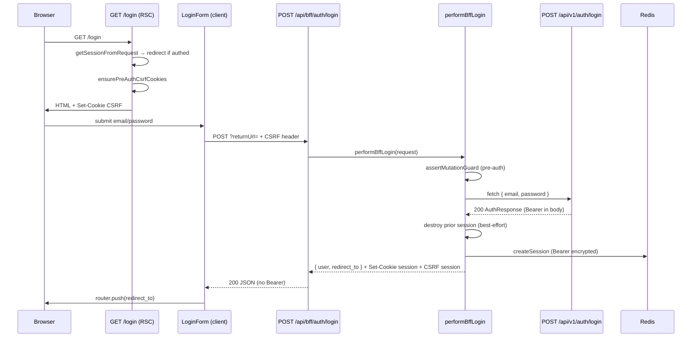

# BFF Auth — Login — Design

**Spec:** `.specs/features/bff-auth/login/spec.md`  
**Status:** Approved — 2026-08-11  
**Confirmada:** 2026-08-11 (SPEC locked; abordagens abaixo)

**Pré-requisitos de runtime:** [session-core](../session-core/spec.md) (Verified), [csrf-proxy](../csrf-proxy/spec.md) (Verified)

---

## Abordagens consideradas

### 1. Orquestração do handler de login

| Abordagem | Prós | Contras | Veredicto |
| --- | --- | --- | --- |
| **A — Serviço `performBffLogin` + Route Handler fino** | Testável sem Next; lógica de strip Bearer isolada; handler ~20 linhas | Um arquivo a mais | **Recomendada** |
| B — Toda lógica inline em `route.ts` | Menos arquivos | Difícil testar matriz upstream; risco de pass-through acidental | Rejeitada |
| C — Reutilizar `callAllowlistedUpstream` + pós-processar body | Menos código | Helper atual repassa body upstream **com Bearer** em `200` — exigiria fork ou flag perigosa | Rejeitada |

### 2. Bootstrap CSRF na página `/login`

| Abordagem | Prós | Contras | Veredicto |
| --- | --- | --- | --- |
| **A — `ensurePreAuthCsrfCookies(cookies)` em RSC via `next/headers`** | Server-first; sem round-trip extra; paridade com `issuePreAuthCsrf` | Refatorar emissão de cookies para API compartilhada | **Recomendada** |
| B — Route Handler `GET /api/bff/auth/csrf` + redirect | Reutiliza `NextResponse.cookies` | Round-trip; URL extra no produto | Rejeitada |
| C — Middleware global em `/login` | Centralizado | Fora do escopo csrf-proxy; ordem vs health | Rejeitada |

### 3. Transporte de `returnUrl`

| Abordagem | Prós | Contras | Veredicto |
| --- | --- | --- | --- |
| **A — Query string no POST BFF: `/api/bff/auth/login?returnUrl=...`** | Body upstream permanece `{ email, password }`; sanitização server-side | Client monta URL com query | **Recomendada** (SPEC) |
| B — Campo `returnUrl` no JSON body BFF | Simples no fetch | Risco de repasse acidental ao Laravel se filtro falhar | Rejeitada |
| C — Somente `returnUrl` na query da página `/login` | Menos params no BFF | Handler precisa ler Referer ou confiar no client para redirect — open redirect risk | Rejeitada |

**Decisão:** A nos três eixos.

---

## Architecture Overview

Primeiro fluxo Auth de produto: página RSC bootstrap CSRF → Client Form POST BFF → serviço server-only chama Laravel → sessão Redis cifrada → resposta sanitizada → redirect client.



### Fluxo de erro (4xx upstream)

1. Guard falha → `403 Forbidden` (sem fetch).
2. Body JSON inválido local → `400` (sem fetch).
3. Upstream `401/403/422/429` → repasse status + body + headers privados (+ `Retry-After` se presente).
4. Upstream `500/503` → mensagem genérica pt-BR.
5. Timeout/abort → `504` pt-BR.

Em **nenhum** caminho de erro SHALL emitir cookie `__Host-fl_session` válido.

---

## Code Reuse Analysis

### Existing Components to Leverage

| Component | Location | How to Use |
| --- | --- | --- |
| Mutation guard | `modules/auth/bff/mutation-guard.ts` | `assertMutationGuard` com `requireSession: false` |
| Allowlist lookup | `modules/auth/bff/allowlist.ts` | Registrar `LOGIN_ENTRY`; `lookupAllowlistEntry` |
| Upstream URL builder | `modules/auth/bff/allowlist.ts` | `buildUpstreamUrl(LOGIN_ENTRY)` — fetch manual, **não** pass-through em 200 |
| returnUrl sanitizer | `modules/auth/bff/return-url.ts` | `sanitizeReturnUrl` pós-login active |
| Private responses | `modules/auth/bff/private-response.ts` | `jsonWithPrivateCache`, `forbiddenResponse` |
| CSRF issue/validate | `modules/auth/bff/csrf.ts` | `issueCsrfForSession`, refatorar `issuePreAuthCsrf` → shared writer |
| Session facade | `modules/auth/services/bff-session.ts` | `createSession`, `getSession`, `destroySession`, `applySessionCookie` |
| Email Zod | `modules/shared/schemas/email.ts` | Reutilizar em `login-schema.ts` |
| Form defaults | `modules/shared/lib/form-defaults.ts` | `shouldBlockSubmit`, `focusFirstError` |
| UI primitives | `modules/shared/components/ui/*` | Button, Input, Label, FormField |
| Probe route tests | `app/api/bff/_probe/mutate/route.test.ts` | Padrão Request sintético + env stub + fetch mock |
| MSW harness | `modules/shared/test/msw/` | RTL tests do formulário |

### Integration Points

| System | Integration Method |
| --- | --- |
| Laravel Auth API | `fetch(LARAVEL_INTERNAL_URL + '/auth/login')` com JSON `{ email, password }` |
| Redis (session-core) | `createSession` / `destroySession` via facade injectable em testes |
| CSRF (csrf-proxy) | Pre-auth no GET `/login`; session-bound pós-login via `issueCsrfForSession` |
| Allowlist | `AUTH_BFF_ALLOWLIST` ganha **uma** entrada produto (login) |
| Fatia `email-verification` | Redirect `/verify-email` placeholder page (404 OK até fatia 6) |
| Fatia `register` / `password` | Links `/register`, `/forgot-password` na UI |

---

## Components

### `LOGIN_ALLOWLIST_ENTRY` + allowlist update

- **Purpose:** Entrada estática allowlisted para login.
- **Location:** `frontend/modules/auth/bff/allowlist.ts` (const exportada + push na tabela)
- **Interfaces:**

```typescript
export const LOGIN_ALLOWLIST_ENTRY: AllowlistEntry = {
  method: 'POST',
  bffPath: '/api/bff/auth/login',
  upstreamMethod: 'POST',
  upstreamPath: '/auth/login',
  requireSession: false,
  requireCsrf: true,
};
```

- **Dependencies:** `AllowlistEntry` type
- **Reuses:** Padrão probe `_probe/mutate`

### `login-schema.ts`

- **Purpose:** Validação client Zod espelhando `LoginRequest` OpenAPI.
- **Location:** `frontend/modules/auth/schemas/login-schema.ts`
- **Interfaces:**
  - `loginSchema: z.ZodObject<{ email, password }>`
  - `LoginFormValues = z.infer<typeof loginSchema>`
- **Dependencies:** `emailSchema` from shared
- **Reuses:** `modules/shared/schemas/email.ts`

```typescript
export const loginSchema = z.object({
  email: emailSchema.transform((v) => v.toLowerCase()),
  password: z
    .string()
    .min(1, 'Informe a senha.')
    .max(128, 'A senha deve ter no máximo 128 caracteres.'),
});
```

### `auth-messages.ts`

- **Purpose:** Mapa pt-BR de códigos API + mensagens genéricas gateway.
- **Location:** `frontend/modules/auth/lib/auth-messages.ts`
- **Interfaces:**
  - `messageForAuthError(code: string | undefined, status: number): string`
  - `formatRetryAfter(seconds: number | null): string | null`
- **Dependencies:** none
- **Reuses:** none

| `code` / status | Mensagem UI (pt-BR) |
| --- | --- |
| `INVALID_CREDENTIALS` | E-mail ou senha incorretos. |
| `ACCOUNT_SUSPENDED` | Esta conta está suspensa. |
| `ACCOUNT_PENDING_DELETION` | Esta conta está em processo de exclusão. |
| `RATE_LIMIT_EXCEEDED` | Muitas tentativas. Aguarde antes de tentar novamente. |
| `VALIDATION_FAILED` | Verifique os campos informados. |
| 504 / gateway | Não foi possível conectar ao serviço. Tente novamente. |
| 500 / 503 | Algo deu errado. Tente novamente. |

### `auth-api-types.ts`

- **Purpose:** Tipos server-only para parse seguro da resposta upstream.
- **Location:** `frontend/modules/auth/lib/auth-api-types.ts`
- **Interfaces:**
  - `UpstreamAuthData`, `UpstreamAuthResponse`
  - `parseUpstreamAuthResponse(json: unknown): UpstreamAuthData | null`
  - `toPublicUser(user: UpstreamUser): BffPublicUser` (mesmos campos User OpenAPI — sem token)
- **Dependencies:** none (types + type guards)
- **Reuses:** Shape de `docs/openapi.yaml` `AuthData`, `User`

### `bff-login.ts` (serviço)

- **Purpose:** Orquestrar login BFF end-to-end (guard → upstream → sessão → resposta sanitizada).
- **Location:** `frontend/modules/auth/services/bff-login.ts`
- **Interfaces:**

```typescript
export type BffLoginSuccess = {
  user: BffPublicUser;
  redirectTo: string;
  sessionId: string;
};

export type BffLoginResult =
  | { ok: true; success: BffLoginSuccess }
  | { ok: false; response: NextResponse };

export async function performBffLogin(
  request: Request,
  deps?: BffLoginDependencies,
): Promise<BffLoginResult>;
```

- **Dependencies:** bff guards, bff-session, return-url, auth-api-types, csrf
- **Reuses:** `assertMutationGuard`, `buildUpstreamUrl`, session facade

**Algoritmo (happy path):**

1. `lookupAllowlistEntry('POST', '/api/bff/auth/login')` — throw/403 se ausente.
2. `assertMutationGuard(request, LOGIN_ENTRY)` — retorna `guard.response` se falha.
3. `parseLoginBody(await request.text())` — `{ email, password }` ou 400.
4. `returnUrl = sanitizeReturnUrl(request.nextUrl.searchParams.get('returnUrl'), '/')`.
5. `fetch(buildUpstreamUrl(LOGIN_ENTRY), { method: 'POST', headers: { 'Content-Type': 'application/json' }, body: JSON.stringify({ email, password }), signal: AbortSignal.timeout(10_000) })`.
6. Se status ≠ 200 → `forwardUpstreamError(response)` (repasse 4xx; genérico 5xx/504).
7. Parse JSON → `parseUpstreamAuthResponse` — null → 500 sem cookie.
8. Validar `token_kind ∈ { session, verification }`.
9. `prior = await getSession(request.headers.get('cookie'))` — se `context`, `destroySession(context.sessionId)` best-effort.
10. `createSession({ bearer: data.token, kind: mapKind(data.token_kind), userId: data.user.id })`.
11. Montar `NextResponse.json({ data: { user, redirect_to } })` com `applySessionCookie` + `issueCsrfForSession`.
12. `redirect_to` = kind `verification` ? `/verify-email` : `returnUrl`.

### `ensurePreAuthCsrfCookies` (refactor csrf)

- **Purpose:** Emitir cookies pré-auth a partir de RSC (`cookies()` API).
- **Location:** `frontend/modules/auth/bff/csrf.ts`
- **Interfaces:**
  - `writePreAuthCsrfCookies(store: CookieStoreWriter, csrfSid?: string): void` — interno
  - `ensurePreAuthCsrfCookies(cookies: ReadonlyRequestCookies): void` — skip se sid+token já válidos
- **Dependencies:** crypto, env, session-cookie helpers
- **Reuses:** Lógica existente de `issuePreAuthCsrf`

### `getSessionFromRequest` (helper)

- **Purpose:** Wrapper server-only para páginas/guards — expõe metadados **sem** Bearer serializável.
- **Location:** `frontend/modules/auth/services/bff-session.ts`
- **Interfaces:**

```typescript
export type SessionSummary = { sessionId: string; kind: SessionKind; userId: string };

export async function getSessionFromRequest(
  request: Request,
  deps?: BffSessionDependencies,
): Promise<SessionSummary | null>;
```

- **Dependencies:** `getSession`
- **Reuses:** Facade existente; **não** exportar `bearer` no tipo retornado

### `login-form.tsx` (client)

- **Purpose:** Formulário interativo RHF+Zod; POST BFF; exibe erros pt-BR.
- **Location:** `frontend/modules/auth/components/login-form.tsx`
- **Interfaces:** Props `{ returnUrl?: string }`
- **Dependencies:** login-schema, auth-messages, shared UI, `useRouter`
- **Reuses:** form-defaults, shared primitives

**Submit contract:**

```typescript
const csrf = readCookie('__Host-fl_csrf'); // document.cookie parser local
await fetch(`/api/bff/auth/login?returnUrl=${encodeURIComponent(returnUrl ?? '')}`, {
  method: 'POST',
  credentials: 'include',
  headers: {
    'Content-Type': 'application/json',
    'X-CSRF-Token': csrf,
  },
  body: JSON.stringify({ email, password }),
});
```

### `app/login/page.tsx` (RSC)

- **Purpose:** Shell server-first; redirect se autenticado; bootstrap CSRF; renderiza `LoginForm`.
- **Location:** `frontend/app/login/page.tsx`
- **Interfaces:** `searchParams: { returnUrl?: string }`
- **Dependencies:** `cookies()`, `redirect()`, `getSessionFromRequest`, `ensurePreAuthCsrfCookies`
- **Reuses:** Layout root (AppProviders já no layout)

**Redirect rules:**

| Sessão | Ação |
| --- | --- |
| `kind: session` | `redirect(sanitizeReturnUrl(returnUrl, '/'))` |
| `kind: verification` | `redirect('/verify-email')` |
| null | render login |

### `app/api/bff/auth/login/route.ts`

- **Purpose:** Route Handler fino delegando a `performBffLogin`.
- **Location:** `frontend/app/api/bff/auth/login/route.ts`
- **Interfaces:** `export async function POST(request: Request): Promise<NextResponse>`
- **Dependencies:** `performBffLogin`
- **Reuses:** Padrão probe mutate

---

## Data Models

### BFF login success response (browser)

```typescript
interface BffLoginSuccessResponse {
  data: {
    user: {
      id: string;
      name: string;
      email: string;
      status: 'pending_verification' | 'active' | 'suspended' | 'deletion_pending';
      email_verified_at: string | null;
      terms_version: string;
      terms_accepted_at: string;
      created_at: string;
      updated_at: string;
    };
    redirect_to: string;
  };
}
```

**Relationships:** `user` espelha OpenAPI `User`; nunca inclui campos de token.

### Upstream parse (server-only)

```typescript
interface UpstreamAuthData {
  token: string;
  token_type: 'Bearer';
  token_kind: 'session' | 'verification';
  expires_at: string;
  user: /* User schema */;
}
```

Descartado após `createSession` — variável local, não logada.

---

## Error Handling Strategy

| Error Scenario | Handling | User Impact |
| --- | --- | --- |
| Origin/CSRF inválido | `403` `{ message: 'Forbidden.' }` | Mensagem genérica; sem submit upstream |
| JSON body inválido | `400` pt-BR | "Requisição inválida." |
| Upstream `401` | Repasse body API | "E-mail ou senha incorretos." |
| Upstream `403` status conta | Repasse body API | Mensagem específica suspensão/exclusão |
| Upstream `422` | Repasse `errors` | Erros de campo se mapeáveis; senão genérico |
| Upstream `429` | Repasse + `Retry-After` | Throttle com tempo estimado |
| Upstream timeout | `504` genérico | Retry sugerido |
| Upstream 500/503 | Genérico pt-BR | Sem detalhe técnico |
| Parse 200 sem token | `500` sem cookie | Genérico |
| Redis fail pós-200 | `500`; destroy best-effort | Genérico; sem sessão parcial |

---

## Risks & Concerns

| Concern | Location | Impact | Mitigation |
| --- | --- | --- | --- |
| `callAllowlistedUpstream` repassa Bearer em 200 | `bff/upstream.ts:45-53` | Vazamento de token ao browser | Login usa fetch dedicado + `performBffLogin`; nunca pass-through em sucesso |
| Foundation gate proíbe rotas auth produto | `foundation-gates.test.ts:22-31` | CI falha ao adicionar login route | Task T10 atualiza gate: permite `api/bff/auth/login` + `login/page.tsx`; continua proibindo register/verify/password |
| CSRF bootstrap só via `NextResponse` | `bff/csrf.ts:53-64` | RSC não pode chamar `issuePreAuthCsrf` direto | Refatorar `writePreAuthCsrfCookies` compartilhado (Design § ensurePreAuthCsrfCookies) |
| Bearer em props RSC | Qualquer serialização acidental | Vazamento no HTML | `SessionSummary` sem bearer; login form nunca recebe token |
| `/verify-email` inexistente | App Router | 404 pós-login pending | Aceitável até fatia 6; spec assume placeholder |
| E-mail case normalization | Client vs API | Mismatch raro | `loginSchema` lowercase + trim alinhado ao Laravel `EmailAddress` |

---

## Tech Decisions

| Decision | Choice | Rationale |
| --- | --- | --- |
| Serviço vs inline handler | `performBffLogin` em `services/bff-login.ts` | Testabilidade matriz upstream; evita pass-through Bearer |
| returnUrl transport | Query param no POST BFF | Body upstream estrito; sanitização server-side |
| CSRF bootstrap | `ensurePreAuthCsrfCookies` em RSC | Server-first sem route auxiliar |
| Redirect autenticado em `/login` | RSC `redirect()` via `getSessionFromRequest` | Sem flash de formulário |
| Client navigation pós-login | `useRouter().push(redirect_to)` | SPA navigation; destino já sanitizado pelo BFF |
| Password validation client | max 128 only, no composition | Paridade API login |
| Allowlist constant | `LOGIN_ALLOWLIST_ENTRY` exportada | Testável; diff review claro |

> **Project-level decisions:** Nenhuma nova AD necessária — conforma AD-017 (`/api/bff/...`) e AD-013 (módulos frontend).
