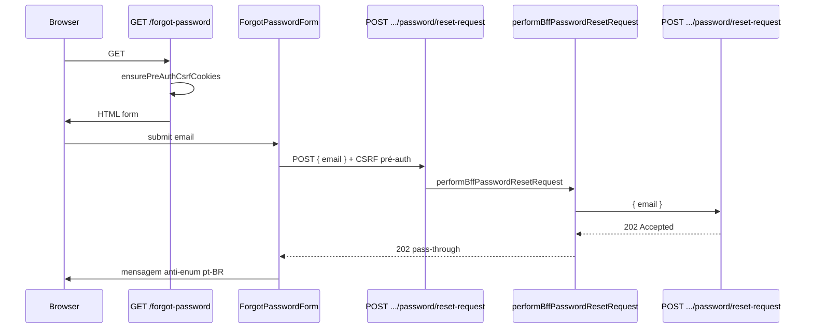
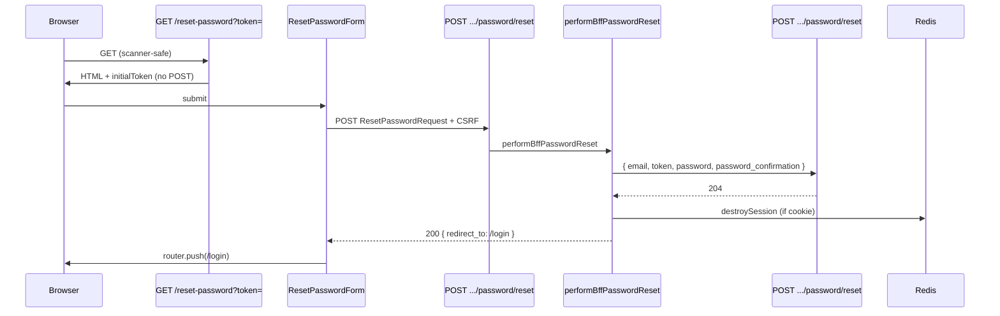
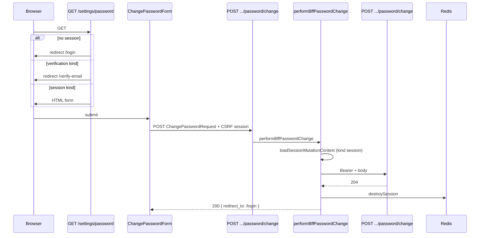

# BFF Auth — Senha — Design

**Spec:** `.specs/features/bff-auth/password/spec.md`  
**Status:** Approved — 2026-08-18  
**Pré-requisitos de runtime:** [session-core](../session-core/spec.md) (Verified), [csrf-proxy](../csrf-proxy/spec.md) (Verified), [login](../login/spec.md) (Verified), [register](../register/spec.md) (Verified), [email-verification](../email-verification/spec.md) (Verified)

---

## Abordagens consideradas

### 1. Orquestração dos handlers de senha

| Abordagem | Prós | Contras | Veredicto |
| --- | --- | --- | --- |
| **A — Três serviços (`performBffPasswordResetRequest`, `performBffPasswordReset`, `performBffPasswordChange`) + helper compartilhado para change** | Testável; reset-request não destrói sessão; reset/change compartilham pós-sucesso destroy | Três arquivos de serviço | **Recomendada** |
| B — Serviço único `performBffPassword(action)` | Um arquivo | Branching forgot/reset/change; testes menos focados | Rejeitada |
| C — `callAllowlistedUpstream` + pós-processar | Menos código | Não traduz `204`→`200`; não destroy session; risco de repasse Bearer | Rejeitada |

### 2. Tradução de sucesso reset/change (`204` upstream)

| Abordagem | Prós | Contras | Veredicto |
| --- | --- | --- | --- |
| **A — BFF responde `200` JSON com `redirect_to` + `message`** | Paridade verify-email; UI consistente | Status diferente do upstream | **Recomendada** (SPEC) |
| B — Repassar `204` sem body | Paridade HTTP upstream | UI sem payload de sucesso | Rejeitada |
| C — Redirect `302` do Route Handler | Sem JSON | Mistura redirect com mutation POST | Rejeitada |

### 3. Reset-request (anti-enumeração)

| Abordagem | Prós | Contras | Veredicto |
| --- | --- | --- | --- |
| **A — Pass-through estrito de `202` + envelope `Accepted`** | Paridade AUTH-26; UI mostra mesma copy sempre | Nenhum | **Recomendada** |
| B — BFF normaliza corpo para mensagem pt-BR custom | Copy controlada no BFF | Quebra paridade anti-enum se divergir | Rejeitada |

### 4. Loader de sessão para change vs reset destroy opcional

| Abordagem | Prós | Contras | Veredicto |
| --- | --- | --- | --- |
| **A — `loadSessionMutationContext` (kind `session`) para change; reset lê cookie opcionalmente após `204`** | Change exige sessão; reset público mas destroy best-effort se cookie existir | Duas estratégias explícitas | **Recomendada** |
| B — `requireSession: true` no reset | Simplifica destroy | Bloqueia reset sem cookie BFF (link de e-mail em outro dispositivo) | Rejeitada |

### 5. Erros de validação `422` com `FieldError`

| Abordagem | Prós | Contras | Veredicto |
| --- | --- | --- | --- |
| **A — Helper `applyServerFieldErrors` + `messageForFieldError(code)`** | Mapeia `PASSWORD_REUSED` e token inválido para pt-BR; reutilizável nos 3 forms | Novo helper pequeno | **Recomendada** |
| B — Repassar message API em inglês | Menos código | Viola product UI pt-BR | Rejeitada |

**Decisão:** A em todos os eixos.

---

## Architecture Overview

Três fluxos públicos/autenticados paralelos:

1. **Forgot** — pré-auth CSRF → upstream `202` → pass-through sem side effects na sessão BFF.
2. **Reset** — pré-auth CSRF → upstream `204` → destroy session opcional + clear cookie → `200` sanitizado → redirect `/login`.
3. **Change** — CSRF session-mode + kind `session` → upstream `204` → destroy session obrigatória + clear cookie → `200` sanitizado → redirect `/login`.

Diferenças em relação a login/register: reset/change traduzem `204`→`200` (como verify); reset **não** exige sessão no guard mas **pode** destroy cookie existente; change exige `kind: session` (como inverse de verify que exige `verification`).







### Fluxo de erro (reset/change)

1. Guard falha → `403 Forbidden` (sem fetch).
2. Body JSON inválido → `400` pt-BR (sem fetch).
3. Change: `kind !== session` → `403` (sem fetch).
4. Upstream `401 INVALID_CREDENTIALS` (change) → repasse; sessão intacta.
5. Upstream `422` → repasse `errors` com `FieldError`; sessão intacta; token não consumido.
6. Upstream `429` → repasse + `Retry-After`.
7. Upstream `5xx`/timeout → genérico pt-BR / `504`.

Em **nenhum** caminho de erro reset/change SHALL `destroySession` ou `clearSessionCookie`.

---

## Code Reuse Analysis

### Existing Components to Leverage

| Component | Location | How to Use |
| --- | --- | --- |
| Login/register service pattern | `bff-login.ts`, `bff-register.ts` | Guards pré-auth, forward 4xx, fetch dedicado |
| Verify destroy pattern | `bff-verify-email.ts` | `204`→`200`, destroy + clear cookie em sucesso |
| Session mutation loader | `bff-email-verification-shared.ts` | Modelo para `loadSessionMutationContext` (kind `session`) |
| `passwordSchema` | `schemas/password-schema.ts` | Reset + change forms |
| `emailSchema` | `modules/shared/schemas/email.ts` | Forgot + reset email field |
| Mutation guard | `bff/mutation-guard.ts` | `assertMutationGuard` pré-auth e session-mode |
| Allowlist | `bff/allowlist.ts` | Três novas entradas |
| Private responses | `bff/private-response.ts` | `jsonWithPrivateCache`, `forbiddenResponse` |
| Session facade | `services/bff-session.ts` | `getSession`, `destroySession`, `clearSessionCookie`, `getSessionFromRequest` |
| Auth messages | `lib/auth-messages.ts` | Estender; `formatRetryAfter` |
| Verification guard | `lib/verification-guard.ts` | Expandir `VERIFICATION_ALLOWED_PATHS` |
| Form defaults | `shared/lib/form-defaults.ts` | `shouldBlockSubmit`, `focusFirstError` |
| UI primitives | `shared/components/ui/*` | Button, Input, Label, FormField |
| Client cookie | `lib/client-cookie.ts` | `readClientCookie('__Host-fl_csrf')` |
| Login/forgot link | `login-form.tsx` | Já aponta `/forgot-password` |
| Register 422 handling | `register-form.tsx` | Base para `applyServerFieldErrors` (adaptar `FieldError[]`) |
| Verify form token strip | `verify-email-form.tsx` | `replaceState` pattern para reset |
| Pre-auth CSRF pages | `app/login/page.tsx`, `app/register/page.tsx` | `ensurePreAuthCsrfCookies` |
| Route handler tests | `app/api/bff/auth/login/route.test.ts` | Request sintético + mocks |
| Foundation gates | `foundation-gates.test.ts` | Atualizar allowlist prod password |

### Integration Points

| System | Integration Method |
| --- | --- |
| Laravel Auth API | `POST /auth/password/reset-request` (público); `POST /auth/password/reset` (público); `POST /auth/password/change` (Bearer `session`) |
| Redis (session-core) | Reset/change sucesso: `destroySession` + `clearSessionCookie`; forgot: sem alteração |
| CSRF (csrf-proxy) | Forgot/reset: pré-auth; change: session-bound CSRF do login anterior |
| Allowlist | `AUTH_BFF_ALLOWLIST` +3 entradas |
| Verification guard | `/forgot-password`, `/reset-password` na allowlist de paths restritos |
| `session-shell` (futuro) | Link para `/settings/password` a partir do perfil |

---

## Components

### Allowlist entries

- **Location:** `frontend/modules/auth/bff/allowlist.ts`

```typescript
export const PASSWORD_RESET_REQUEST_ALLOWLIST_ENTRY: AllowlistEntry = {
  method: 'POST',
  bffPath: '/api/bff/auth/password/reset-request',
  upstreamMethod: 'POST',
  upstreamPath: '/auth/password/reset-request',
  requireSession: false,
  requireCsrf: true,
};

export const PASSWORD_RESET_ALLOWLIST_ENTRY: AllowlistEntry = {
  method: 'POST',
  bffPath: '/api/bff/auth/password/reset',
  upstreamMethod: 'POST',
  upstreamPath: '/auth/password/reset',
  requireSession: false,
  requireCsrf: true,
};

export const PASSWORD_CHANGE_ALLOWLIST_ENTRY: AllowlistEntry = {
  method: 'POST',
  bffPath: '/api/bff/auth/password/change',
  upstreamMethod: 'POST',
  upstreamPath: '/auth/password/change',
  requireSession: true,
  requireCsrf: true,
};
```

### `forgot-password-schema.ts`

```typescript
export const forgotPasswordSchema = z.object({
  email: emailSchema.transform((value) => value.toLowerCase()),
});
```

### `reset-password-schema.ts`

```typescript
export const resetPasswordSchema = z
  .object({
    email: emailSchema.transform((v) => v.toLowerCase()),
    token: z.string().min(1, 'Informe o código de recuperação.'),
    password: passwordSchema,
    password_confirmation: z.string(),
  })
  .refine((data) => data.password === data.password_confirmation, {
    message: 'As senhas não coincidem.',
    path: ['password_confirmation'],
  });
```

**Nota:** Sem `.trim()` em `token`.

### `change-password-schema.ts`

```typescript
export const changePasswordSchema = z
  .object({
    current_password: z
      .string()
      .min(1, 'Informe sua senha atual.')
      .max(128, 'A senha deve ter no máximo 128 caracteres.'),
    password: passwordSchema,
    password_confirmation: z.string(),
  })
  .refine((data) => data.password === data.password_confirmation, {
    message: 'As senhas não coincidem.',
    path: ['password_confirmation'],
  });
```

### `validation-errors.ts` (novo helper)

- **Purpose:** Mapear `FieldError` da API para mensagens pt-BR e aplicar em RHF via `setError`.
- **Location:** `frontend/modules/auth/lib/validation-errors.ts`

```typescript
export type FieldErrorItem = { code?: string; message?: string } | string;

export function messageForFieldError(code: string | undefined): string | null {
  switch (code) {
    case 'PASSWORD_REUSED':
      return 'A nova senha deve ser diferente da senha atual.';
    default:
      return null;
  }
}

/** Token field: uniform message for any server token validation failure. */
export function messageForTokenFieldError(field: 'token'): string {
  return field === 'token'
    ? 'Link de redefinição inválido ou expirado.'
    : 'Verifique o campo informado.';
}

export function applyServerFieldErrors<TField extends string>(
  errors: Record<string, FieldErrorItem[] | FieldErrorItem | string[] | string> | undefined,
  allowedFields: readonly TField[],
  setError: (field: TField, error: { type: string; message: string }) => void,
): boolean;
```

- **Regras:** Para campo `token`, sempre mensagem uniforme pt-BR (não ecoar message API em inglês). Para `password` com `code=PASSWORD_REUSED`, usar `messageForFieldError`. Demais campos: usar `message` do item se string; se objeto, `messageForFieldError(code) ?? message`.

### `bff-password-shared.ts`

- **Purpose:** Loader de mutation autenticada com `kind: 'session'` (espelho invertido de verification).
- **Location:** `frontend/modules/auth/services/bff-password-shared.ts`

```typescript
export async function loadSessionMutationContext(
  request: Request,
  entry: AllowlistEntry,
  deps?: BffSessionDependencies,
): Promise<
  | { ok: true; ctx: { sessionId: string; bearerPlaintext: string; kind: 'session' } }
  | { ok: false; response: NextResponse }
>;
```

- **Algoritmo:** Igual `loadVerificationMutationContext`, mas rejeita `kind !== 'session'`.

### `performBffPasswordResetRequest`

- **Location:** `frontend/modules/auth/services/bff-password-reset-request.ts`
- **Algoritmo:**
  1. `assertMutationGuard` pré-auth (`requireSession: false`).
  2. Parse `{ email }` ou `400`.
  3. `fetch` upstream com body `{ email }` only.
  4. Repassar `202`/`422`/`429`/5xx com headers privados.
  5. **Nunca** `getSession` / `destroySession`.

### `performBffPasswordReset`

- **Location:** `frontend/modules/auth/services/bff-password-reset.ts`
- **Algoritmo (happy path):**
  1. `assertMutationGuard` pré-auth.
  2. Parse `ResetPasswordRequest` ou `400`.
  3. `fetch` upstream sem Bearer.
  4. Se status !== `204` → forward error; **não** destroy.
  5. `getSession(cookie)` — se `context`, `destroySession(sessionId)` best-effort.
  6. `200` `{ data: { redirect_to: '/login', message: 'Senha redefinida. Faça login para continuar.' } }` + `clearSessionCookie`.

Constantes de sucesso (espelhar verify):

```typescript
const RESET_SUCCESS_MESSAGE = 'Senha redefinida. Faça login para continuar.';
const RESET_SUCCESS_REDIRECT = '/login' as const;
```

### `performBffPasswordChange`

- **Location:** `frontend/modules/auth/services/bff-password-change.ts`
- **Algoritmo:** `loadSessionMutationContext` → parse body → `fetch` com Bearer → se `204` → destroy + clear + `200` com message pt-BR de change.

### Client forms

| Component | BFF endpoint | CSRF mode | Sucesso |
| --- | --- | --- | --- |
| `ForgotPasswordForm` | `reset-request` | pré-auth | Estado `success` com copy anti-enum; **sem** redirect |
| `ResetPasswordForm` | `reset` | pré-auth | `router.push(redirect_to)` |
| `ChangePasswordForm` | `change` | session | `router.push(redirect_to)` |

**Forgot anti-enum copy (constante UI):**

```typescript
export const FORGOT_PASSWORD_SUCCESS_MESSAGE =
  'Se o e-mail estiver cadastrado, você receberá instruções para redefinir sua senha.';
```

**ResetPasswordForm:** props `{ initialToken?: string }`; `useEffect` strip query (copiar verify-email-form).

### Pages (RSC)

| Page | Bootstrap | Guards |
| --- | --- | --- |
| `app/forgot-password/page.tsx` | `ensurePreAuthCsrfCookies` | Público; sem redirect por sessão |
| `app/reset-password/page.tsx` | `ensurePreAuthCsrfCookies` | Público; `initialToken` de `searchParams.token` |
| `app/settings/password/page.tsx` | Nenhum pré-auth | `null` → `/login`; `verification` → `/verify-email`; `session` → render |

### `verification-guard.ts` (modify)

```typescript
export const VERIFICATION_ALLOWED_PATHS = [
  '/verify-email',
  '/login',
  '/terms',
  '/forgot-password',
  '/reset-password',
] as const;
```

Atualizar testes de matriz: `verification` + `/forgot-password` → `allow`.

### Route Handlers

- `app/api/bff/auth/password/reset-request/route.ts` → `performBffPasswordResetRequest`
- `app/api/bff/auth/password/reset/route.ts` → `performBffPasswordReset`
- `app/api/bff/auth/password/change/route.ts` → `performBffPasswordChange`

---

## Data Models

### BFF reset/change success response

```typescript
interface BffPasswordMutationSuccessResponse {
  data: {
    redirect_to: '/login';
    message: string;
  };
}
```

### Reset-request success

Repasse direto do envelope `Accepted` upstream (`202`) — sem transformação.

### Upstream bodies (server-only)

```typescript
interface PasswordResetRequestBody {
  email: string;
}

interface ResetPasswordRequestBody {
  email: string;
  token: string;
  password: string;
  password_confirmation: string;
}

interface ChangePasswordRequestBody {
  current_password: string;
  password: string;
  password_confirmation: string;
}
```

---

## Error Handling Strategy

| Error Scenario | Handling | User Impact |
| --- | --- | --- |
| Origin/CSRF inválido | `403 Forbidden` | Genérico |
| Change: kind ≠ `session` | `403 Forbidden` | Genérico |
| Body JSON inválido | `400` pt-BR | "Requisição inválida." |
| Change: senha atual incorreta | Repasse `401 INVALID_CREDENTIALS` | Erro em `current_password` |
| Token reset inválido | Repasse `422` campo `token` | Link inválido/expirado (uniforme) |
| Senha reutilizada | Repasse `422` + `PASSWORD_REUSED` | Erro em `password` pt-BR |
| Validação composição senha | Client Zod ou repasse `422` | Erros de campo pt-BR |
| Rate limit | Repasse `429` + `Retry-After` | Throttle message |
| Upstream timeout | `504` | Retry |
| Reset/change sucesso + Redis destroy fail | Clear cookie + `200` | Sucesso; órfão expira por TTL |
| Forgot qualquer `202` | Pass-through | Mesma mensagem anti-enum |

---

## Risks & Concerns

| Concern | Location | Impact | Mitigation |
| --- | --- | --- | --- |
| `FieldError` objeto vs string em `422` | `register-form.tsx` assume `string[]` | PASSWORD_REUSED não mapeia | Novo `validation-errors.ts` + testes |
| Foundation gate bloqueia password | `foundation-gates.test.ts:36` | CI falha ao adicionar rotas | Task final atualiza gate explicitamente |
| Destroy session em erro reset | Implementação incorreta | Usuário perde sessão sem reset | Testes: 422/401 **não** chamam destroy |
| Reset com sessão `verification` ativa | Edge case pós-forgot | Sessão obsoleta após reset | destroy best-effort em qualquer kind |
| `callAllowlistedUpstream` repassa Bearer | `bff/upstream.ts` | Vazamento | Serviços usam fetch dedicado |
| Token em prop RSC / query | `reset-password/page.tsx` | Referrer/histórico | `replaceState` no client; testes sentinel |
| Change acessível sem shell nav | `/settings/password` órfão | UX incompleta até session-shell | Aceitável MVP; session-shell linkará depois |

---

## Tech Decisions

| Decision | Choice | Rationale |
| --- | --- | --- |
| Serviços | Três `performBff*` + `bff-password-shared` | Separação forgot vs destroy-session flows |
| Reset-request | Pass-through `202` | Anti-enumeração depende de paridade API |
| Reset/change success | `204`→`200` JSON | Paridade verify-email |
| Reset session | Opcional destroy pós-`204` | Público mas BFFUI-63 se cookie existir |
| Change session | `loadSessionMutationContext` kind `session` | Paridade inversa verification loader |
| Validation errors | `validation-errors.ts` helper | `FieldError` com `code` PASSWORD_REUSED |
| Schemas | Três arquivos Zod | Atomicidade; reutiliza `passwordSchema` |
| Verification paths | +`/forgot-password`, `/reset-password` | Recovery durante conta restrita |
| Forgot UI pós-202 | In-place success state | Não há `redirect_to`; anti-enum |

> **Project-level decisions:** Nenhuma nova AD — conforma AD-017 (`/api/bff/...`) e AD-013 (módulos frontend).
