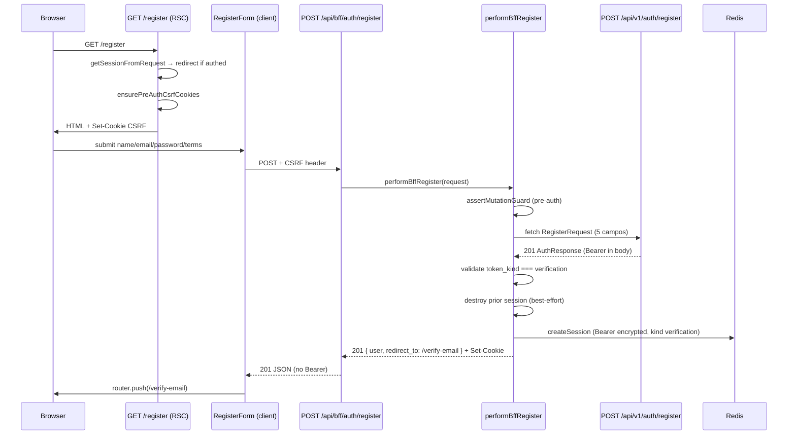

# BFF Auth — Cadastro — Design

**Spec:** `.specs/features/bff-auth/register/spec.md`  
**Status:** Verified — 2026-08-11  
**Pré-requisitos de runtime:** [session-core](../session-core/spec.md) (Verified), [csrf-proxy](../csrf-proxy/spec.md) (Verified), [login](../login/spec.md) (Verified)

---

## Abordagens consideradas

### 1. Orquestração do handler de cadastro

| Abordagem | Prós | Contras | Veredicto |
| --- | --- | --- | --- |
| **A — Serviço `performBffRegister` + Route Handler fino** | Testável sem Next; strip Bearer isolado; paridade login | Um arquivo a mais | **Recomendada** |
| B — Toda lógica inline em `route.ts` | Menos arquivos | Matriz upstream difícil de testar; risco de pass-through Bearer | Rejeitada |
| C — Reutilizar `callAllowlistedUpstream` + pós-processar body | Menos código | Helper repassa body upstream **com Bearer** em sucesso — exigiria fork perigoso | Rejeitada |

### 2. Política de senha no client

| Abordagem | Prós | Contras | Veredicto |
| --- | --- | --- | --- |
| **A — `password-schema.ts` compartilhado + `register-schema.ts` compõe** | Reutilizável na fatia password; uma fonte de verdade para composição ASCII | Dois arquivos | **Recomendada** |
| B — Regras inline só em `register-schema.ts` | Um arquivo | Duplicação futura em reset/change password | Rejeitada |
| C — Validar senha só no server | Menos Zod | UX ruim; viola spec RGR-08 | Rejeitada |

### 3. Aceite de Terms na UI

| Abordagem | Prós | Contras | Veredicto |
| --- | --- | --- | --- |
| **A — Checkbox nativo + link `/terms` (nova aba) + versão via env pública** | Sem Radix (AD-015); auditável; alinhado backend `AUTH_TERMS_CURRENT_VERSION` | Env extra no frontend | **Recomendada** |
| B — Modal inline com texto legal completo | Sem navegação | Conteúdo jurídico fora do escopo; página `/terms` exigida pela spec | Rejeitada |
| C — Enviar `terms_version` no body BFF | Explícito no wire | Spec proíbe — API persiste versão server-side | Rejeitada |

**Decisão:** A nos três eixos.

---

## Architecture Overview

Cadastro segue o mesmo modelo server-first do login: página RSC bootstrap CSRF → Client Form POST BFF → serviço server-only chama Laravel → sessão Redis cifrada (`verification`) → resposta sanitizada → redirect fixo `/verify-email`.

Diferenças em relação ao login: upstream retorna **201** (não 200); sessão **sempre** `verification`; **sem** `returnUrl`; body upstream inclui `name`, `password_confirmation`, `accept_terms`; anti-enumeração via `REGISTRATION_NOT_ALLOWED`.



### Fluxo de erro (4xx upstream)

1. Guard falha → `403 Forbidden` (sem fetch).
2. Body JSON inválido local → `400` (sem fetch).
3. Upstream `403 REGISTRATION_NOT_ALLOWED` → repasse status + body uniforme (sem cookie).
4. Upstream `422` → repasse `errors` (sem cookie).
5. Upstream `429` → repasse + `Retry-After` (sem cookie).
6. Upstream `500/503` → mensagem genérica pt-BR.
7. Timeout/abort → `504` pt-BR.

Em **nenhum** caminho de erro SHALL emitir cookie `__Host-fl_session` válido.

---

## Code Reuse Analysis

### Existing Components to Leverage

| Component | Location | How to Use |
| --- | --- | --- |
| Login service pattern | `modules/auth/services/bff-login.ts` | Espelhar estrutura `performBffRegister`, guards, forward 4xx, destroy-before-create |
| Mutation guard | `modules/auth/bff/mutation-guard.ts` | `assertMutationGuard` com `requireSession: false` |
| Allowlist lookup | `modules/auth/bff/allowlist.ts` | Adicionar `REGISTER_ALLOWLIST_ENTRY` |
| Upstream URL builder | `modules/auth/bff/allowlist.ts` | `buildUpstreamUrl(REGISTER_ENTRY)` — fetch manual |
| Private responses | `modules/auth/bff/private-response.ts` | `jsonWithPrivateCache`, `forbiddenResponse` |
| CSRF issue/validate | `modules/auth/bff/csrf.ts` | `ensurePreAuthCsrfCookies`, `issueCsrfForSession` |
| Session facade | `modules/auth/services/bff-session.ts` | `createSession`, `getSession`, `destroySession`, `getSessionFromRequest` |
| Auth API types | `modules/auth/lib/auth-api-types.ts` | `parseUpstreamAuthResponse`, `toPublicUser`, `mapTokenKindToSessionKind` |
| Auth messages | `modules/auth/lib/auth-messages.ts` | Estender com `REGISTRATION_NOT_ALLOWED` |
| Email Zod | `modules/shared/schemas/email.ts` | Reutilizar em `register-schema.ts` |
| Form defaults | `modules/shared/lib/form-defaults.ts` | `shouldBlockSubmit`, `focusFirstError` |
| UI primitives | `modules/shared/components/ui/*` | Button, Input, Label, FormField |
| Client cookie reader | `modules/auth/lib/client-cookie.ts` | `readClientCookie('__Host-fl_csrf')` |
| Login form tests | `modules/auth/components/login-form.test.tsx` | Padrão RTL + MSW |
| Login route tests | `app/api/bff/auth/login/route.test.ts` | Padrão Request sintético + env stub |
| Auth fixtures | `modules/auth/lib/test/auth-fixtures.ts` | `buildUpstreamAuthPayload`, `FIXTURE_BEARER` |
| Login page | `app/login/page.tsx` | Paridade redirect autenticado + CSRF bootstrap |

### Integration Points

| System | Integration Method |
| --- | --- |
| Laravel Auth API | `fetch(LARAVEL_INTERNAL_URL + '/auth/register')` com JSON `RegisterRequest` |
| Redis (session-core) | `createSession({ kind: 'verification' })` / `destroySession` best-effort |
| CSRF (csrf-proxy) | Pre-auth no GET `/register`; session-bound pós-register |
| Allowlist | `AUTH_BFF_ALLOWLIST` ganha entrada register (além de login) |
| Terms version | `NEXT_PUBLIC_AUTH_TERMS_CURRENT_VERSION` (default `2026-01`) — exibição UI only |
| Fatia `email-verification` | Redirect `/verify-email` (página pode ser placeholder até fatia 6) |

---

## Components

### `REGISTER_ALLOWLIST_ENTRY` + allowlist update

- **Purpose:** Entrada estática allowlisted para cadastro.
- **Location:** `frontend/modules/auth/bff/allowlist.ts`
- **Interfaces:**

```typescript
export const REGISTER_ALLOWLIST_ENTRY: AllowlistEntry = {
  method: 'POST',
  bffPath: '/api/bff/auth/register',
  upstreamMethod: 'POST',
  upstreamPath: '/auth/register',
  requireSession: false,
  requireCsrf: true,
};
```

- **Dependencies:** `AllowlistEntry` type
- **Reuses:** Padrão `LOGIN_ALLOWLIST_ENTRY`

### `password-schema.ts`

- **Purpose:** Validação Zod reutilizável da política `Password` OpenAPI (12–128, composição ASCII).
- **Location:** `frontend/modules/auth/schemas/password-schema.ts`
- **Interfaces:**
  - `passwordSchema: z.ZodString`
  - `PASSWORD_MIN_LENGTH = 12`, `PASSWORD_MAX_LENGTH = 128`
- **Dependencies:** `zod`
- **Reuses:** Descrição OpenAPI `Password` (`docs/openapi.yaml`)

```typescript
const ASCII_SYMBOL = /[!-/:-@[-`{-~]/;

export const passwordSchema = z
  .string()
  .min(12, 'A senha deve ter pelo menos 12 caracteres.')
  .max(128, 'A senha deve ter no máximo 128 caracteres.')
  .regex(/[a-z]/, 'A senha deve conter uma letra minúscula.')
  .regex(/[A-Z]/, 'A senha deve conter uma letra maiúscula.')
  .regex(/[0-9]/, 'A senha deve conter um dígito.')
  .regex(ASCII_SYMBOL, 'A senha deve conter um símbolo.');
```

### `register-schema.ts`

- **Purpose:** Validação client Zod espelhando `RegisterRequest` OpenAPI.
- **Location:** `frontend/modules/auth/schemas/register-schema.ts`
- **Interfaces:**
  - `registerSchema: z.ZodObject<{ name, email, password, password_confirmation, accept_terms }>`
  - `RegisterFormValues = z.infer<typeof registerSchema>`
- **Dependencies:** `emailSchema`, `passwordSchema`
- **Reuses:** `modules/shared/schemas/email.ts`, `password-schema.ts`

```typescript
export const registerSchema = z
  .object({
    name: z
      .string()
      .trim()
      .min(1, 'Informe seu nome.')
      .max(120, 'O nome deve ter no máximo 120 caracteres.'),
    email: emailSchema.transform((v) => v.toLowerCase()),
    password: passwordSchema,
    password_confirmation: z.string(),
    accept_terms: z.literal(true, {
      errorMap: () => ({ message: 'Você precisa aceitar os Termos de uso.' }),
    }),
  })
  .refine((data) => data.password === data.password_confirmation, {
    message: 'As senhas não coincidem.',
    path: ['password_confirmation'],
  });
```

### `auth-terms.ts`

- **Purpose:** Fonte única da versão exibida dos Terms no browser.
- **Location:** `frontend/modules/auth/lib/auth-terms.ts`
- **Interfaces:**
  - `getAuthTermsCurrentVersion(): string` — lê `process.env.NEXT_PUBLIC_AUTH_TERMS_CURRENT_VERSION ?? '2026-01'`
- **Dependencies:** none
- **Reuses:** Alinhamento com `AUTH_TERMS_CURRENT_VERSION` backend

### `auth-messages.ts` (extensão)

- **Purpose:** Mapa pt-BR incluindo anti-enumeração de cadastro.
- **Location:** `frontend/modules/auth/lib/auth-messages.ts` (modify)
- **Interfaces:** adicionar case `REGISTRATION_NOT_ALLOWED`
- **Dependencies:** none
- **Reuses:** Mapa existente login

| `code` / status | Mensagem UI (pt-BR) |
| --- | --- |
| `REGISTRATION_NOT_ALLOWED` | Não foi possível concluir o cadastro. Verifique seus dados ou entre em contato com o suporte. |
| (demais) | Mantém mapeamento login existente |

> Mensagem **idêntica** para convite inválido e e-mail duplicado (RGR-04, RGR-05).

### `bff-register.ts` (serviço)

- **Purpose:** Orquestrar cadastro BFF end-to-end (guard → upstream → sessão verification → resposta sanitizada).
- **Location:** `frontend/modules/auth/services/bff-register.ts`
- **Interfaces:**

```typescript
export type BffRegisterSuccess = {
  user: BffPublicUser;
  redirectTo: '/verify-email';
  sessionId: string;
};

export type BffRegisterResult =
  | { ok: true; response: NextResponse; success: BffRegisterSuccess }
  | { ok: false; response: NextResponse };

export async function performBffRegister(
  request: Request,
  deps?: BffRegisterDependencies,
): Promise<BffRegisterResult>;
```

- **Dependencies:** bff guards, bff-session, auth-api-types, csrf
- **Reuses:** Estrutura `performBffLogin`

**Algoritmo (happy path):**

1. `lookupAllowlistEntry('POST', '/api/bff/auth/register')` — 403 se ausente.
2. `assertMutationGuard(request, REGISTER_ENTRY)` — retorna `guard.response` se falha.
3. `parseRegisterBody(await request.text())` — extrai e valida shape mínima ou 400.
4. Montar upstream body **estrito**: `{ name, email, password, password_confirmation, accept_terms }` — descartar campos extras.
5. `fetch(buildUpstreamUrl(REGISTER_ENTRY), { …, signal: AbortSignal.timeout(10_000) })`.
6. Se status ≠ **201** → repasse 4xx ou genérico 5xx/504 (mesma lógica login).
7. Parse JSON → `parseUpstreamAuthResponse` — null → 500 sem cookie.
8. Validar `token_kind === 'verification'` — senão 500 sem cookie.
9. Validar `user.status === 'pending_verification'` (assert testável; não bloqueia se parser já confia upstream).
10. `prior = await getSession(...)` — se existir, `destroySession` best-effort.
11. `createSession({ bearer, kind: 'verification', userId })`.
12. Montar `NextResponse.json({ data: { user, redirect_to: '/verify-email' } }, { status: 201 })` + `applySessionCookie` + `issueCsrfForSession`.

**Rollback pós-201:** Se `createSession` falhar após upstream 201, responder 500 genérico; `destroySession` best-effort se write parcial.

### `register-form.tsx` (client)

- **Purpose:** Formulário RHF+Zod; POST BFF; Terms checkbox; erros pt-BR.
- **Location:** `frontend/modules/auth/components/register-form.tsx`
- **Interfaces:** Props `{ termsVersion: string }`
- **Dependencies:** register-schema, auth-messages, auth-terms (via prop), shared UI, `useRouter`
- **Reuses:** Padrão `login-form.tsx`

**Submit contract:**

```typescript
await fetch('/api/bff/auth/register', {
  method: 'POST',
  credentials: 'include',
  headers: {
    'Content-Type': 'application/json',
    'X-CSRF-Token': readClientCookie('__Host-fl_csrf'),
  },
  body: JSON.stringify({
    name,
    email,
    password,
    password_confirmation,
    accept_terms: true,
  }),
});
```

**Terms checkbox:** `<input type="checkbox">` nativo com `Label`/`FormField` (sem componente Checkbox Radix — AD-015).

**Server-side field errors:** mapear `errors` do body 422 para `setError` RHF por campo.

### `app/register/page.tsx` (RSC)

- **Purpose:** Shell server-first; redirect se autenticado; bootstrap CSRF; renderiza `RegisterForm`.
- **Location:** `frontend/app/register/page.tsx`
- **Dependencies:** `cookies()`, `redirect()`, `getSessionFromRequest`, `ensurePreAuthCsrfCookies`, `getAuthTermsCurrentVersion`
- **Reuses:** Paridade `app/login/page.tsx`

**Redirect rules:**

| Sessão | Ação |
| --- | --- |
| `kind: session` | `redirect('/')` |
| `kind: verification` | `redirect('/verify-email')` |
| null | render register + CSRF bootstrap |

### `app/terms/page.tsx` (RSC estática)

- **Purpose:** Página mínima pt-BR com versão atual dos Terms (auditabilidade).
- **Location:** `frontend/app/terms/page.tsx`
- **Interfaces:** renderiza `getAuthTermsCurrentVersion()` + texto placeholder pt-BR
- **Dependencies:** `auth-terms.ts`
- **Reuses:** Layout root

### `app/api/bff/auth/register/route.ts`

- **Purpose:** Route Handler fino delegando a `performBffRegister`.
- **Location:** `frontend/app/api/bff/auth/register/route.ts`
- **Interfaces:** `export async function POST(request: Request): Promise<NextResponse>`
- **Dependencies:** `performBffRegister`
- **Reuses:** Padrão `app/api/bff/auth/login/route.ts`

---

## Data Models

### BFF register success response (browser)

```typescript
interface BffRegisterSuccessResponse {
  data: {
    user: {
      id: string;
      name: string;
      email: string;
      status: 'pending_verification';
      email_verified_at: null;
      terms_version: string;
      terms_accepted_at: string;
      created_at: string;
      updated_at: string;
    };
    redirect_to: '/verify-email';
  };
}
```

**Relationships:** `user` espelha OpenAPI `User`; nunca inclui campos de token.

### Upstream parse (server-only)

Reutiliza `UpstreamAuthData` de `auth-api-types.ts`. Descartado após `createSession`.

### RegisterRequest (upstream body)

```typescript
interface RegisterUpstreamBody {
  name: string;
  email: string;
  password: string;
  password_confirmation: string;
  accept_terms: true;
}
```

`terms_version` **não** é enviado pelo cliente (API persiste server-side).

---

## Error Handling Strategy

| Error Scenario | Handling | User Impact |
| --- | --- | --- |
| Origin/CSRF inválido | `403` `{ message: 'Forbidden.' }` | Genérico; sem submit upstream |
| JSON body inválido | `400` pt-BR | "Requisição inválida." |
| Upstream `403 REGISTRATION_NOT_ALLOWED` | Repasse body API | Mensagem genérica uniforme (convite/duplicata) |
| Upstream `422` | Repasse `errors` | Erros de campo; server-side preservados |
| Upstream `429` | Repasse + `Retry-After` | Throttle com tempo estimado |
| Upstream timeout | `504` genérico | Retry sugerido |
| Upstream 500/503 | Genérico pt-BR | Sem detalhe técnico |
| Parse 201 sem token | `500` sem cookie | Genérico |
| `token_kind` ≠ verification | `500` sem cookie | Genérico |
| Redis fail pós-201 | `500`; destroy best-effort | Genérico; sem sessão parcial |

---

## Risks & Concerns

| Concern | Location | Impact | Mitigation |
| --- | --- | --- | --- |
| `callAllowlistedUpstream` repassa Bearer em sucesso | `bff/upstream.ts` | Vazamento de token | Register usa fetch dedicado + `performBffRegister`; nunca pass-through em 201 |
| Foundation gate proíbe rotas register | `foundation-gates.test.ts:33` | CI falha ao adicionar register | Task T10 atualiza gate: permite register route + page; continua proibindo verify/password |
| Sem componente Checkbox shared | `shared/components/ui/` | UI inconsistente | Checkbox HTML nativo estilizado via Tailwind + Label (AD-015) |
| Env Terms não documentada no frontend | — | Versão errada na UI | `auth-terms.ts` + default `2026-01`; documentar em `.env.example` frontend se existir |
| Upstream 201 vs login 200 | `bff-login.ts:153` | Branch errado no service | Register trata **201** explicitamente; testes Vitest cobrem |
| Anti-enumeração quebrada na UI | `register-form.tsx` | Vazamento convite/duplicata | `REGISTRATION_NOT_ALLOWED` → mesma string pt-BR nos dois fixtures MSW |
| Bearer em props RSC | Qualquer serialização | Vazamento HTML | `SessionSummary` sem bearer; form nunca recebe token |

---

## Tech Decisions

| Decision | Choice | Rationale |
| --- | --- | --- |
| Serviço vs inline handler | `performBffRegister` em `services/bff-register.ts` | Paridade login; testabilidade matriz upstream |
| Redirect pós-register | Fixo `/verify-email` | Spec: sem `returnUrl`; conta sempre restrita |
| Upstream success status | **201 Created** | OpenAPI `AuthIssued` para register |
| Session kind | Sempre `verification` | Upstream emite `token_kind: verification`; rejeitar outros |
| Password validation | `password-schema.ts` compartilhado | Reutilização fatia password; paridade OpenAPI |
| Terms UI | Checkbox nativo + `/terms` RSC | AD-015 (sem Radix); auditabilidade |
| Terms version source | `NEXT_PUBLIC_AUTH_TERMS_CURRENT_VERSION` | Browser exibe; API persiste server-side |
| Allowlist constant | `REGISTER_ALLOWLIST_ENTRY` exportada | Testável; diff review claro |
| Auth messages | Estender `auth-messages.ts` | Uma fonte pt-BR; anti-enum uniforme |

> **Project-level decisions:** Nenhuma nova AD necessária — conforma AD-017 (`/api/bff/...`) e AD-013 (módulos frontend).
