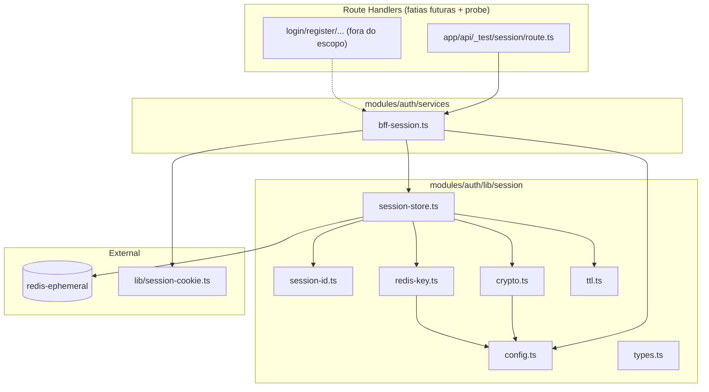

# BFF Auth — Núcleo de sessão — Design

**Spec:** `.specs/features/bff-auth/session-core/spec.md`  
**Status:** Approved — 2026-08-11 (mantenedor confirmou 2026-08-11)

---

## Abordagens consideradas

### 1. Cliente Redis no frontend

| Abordagem | Prós | Contras | Veredicto |
| --- | --- | --- | --- |
| **A — `redis` npm (node-redis v4+)** | Oficial; `createClient`; suporte TLS; mantido | Nova dependência (aprovada na spec) | **Recomendada** |
| B — `ioredis` | API familiar; cluster | Dependência extra não alinhada à spec | Rejeitada |
| C — HTTP proxy para Redis | Zero dep Redis no Node | Nova superfície de rede; viola simplicidade | Rejeitada |

### 2. Onde vive a cifra

| Abordagem | Prós | Contras | Veredicto |
| --- | --- | --- | --- |
| **A — `node:crypto` Web Crypto compat (`createCipheriv` / `createDecipheriv` AES-256-GCM)** | Zero deps; nativo Node 24 | Implementação manual de envelope | **Recomendada** |
| B — Biblioteca `@noble/ciphers` | API ergonômica | Nova dependência desnecessária | Rejeitada |
| C — Cifra no Laravel, BFF só guarda referência | Menos crypto no Next | Bearer trafegaria ou Redis guardaria handle — viola spec | Rejeitada |

### 3. Testes de persistência Redis

| Abordagem | Prós | Contras | Veredicto |
| --- | --- | --- | --- |
| **A — Mock/fake do `SessionStore` em unit tests; integração opcional via probe route** | Rápido; determinístico; sem Redis no Vitest default | Não exercita Redis real no unit gate | **Recomendada** |
| B — Redis real no container para todo `test-frontend` | Integração fiel | Flaky/slow; compose coupling | Rejeitada para unit; probe cobre wiring |
| C — `redis-memory-server` | Meio-termo | Dep extra + complexidade Docker | Rejeitada |

**Decisão:** A nos três eixos.

---

## Architecture Overview

Núcleo **server-only** em camadas: config → primitivos (id, crypto, ttl, redis-key) → store → facade → (opcional) probe HTTP. Nenhum Client Component importa módulos de sessão.



### Fluxo: `createSession`

1. Validar input (`bearer`, `kind`, `userId`).
2. `generateSessionId()` → 32 bytes → base64url (43 chars).
3. `encryptBearer(bearer)` → envelope `{ kid, nonce, ciphertext }`.
4. Montar `SessionRecord` v1 com `createdAt` = `lastActivityAt` = now.
5. `redisKey = bff:sess:` + HMAC-SHA256(hmacKey, rawId).
6. `SET key JSON EX remainingAbsoluteSeconds`.
7. Retornar `{ sessionId: cookieValue, expiresAt }`.

### Fluxo: `getSession`

1. Parse cookie header → extrair valor por `BFF_SESSION_COOKIE_NAME`.
2. `parseSessionId(cookieValue)` → null se inválido (**sem Redis**).
3. `GET redisKey` → miss → null + clear cookie instruction.
4. Validar `schemaVersion`, `kind`, timestamps (absoluto + idle).
5. `decryptBearer(envelope)` → falha → `destroySession` + null.
6. Retornar `SessionContext` com `bearer` **somente em memória**.

---

## Code Reuse Analysis

### Existing Components to Leverage

| Component | Location | How to Use |
| --- | --- | --- |
| Session cookie helper | `frontend/lib/session-cookie.ts` | `setSessionCookie`, `buildSessionCookieOptions` para emitir/limpar cookie |
| Session cookie tests | `frontend/lib/session-cookie.test.ts` | Regressão; estender se `__Host-` prefix test needed |
| Module scaffold `auth` | `frontend/modules/auth/index.ts` | Exportar facade/types server-only |
| Vitest + `@/` alias | `frontend/vitest.config.ts` | Co-located `*.test.ts`; coverage ≥75% em `modules/**` |
| Health route test pattern | `frontend/app/health/route.test.ts` | Modelo para probe route tests |
| Foundation gates | `frontend/modules/shared/lib/foundation-gates.test.ts` | Atualizar allowlist: `health` + `api/_test/session` only |
| Makefile | `Makefile` | `make lint-frontend`, `make test-frontend`, `make test-frontend-coverage` |
| Docker frontend service | `docker-compose.yml` | Injetar env BFF + REDIS_* |
| `.env.example` raiz | `.env.example` | Documentar chaves dev + nota rotação |

### Integration Points

| System | Integration Method |
| --- | --- |
| `redis-ephemeral` | `redis` client `createClient({ url })` lazy singleton; host `REDIS_HOST:REDIS_PORT` |
| Next Route Handlers | Import dinâmico de `bff-session` (server-only); probe gated por env |
| Fatias csrf-proxy / login | Consomem `createSession`, `getSession`, `rotateSession`, `destroySession` |
| API Auth Laravel | **Não** chamada nesta fatia; Bearer armazenado para uso futuro |

---

## Components

### `loadBffSessionConfig`

- **Purpose:** Carregar e validar env vars; fail-fast se chaves ausentes/malformadas.
- **Location:** `frontend/modules/auth/lib/session/config.ts`
- **Interfaces:**
  - `loadBffSessionConfig(): BffSessionConfig` — parse base64 keys, validate lengths (AES 32 bytes, HMAC ≥32)
  - `BffSessionConfig`: `{ aesKey, hmacKey, aesKeyId, cookieName, redisUrl, probeEnabled }`
- **Dependencies:** `process.env`
- **Reuses:** padrão fail-fast de quality gates

### `session-id`

- **Purpose:** Gerar e validar IDs opacos 256-bit.
- **Location:** `frontend/modules/auth/lib/session/session-id.ts`
- **Interfaces:**
  - `generateSessionId(): string` — base64url 43 chars
  - `parseSessionId(value: string): Uint8Array | null` — rejeita charset/comprimento inválidos
- **Dependencies:** `node:crypto` `randomBytes`
- **Reuses:** none

### `crypto`

- **Purpose:** Envelope AES-256-GCM versionado para Bearer.
- **Location:** `frontend/modules/auth/lib/session/crypto.ts`
- **Interfaces:**
  - `encryptBearer(plaintext: string, config): SessionEnvelope`
  - `decryptBearer(envelope, config): string` — throws `SessionDecryptError` on failure
  - `SessionEnvelope`: `{ kid, nonce, ciphertext }` (ciphertext includes GCM tag)
- **Dependencies:** `node:crypto`; config aesKey + aesKeyId
- **Reuses:** none

### `redis-key`

- **Purpose:** Derivar chave Redis não pesquisável por ID bruto.
- **Location:** `frontend/modules/auth/lib/session/redis-key.ts`
- **Interfaces:**
  - `buildRedisSessionKey(sessionIdBytes: Uint8Array, hmacKey: Buffer): string` → `bff:sess:{hex}`
- **Dependencies:** `node:crypto` `createHmac`
- **Reuses:** none

### `ttl`

- **Purpose:** Constantes e helpers de expiração absoluta/idle/throttle.
- **Location:** `frontend/modules/auth/lib/session/ttl.ts`
- **Interfaces:**
  - `ABSOLUTE_TTL_SECONDS`, `IDLE_TTL_SECONDS` por `SessionKind`
  - `TOUCH_THROTTLE_SECONDS = 900`
  - `isAbsoluteExpired(record, now): boolean`
  - `isIdleExpired(record, now): boolean`
  - `remainingAbsoluteSeconds(record, now): number`
  - `shouldTouch(lastActivityAt, now): boolean`
- **Dependencies:** `SessionRecord`, `SessionKind`
- **Reuses:** paridade `auth/bearer-tokens` TTLs

### `session-store`

- **Purpose:** Persistência Redis JSON v1; isolamento do client Redis.
- **Location:** `frontend/modules/auth/lib/session/session-store.ts`
- **Interfaces:**
  - `SessionStore`: `{ get(key), set(key, record, exSeconds), del(key), multi() }`
  - `createSessionStore(config): SessionStore` — lazy connect `redis` client
  - `parseSessionRecord(json: string): SessionRecord | null`
  - `serializeSessionRecord(record): string`
- **Dependencies:** `redis` package; config redisUrl
- **Reuses:** schema v1 da spec

### `bff-session` (facade)

- **Purpose:** API pública interna para fatias BFF Auth.
- **Location:** `frontend/modules/auth/services/bff-session.ts`
- **Interfaces:**
  - `createSession(input: CreateSessionInput): Promise<CreateSessionResult>`
  - `getSession(cookieHeader: string | null): Promise<GetSessionResult>` — `{ context } | { context: null, clearCookie: true }`
  - `touchSession(sessionId: string): Promise<void>`
  - `rotateSession(currentSessionId: string, input?: CreateSessionInput): Promise<CreateSessionResult>`
  - `destroySession(sessionId: string): Promise<{ clearCookie: true }>`
  - `applySessionCookie(response, sessionId, maxAge?)` / `clearSessionCookie(response)`
- **Dependencies:** store, crypto, session-id, redis-key, ttl, config, `session-cookie.ts`
- **Reuses:** `frontend/lib/session-cookie.ts`

### Probe Route Handler

- **Purpose:** Integração test/dev sem vazar Bearer.
- **Location:** `frontend/app/api/_test/session/route.ts`
- **Interfaces:**
  - `GET` → `{ authenticated: boolean, kind?: SessionKind }`
  - `POST` body `{ bearer, kind, userId }` → Set-Cookie
  - `export const dynamic = 'force-dynamic'`
  - Early return 404 se probe desabilitado
- **Dependencies:** `bff-session`
- **Reuses:** padrão `health/route.ts`

### Decrypt fail counter (observability hook)

- **Purpose:** Contador interno para SC observability; export OTel na Fase 4.
- **Location:** `frontend/modules/auth/lib/session/metrics.ts`
- **Interfaces:** `incrementDecryptFail(): void`; `getDecryptFailCount(): number` (test-only export)
- **Dependencies:** none
- **Reuses:** none

---

## Data Models

### Types (`types.ts`)

```typescript
export type SessionKind = 'session' | 'verification';

export interface SessionEnvelope {
  kid: string;
  nonce: string; // base64url, 12 bytes decoded
  ciphertext: string; // base64url, includes GCM tag
}

export interface SessionRecord {
  schemaVersion: 1;
  kind: SessionKind;
  userId: string; // UUID v7
  createdAt: string; // ISO-8601 UTC
  lastActivityAt: string; // ISO-8601 UTC
  envelope: SessionEnvelope;
}

/** Server-only — MUST NOT JSON.stringify to client */
export interface SessionContext {
  sessionId: string;
  kind: SessionKind;
  userId: string;
  bearer: string;
  createdAt: Date;
  lastActivityAt: Date;
}

export interface CreateSessionInput {
  bearer: string;
  kind: SessionKind;
  userId: string;
}

export interface CreateSessionResult {
  sessionId: string;
  expiresAt: Date;
}

export type GetSessionResult =
  | { context: SessionContext; clearCookie?: false }
  | { context: null; clearCookie: true };
```

**Relationships:** `SessionRecord` persisted in Redis; `SessionContext` exists only in server memory per request.

### TTL constants

| Kind | Absolute | Idle |
| --- | --- | --- |
| `session` | 604_800 s (7d) | 86_400 s (24h) |
| `verification` | 86_400 s (24h) | 3_600 s (1h) |

---

## Error Handling Strategy

| Error Scenario | Handling | Caller / User Impact |
| --- | --- | --- |
| Cookie ausente/malformado | `getSession` → null, no Redis | Handler trata como não autenticado |
| Redis miss / eviction | null + `clearCookie: true` | Cookie limpo na response |
| Redis connection error | Same as miss; log error sem secrets | Sessão encerrada localmente |
| GCM decrypt fail / unknown `kid` | `destroySession` + incrementDecryptFail + null | Cookie limpo |
| Absolute/idle expired | del Redis + null + clearCookie | Re-login necessário |
| Empty bearer on create | throw `ValidationError` before SET | 400 em probe; callers validate |
| Invalid env at startup | throw on first `loadBffSessionConfig()` | Container fail-fast |
| Probe disabled | HTTP 404 | Não expõe superfície |

---

## Risks & Concerns

| Concern | Location | Impact | Mitigation |
| --- | --- | --- | --- |
| Bearer leak via serialization | Nova facade | Exposição credencial no browser | Testes assert `JSON.stringify` sem bearer; `SessionContext` sem `toJSON`; probe response tipada |
| Redis client connection storm | `session-store.ts` | Latência / socket exhaustion | Singleton lazy client; reuse across requests in same Node process |
| `foundation-gates` bloqueia probe route | `foundation-gates.test.ts:26` | CI fail ao adicionar probe | Task dedicada atualiza allowlist para `health` + `api/_test/session` |
| Chaves dev fracas em `.env.example` | Compose env | Uso acidental em prod | Comentário explícito "dev only"; prod fail-fast SOPS Fase 4 |
| Import client-side acidental | `modules/auth` | Bearer no bundle | `'server-only'` package ou assert build; imports só em route handlers / server modules |
| Cookie name mismatch DOCKER-06 tests | `session-cookie.test.ts` usa `fl_session` | Regressão | Usar nome completo `__Host-fl_session` nos testes de integração da facade |

---

## Tech Decisions

| Decision | Choice | Rationale |
| --- | --- | --- |
| Redis client | `redis` npm (pinned) | Spec assumption; official client |
| Crypto | Node `node:crypto` AES-256-GCM | Zero deps; Node 24 in AD-005 |
| Redis key format | `bff:sess:` + HMAC-SHA256 hex | Spec; namespace isolation |
| Session ID encoding | base64url no cookie | URL-safe; 256-bit entropy |
| Store testing | In-memory fake implementing `SessionStore` | Deterministic unit tests |
| Server-only boundary | `import 'server-only'` top of `bff-session.ts` + store | Prevents client bundle leakage |
| Probe gating | `NODE_ENV !== 'production' \|\| BFF_SESSION_PROBE_ENABLED` | Spec SC-16 |
| Rotate semantics | DEL old key then CREATE new (sequential; not MULTI cross-key) | Old ID invalid after rotate completes |

> **Project-level:** Nenhuma decisão nova além da spec. Chaves BFF seguem `docs/security.md` §14 (finalidades separadas). Não requer novo AD-NNN.

---

## File Tree (deliverables)

```txt
frontend/
  modules/auth/
    lib/session/
      config.ts
      config.test.ts
      types.ts
      session-id.ts
      session-id.test.ts
      crypto.ts
      crypto.test.ts
      redis-key.ts
      redis-key.test.ts
      ttl.ts
      ttl.test.ts
      session-store.ts
      session-store.test.ts
      metrics.ts
      metrics.test.ts
      test/
        fake-session-store.ts
    services/
      bff-session.ts
      bff-session.test.ts
    index.ts                    # re-export server types only (no bearer in barrels)
  app/api/_test/session/
    route.ts
    route.test.ts
docker-compose.yml              # frontend env: BFF_SESSION_*, REDIS_*
.env.example                    # chaves dev + rotação doc
```

---

## Referências

- `.specs/features/bff-auth/session-core/spec.md`
- `docs/security.md` §5.1–5.2, §14
- `docs/architecture.md` §8–§9
- `frontend/lib/session-cookie.ts`
- `.specs/features/auth/bearer-tokens/spec.md` (TTL/throttle parity)
