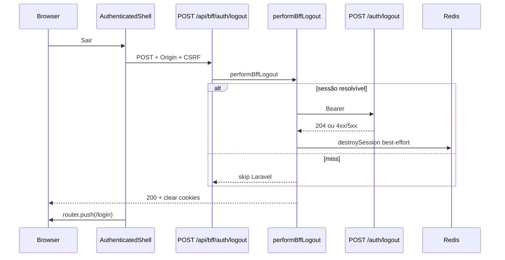
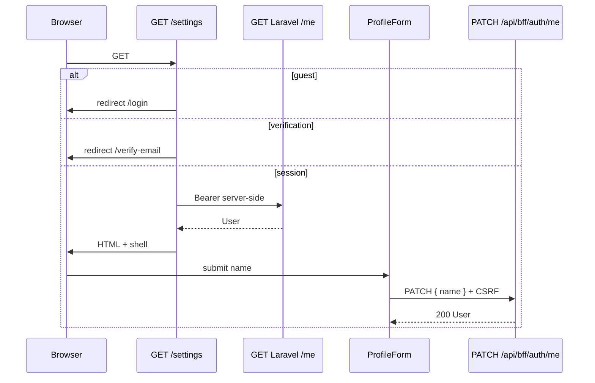

# BFF Auth — Sessão e shell — Design

**Spec:** `.specs/features/bff-auth/session-shell/spec.md`  
**Context:** `.specs/features/bff-auth/session-shell/context.md`  
**Status:** Approved — 2026-08-19  
**Pré-requisitos:** session-core, csrf-proxy, login, email-verification, password (Verified)

---

## Abordagens consideradas

### 1. Orquestração dos handlers

| Abordagem | Prós | Contras | Veredicto |
| --- | --- | --- | --- |
| **A — Três serviços (`performBffLogout`, `performBffLogoutAll`, `performBffMe`) + guard de logout dedicado** | Testável; logout não quebra em miss; me GET/PATCH no mesmo arquivo | Três arquivos | **Recomendada** |
| B — Serviço único `performBffAccount(action)` | Um arquivo | Branching logout vs me; testes opacos | Rejeitada |
| C — `callAllowlistedUpstream` cru | Menos código | Logout precisaria pós-processar 204 e best-effort; risco de Bearer | Rejeitada |

### 2. Guard de logout vs `assertMutationGuard`

| Abordagem | Prós | Contras | Veredicto |
| --- | --- | --- | --- |
| **A — Guard especial: Origin sempre; CSRF só com sessão; miss → 200 local** | Atende SH-04; CSRF protege quem ainda está logado | Exceção documentada à allowlist `requireSession: true` | **Recomendada** |
| B — `requireSession: false` + CSRF pré-auth | Reusa guard genérico | Segundo logout exige cookies pré-auth que o user logado não tem | Rejeitada |
| C — Sempre `assertMutationGuard` requireSession | Simples | Segundo Sair / Redis miss → `403` em vez de deslogar | Rejeitada |

### 3. Shell autenticado

| Abordagem | Prós | Contras | Veredicto |
| --- | --- | --- | --- |
| **A — `AuthenticatedShell` + `app/settings/layout.tsx`; home ramifica guest vs session** | Um chrome para `/settings` e `/settings/password` | Home não usa o layout de settings | **Recomendada** |
| B — Middleware Next.js global | Centralizado | csrf-proxy rejeitou middleware obrigatório; overlap com páginas públicas | Rejeitada |
| C — Duplicar nav em cada page | Zero layout | Drift `/settings` vs password | Rejeitada |

**Decisão:** A em todos os eixos.

---

## Architecture Overview

1. **Logout** — Origin; se sessão: CSRF + revoke Laravel best-effort + destroy Redis; sempre clear session+CSRF cookies + `200` `{ redirect_to: /login }` (exceto Origin/CSRF inválidos com sessão ainda presente).
2. **Logout-all** — `loadSessionMutationContext` (kind `session`) + CSRF; só após `204` destroy+clear; senha errada mantém sessão.
3. **GET me** — sessão `session`\|`verification`, sem CSRF/Origin; pass-through `UserResponse`.
4. **PATCH me** — kind `session` + CSRF; body só `{ name }` trimado; `400` local se extras.
5. **UI** — `/settings` RSC hidrata via `fetchCurrentUserForPage` (mesmo serviço GET, sem self-HTTP); mutations pelo browser.





---

## Code Reuse Analysis

### Existing Components to Leverage

| Component | Location | How to Use |
| --- | --- | --- |
| `loadSessionMutationContext` | `services/bff-password-shared.ts` | logout-all + PATCH me |
| `assertMutationGuard` | `bff/mutation-guard.ts` | logout-all / PATCH; **não** no miss de logout |
| `validateMutationOrigin` | `bff/origin.ts` | Guard especial de logout |
| `validateCsrfDoubleSubmit` | `bff/csrf.ts` | Logout quando há sessão |
| `forbiddenResponse` / `jsonWithPrivateCache` | `bff/private-response.ts` | 403 + no-store |
| Allowlist | `bff/allowlist.ts` | +4 entradas |
| Session facade | `services/bff-session.ts` | get/destroy/clear |
| Verify destroy 204→200 | `bff-verify-email.ts` / `bff-password-change.ts` | Envelope `redirect_to` |
| Metrics decrypt | `lib/session/metrics.ts` | Estender contadores logout |
| Verification guard | `lib/verification-guard.ts` | Estender account paths |
| `applyServerFieldErrors` | `lib/validation-errors.ts` | PATCH 422 + logout-all |
| `messageForAuthError` / `formatRetryAfter` | `lib/auth-messages.ts` | 401/429 copies |
| Change password form | `change-password-form.tsx` | CSRF header + pending + 429 |
| Settings password page | `app/settings/password/page.tsx` | Guard session; passa a viver no layout |
| UI primitives | `shared/components/ui/*` | Button, Input, FormField |
| `readClientCookie` | `lib/client-cookie.ts` | CSRF token |
| Foundation gates | `foundation-gates.test.ts` | Permitir rotas novas |

### Integration Points

| System | Integration Method |
| --- | --- |
| Laravel | `POST /auth/logout`, `POST /auth/logout-all`, `GET /me`, `PATCH /me` |
| Redis | destroy no logout (sempre tentar se houver id) e no logout-all/`ACCOUNT_*` sucesso |
| CSRF | clear cookies no sucesso local de logout/logout-all |

### Concerns found in reuse

| Concern | Location | Impact | Mitigation |
| --- | --- | --- | --- |
| `assertMutationGuard` recusa sessão miss | `mutation-guard.ts:29-31` | Quebra logout idempotente | Guard especial só em `performBffLogout` |
| Home hoje é landing para todos os guests; verification já redireciona | `app/page.tsx` | Session precisa de ramo UI | Ramificar `kind === 'session'` para shell |
| Password page sem nav | `settings/password/page.tsx` | UX inconsistente | `settings/layout.tsx` com shell |
| Allowlist test length 7 | `allowlist.test.ts` | Gate quebra ao adicionar 4 | Atualizar T6 |

---

## Components

### Allowlist

```typescript
export const LOGOUT_ALLOWLIST_ENTRY: AllowlistEntry = {
  method: 'POST',
  bffPath: '/api/bff/auth/logout',
  upstreamMethod: 'POST',
  upstreamPath: '/auth/logout',
  requireSession: true,
  requireCsrf: true,
};

export const LOGOUT_ALL_ALLOWLIST_ENTRY: AllowlistEntry = {
  method: 'POST',
  bffPath: '/api/bff/auth/logout-all',
  upstreamMethod: 'POST',
  upstreamPath: '/auth/logout-all',
  requireSession: true,
  requireCsrf: true,
};

export const ME_GET_ALLOWLIST_ENTRY: AllowlistEntry = {
  method: 'GET',
  bffPath: '/api/bff/auth/me',
  upstreamMethod: 'GET',
  upstreamPath: '/me',
  requireSession: true,
  requireCsrf: false,
};

export const ME_PATCH_ALLOWLIST_ENTRY: AllowlistEntry = {
  method: 'PATCH',
  bffPath: '/api/bff/auth/me',
  upstreamMethod: 'PATCH',
  upstreamPath: '/me',
  requireSession: true,
  requireCsrf: true,
};
```

`AUTH_BFF_ALLOWLIST` length **11**.

### `clearCsrfCookies` (`bff/csrf.ts`)

- Expira `__Host-fl_csrf` e `__Host-fl_csrf_sid` (`maxAge: 0`, mesmos atributos `__Host-`).
- Chamada junto com `clearSessionCookie` nos sucessos locais de logout / logout-all / RSC `ACCOUNT_*`.

### `performBffLogout` (`services/bff-logout.ts`)

```
1. validateMutationOrigin — fail → 403, sem clear
2. getSession
3. Se context: validateCsrf session-mode — fail → 403, sem clear
4. Se context: fetch POST logout (sem body); ignore 204/401/403/422/429; 5xx/timeout/rede → incrementLogoutUpstreamFail
5. Se context: destroySession; se throw/false → incrementLogoutRedisFail
6. json 200 { data: { redirect_to: '/login', message: 'Você saiu da conta.' } } + clearSessionCookie + clearCsrfCookies
7. Miss: pular 3–5; ainda passo 6 (Origin já ok)
```

### `performBffLogoutAll`

- `loadSessionMutationContext` + body Zod `{ current_password }` max 128, `strict`/strip extras → `400` se inválido.
- Upstream só `{ current_password }`.
- `204` → destroy best-effort + clear cookies + `200` envelope logout-all.
- Outros status → pass-through, sessão intacta.

### `performBffMe`

- **GET:** `getSession`; miss ou kind inválido → 403; fetch GET `/me` + Bearer; pass-through status/body; `Cache-Control` privado.
- **PATCH:** `loadSessionMutationContext`; parse `{ name }` trim 1–120 strict; extras → 400; upstream `{ name }`; pass-through.

### `fetchCurrentUserForPage` (mesmo módulo me)

- Usado pela RSC `/settings`. Sem Origin/CSRF (server).
- `403` com `code` `ACCOUNT_SUSPENDED` \| `ACCOUNT_PENDING_DELETION` → caller faz destroy+clear+redirect login.

### Account guard (`lib/account-guard.ts` ou extensão de `verification-guard.ts`)

```typescript
export function isAccountPath(pathname: string): boolean {
  return pathname === '/settings' || pathname.startsWith('/settings/');
}

export function resolveAccountPageGuard(input: {
  pathname: string;
  sessionKind: 'session' | 'verification' | null;
}): { action: 'allow' } | { action: 'redirect'; to: '/login' | '/verify-email' | '/' }
```

- Account path + null → `/login`
- Account path + verification → `/verify-email`
- Reusa `resolveVerificationSessionGuard` para `/` e `/verify-email`

### UI

- `AuthenticatedShell` — nav Início, Conta, `LogoutButton`
- `LogoutButton` — POST logout, headers L-046, `router.push('/login')`
- `ProfileForm` — name + email readOnly
- `LogoutAllForm` — current_password; 401 campo; 429 L-053
- `app/settings/layout.tsx` — guard account + shell
- `app/settings/page.tsx` — GET me + forms
- `app/page.tsx` — session → shell + placeholder; guest landing; verification via helper existente
- `verify-email-form` ou página — `LogoutButton`

### Schemas

```typescript
export const updateProfileSchema = z.object({
  name: z.string().trim().min(1).max(120),
});

export const logoutAllSchema = z.object({
  current_password: z.string().min(1).max(128),
});
```

BFF PATCH: `updateProfileSchema.strict()` (rejeita extras).

---

## Data Models

User envelope = OpenAPI `User` (pass-through). Sem modelo persistido no BFF além da sessão Redis existente.

Logout success:

```typescript
type LogoutSuccessBody = {
  data: { redirect_to: '/login'; message: string };
};
```

---

## Error Handling Strategy

| Scenario | Handling | User impact |
| --- | --- | --- |
| Origin/CSRF logout com sessão | 403, sessão intacta | Mensagem genérica proibido |
| Logout miss / Redis flush | 200 + cookies limpos | Vai ao login |
| Laravel logout 5xx/timeout | 200 local + `bff_logout_upstream_fail_total` | Sai mesmo assim |
| destroySession falha | 200 + `bff_logout_redis_fail_total` | Sai; chave órfã TTL |
| Logout-all senha errada | 401 pass-through | Permanece em `/settings` |
| PATCH extras / name vazio | 400 local | Erro de campo |
| GET me ACCOUNT_* na RSC | destroy+clear+redirect login | Sem loop |
| 429 com/sem Retry-After | Copies distintas | L-053 |

---

## Risks & Concerns

| Concern | Location | Impact | Mitigation |
| --- | --- | --- | --- |
| Mutation guard vs logout miss | `mutation-guard.ts:29` | 403 no segundo Sair | Guard dedicado (T7) |
| Loop login↔home se ACCOUNT_* só redirect | `app/login/page.tsx:22` | Usuário preso | Destroy cookie antes do redirect (spec) |
| GET me é o primeiro GET allowlisted | `allowlist.ts` | Origin/CSRF skip precisa de teste | T9/T12: GET sem CSRF ainda 200 |
| Shell em password page altera layout Verified | `settings/password/page.tsx` | Regressão visual | RTL: nav presente; form change intacto |
| Contadores vs OTel | `metrics.ts` | Alerta ops fora da suíte | L-026: getters de teste only |

---

## Tech Decisions (feature-local)

| Decision | Choice | Rationale |
| --- | --- | --- |
| Guard logout | Especial, não mutar `assertMutationGuard` | Evita mudar semântica de change/verify |
| GET me Origin | Não exigir | csrf-proxy GET |
| Layout settings | `app/settings/layout.tsx` | Cobre password |
| Flash message | Nenhuma query | Paridade change-password |
| AD-017 | Conform | Prefix `/api/bff` |

Nenhuma decisão nova de projeto (`AD-NNN`); não altera STATE Decisions.
