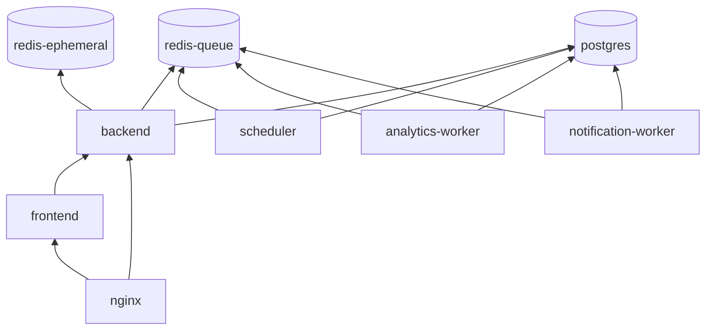

# Docker Foundation Design

**Spec:** `.specs/features/docker-foundation/spec.md`  
**Context:** `.specs/features/docker-foundation/context.md`  
**Status:** Approved — pronto para Tasks (2026-07-21)

---

## Abordagens consideradas

### Composição Docker

| Abordagem | Prós | Contras | Veredicto |
| --- | --- | --- | --- |
| **A — `docker-compose.yml` + profiles + `docker-compose.prod.yml`** | Um grafo de serviços; perfis `test`/`docs`/`benchmark`/`observability`; prod via override | Arquivo base cresce; exige disciplina de profiles | **Recomendada** — alinha `architecture.md` §11 e AD-002/AD-004 |
| B — Compose separado por ambiente (`dev.yml`, `test.yml`, `prod.yml`) | Isolamento total entre arquivos | Duplicação de serviços; drift entre ambientes | Rejeitada |
| C — Apenas dev no MVP; prod em feature futura | Entrega inicial menor | Viola P2 da spec e preparação multiarch | Rejeitada |

### Ingress TLS local

| Abordagem | Prós | Contras | Veredicto |
| --- | --- | --- | --- |
| **A — Nginx único com dois `server_name` (TLS)** | Espelha produção; enforce de allowlist por host; um ponto de TLS | Config Nginx mais elaborada | **Recomendada** — conforme topologia §3 |
| B — TLS terminado no Next/Laravel | Menos Nginx | Viola separação; cookies/`Secure` inconsistentes; Short host expõe stack errada | Rejeitada |
| C — mkcert no host | DX de confiança automática | Dependência externa (AD-001 rejeitou) | Rejeitada |

**Decisão:** Abordagem A em ambos os eixos.

---

## Architecture Overview

Monorepo com **um Nginx de borda** terminando TLS para `app.localhost` e `go.localhost`, encaminhando para **Next.js** (UI/BFF) e **PHP-FPM/Laravel** (API + redirect). Datastores e filas rodam em containers dedicados; workers e scheduler compartilham a imagem PHP.

```mermaid
flowchart TB
    subgraph host["Host (dev)"]
        P443["`:443` HTTPS"]
        P5432["`:5432` PostgreSQL"]
        P6379["`:6379` redis-ephemeral"]
        P6380["`:6380` redis-queue"]
    end

    subgraph compose["Docker Compose network `fake-link`"]
        NGINX[nginx]
        FE[frontend Next.js]
        BE[backend PHP-FPM]
        SCH[scheduler]
        AW[analytics-worker]
        NW[notification-worker]
        PG[(postgres)]
        RE[(redis-ephemeral)]
        RQ[(redis-queue)]
        SW[swagger-ui profile docs]
        OTEL[otel-collector profile observability]
    end

    Browser --> P443 --> NGINX
    P5432 --> PG
    P6379 --> RE
    P6380 --> RQ

    NGINX -->|"app.localhost UI/BFF"| FE
    NGINX -->|"app.localhost /api/v1"| BE
    NGINX -->|"app.localhost /docs"| SW
    NGINX -->|"go.localhost redirect"| BE

    FE --> BE
    BE --> PG
    BE --> RE
    BE --> RQ
    SCH --> PG
    SCH --> RQ
    AW --> PG
    AW --> RQ
    NW --> PG
    NW --> RQ
    BE -.-> OTEL
    FE -.-> OTEL
```

### Fluxo de bootstrap (dev)

1. `make trust-ca` — gera CA + certs (`docker/scripts/generate-dev-certs.sh`) se ausentes.
2. `make up` — valida `.env`, build imagens, `docker compose up -d`.
3. Datastores ficam `healthy` → backend/frontend → nginx.
4. Smoke: `curl -k https://app.localhost/health` e `curl -k https://go.localhost/health`.

---

## Layout do repositório

```txt
/
├── docker-compose.yml           # Base + profiles
├── docker-compose.prod.yml      # Override produção (P2)
├── Makefile                     # Interface única (AD-003)
├── .env.example
├── .env                         # gitignored
├── docker/
│   ├── versions.env             # Pin canônico (AD-005)
│   ├── nginx/
│   │   ├── Dockerfile           # Extends official nginx:stable
│   │   ├── conf.d/
│   │   │   ├── 00-global.conf
│   │   │   ├── app.localhost.conf
│   │   │   └── go.localhost.conf
│   │   └── certs/               # Gerados; CA .pem commitada; leaf gitignored
│   ├── php/
│   │   ├── Dockerfile           # Multi-stage: base + dev + prod target
│   │   ├── php.ini
│   │   ├── www.conf             # FPM pool + ping.path
│   │   └── docker-entrypoint.sh
│   ├── node/
│   │   └── Dockerfile           # Multi-stage: base + dev + prod target
│   ├── postgres/
│   │   └── init/                # Opcional: extensões/locale
│   ├── redis/
│   │   ├── ephemeral.conf
│   │   └── queue.conf
│   └── scripts/
│       ├── generate-dev-certs.sh
│       ├── trust-ca.sh          # Instruções/import por SO
│       └── validate-env.sh
├── backend/                     # Stub Laravel mínimo (escopo integração)
└── frontend/                    # Stub Next.js mínimo (escopo integração)
```

---

## Code Reuse Analysis

### Existing Components to Leverage

| Component | Location | How to Use |
| --- | --- | --- |
| Topologia de hosts | `docs/architecture.md` §3 | Mapa Nginx app vs short |
| Políticas Redis | `docs/architecture.md` §9 | `ephemeral.conf` / `queue.conf` |
| Allowlist Short host | `docs/security.md` §2 | Locations Nginx `go.localhost` |
| Domínios locais | `docs/openapi.yaml` servers | `app.localhost`, `go.localhost` |
| Decisões AD-001–005 | `.specs/STATE.md` | Constraints de TLS, workers, ports, versões |
| OpenAPI spec | `docs/openapi.yaml` | Swagger UI monta este arquivo no profile `docs` |

### Integration Points

| System | Integration Method |
| --- | --- |
| Laravel backend (futuro) | Variáveis `DB_*`, `REDIS_*`, `REDIS_QUEUE_*`; FPM via Nginx |
| Next.js frontend (futuro) | `BACKEND_INTERNAL_URL`; proxy BFF server-side |
| Pest/CI (futuro) | Profile `test` + `make test` |
| OpenTelemetry (P2) | Profile `observability`; env `OTEL_EXPORTER_OTLP_ENDPOINT` |

**Reuse existente de código:** nenhum — repositório ainda sem `backend/`, `frontend/` ou `docker/`. Design define contratos para stubs mínimos.

---

## Mapa de rotas Nginx

### `app.localhost` (App host)

| Location | Upstream | Métodos | Notas |
| --- | --- | --- | --- |
| `/health` | `frontend:3000/health` | GET | DOCKER-02 |
| `/api/v1/*` | `backend:9000` (FastCGI) | Conforme OpenAPI | API direta + Swagger |
| `/docs` | `swagger-ui:8080` | GET | Profile `docs` only |
| `/docs/*` | `swagger-ui:8080` | GET | Assets Swagger |
| `/*` | `frontend:3000` | GET, POST, … | UI + Route Handlers BFF |
| HTTP `:80` | redirect 301 | — | → HTTPS; **sem HSTS** |

Headers globais (App): `X-Request-Id` gerado/substituído; remove `traceparent`/`tracestate` recebidos; **não** adiciona `Strict-Transport-Security`.

### `go.localhost` (Short host)

| Location | Upstream | Métodos | Notas |
| --- | --- | --- | --- |
| `/health` | `backend:9000/health` (FastCGI) | GET | DOCKER-03 |
| `/robots.txt` | `backend:9000` | GET | Allowlist produção |
| `/` | `backend:9000` | GET, HEAD | Raiz → landing redirect (stub 302) |
| `~ ^/[a-z0-9-]+$` | `backend:9000` | GET, HEAD | Slug único segmento; rejeita encoding extra no Laravel |
| Outros caminhos | — | — | **444/404** no Nginx antes do PHP |
| Métodos mutáveis | — | POST, PUT, … | **405/444** no Nginx |

### Resolução `*.localhost`

Browsers modernos resolvem `*.localhost` → `127.0.0.1`. Documentar fallback `/etc/hosts` para ferramentas CLI sem mDNS.

---

## Components

### `docker/versions.env`

- **Purpose:** Pin único consumido por Dockerfiles e Compose via `env_file`.
- **Location:** `docker/versions.env`
- **Interfaces:** Variáveis `PHP_VERSION`, `LARAVEL_VERSION`, `NODE_VERSION`, etc. (spec §Pin)
- **Dependencies:** Nenhuma
- **Reuses:** AD-005

### Nginx (`nginx` service)

- **Purpose:** Terminação TLS, roteamento dual-host, allowlist Short host.
- **Location:** `docker/nginx/`
- **Interfaces:**
  - Escuta `443` (e `80` redirect) no container; publica `${NGINX_HTTPS_PORT:-443}` no host
  - FastCGI → `backend:9000`; proxy → `frontend:3000`, `swagger-ui:8080`
- **Dependencies:** Certs em `docker/nginx/certs/`; backend e frontend healthy
- **Reuses:** Imagem oficial `nginx:${NGINX_VERSION}` (Debian stable)

**Healthcheck:**

```yaml
test: ["CMD-SHELL", "curl -fk https://127.0.0.1/health -H 'Host: app.localhost' && curl -fk https://127.0.0.1/health -H 'Host: go.localhost'"]
interval: 15s
timeout: 5s
retries: 5
start_period: 30s
```

### Backend PHP-FPM (`backend`, `scheduler`, workers)

- **Purpose:** Laravel API, redirect surface, filas e scheduler.
- **Location:** `docker/php/Dockerfile`, `backend/`
- **Interfaces:**
  - FPM `9000` (rede interna)
  - `GET /health` → `200 {"status":"ok"}` (stub route)
  - Workers: `queue:work redis --queue=analytics|notifications --timeout=...`
  - Scheduler: `schedule:work`
- **Dependencies:** `postgres`, `redis-ephemeral`, `redis-queue` healthy
- **Reuses:** Imagem `php:${PHP_VERSION}-fpm-bookworm`

**Variáveis principais:**

| Variável | Valor dev (exemplo) |
| --- | --- |
| `DB_HOST` | `postgres` |
| `DB_DATABASE` | `fake_link` |
| `REDIS_HOST` | `redis-ephemeral` |
| `REDIS_PORT` | `6379` |
| `REDIS_QUEUE_HOST` | `redis-queue` |
| `REDIS_QUEUE_PORT` | `6379` |
| `APP_URL` | `https://app.localhost` |
| `SHORT_HOST` | `go.localhost` |

**Healthcheck (FPM ping):**

```yaml
test: ["CMD-SHELL", "SCRIPT_NAME=/ping SCRIPT_FILENAME=/ping REQUEST_METHOD=GET cgi-fcgi -bind -connect 127.0.0.1:9000 || exit 1"]
```

`www.conf`: `ping.path = /ping`, `ping.response = pong`.

### Frontend Next.js (`frontend`)

- **Purpose:** UI e BFF (stub inicial com `/health` only).
- **Location:** `docker/node/Dockerfile`, `frontend/`
- **Interfaces:**
  - HTTP `3000` — `GET /health` → `200 {"status":"ok"}`
  - Dev: bind mount + `pnpm dev`; Prod target: `pnpm build && pnpm start`
- **Dependencies:** `postgres`, `redis-ephemeral`, `redis-queue` healthy (`depends_on` + `service_healthy`)
- **Reuses:** Imagem `node:${NODE_VERSION}-bookworm`; Corepack + pnpm pin

**Healthcheck:**

```yaml
test: ["CMD-SHELL", "curl -f http://127.0.0.1:3000/health || exit 1"]
```

### PostgreSQL (`postgres`)

- **Purpose:** Fonte de verdade relacional.
- **Location:** Serviço Compose + volume nomeado
- **Interfaces:** `5432` interno; host `5432` em dev (AD-004)
- **Dependencies:** Nenhuma
- **Reuses:** Imagem `postgres:${POSTGRES_VERSION}-bookworm`

**Volume:** `fake_link_postgres_data` → `/var/lib/postgresql` (PG 18+ layout versionado).

**Healthcheck:** `pg_isready -U ${POSTGRES_USER} -d ${POSTGRES_DB}`

### Redis efêmero (`redis-ephemeral`)

- **Purpose:** Cache, rate limit, sessões BFF.
- **Location:** `docker/redis/ephemeral.conf`
- **Interfaces:** `6379`; host `6379` em dev
- **Config locked:**
  - `save ""` — sem RDB
  - `appendonly no`
  - `maxmemory-policy allkeys-lru` (eviction habilitada)
- **Healthcheck:** `redis-cli ping`

### Redis fila (`redis-queue`)

- **Purpose:** Broker Laravel queues.
- **Location:** `docker/redis/queue.conf`
- **Interfaces:** `6379` interno; host `6380` em dev (evita colisão)
- **Config locked:**
  - `appendonly yes`
  - `appendfsync everysec`
  - `maxmemory-policy noeviction`
- **Volume:** `fake_link_redis_queue_data` (AOF)
- **Healthcheck:** `redis-cli ping`

### Workers e scheduler

| Service | Command | Scale dev | Scale benchmark/prod |
| --- | --- | --- | --- |
| `scheduler` | `php artisan schedule:work` | 1 | 1 |
| `analytics-worker` | `php artisan queue:work redis --queue=analytics --sleep=1 --timeout=120 --max-jobs=1000 --max-time=3600` | 1 | 2 |
| `notification-worker` | `php artisan queue:work redis --queue=notifications --sleep=1 --timeout=60 --max-jobs=1000 --max-time=3600` | 1 | 1 |

Todos usam imagem `backend`, `stop_grace_period: 30s`, `STOPSIGNAL SIGTERM`.

**Healthcheck (workers e scheduler):**

```yaml
# scheduler
test: ["CMD-SHELL", "pgrep -f 'artisan schedule:work' >/dev/null || exit 1"]
interval: 30s
timeout: 5s
retries: 3
start_period: 30s

# analytics-worker / notification-worker
test: ["CMD-SHELL", "pgrep -f 'artisan queue:work' >/dev/null || exit 1"]
interval: 30s
timeout: 5s
retries: 3
start_period: 30s
```

**depends_on:** `postgres`, `redis-queue` com `condition: service_healthy`. Não dependem de `redis-ephemeral` nem de `backend` HTTP.

### Swagger UI (`swagger-ui`, profile `docs`)

- **Purpose:** Documentação OpenAPI interativa.
- **Location:** Serviço Compose efêmero
- **Interfaces:** `SWAGUL_UI` apontando para `/openapi.yaml` montado de `docs/openapi.yaml`
- **Dependencies:** Nginx profile `docs`
- **Reuses:** Imagem `swaggerapi/swagger-ui:v5.18.2` (pin em `versions.env` como `SWAGGER_UI_VERSION`)

**Healthcheck:**

```yaml
test: ["CMD-SHELL", "curl -f http://127.0.0.1:8080/ || exit 1"]
interval: 15s
timeout: 5s
retries: 5
start_period: 20s
```

**depends_on:** nenhum bloqueante (Nginx faz proxy; Swagger pode subir em paralelo).

### OpenTelemetry Collector (`otel-collector`, profile `observability`, P2)

- **Purpose:** Stub de observabilidade local; endpoint OTLP para apps.
- **Location:** `docker/otel/` (mínimo)
- **Interfaces:** `4317` gRPC / `4318` HTTP internos; **não** publicar no host
- **Dependencies:** Nenhuma crítica

**Healthcheck (P2):**

```yaml
test: ["CMD-SHELL", "wget -qO- http://127.0.0.1:13133/ || exit 1"]
interval: 15s
timeout: 5s
retries: 5
start_period: 20s
```

---

## Healthchecks e `depends_on` (matriz obrigatória)

Atende **DOCKER-15** (todo serviço com `healthcheck`) e **DOCKER-16** (`depends_on` + `service_healthy` nos críticos).

### Healthcheck por serviço

| Serviço | Healthcheck | interval / timeout / retries / start_period |
| --- | --- | --- |
| `postgres` | `pg_isready -U $$POSTGRES_USER -d $$POSTGRES_DB` | 10s / 5s / 5 / 30s |
| `redis-ephemeral` | `redis-cli ping` | 10s / 3s / 5 / 10s |
| `redis-queue` | `redis-cli ping` | 10s / 3s / 5 / 10s |
| `backend` | FPM ping (`cgi-fcgi` → `/ping`) | 15s / 5s / 5 / 40s |
| `frontend` | `curl -f http://127.0.0.1:3000/health` | 15s / 5s / 5 / 60s |
| `nginx` | curl HTTPS `/health` nos dois vhosts | 15s / 5s / 5 / 30s |
| `scheduler` | `pgrep -f 'artisan schedule:work'` | 30s / 5s / 3 / 30s |
| `analytics-worker` | `pgrep -f 'artisan queue:work'` | 30s / 5s / 3 / 30s |
| `notification-worker` | `pgrep -f 'artisan queue:work'` | 30s / 5s / 3 / 30s |
| `swagger-ui` *(profile docs)* | `curl -f http://127.0.0.1:8080/` | 15s / 5s / 5 / 20s |
| `otel-collector` *(profile observability, P2)* | HTTP `:13133` | 15s / 5s / 5 / 20s |

Parâmetros comuns em todos: `start_period` evita falso negativo no boot; workers usam intervalo maior (processo longo).

### Grafo `depends_on`

Ordem de subida garantida por `condition: service_healthy`, salvo onde indicado:



| Serviço | depends_on | condition |
| --- | --- | --- |
| `postgres` | — | — |
| `redis-ephemeral` | — | — |
| `redis-queue` | — | — |
| `backend` | `postgres`, `redis-ephemeral`, `redis-queue` | `service_healthy` |
| `frontend` | `backend` | `service_healthy` |
| `nginx` | `backend`, `frontend` | `service_healthy` |
| `scheduler` | `postgres`, `redis-queue` | `service_healthy` |
| `analytics-worker` | `postgres`, `redis-queue` | `service_healthy` |
| `notification-worker` | `postgres`, `redis-queue` | `service_healthy` |
| `swagger-ui` | — | — *(profile docs; opcional `service_started`)* |
| `otel-collector` | — | — *(P2)* |

**Notas:**

- Datastores são folha — sobem primeiro, sem dependências.
- Workers **não** dependem de `backend` HTTP/FPM: rodam o mesmo código/imagem, mas processo separado.
- `nginx` só fica `healthy` quando backend **e** frontend respondem via TLS — evita smoke prematuro (DOCKER-02/03).
- Spec exige que serviço dependente **não** marque `healthy` se PG/Redis ainda não estiverem prontos (DOCKER-16).

### Exemplo Compose (trecho)

```yaml
services:
  backend:
    depends_on:
      postgres:
        condition: service_healthy
      redis-ephemeral:
        condition: service_healthy
      redis-queue:
        condition: service_healthy
    healthcheck:
      test: ["CMD-SHELL", "SCRIPT_NAME=/ping SCRIPT_FILENAME=/ping REQUEST_METHOD=GET cgi-fcgi -bind -connect 127.0.0.1:9000 || exit 1"]
      interval: 15s
      timeout: 5s
      retries: 5
      start_period: 40s

  nginx:
    depends_on:
      backend:
        condition: service_healthy
      frontend:
        condition: service_healthy
    healthcheck:
      test: ["CMD-SHELL", "curl -fk https://127.0.0.1/health -H 'Host: app.localhost' && curl -fk https://127.0.0.1/health -H 'Host: go.localhost'"]
      interval: 15s
      timeout: 5s
      retries: 5
      start_period: 30s
```

---

| Profile | Ativa | Comportamento |
| --- | --- | --- |
| *(default)* | Sempre | Stack P1 dev; datastores publicados; workers 1+1 |
| `test` | CI / `make test` | `COMPOSE_PROJECT_NAME=fake_link_test`; volumes `_test`; **sem** portas de datastore; rede isolada |
| `docs` | `make up-docs` | Adiciona `swagger-ui`; Nginx inclui `/docs` |
| `benchmark` | Load tests | `analytics-worker` scale 2; env documentado em `tests/load/` |
| `observability` | Dev opcional | Collector + export para stdout/debug |

**Produção (`docker-compose.prod.yml`):**

- `restart: unless-stopped`
- Limites CPU/RAM por serviço (referência VM 4 vCPU / 8 GB)
- Sem bind mounts de código
- Datastores sem `ports:`
- Workers 2+1
- Profile `observability` completo (Collector, Prometheus, Tempo, Loki, Grafana — P2)

---

## Makefile (interface AD-003)

| Target | Ação |
| --- | --- |
| `help` | Lista targets |
| `trust-ca` | Gera/importa CA dev |
| `build` | `docker compose build` |
| `up` | Valida env + certs + `compose up -d` |
| `down` | `compose down` |
| `ps` | `compose ps` |
| `logs` | `compose logs -f` |
| `shell-backend` | `exec backend bash` |
| `shell-frontend` | `exec frontend bash` |
| `migrate` | `exec backend php artisan migrate --force` |
| `smoke` | Curl HTTPS nos dois `/health` |
| `test` | Profile `test` + smoke/compose validation |
| `lint` | Placeholder para lint em containers (Fase 0 posterior) |

Compose invocado sempre via `docker compose --env-file docker/versions.env`.

---

## Stubs mínimos de aplicação

Escopo de integração Docker (não scaffold completo):

### Backend (`backend/`)

- Laravel 13 API Only skeleton
- Rota `GET /health` → JSON spec
- Rota stub `GET /robots.txt`, `GET /`, `GET /{slug}` retornando respostas mínimas para smoke Short host
- `.env` via Compose; drivers `pgsql`, `redis`
- Migrations vazias ou tabela `health_checks` opcional

### Frontend (`frontend/`)

- Next.js 16 App Router minimal
- Route `app/health/route.ts` → JSON spec
- `next dev` em dev target; cookies config preparada para `Secure` (sem relaxar)

---

## Variáveis de ambiente (`.env.example`)

Grupos obrigatórios — `validate-env.sh` falha com mensagem clara se ausentes:

| Grupo | Variáveis |
| --- | --- |
| Compose | `COMPOSE_PROJECT_NAME`, `NGINX_HTTPS_PORT` |
| Postgres | `POSTGRES_USER`, `POSTGRES_PASSWORD`, `POSTGRES_DB` |
| App | `APP_KEY`, `APP_ENV`, `APP_DEBUG` |
| URLs | `APP_URL`, `SHORT_HOST`, `NEXT_PUBLIC_APP_URL` |
| Redis | `REDIS_HOST`, `REDIS_PORT`, `REDIS_QUEUE_HOST`, `REDIS_QUEUE_PORT` |
| Ports dev | `POSTGRES_PUBLISH_PORT=5432`, `REDIS_EPHEMERAL_PUBLISH_PORT=6379`, `REDIS_QUEUE_PUBLISH_PORT=6380` |

Segredos: placeholders em `.env.example`; `.env` gitignored; nunca em layers de imagem.

---

## Error Handling Strategy

| Error Scenario | Handling | User Impact |
| --- | --- | --- |
| Porta 443 ocupada | Compose fail; Makefile detecta e imprime hint | Mensagem explícita |
| `.env` incompleto | `validate-env.sh` exit 1 antes do up | Lista variáveis faltantes |
| Certificados ausentes | `make up` chama `trust-ca` ou instrui | Passo único documentado |
| Postgres down | Healthcheck `unhealthy`; dependentes não promovem | `compose ps` vermelho |
| Redis queue OOM | `noeviction` → OOM command; worker log erro | Visível em logs |
| Build falha | Exit non-zero; sem partial up silencioso | Log Docker build |

---

## Risks & Concerns

| Concern | Location | Impact | Mitigation |
| --- | --- | --- | --- |
| Repositório greenfield | N/A | Sem padrões existentes para copiar | Stubs mínimos + design como referência; Tasks separa infra vs scaffold |
| PG 18 volume path | Docker Hub postgres:18 | Mount errado corrompe dados | Usar `/var/lib/postgresql` + doc oficial; teste de volume em smoke |
| CA não confiável | Dev TLS | Browser/curl rejeita HTTPS | `make trust-ca` documentado por SO; `smoke` usa `-k` apenas em CI inicial |
| FPM health ≠ HTTP `/health` | backend container | Container healthy mas rota quebrada | Nginx healthcheck HTTP + target `make smoke` (DOCKER-02/03) |
| Redis 8.x license | `redis:8` | Compliance | Documentar tri-license; pin 8.8.0; ADR futuro se necessário |
| Consumo RAM dev | 9 containers | Máquinas 8 GB apertadas | AD-002 (1+1 workers); docs de requisito mínimo 8 GB |
| Profile drift | compose.yml | Serviço sobe sem profile esperado | Testes de `docker compose config` por profile na Tasks |

---

## Tech Decisions

| Decision | Choice | Rationale |
| --- | --- | --- |
| Ingress | Nginx único dual-vhost | Espelha produção; enforce allowlist Short host |
| PHP runtime | PHP-FPM + Nginx FastCGI | Padrão Laravel; separa TLS do worker PHP |
| Dev hot reload | Bind mounts + `pnpm dev` / FPM | DX; prod usa multi-stage sem mounts |
| Redis instâncias | Dois serviços Compose | Impossibilita URL única acidental (DOCKER-12) |
| Queue connection | Laravel `redis` driver apontando `redis-queue` | Filas isoladas de cache/sessão |
| TLS dev | OpenSSL script (AD-001) | Reproduzível sem mkcert |
| Test isolation | `COMPOSE_PROJECT_NAME` + volumes `_test` | CI efêmero sem poluir dev |
| HSTS | Ausente | ADR 0006 permanente |
| Swagger | Container sidecar profile `docs` | Não embute UI no backend |

---

## Requirement Coverage (Design)

| ID | Design element |
| --- | --- |
| DOCKER-01 | Compose services table + Makefile `up` |
| DOCKER-02 | Nginx → frontend `/health` |
| DOCKER-03 | Nginx → backend `/health` |
| DOCKER-04 | Mapa rotas `app.localhost` |
| DOCKER-05 | Mapa rotas `go.localhost` + allowlist |
| DOCKER-06 | TLS + cookies não relaxados |
| DOCKER-07 | `.env.example` groups |
| DOCKER-08 | Dois Redis + configs distintas |
| DOCKER-09–14 | Postgres volume, Redis configs, workers |
| DOCKER-15–18 | Healthchecks + depends_on + grace periods |
| DOCKER-19–22 | Profiles table |
| DOCKER-23–26 | Multi-stage Dockerfiles + prod override |
| DOCKER-27–29 | Makefile + README section |

---

## Verificação do Design

Antes de Tasks, confirmar:

- [x] Mapa Nginx alinhado com `docs/security.md` allowlist Short host
- [x] Portas dev fixas documentadas (5432, 6379, 6380, 443)
- [x] Healthcheck + `depends_on` definidos para todos os serviços P1/P2
- [x] Stubs mínimos aceitos como escopo de integração (§ Stubs mínimos de aplicação)
- [x] P2 (prod/observability completa) faseado nas Tasks — Phases 4–5 em `tasks.md`
