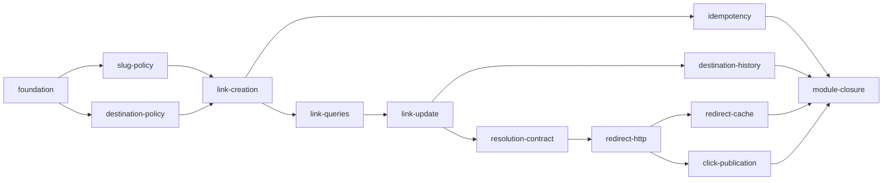

# Links + Redirect Backend API — Índice de specs

**Status do módulo:** Em progresso — 2026-09-18 (13 fatias; 1–4 implementadas e verificadas; 5–13 em seed)

**Escopo do módulo:** backend Laravel em `backend/modules/Links/` e `backend/modules/Redirects/` — endpoints `/api/v1/links*` do host da aplicação e a superfície pública do host curto.

**Fora do escopo:** BFF Next.js e UI de links (pacote futuro `bff-links/`), worker e consultas de Analytics (Fase 3), comandos `Operations` de bloqueio e exclusão (Fase 4).

**Fase alvo:** Fase 2 (Links + Redirect) — este índice cobre somente a API backend.

**Runtime HTTP:** somente `POST /api/v1/links`. Contrato vs superfície: `docs/api.md` §1.1.

---

## Como usar

1. Aprofundar **uma fatia por vez**, na ordem sugerida abaixo (`specify feature` / deepen).
2. Cada pasta hoje começa com `spec.md`. Fatias 1–4 já têm spec fechada, design/tasks quando aplicável, Execute e `validation.md`. Fatias 5–13 permanecem em seed até serem aprofundadas.
3. Só abrir a próxima fatia depois que a anterior tiver critérios de aceite atendidos e testes do escopo passando.
4. IDs `LNK-XX` são estáveis neste índice; specs filhas referenciam esses IDs e definem seus IDs locais no Specify.

**Pré-requisito:** módulo Auth backend verificado (`.specs/features/auth/`) — identidade autenticada, policies de ownership e `404` uniforme.

---

## Mapa de fatias

| Ordem | Fatia | Pasta | Status | Depende de | Endpoints / entrega |
| --- | --- | --- | --- | --- | --- |
| 1 | Fundação dos módulos | [foundation](./foundation/spec.md) | ✅ Implementada e verificada (`main`) | Fase 0 + Auth | Scaffold `Links`/`Redirects`, migrations base, keyring de destinos |
| 2 | Política de slug | [slug-policy](./slug-policy/spec.md) | ✅ Implementada e verificada (`main`, PR [#25](https://github.com/diashelter/fake-link/pull/25)) | foundation | Base36 automático, alias personalizado, reserva permanente |
| 3 | Política de destino | [destination-policy](./destination-policy/spec.md) | ✅ Implementada e verificada (`main`, PR [#26](https://github.com/diashelter/fake-link/pull/26)) | foundation | Validação, normalização e cifra AES-256-GCM da URL |
| 4 | Criação de link | [link-creation](./link-creation/spec.md) | ✅ Implementada e verificada (`feature/link-creation`, 2026-09-18) | slug-policy, destination-policy | `POST /api/v1/links` |
| 5 | Idempotência | [idempotency](./idempotency/spec.md) | Seed | link-creation | `Idempotency-Key`, replay cifrado, `409` |
| 6 | Consultas de link | [link-queries](./link-queries/spec.md) | Seed | link-creation | `GET /api/v1/links`, `GET /api/v1/links/{link}` |
| 7 | Atualização de link | [link-update](./link-update/spec.md) | Seed | link-queries | `PATCH /api/v1/links/{link}` com `If-Match` |
| 8 | Histórico de destinos | [destination-history](./destination-history/spec.md) | Seed | link-update | `GET /api/v1/links/{link}/history` |
| 9 | Contrato de resolução | [resolution-contract](./resolution-contract/spec.md) | Seed | link-update | Porta de resolução efetiva de slug em `Links` |
| 10 | Superfície HTTP do redirect | [redirect-http](./redirect-http/spec.md) | Seed | resolution-contract | `GET`/`HEAD /{slug}`, `/`, `/robots.txt` |
| 11 | Cache de redirect | [redirect-cache](./redirect-cache/spec.md) | Seed | redirect-http | Snapshot cifrado no Redis efêmero, TTL, invalidação, fallback |
| 12 | Publicação de clique | [click-publication](./click-publication/spec.md) | Seed | redirect-http | `recordClick` after-response best-effort |
| 13 | Fechamento do módulo | [module-closure](./module-closure/spec.md) | Seed | fatias 1–12 | Lint OpenAPI, contract tests, cobertura, docs/STATE, Verifier final |

---

## Catálogo de features (LNK-XX)

Referência única — detalhes ficam na spec da fatia correspondente.

| ID | Feature | Fatia |
| --- | --- | --- |
| LNK-01 | Scaffold hexagonal do módulo `Links` | foundation |
| LNK-02 | Scaffold hexagonal do módulo `Redirects` | foundation |
| LNK-03 | Migrations base de links, reservas e versões de destino | foundation |
| LNK-04 | Keyring de destinos com chave externa à persistência | foundation |
| LNK-05 | Registro de suítes e gates de cobertura dos módulos | foundation |
| LNK-10 | Slug automático Base36 de 8 caracteres por CSPRNG | slug-policy |
| LNK-11 | Retentativa de colisão limitada a 5 tentativas | slug-policy |
| LNK-12 | Normalização de alias personalizado para ASCII minúsculo | slug-policy |
| LNK-13 | Allowlist de caracteres e comprimento (3–48) do alias | slug-policy |
| LNK-14 | Denylist de palavras reservadas | slug-policy |
| LNK-15 | Reserva global e permanente em `slug_reservations` | slug-policy |
| LNK-16 | Reserva órfã sem proprietário nem destino | slug-policy |
| LNK-20 | Esquema HTTP/HTTPS e limite de 2.048 caracteres | destination-policy |
| LNK-21 | Exigência de hostname público válido | destination-policy |
| LNK-22 | Rejeição de IP literal, host local/especial e host curto próprio | destination-policy |
| LNK-23 | Rejeição de `userinfo` e caracteres de controle | destination-policy |
| LNK-24 | Portas customizadas aceitas e portas padrão redundantes removidas | destination-policy |
| LNK-25 | Preservação de query string e fragmento | destination-policy |
| LNK-26 | Envelope AES-256-GCM com `key_id` para destino e histórico | destination-policy |
| LNK-30 | `POST /api/v1/links` com payload fechado | link-creation |
| LNK-31 | Transação única de reserva, link e primeira versão de destino | link-creation |
| LNK-32 | Resposta `201` com `Location`, `ETag` forte e `LinkDetail` | link-creation |
| LNK-33 | `409 ALIAS_UNAVAILABLE` para alias indisponível | link-creation |
| LNK-34 | Rate limit de criação (60/min por conta) | link-creation |
| LNK-40 | Header `Idempotency-Key` opcional (16–128, charset restrito) | idempotency |
| LNK-41 | `key_hash` e `request_fingerprint` por HMAC, escopados por conta | idempotency |
| LNK-42 | `response_snapshot` criptografado com keyring próprio | idempotency |
| LNK-43 | Replay exato de status, headers e corpo por 24 horas | idempotency |
| LNK-44 | `409 IDEMPOTENCY_KEY_REUSED` para fingerprint divergente | idempotency |
| LNK-50 | `GET /api/v1/links` com cursor assinado e ordem fixa | link-queries |
| LNK-51 | `per_page` (1–100, padrão 20) e `meta` mínima | link-queries |
| LNK-52 | Filtro `search` (2–160) por título e prefixo de slug | link-queries |
| LNK-53 | Filtro `status` e derivação do estado efetivo | link-queries |
| LNK-54 | `GET /api/v1/links/{link}` com `LinkDetail` e `ETag` | link-queries |
| LNK-55 | Ownership com `404` uniforme | link-queries |
| LNK-56 | `422 INVALID_CURSOR` para cursor inválido | link-queries |
| LNK-60 | `PATCH /api/v1/links/{link}` com campos mutáveis | link-update |
| LNK-61 | `If-Match` obrigatório e `428 IF_MATCH_REQUIRED` | link-update |
| LNK-62 | `412 ETAG_MISMATCH` para pré-condição obsoleta | link-update |
| LNK-63 | Troca de destino encerra a versão vigente e cria nova na mesma transação | link-update |
| LNK-64 | No-op semântico sem `updated_at`, histórico ou novo `ETag` | link-update |
| LNK-65 | `ETag` opaco derivado também do estado efetivo | link-update |
| LNK-66 | Link bloqueado permanece editável sem limpar `blocked_at` | link-update |
| LNK-70 | `GET /api/v1/links/{link}/history` com cursor | destination-history |
| LNK-71 | Item com `destination_url`, `valid_from` e `valid_to` | destination-history |
| LNK-72 | Imutabilidade e ordem temporal do histórico | destination-history |
| LNK-80 | Contrato de resolução com três resultados possíveis | resolution-contract |
| LNK-81 | Snapshot mínimo e suficiente para o redirect | resolution-contract |
| LNK-82 | Precedência do estado efetivo na resolução | resolution-contract |
| LNK-83 | Independência de HTTP, Redis, headers e templates | resolution-contract |
| LNK-90 | `GET /{slug}` com `302`, `Location` e `Cache-Control: no-store` | redirect-http |
| LNK-91 | `HEAD /{slug}` com os mesmos headers, sem corpo e sem clique | redirect-http |
| LNK-92 | `GET /` redireciona à landing page sem analytics | redirect-http |
| LNK-93 | `GET /robots.txt` estático com `Disallow: /` | redirect-http |
| LNK-94 | Normalização de caixa e barra final única | redirect-http |
| LNK-95 | Rejeição de percent-encoding e segmentos extras | redirect-http |
| LNK-96 | Query string de entrada ignorada e nunca anexada ao destino | redirect-http |
| LNK-97 | Erros HTML mínimos com código, mensagem e request ID | redirect-http |
| LNK-98 | Rate limit de redirect (120/min por IP + slug) | redirect-http |
| LNK-100 | Snapshot cifrado AES-256-GCM com keyring dedicado ao cache | redirect-cache |
| LNK-101 | TTL positivo de 5 min e negativo de 30 s, limitado pela expiração | redirect-cache |
| LNK-102 | Jitter uniforme de ±10% nos TTLs | redirect-cache |
| LNK-103 | Invalidação síncrona best-effort após commit | redirect-cache |
| LNK-104 | Cache corrompido gera métrica, remoção best-effort e fallback | redirect-cache |
| LNK-105 | Degradação: Redis fora força PostgreSQL; hit válido sobrevive a PostgreSQL fora | redirect-cache |
| LNK-106 | `503 REDIRECT_UNAVAILABLE` em miss sem fonte de verdade ou falha de decrypt | redirect-cache |
| LNK-110 | `recordClick` after-response em modo best-effort | click-publication |
| LNK-111 | Payload sanitizado sem IP, user-agent, destino ou referenciador completo | click-publication |
| LNK-112 | Redirect independente do Redis de fila e do worker | click-publication |
| LNK-113 | Métricas de falha de publicação sem dados brutos | click-publication |
| LNK-120 | OpenAPI sincronizada e lint Spectral | module-closure |
| LNK-121 | Contract tests dos endpoints entregues | module-closure |
| LNK-122 | Cobertura de 90% linhas e 85% branches | module-closure |
| LNK-123 | Suítes de concorrência e resiliência do módulo | module-closure |
| LNK-124 | Atualização de `docs/`, `STATE.md` e Verifier final | module-closure |

---

## Modelo persistente (visão geral)

Migrations em `backend/database/migrations/` — introduzidas progressivamente:

| Tabela | Fatia que introduz |
| --- | --- |
| `slug_reservations` | foundation (esquema); slug-policy (regras de reserva) |
| `short_links` | foundation |
| `link_destination_versions` | foundation (esquema); destination-policy (cifra e normalização) |
| `idempotency_keys` | idempotency |

Detalhes de campos: `docs/data-model.md` §4 e §7.

---

## Cache de redirect (TTLs por resultado)

Referência: `docs/architecture.md` §7 e `docs/security.md` §9. Especificado na fatia [redirect-cache](./redirect-cache/spec.md).

| Resultado | TTL base | Regra adicional |
| --- | --- | --- |
| Snapshot ativo | 5 minutos | Nunca ultrapassa a expiração do link |
| Slug ausente | 30 segundos | Cache negativo |
| Link indisponível | 30 segundos | Sem revelar a causa publicamente |

Todos os TTLs recebem jitter de ±10%. Não há stale além do TTL nem distributed lock.

---

## Rate limiting (por fatia)

Cada spec filha inclui os limites da sua superfície. Referência global: `docs/api.md` §8 e `docs/security.md` §11.

| Superfície | Limite inicial | Dimensão | Fatia |
| --- | --- | --- | --- |
| Criação de link | 60/min | Conta | link-creation |
| Demais escritas privadas de Links | 120/min | Conta | link-update |
| Leituras privadas de Links | 300/min | Token | link-queries, destination-history |
| Redirect | 120/min | IP + slug | redirect-http |

---

## Critérios de saída do módulo (completo)

Quando **todas** as fatias 1–13 estiverem implementadas e verificadas (fatias 1–12 = funcionalidade; fatia 13 = [module-closure](./module-closure/spec.md)):

- Usuário cria e gerencia links somente via API, e o destino anterior permanece no histórico criptografado.
- Alias não pode ser sequestrado por caixa, concorrência, exclusão ou reserva órfã.
- Conflito de `ETag` nunca sobrescreve silenciosamente.
- Redirect correto continua em cache hit com PostgreSQL indisponível e em fallback com Redis efêmero indisponível.
- Falha, parada ou perda aceita da fila de analytics não altera a resposta de um redirect válido.
- OpenAPI (`docs/openapi.yaml`) sincronizada com os endpoints entregues.
- Cobertura de Links e Redirects: 90% linhas / 85% branches (`docs/roadmap.md`, `docs/testing.md` §4).

---

## Fora do escopo (todas as fatias)

| Item | Motivo |
| --- | --- |
| BFF, cookies, CSRF, UI de links | Camada Next.js — pacote `bff-links/` futuro |
| Worker, agregados e consultas de Analytics | Fase 3 |
| Comandos `Operations` (block, suspend, delete) | Fase 4 |
| QR Codes, domínios personalizados, limites de cliques, links protegidos | Pós-MVP |
| Fetch server-side, preview ou reputação de destino | Rejeitado no desenho inicial (`docs/security.md` §8.1) |
| Hard delete de link para o usuário | Não existe endpoint (`docs/api.md` §4.1) |

---

## Referências do projeto

| Documento | Uso |
| --- | --- |
| `docs/product.md` | Regras de produto |
| `docs/api.md` §4, §5, §7, §8 | Contrato HTTP de Links e Redirect |
| `docs/openapi.yaml` | Design-first |
| `docs/data-model.md` §4, §7 | Esquema persistente |
| `docs/architecture.md` §4.2, §4.3, §6.1, §6.2, §7 | Papel dos módulos e fluxos críticos |
| `docs/security.md` §8, §9, §11 | URL policy, cache cifrado e rate limiting |
| `docs/testing.md` §6.3, §6.4, §7 | Casos de teste obrigatórios e modos de falha |
| `docs/roadmap.md` | Entregáveis e critérios de saída da Fase 2 |
| `LARAVEL_CODE_DESIGN.md` | Padrões hexagonais |
| `.specs/features/auth/README.md` | Precedente de módulo backend |
