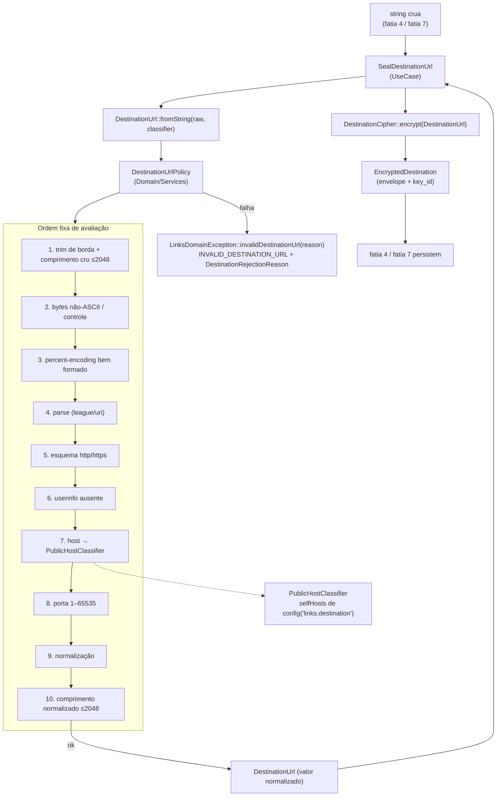

# Links — Política de destino · Design

**Spec**: `.specs/features/links/destination-policy/spec.md`
**Context**: `.specs/features/links/destination-policy/context.md`
**Status**: Draft
**Depende de**: `.specs/features/links/foundation/design.md` (VO `DestinationUrl`, `LinksDomainException`, porta `DestinationCipher`, `config/links.php`)

---

## Architecture Overview

A fatia acrescenta **uma cadeia de validação determinística** entre a string crua e a cifra. Nada nela toca banco, rede ou relógio: são três colaboradores puros mais um serviço de aplicação que sela o resultado.

O ponto central é que o portão é **estrutural, não disciplinar**: `DestinationCipher::encrypt()` já recebe `DestinationUrl` (decidido na fatia 1), então basta garantir que só exista um caminho para construir esse VO — e que ele exija a política completa.



**Por que a política não vive no `FormRequest`:** o `FormRequest` é da fatia 4 e existe uma única vez, enquanto a exigência de `docs/security.md` §8.1 é revalidar **antes de cada persistência de nova versão**. Colocar a regra no domínio e obrigar sua execução na construção do VO faz a fatia 7 herdar a garantia sem escrever nada.

---

## Approach Exploration

### A. Parser de URL

| Abordagem | Prós | Contras | Veredito |
| --- | --- | --- | --- |
| **A1 — `league/uri` 7.8.1 (recomendada)** | **Já vendorizado** (transitivo de `laravel/framework`, verificado em `backend/vendor/league/uri`); RFC 3986; remove porta padrão e minúscula esquema/host de graça; `toString()` idempotente (probado) | É dependência transitiva hoje — precisa virar `require` direto | **Escolhida** |
| A2 — `parse_url()` nativo | Zero dependência | Não valida host, aceita entradas que depois divergem entre parsers, não normaliza porta; obrigaria regex própria na autoridade — exatamente o que `docs/data-model.md` §4 proíbe | Descartada |
| A3 — `Illuminate\Support\Uri` | Fachada Laravel já disponível | É um wrapper fino sobre `league/uri`; adiciona indireção sem ganho e amarra o domínio ao framework | Descartada |

**Comportamento de A1 verificado empiricamente** (probe executado em `fake_link_e2e-backend-1`, PHP 8.4 sem `ext-intl`) — a tabela abaixo é a base de vários requisitos e **não** é suposição:

| Entrada | `league/uri` produz | Consequência para o desenho |
| --- | --- | --- |
| `HTTPS://Example.COM/Path` | `https://example.com/Path` | Minúsculas de esquema/host vêm de graça; caixa do path preservada |
| `http://example.com:80/x`, `https://example.com:443/x`, `https://example.com:/x`, `https://example.com:0443/x` | porta removida | LDST-15 sai do parser |
| `https://example.com:00080/x` | `https://example.com:80/x` | Porta 80 em `https` é customizada e é preservada |
| `https://example.com:8443/x` | preservada | LDST-16 sai do parser |
| `https://example.com` | `https://example.com` (**sem** `/`) | O `/` final de LDST-19 é **nosso**, não do parser |
| `https://example.com./x` | ponto final **preservado** | A remoção do ponto final é **nossa** |
| `https://café.com/x` | `https://xn--caf-dma.com/x` | Converte IDN **mesmo sem `ext-intl`** → a rejeição de não-ASCII tem de ser **nossa e anterior ao parse** |
| `https://example.com/q?a=á` | `?a=%C3%A1` | Percent-encoda bytes não-ASCII → idem acima; é o motivo real de D4 |
| `https://example.com/%`, `/%A` | `/%25`, `/%25A` | Reescreve `%` → a checagem de percent-encoding tem de ser **nossa e anterior ao parse** |
| `https://@example.com/x`, `https://:@…`, `https://u@…` | `getUserInfo()` = `''`, `':'`, `'u'` (nunca `null`) | Detectar userinfo por `!== null` cobre as três formas |
| `https://example.com:65536/x` | porta `65536` aceita | Faixa 1–65535 é **nossa** |
| `https://exa_mple.com/x`, `https://a..b.com/x`, `https://2130706433/x`, `http://0x7f.1/x` | aceitos como reg-name | Sintaxe de hostname e literais inteiros são **nossos** |
| `https://`, `http:///path`, `https://ho st.com/`, `…/x\tz` | `SyntaxError` | Capturar e converter em `MALFORMED_URL` / `CONTROL_CHARACTER` |
| `/a/./b/../c//d`, `#` vazio, `?` vazio, `%2F` | preservados intactos | LDST-17 e LDST-18 saem de graça |

> Regra que emerge da tabela: **tudo que o parser reescreveria em silêncio é verificado antes dele.** O parser é usado para ler a autoridade e para o que ele normaliza corretamente — nunca como validador.

### B. Onde a política é executada

| Abordagem | Prós | Contras | Veredito |
| --- | --- | --- | --- |
| **B1 — `DestinationUrl::fromString(string $raw, PublicHostClassifier $hosts)` (recomendada)** | Um único construtor; impossível obter o VO sem política; a dependência configurável entra explícita na assinatura | Muda a assinatura definida na fatia 1 (`fromString(string): self`) | **Escolhida** |
| B2 — VO fraco + `DestinationUrlFactory` | Assinatura da fatia 1 intacta | Dois caminhos de construção: `fromString()` continuaria produzindo VO sem política, e `encrypt(DestinationUrl)` aceitaria esse VO — o portão vira convenção | Descartada |
| B3 — Política no `FormRequest` | Erro de validação natural em HTTP | Não revalida na fatia 7; duplicaria a regra em dois endpoints | Descartada |

> **Impacto de B1 na fatia 1:** a fatia `foundation` ainda **não foi executada** (`backend/modules/` contém apenas `Auth/`). Se ela for implementada antes desta, T1 desta fatia altera a assinatura e os testes de `DestinationUrl` correspondentes (LFND-10). Se as duas forem executadas na mesma sequência, a fatia 1 pode já nascer com a assinatura final. Nenhum outro consumidor existe.

---

## Code Reuse Analysis

### Componentes existentes a aproveitar

| Componente | Localização | Como usar |
| --- | --- | --- |
| `PasswordPolicy` | `backend/modules/Auth/Domain/Services/PasswordPolicy.php` | Padrão exato a replicar: serviço de domínio `final`, constantes privadas, `violations(): list<Enum>` + `validate(): void` que lança a primeira violação |
| `PasswordViolationCode` | `backend/modules/Auth/Domain/Enums/PasswordViolationCode.php` | Padrão de enum de motivo de rejeição → `DestinationRejectionReason` |
| `EmailAddress` | `backend/modules/Auth/Domain/ValueObjects/EmailAddress.php` | Padrão de VO `final readonly`, construtor privado, `fromString()`/`value()`/`equals()` |
| `AuthDomainException` | `backend/modules/Auth/Exceptions/AuthDomainException.php` | Padrão de exceção com `errorCode` estável e named constructors — mas **sem** repetir o parâmetro `$raw` não usado (ver Risks) |
| `LinksDomainException` | `backend/modules/Links/Exceptions/LinksDomainException.php` (fatia 1) | Estender `invalidDestinationUrl()` para carregar o motivo |
| `DestinationCipher` + `EncryptedDestination` | `backend/modules/Links/Contracts/Services/`, `Domain/ValueObjects/` (fatia 1) | Consumidos como estão; **nenhuma alteração** |
| `config/links.php` | `backend/config/links.php` (fatia 1) | Acrescentar a chave `destination.self_hosts` ao lado de `keyring`/`active_key_id` |
| `LinksServiceProvider` | `backend/modules/Links/ServiceProviders/` (fatia 1) | Acrescentar o bind de `PublicHostClassifier` (singleton, construído da config) |
| `league/uri` | `backend/vendor/league/uri` (7.8.1, transitivo) | Promover a `require` direto em `backend/composer.json` |
| Sentinela anti-vazamento | `frontend/e2e/**` (gate Bearer da Fase 1) | Mesma técnica de token único + varredura, aplicada a log/exceção/trace (LDST-24) |

### Pontos de integração

| Sistema | Método de integração |
| --- | --- |
| `backend/composer.json` | `league/uri` passa a dependência direta (`^7.8`) — sem `composer update` de outros pacotes |
| `backend/config/links.php` | `destination.self_hosts` derivado de `SHORT_HOST` e `APP_URL` |
| `backend/.env.example` / `phpunit.xml` | `SHORT_HOST` já existe (`go.localhost`); `phpunit.xml` fixa `SHORT_HOST` e `APP_URL` determinísticos para o teste da config |
| Fatias 4 e 7 | Consomem `SealDestinationUrl`; nenhuma delas importa `DestinationUrlPolicy` diretamente |
| `docs/openapi.yaml` | **Não alterado** nesta fatia (sem endpoint) |

---

## Components

### `DestinationRejectionReason` (enum)

- **Purpose**: nomear o motivo da rejeição com cardinalidade fixa, sem carregar dado do usuário.
- **Location**: `backend/modules/Links/Domain/Enums/DestinationRejectionReason.php`
- **Interfaces**:
  ```php
  enum DestinationRejectionReason: string {
      case TooLong = 'TOO_LONG';
      case NonAsciiInput = 'NON_ASCII_INPUT';
      case ControlCharacter = 'CONTROL_CHARACTER';
      case InvalidPercentEncoding = 'INVALID_PERCENT_ENCODING';
      case MalformedUrl = 'MALFORMED_URL';
      case SchemeNotAllowed = 'SCHEME_NOT_ALLOWED';
      case UserinfoPresent = 'USERINFO_PRESENT';
      case InvalidHostname = 'INVALID_HOSTNAME';
      case IpLiteral = 'IP_LITERAL';
      case SpecialUseHost = 'SPECIAL_USE_HOST';
      case SelfHost = 'SELF_HOST';
      case InvalidPort = 'INVALID_PORT';
  }
  ```
- **Reuses**: padrão `PasswordViolationCode`

### `PublicHostClassifier`

- **Purpose**: responder se um host **já normalizado** é um hostname público aceitável.
- **Location**: `backend/modules/Links/Domain/Services/PublicHostClassifier.php`
- **Interfaces**:
  - `__construct(/** @param list<string> $selfHosts */ private array $selfHosts)`
  - `reject(string $host): ?DestinationRejectionReason` — `null` quando o host é aceitável
- **Ordem interna**: literal IP → sintaxe de hostname → nome de uso especial → host próprio
- **Regras**:
  - **IP literal**: host começando com `[` ⇒ `IpLiteral` (IPv6); `filter_var($host, FILTER_VALIDATE_IP)` verdadeiro ⇒ `IpLiteral`
  - **Sintaxe**: total ≤253; ≥2 labels; cada label `^[a-z0-9]([a-z0-9-]{0,61}[a-z0-9])?$`; último label `^[a-z]{2,}$` — esta última regra é o que derruba `2130706433`, `0x7f.1` e qualquer outra forma inteira de IPv4
  - **Uso especial** (sufixo exato de label): `localhost`, `local`, `internal`, `home.arpa`, `test`, `invalid`, `example`, `onion`, `alt` ⇒ `SpecialUseHost`
  - **Host próprio**: `$host === $self || str_ends_with($host, '.'.$self)` para cada `$self` ⇒ `SelfHost`
- **Dependencies**: nenhuma — sem DNS, sem I/O, sem config lida internamente (recebe a lista pronta)
- **Nota**: comparação de sufixo é **por label**, nunca por substring — `mylocalhost.com` e `internal-tools.com` passam.

### `DestinationUrlPolicy`

- **Purpose**: executar a cadeia completa na ordem fixa e devolver o valor normalizado, ou o motivo da rejeição.
- **Location**: `backend/modules/Links/Domain/Services/DestinationUrlPolicy.php`
- **Interfaces**:
  - `__construct(private PublicHostClassifier $hosts)`
  - `normalize(string $raw): string` — devolve o valor normalizado ou lança `LinksDomainException::invalidDestinationUrl($reason)`
  - `reject(string $raw): ?DestinationRejectionReason` — variante sem exceção, usada nos testes de matriz
- **Constantes**: `MAX_LENGTH = 2048`
- **Cadeia** (mesma ordem da spec; a primeira que falhar define o motivo):
  1. `$raw = trim($raw, " \t\r\n\0\x0B")` — apenas nas bordas
  2. `strlen($raw) > 2048` ⇒ `TooLong`
  3. `preg_match('/[^\x20-\x7E]/', $raw)` ⇒ `NonAsciiInput` se byte ≥ `\x80`, senão `ControlCharacter` (cobre `\t`, `\r`, `\n`, `\x7F` internos)
  4. `preg_match('/%(?![0-9A-Fa-f]{2})/', $raw)` ⇒ `InvalidPercentEncoding`
  5. `Uri::new($raw)` em `try`/`catch (SyntaxError)` ⇒ `MalformedUrl`
  6. `getScheme()` ∉ {`http`,`https`} ⇒ `SchemeNotAllowed`
  7. `getUserInfo() !== null` ⇒ `UserinfoPresent`
  8. host `null`/vazio ⇒ `MalformedUrl`; host com ponto final é aparado antes de classificar; `$this->hosts->reject($host)` ⇒ motivo devolvido
  9. `getPort()` fora de 1–65535 ⇒ `InvalidPort`
  10. Reconstrução: `Uri::new(...)->withHost($hostSemPontoFinal)`, e `withPath('/')` quando `getPath() === ''`; `toString()`
  11. `strlen($normalized) > 2048` ⇒ `TooLong`
- **Dependencies**: `League\Uri\Uri`, `PublicHostClassifier`, `LinksDomainException`
- **Reuses**: forma de `PasswordPolicy` (`violations()`/`validate()`)
- **Invariante testável**: `normalize(normalize($x)) === normalize($x)` para todo `$x` aceito.

### `DestinationUrl` (VO — modificado)

- **Purpose**: provar, pelo tipo, que um destino em trânsito passou pela política completa.
- **Location**: `backend/modules/Links/Domain/ValueObjects/DestinationUrl.php` (**modifica** a versão da fatia 1)
- **Interfaces**:
  - `static fromString(string $raw, PublicHostClassifier $hosts): self` — **assinatura alterada**
  - `value(): string` (valor normalizado), `equals(self $other): bool`
- **Mudança**: as checagens inline da fatia 1 (esquema, tamanho, host não vazio) saem do VO e passam a ser parte da cadeia de `DestinationUrlPolicy`, que o VO instancia com o classificador recebido.
- **Regra**: não existe caminho público que devolva o valor cru; `value()` é sempre o normalizado.

### `LinksDomainException` (modificado)

- **Purpose**: carregar o motivo interno sem mudar o código público.
- **Location**: `backend/modules/Links/Exceptions/LinksDomainException.php` (**modifica** a versão da fatia 1)
- **Interfaces**:
  - `static invalidDestinationUrl(DestinationRejectionReason $reason): self` — `errorCode` continua `INVALID_DESTINATION_URL`
  - `reason(): ?DestinationRejectionReason`
- **Regra de segurança**: a mensagem é **sempre** `The destination URL is not allowed.`, independente do motivo, e o named constructor **não aceita** a URL como parâmetro — não há como interpolá-la por engano.

### `SealDestinationUrl` (UseCase)

- **Purpose**: ser o único caminho que leva de string crua a `EncryptedDestination`, revalidando a cada chamada.
- **Location**: `backend/modules/Links/UseCases/SealDestinationUrl.php`
- **Interfaces**:
  - `__construct(private PublicHostClassifier $hosts, private DestinationCipher $cipher)`
  - `__invoke(string $raw): EncryptedDestination`
- **Comportamento**: `DestinationUrl::fromString($raw, $this->hosts)` → `$this->cipher->encrypt($vo)`. Rejeição lança antes de qualquer chamada ao cipher.
- **Dependencies**: `PublicHostClassifier`, `DestinationCipher` (porta)
- **Reuses**: estilo de UseCase invocável de `Modules\Auth\UseCases`
- **Consumidores**: fatia 4 (primeira versão) e fatia 7 (cada nova versão) — nenhuma delas chama `encrypt()` diretamente.

### Config `backend/config/links.php` (modificado)

```php
'destination' => [
    'keyring' => /* fatia 1 */,
    'active_key_id' => /* fatia 1 */,
    // NOVO: hosts próprios, derivados de env e normalizados para minúsculas sem porta
    'self_hosts' => array_values(array_unique(array_filter([
        env('SHORT_HOST'),
        parse_url((string) env('APP_URL'), PHP_URL_HOST),
    ]))),
],
```

> `parse_url` aqui é aceitável e intencional: a entrada é config controlada pelo operador, não entrada de usuário, e só se extrai o host de uma URL própria. A proibição de `parse_url` vale para o destino não confiável.

### `LinksServiceProvider` (modificado)

- Acrescenta: `$this->app->singleton(PublicHostClassifier::class, fn () => new PublicHostClassifier(config('links.destination.self_hosts')));`
- `SealDestinationUrl` é resolvido por autowiring (ambas as dependências são bindadas).

---

## Data Models

Nenhum. A fatia não cria nem altera tabela, coluna, índice ou migration — `link_destination_versions` já nasceu completa na fatia 1. O único dado novo é a chave de configuração `links.destination.self_hosts`.

---

## Error Handling Strategy

| Cenário | Tratamento | Impacto |
| --- | --- | --- |
| Qualquer regra da política reprova | `LinksDomainException::invalidDestinationUrl($reason)` antes de qualquer cifra ou I/O | Nenhuma escrita; fatia 4 mapeia para `422 VALIDATION_FAILED` + `INVALID_DESTINATION_URL` |
| `league/uri` lança `SyntaxError` | Capturada e convertida em motivo `MalformedUrl` | Nunca vaza mensagem do parser (que **contém a URL**) para fora do domínio |
| Motivo interno | Disponível em `reason()` para teste e métrica | Nunca atravessa a fronteira HTTP |
| `self_hosts` vazio | Config inválida de ambiente; `SHORT_HOST` é obrigatório em `docker/scripts/validate-env.sh` | O classificador funciona, mas o teste de config assere lista não vazia no ambiente de teste |
| Destino válido, cifra falha | Propaga a exceção da fatia 1 (`DestinationDecryptionFailed` só na decifra; falha de keyring é de boot) | Sem tratamento novo nesta fatia |
| Valor decifrado no redirect | Reconstruído como `DestinationUrl` pela fatia 10 — política reaplicada | Ver Risks (endurecimento de política) |

---

## Risks & Concerns

| Concern | Location | Impact | Mitigation |
| --- | --- | --- | --- |
| **Mensagem do `SyntaxError` de `league/uri` contém a URL inteira** (`The uri \`https://…\` is invalid`) — probado | `DestinationUrlPolicy` passo 5 | Se a exceção do parser escapar ou for encadeada como `previous`, a URL vaza em log e trace, quebrando LDST-24 | A exceção é capturada e **descartada**: nunca encadeada como `previous`, nunca relançada. O teste de sentinela (T9) cobre justamente o caminho `MALFORMED_URL` |
| `decrypt()` da fatia 1 devolve `DestinationUrl`, reconstruindo o VO — e portanto **reaplicando a política** | `backend/modules/Links/Contracts/Services/DestinationCipher.php` (fatia 1) | Um endurecimento futuro da política tornaria destinos já persistidos irreconstruíveis: o redirect de um link válido passaria a falhar | Registrado como risco conhecido desta fatia. A política nasce aqui na sua forma completa, então nenhum valor persistido pode nascer inválido. Qualquer regra **nova** adicionada depois exige decidir explicitamente entre migração de dados ou construtor de valor legado — a decisão pertence a quem endurecer, e a fatia 10 deve mapear a falha para `503`, nunca para `Location` vazio |
| `AuthDomainException::invalidEmail(string $raw)` recebe o valor cru e **não o usa** | `backend/modules/Auth/Exceptions/AuthDomainException.php:28` | Precedente convida a repetir a assinatura em `Links`; um dia alguém interpola `$raw` na mensagem e vaza a URL | `invalidDestinationUrl()` recebe **apenas** o enum. Divergir do precedente é deliberado e está documentado aqui |
| `league/uri` é dependência **transitiva** | `backend/composer.json` | Um `composer update` do framework pode removê-la ou trocar de major sem aviso, quebrando o domínio | T2 promove a `require` direto com constraint `^7.8` |
| Política é o **único** filtro entre entrada de usuário e header `Location` | toda a fatia | Um furo aqui vira redirect aberto para rede interna | Matriz de teste orientada a motivo + sensor de discriminação do Verifier (mutação por regra: remover cada checagem deve matar pelo menos um teste) |
| Sem DNS, hostname público que resolve para IP privado é aceito | decisão D1 | SSRF por resolução continua possível se algum dia existir fetch server-side | Aceito e documentado na spec e no contexto; `docs/security.md` §8.1 condiciona qualquer fetch futuro a isolamento próprio |
| PCOV não mede branches; o gate de 85% é de métodos | `docs/testing.md` §4 | Cadeia com 12 ramos pode atingir o gate sem cobrir todos os motivos | A matriz exige **um caso por motivo** (12 motivos), independentemente do número reportado pelo gate |
| `trim` de borda muda a entrada antes da checagem de comprimento | `DestinationUrlPolicy` passo 1 | URL de 2.050 caracteres com 3 espaços à direita passaria a ter 2.047 e seria aceita | Comportamento **intencional** e coberto por teste explícito: whitespace de borda não é conteúdo da URL |

---

## Tech Decisions

| Decisão | Escolha | Racional |
| --- | --- | --- |
| Parser | `league/uri` 7.8.1, promovido a dependência direta | Único parser RFC 3986 já disponível; comportamento verificado por probe, não presumido |
| Checagens anteriores ao parser | não-ASCII, controle e percent-encoding | O parser reescreve os três em silêncio (probado); validar depois dele validaria o valor errado |
| Detecção de `userinfo` | `getUserInfo() !== null` | Cobre `u:p@`, `u@`, `@` e `:@` — as quatro formas retornam string, nunca `null` (probado) |
| Rejeição de IP literal | Todos, inclusive públicos | Torna a denylist de faixas RFC 6890 desnecessária; um destino legítimo tem nome |
| TLD alfabético ≥2 | Regra de sintaxe de host | Derruba de uma vez formas inteiras/hex de IPv4 sem lista de faixas |
| Classificador separado do parser | Dois serviços | O classificador é a única peça configurável; separá-lo mantém a política pura e o classificador reutilizável pela fatia 10 |
| Motivo como enum, código público único | `DestinationRejectionReason` interno | Observabilidade sem virar oráculo (D2) |
| `SealDestinationUrl` como UseCase | Ponto único de selagem | Faz a revalidação por versão ser estrutural, não disciplinar |
| Sem novo módulo `Shared` | Tudo em `Links` | Mantém a decisão D2 da fatia 1 |

> **Decisão de nível de projeto:** o uso de `league/uri` como parser oficial (e a proibição de `parse_url`/regex para autoridade de entrada não confiável) vale para toda fatia que leia URL — inclusive `redirect-http` e o BFF. Registrada como **AD-019** em `.specs/STATE.md`.

---

## Conformidade com decisões ativas (`.specs/STATE.md`)

| Decisão | Como esta fatia conforma |
| --- | --- |
| AD-005 (pin de stack) | Nenhuma mudança de imagem, versão de runtime ou extensão PHP — `ext-intl` **não** é adicionada |
| AD-006 (`server_name` no Nginx) | `SHORT_HOST` é lido só como valor de config; nenhuma rota com `domain()` |
| AD-009 (Pint, Larastan 6, PHPMD, Pest, gates via Docker) | Código novo é `final`, tipado e strict; gates rodam por `make` |
| AD-011 (`fake_link_testing`) | Fatia não tem I/O de banco; nenhuma suíte nova toca PostgreSQL |
| AD-016 (contract tests e Spectral) | Sem superfície HTTP nesta fatia; `docs/openapi.yaml` não muda |
