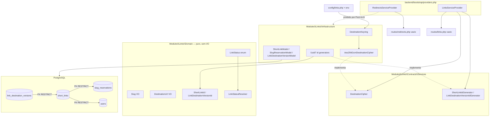

# Links — Fundação dos módulos · Design

**Spec**: `.specs/features/links/foundation/spec.md`
**Context**: `.specs/features/links/foundation/context.md`
**Status**: Draft

---

## Architecture Overview

A fatia entrega três blocos independentes que se encontram apenas no `LinksServiceProvider`: **domínio puro** (VOs e derivação de estado), **criptografia de destino** (keyring + envelope AES-256-GCM) e **persistência** (três migrations + Models Eloquent). `Redirects` nasce como casca: provider, arquivo de rotas vazio e suíte registrada — sem domínio próprio, porque toda regra que torna um link utilizável pertence a `Links` (`docs/architecture.md` §4.2).



**Fronteira principal a proteger:** `Redirects` pode, no futuro, depender de `Links\Contracts` e `Links\DTOs` — nunca de `Links\Infrastructure` ou `Links\Domain`. Esta fatia introduz a regra Pest Arch que torna isso executável, hoje ainda sem código que a viole (é o discrimination sensor da fatia).

---

## Approach Exploration

As quatro escolhas estruturais maiores já estão travadas em `context.md` (D1–D4). Restaram duas decisões de design com alternativas reais:

### A. Formato do envelope cifrado

| Abordagem | Trade-off |
| --- | --- |
| **A1 (escolhida)** — string única `base64(version‖nonce‖tag‖ciphertext)`, `key_id` em coluna separada | Um único `text` no banco, sem parsing frágil; `key_id` consultável e rotacionável sem decifrar; AAD amarra versão + `key_id` |
| A2 — colunas separadas para nonce e tag | Schema divergiria de `docs/data-model.md` §4, que define `destination_url` como o envelope completo |
| A3 — JSON com campos nomeados | Legível, mas ~40% maior por registro e convida leitura parcial do envelope |

**Recomendação: A1.** É a única compatível com o schema já documentado.

### B. Generalização do gate de cobertura

| Abordagem | Trade-off |
| --- | --- |
| **B1 (escolhida)** — generalizar `check-auth-coverage-gate.php` em `check-module-coverage-gate.php` com mapa `módulo → (linhas, métodos)` | Um script, três módulos; limiar de Auth preservado; um só lugar para o parser de HTML do PCOV |
| B2 — copiar o script para `check-links-coverage-gate.php` e `check-redirects-coverage-gate.php` | Zero risco de regressão no gate Auth, mas triplica o parser frágil de HTML |
| B3 — trocar o parser de HTML por Clover XML | Mais robusto que regex sobre HTML, porém muda o formato de relatório usado hoje e extrapola o escopo da fatia |

**Recomendação: B1**, com a preservação do comportamento do gate Auth como critério de aceite explícito (LFND-19). B3 fica registrado em `Risks & Concerns` como dívida conhecida.

---

## Code Reuse Analysis

### Componentes existentes a aproveitar

| Componente | Localização | Como usar |
| --- | --- | --- |
| `EmailAddress` | `backend/modules/Auth/Domain/ValueObjects/EmailAddress.php` | Padrão de VO: `final readonly`, construtor privado, `fromString()`, `value()`, `equals()` — replicar em `Slug` e `DestinationUrl` |
| `UserId` | `backend/modules/Auth/Domain/ValueObjects/UserId.php` | Padrão de VO de identidade UUID v7 — replicar em `ShortLinkId` e `LinkDestinationVersionId` |
| `AuthDomainException` | `backend/modules/Auth/Exceptions/AuthDomainException.php` | Padrão de exceção de domínio com `errorCode` estável e named constructors — replicar como `LinksDomainException` |
| `UserStatus` | `backend/modules/Auth/Domain/Enums/UserStatus.php` | Padrão de enum backed string — replicar em `LinkStatus` |
| `Uuid7UserIdGenerator` + porta `UserIdGenerator` | `backend/modules/Auth/Infrastructure/Identity/`, `Contracts/Services/` | Padrão port + adaptador `Str::uuid7()` — replicar para os dois novos IDs |
| `AuthServiceProvider` | `backend/modules/Auth/ServiceProviders/AuthServiceProvider.php:114-124` | Padrão de `Route::prefix(...)->group(fn () => $this->loadRoutesFrom(...))` e de `bind()` de ports |
| Migration `auth_tokens` | `backend/database/migrations/2026_07_23_143256_create_auth_tokens_table.php` | Padrão de `uuid()->primary()`, `timestampTz`, `restrictOnDelete()` e `CHECK` via `DB::statement` |
| `UserModel` + `UserModelFactory` | `backend/modules/Auth/Infrastructure/Persistence/Eloquent/` | Padrão de Model com `HasFactory`, `$table`, casts e factory determinística |
| `ModularMonolithTest` | `backend/tests/Architecture/ModularMonolithTest.php` | Já enumera `Links` e `Redirects` em `$domainModules` — basta acrescentar a regra de seam |
| `check-auth-coverage-gate.php` | `backend/scripts/check-auth-coverage-gate.php` | Generalizar (abordagem B1), preservando o parser e o comportamento atual |

### Pontos de integração

| Sistema | Método de integração |
| --- | --- |
| `bootstrap/providers.php` | Acrescentar os dois providers ao array existente |
| `backend/phpunit.xml` | Acrescentar diretórios às suítes `Unit`/`Feature`/`Integration` e aos `<source><include>`; acrescentar env do keyring de teste |
| `backend/phpstan.neon` | Acrescentar `modules/Links` e `modules/Redirects` a `paths` (e `ignoreErrors` de Pest para `modules/*/Tests/*`, como já existe para Auth) |
| `backend/composer.json` (`test:coverage`) | Trocar a chamada do script Auth pelo script generalizado |
| `users` (tabela Auth) | `short_links.user_id` referencia `users.id` com `RESTRICT` — única dependência de schema entre módulos, permitida por ser FK de banco e não import de código |
| `backend/routes/web.php` | **Não alterado** nesta fatia; os placeholders (`/`, `/robots.txt`, `/{slug}` → 404) seguem servindo o host curto até a fatia 10 |

---

## Components

### `LinksDomainException`

- **Purpose**: exceção única de domínio do módulo, com códigos estáveis para as invariantes desta fatia.
- **Location**: `backend/modules/Links/Exceptions/LinksDomainException.php`
- **Interfaces**:
  - `static invalidSlug(): self` — código `INVALID_SLUG`
  - `static invalidDestinationUrl(): self` — código `INVALID_DESTINATION_URL`
  - `static invalidShortLinkId(): self` / `static invalidLinkDestinationVersionId(): self`
  - `errorCode(): string`
- **Dependencies**: `DomainException`
- **Reuses**: `AuthDomainException` (estrutura e nomenclatura)
- **Nota de segurança**: os named constructors **não** recebem nem interpolam o valor inválido na mensagem — evita que URL de destino vaze via exceção serializada (LFND-16).

### `DestinationDecryptionFailed`

- **Purpose**: sinalizar falha de decifra sem expor plaintext, `key_id` ou envelope.
- **Location**: `backend/modules/Links/Exceptions/DestinationDecryptionFailed.php`
- **Interfaces**: `static unknownKeyId(): self`, `static authenticationFailed(): self`, `static malformedEnvelope(): self`
- **Dependencies**: `RuntimeException`
- **Nota**: mensagem fixa e genérica em todos os casos; o mapeamento para `503` é da fatia 10/11.

### `Slug` (VO)

- **Purpose**: garantir que um slug em trânsito no domínio é ASCII minúsculo e cabe em `varchar(48)`.
- **Location**: `backend/modules/Links/Domain/ValueObjects/Slug.php`
- **Interfaces**: `static fromString(string $raw): self`, `value(): string`, `equals(self $other): bool`
- **Invariantes desta fatia**: `preg_match('/^[a-z0-9-]{1,48}$/', $raw)`; **sem normalização** — maiúscula é rejeitada, não convertida.
- **Dependencies**: `LinksDomainException`
- **Reuses**: padrão `EmailAddress`

### `DestinationUrl` (VO)

- **Purpose**: garantir esquema e limite de tamanho do destino antes de qualquer cifra ou persistência.
- **Location**: `backend/modules/Links/Domain/ValueObjects/DestinationUrl.php`
- **Interfaces**: `static fromString(string $raw): self`, `value(): string`
- **Invariantes desta fatia**: comprimento ≤2.048; `parse_url` com `scheme` ∈ {`http`,`https`} e `host` não vazio; valor preservado **byte a byte** (query e fragmento intactos).
- **Dependencies**: `LinksDomainException`
- **Nota**: a autoridade é lida por parser de URL, nunca por busca textual (`docs/data-model.md` §4) — mesmo com a política completa vindo na fatia 3, o parser já entra aqui para que a fatia 3 só acrescente regras.

### `ShortLinkId` / `LinkDestinationVersionId` (VOs)

- **Purpose**: tipar identificadores UUID v7 e rejeitar UUID de outra versão antes da persistência.
- **Location**: `backend/modules/Links/Domain/ValueObjects/`
- **Interfaces**: `static fromString(string $raw): self`, `value(): string`, `equals(self $other): bool`
- **Reuses**: `Modules\Auth\Domain\ValueObjects\UserId` como referência de implementação (**cópia do padrão, não import** — módulos não importam domínio um do outro).

### `LinkStatus` (enum) + `LinkStatusResolver`

- **Purpose**: expor os quatro estados efetivos e derivá-los, sem persistir estado.
- **Location**: `backend/modules/Links/Domain/Enums/LinkStatus.php`, `backend/modules/Links/Domain/Services/LinkStatusResolver.php`
- **Interfaces**:
  - `enum LinkStatus: string { case Active = 'active'; case Inactive = 'inactive'; case Expired = 'expired'; case Blocked = 'blocked'; }`
  - `LinkStatusResolver::resolve(?DateTimeImmutable $blockedAt, ?DateTimeImmutable $expiresAt, bool $isEnabled, DateTimeImmutable $now): LinkStatus`
- **Dependencies**: nenhuma — função pura, relógio recebido por parâmetro (testabilidade sem fake global)
- **Regra**: `blockedAt !== null` → `Blocked`; senão `expiresAt !== null && expiresAt <= now` → `Expired`; senão `!isEnabled` → `Inactive`; senão `Active`.

### `DestinationCipher` (porta) e `EncryptedDestination`

- **Purpose**: contrato de cifra/decifra de destino, sem vazar detalhes de algoritmo para o restante do módulo.
- **Location**: `backend/modules/Links/Contracts/Services/DestinationCipher.php`, `backend/modules/Links/Domain/ValueObjects/EncryptedDestination.php`
- **Interfaces**:
  - `encrypt(DestinationUrl $destination): EncryptedDestination`
  - `decrypt(string $envelope, string $keyId): DestinationUrl`
  - `EncryptedDestination::envelope(): string`, `EncryptedDestination::keyId(): string`
- **Dependencies**: `DestinationUrl`, `DestinationDecryptionFailed`

### `DestinationKeyring`

- **Purpose**: carregar, validar e servir as chaves de destino a partir da config, falhando cedo.
- **Location**: `backend/modules/Links/Infrastructure/Crypto/DestinationKeyring.php`
- **Interfaces**: `static fromConfig(array $keyring, string $activeKeyId): self`, `activeKeyId(): string`, `keyFor(string $keyId): string`
- **Dependencies**: `config('links.destination')`
- **Regras**: cada chave decodificada SHALL ter exatamente 32 bytes; `activeKeyId` SHALL existir no mapa; keyring vazio SHALL falhar. Falhas lançam `InvalidArgumentException` na construção (boot), nunca em runtime de request.

### `Aes256GcmDestinationCipher`

- **Purpose**: implementar o envelope AES-256-GCM autenticado.
- **Location**: `backend/modules/Links/Infrastructure/Crypto/Aes256GcmDestinationCipher.php`
- **Interfaces**: implementa `DestinationCipher`
- **Dependencies**: `DestinationKeyring`, `openssl_encrypt`/`openssl_decrypt`, `random_bytes`
- **Formato do envelope** (abordagem A1):

  ```
  base64_encode( VERSION(1 byte = 0x01) ‖ NONCE(12 bytes) ‖ TAG(16 bytes) ‖ CIPHERTEXT )
  AAD = "fld-destination-v1|" . key_id
  ```

- **Regras**: nonce novo por operação via `random_bytes(12)`; tag verificada pelo próprio `openssl_decrypt`; `key_id` **não** entra no material cifrado (fica em coluna própria) mas entra no AAD, impedindo troca cruzada de envelopes entre chaves.

### `ShortLinkIdGenerator` / `LinkDestinationVersionIdGenerator` + adaptadores UUID v7

- **Purpose**: gerar identificadores na aplicação, substituíveis por fakes determinísticos em teste.
- **Location**: `backend/modules/Links/Contracts/Services/`, `backend/modules/Links/Infrastructure/Identity/`
- **Interfaces**: `generate(): ShortLinkId` / `generate(): LinkDestinationVersionId`
- **Reuses**: `Uuid7UserIdGenerator` (`Str::uuid7()`)

### Eloquent Models e Factories

- **Purpose**: acesso persistente às três tabelas e fixtures determinísticas para provar constraints.
- **Location**: `backend/modules/Links/Infrastructure/Persistence/Eloquent/{Models,Factories}/`
- **Componentes**: `SlugReservationModel` (PK `slug`, string, sem incrementing, sem timestamps default), `ShortLinkModel` (PK `id` uuid, `$incrementing = false`, `$keyType = 'string'`), `LinkDestinationVersionModel` (idem)
- **Dependencies**: migrations aplicadas
- **Reuses**: `UserModel` / `UserModelFactory` como padrão
- **Nota**: `ShortLinkModelFactory` gera `user_id` a partir de um `users` existente — a factory **não** importa `UserModelFactory` de `Auth` (seam de módulo); recebe o `user_id` como estado obrigatório e os testes criam o usuário via a factory de Auth **no próprio teste**, não dentro do módulo `Links`.

### `LinksServiceProvider`

- **Purpose**: compor o módulo — bindings de ports e arquivo de rotas reservado.
- **Location**: `backend/modules/Links/ServiceProviders/LinksServiceProvider.php`
- **Registra**: `DestinationCipher` → `Aes256GcmDestinationCipher` (singleton, keyring construído a partir de `config('links.destination')`), `ShortLinkIdGenerator`, `LinkDestinationVersionIdGenerator`
- **Rotas**: `Route::prefix('api/v1/links')->group(fn () => $this->loadRoutesFrom(__DIR__.'/../Infrastructure/Http/routes/links.php'))` com o arquivo **sem nenhuma rota definida**
- **Reuses**: `AuthServiceProvider`

### `RedirectsServiceProvider`

- **Purpose**: registrar o módulo `Redirects` e reservar a superfície do host curto.
- **Location**: `backend/modules/Redirects/ServiceProviders/RedirectsServiceProvider.php`
- **Registra**: nenhum binding nesta fatia
- **Rotas**: carrega `Infrastructure/Http/routes/redirects.php`, **sem nenhuma rota definida**; os placeholders de `routes/web.php` seguem intactos

### `check-module-coverage-gate.php`

- **Purpose**: aplicar limiares de cobertura por módulo em um único script.
- **Location**: `backend/scripts/check-module-coverage-gate.php` (substitui `check-auth-coverage-gate.php`)
- **Interfaces**: mapa `['Auth' => [80.0, 80.0], 'Links' => [90.0, 85.0], 'Redirects' => [90.0, 85.0]]`; falha com exit code 1 listando cada módulo fora do limiar
- **Reuses**: parser de HTML PCOV do script atual, sem alteração de lógica

---

## Data Models

### `slug_reservations`

```sql
slug        varchar(48) PRIMARY KEY,
reserved_at timestamptz NOT NULL
```

Sem proprietário, sem FK de saída, nunca removida.

### `short_links`

```sql
id          uuid PRIMARY KEY,
user_id     uuid        NOT NULL REFERENCES users(id) ON DELETE RESTRICT ON UPDATE RESTRICT,
slug        varchar(48) NOT NULL UNIQUE REFERENCES slug_reservations(slug) ON DELETE RESTRICT ON UPDATE RESTRICT,
slug_source text        NOT NULL CHECK (slug_source IN ('automatic','custom')),
title       varchar(160) NULL,
is_enabled  boolean     NOT NULL,
blocked_at  timestamptz NULL,
expires_at  timestamptz NULL,
version     bigint      NOT NULL,
created_at  timestamptz NOT NULL,
updated_at  timestamptz NOT NULL
-- INDEX (user_id)
```

**Relacionamentos**: pertence a um `users`; referencia exatamente uma `slug_reservations`; tem N `link_destination_versions`, das quais exatamente uma está aberta.
**Ausência intencional**: nenhuma coluna de estado efetivo — ele é derivado por `LinkStatusResolver`.

### `link_destination_versions`

```sql
id            uuid PRIMARY KEY,
short_link_id uuid        NOT NULL REFERENCES short_links(id) ON DELETE RESTRICT ON UPDATE RESTRICT,
destination_url text      NOT NULL,   -- envelope AES-256-GCM (base64)
key_id        varchar     NOT NULL,
valid_from    timestamptz NOT NULL,
valid_to      timestamptz NULL,
CHECK (valid_to IS NULL OR valid_to > valid_from)
-- UNIQUE INDEX (short_link_id) WHERE valid_to IS NULL
-- INDEX (short_link_id, valid_from DESC)
```

### Config `backend/config/links.php`

```php
return [
    'destination' => [
        // ['key-2026-08' => '<32 bytes>'] decodificado de base64 do env
        'keyring' => /* parse de LINKS_DESTINATION_KEYRING */,
        'active_key_id' => env('LINKS_DESTINATION_ACTIVE_KEY_ID'),
    ],
];
```

Formato do env `LINKS_DESTINATION_KEYRING`: JSON `{"key_id": "<base64 de 32 bytes>"}`. Nenhuma chave real é versionada; `.env.example` recebe placeholder e `phpunit.xml` recebe chave de teste determinística e obviamente falsa.

---

## Error Handling Strategy

| Cenário | Tratamento | Impacto |
| --- | --- | --- |
| `Slug` inválido | `LinksDomainException::invalidSlug()` antes de qualquer I/O | Nenhuma escrita; fatia 2 mapeia para `422` |
| `DestinationUrl` inválida | `LinksDomainException::invalidDestinationUrl()`; valor bruto **não** entra na mensagem | Nenhuma escrita nem cifra |
| `key_id` desconhecido na decifra | `DestinationDecryptionFailed::unknownKeyId()` | Sem plaintext; fatia 10/11 mapeia para `503` |
| Tag GCM inválida (envelope adulterado) | `openssl_decrypt` retorna `false` → `DestinationDecryptionFailed::authenticationFailed()` | Nunca produz `Location` |
| Envelope malformado / versão desconhecida | `DestinationDecryptionFailed::malformedEnvelope()` | Idem |
| `active_key_id` ausente ou chave ≠ 32 bytes | `InvalidArgumentException` na construção do keyring (boot do container) | Aplicação falha alto em vez de cifrar fraco |
| Violação de FK / UNIQUE / CHECK | Propaga `QueryException` do PostgreSQL; nenhuma validação em PHP substitui a constraint | Constraint é a autoridade (`docs/data-model.md` §9) |
| Segunda versão aberta do mesmo link | Índice parcial único rejeita o insert | Garantia sob concorrência real, não sob mock |

---

## Risks & Concerns

| Concern | Location | Impact | Mitigation |
| --- | --- | --- | --- |
| Regras Pest Arch de `Links`/`Redirects` passam **vácuas** hoje — namespaces vazios | `backend/tests/Architecture/ModularMonolithTest.php:24-60` | Falsa sensação de que os seams estão protegidos | T14 adiciona a regra `Redirects ↛ Links\{Infrastructure,Domain}` e o Verifier executa mutação (import proibido) para provar que ela mata o mutante |
| Gate de cobertura parseia HTML do PCOV com regex | `backend/scripts/check-auth-coverage-gate.php:16-29` | Mudança de template do PCOV quebra o gate silenciosamente (ou o faz passar) | T15 mantém o parser mas adiciona teste do script com relatórios-fixture acima e abaixo do limiar (prova que o gate falha quando deve) — migrar para Clover XML fica registrado como dívida |
| PHPMD analisa somente `app` (`composer md`) | `backend/composer.json:63-65` | Complexidade e acoplamento dos módulos nunca são medidos — já vale para Auth | Fora de escopo (declarado na spec); registrado aqui como dívida transversal a tratar na fatia `module-closure` |
| Placeholder `GET /{slug}` já existe em `routes/web.php` | `backend/routes/web.php:16-18` | Um provider de `Redirects` que registre rota do host curto agora criaria conflito silencioso | O arquivo de rotas de `Redirects` nasce vazio e `web.php` não é tocado (AC LFND-03 assere ausência de rotas novas) |
| `short_links.user_id` cria dependência de schema `Links` → `Auth` | migration | FK entre módulos pode ser lida como violação de fronteira | É FK de banco, não import de código: `docs/architecture.md` §5 já prevê `Links → Auth`; a factory de `Links` **não** importa a factory de `Auth` |
| Chave de destino em env pode vazar para log de boot | `config/links.php` | Comprometimento do keyring | Config nunca é `dd`/`dump`ada; keyring lança exceção sem incluir material de chave; AC LFND-16 cobre logs |
| PCOV não mede branches | `docs/testing.md` §4 | Gate de 85% de "branches" é, na prática, cobertura de métodos | Já documentado no projeto; a spec explicita o proxy para não gerar leitura otimista |

---

## Tech Decisions

| Decisão | Escolha | Racional |
| --- | --- | --- |
| Formato do envelope | `base64(0x01 ‖ nonce12 ‖ tag16 ‖ ciphertext)`, `key_id` em coluna | Compatível com `destination_url text` de `docs/data-model.md` §4; rotação sem decifrar |
| AAD | `"fld-destination-v1|" . key_id` | Amarra envelope a versão e chave; troca cruzada falha na autenticação |
| Relógio do `LinkStatusResolver` | `DateTimeImmutable $now` por parâmetro (sem port `Clock`) | Função pura e testável sem fake global; um port `Clock` entra quando um UseCase precisar dele |
| VOs replicados, não compartilhados | `ShortLinkId` copia o padrão de `UserId` sem importar `Modules\Auth` | `docs/architecture.md` §4.0 proíbe import de `Domain` entre módulos |
| Gate de cobertura | Script único parametrizado por módulo | Evita triplicar o parser frágil |
| `Redirects` sem `Domain` nesta fatia | Só provider + rotas + testes | Toda regra de utilizabilidade pertence a `Links` (§4.2); criar `Domain` vazio violaria `LARAVEL_CODE_DESIGN.md` §6.2 |
| Chave de teste | Valor determinístico e falso em `phpunit.xml` | Fixtures não carregam segredo real (`docs/testing.md` §2) |

> Nenhuma destas decisões altera ou supersede `AD-001`…`AD-018`. Todas as decisões ativas relevantes (AD-006, AD-009, AD-010, AD-011, AD-012, AD-016) são **conformadas**. Nenhum novo `AD-NNN` é proposto por esta fatia — o formato do envelope é local ao módulo `Links`; se as fatias 5 e 11 adotarem o mesmo formato, aí sim vale promover a decisão a `AD-019`.

---

## Conformidade com decisões ativas (`.specs/STATE.md`)

| Decisão | Como esta fatia conforma |
| --- | --- |
| AD-006 (roteamento por `server_name` no Nginx) | Nenhum `domain()` em rotas; providers apenas reservam prefixos |
| AD-009 (stack de qualidade + gates via Docker) | PHPStan nível 6 estendido aos módulos; todos os gates rodam via `make` |
| AD-010 / AD-012 (UUID v7 na aplicação) | `id` e `short_link_id` são `uuid`; ports de geração com `Str::uuid7()` |
| AD-011 (`fake_link_testing`) | Todos os testes de integração da fatia; `phpunit.xml` já fixa o banco |
| AD-016 (contract tests em `modules/{Module}/Tests/Contract/`) | Sem superfície HTTP nesta fatia; diretório `Contract/` só nasce nas fatias 4+ |
