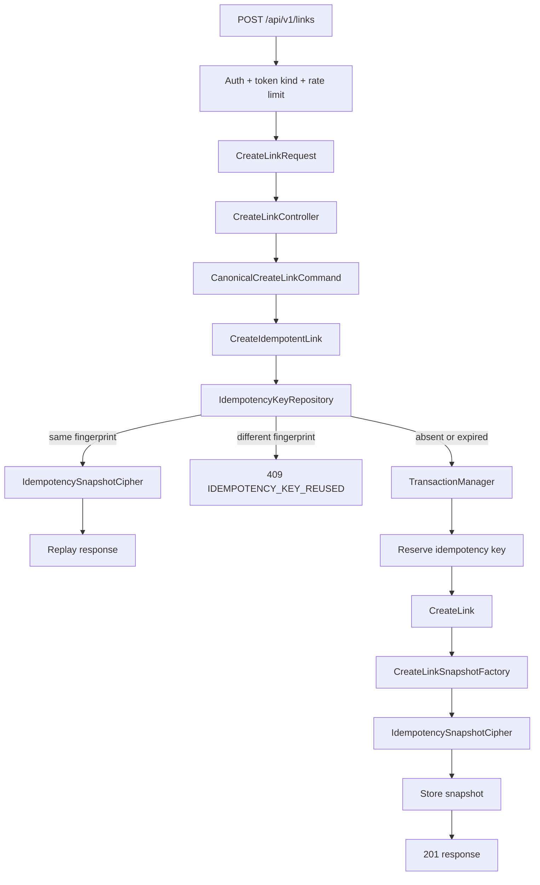

# Links — Idempotência · Design

**Spec:** [spec.md](./spec.md)  
**Status:** Aprovado — 2026-09-18  
**Decisões aplicáveis:** AD-003, AD-009, AD-011, AD-012, AD-016, AD-019 e AD-021

---

## Architecture Overview

Um adaptador de aplicação específico para a criação idempotente assume a fronteira transacional hoje localizada em `CreateLink`. Isso evita que o Controller manipule transações e permite confirmar, como uma unidade, a reserva idempotente, a criação já existente e o snapshot cifrado. `CreateLink` passa a coordenar somente a criação do recurso dentro da transação recebida; o novo UseCase trata chave, fingerprint, snapshot e replay.



`CreateLink` atualmente abre `DB::transaction` diretamente. A refatoração substitui esse detalhe por `TransactionManager` (Contract), implementado na Infrastructure com `DB::transaction`. A nova fronteira engloba idempotência e criação; transações aninhadas não são usadas. A documentação Laravel 13 confirma rollback automático para exceções e suporte a tentativas explícitas de deadlock; esta fatia mantém **uma tentativa**, pois retentar automaticamente a criação poderia estender locks e ocultar indisponibilidade sem uma política de retry já especificada.

---

## Code Reuse Analysis

| Componente | Localização | Uso |
| --- | --- | --- |
| `CreateLink` | `backend/modules/Links/UseCases/CreateLink.php` | Reutilizado para reserva de slug, link e primeira versão; deixa de abrir a transação |
| `CreateLinkRequest` | `backend/modules/Links/Infrastructure/Http/Requests/CreateLinkRequest.php` | Valida `Idempotency-Key` e constrói o comando normalizado |
| `CreateLinkController` | `backend/modules/Links/Infrastructure/Http/Controllers/CreateLinkController.php` | Delega para o novo UseCase e devolve resposta criada ou replay |
| `LinkResponseFactory` | `backend/modules/Links/Infrastructure/Http/Responses/LinkResponseFactory.php` | Fonte única para serializar o `201` e seus headers semânticos |
| `LinkETag` | `backend/modules/Links/Domain/Services/LinkETag.php` | Calcula o ETag antes de gerar o snapshot |
| `DestinationKeyring` e `Aes256GcmDestinationCipher` | `backend/modules/Links/Infrastructure/Crypto/` | Referência de envelope AES-256-GCM, sem compartilhar o keyring |
| `LinksServiceProvider` | `backend/modules/Links/ServiceProviders/LinksServiceProvider.php` | Registra Contracts, adaptadores, command e schedule |
| `CreateLinkConcurrencyTest` | `backend/modules/Links/Tests/Integration/CreateLinkConcurrencyTest.php` | Precedente para duas conexões PostgreSQL reais |
| `ApiFormRequest::errorCodes()` | `backend/app/Http/Requests/ApiFormRequest.php` | Convenção AD-021 para o código estável do header inválido |
| `Tests/Support/OpenApi` | `backend/modules/Links/Tests/Support/OpenApi/` | Reutilizado no contract test da resposta `409` |

---

## Components

### `IdempotencyKey` e `CanonicalCreateLinkCommand`

- **Purpose:** representar uma chave validada e produzir bytes determinísticos do comando normalizado.
- **Location:** `Domain/ValueObjects/` e `Domain/Services/`.
- **Interfaces:** `IdempotencyKey::fromString(string): self`; `CanonicalCreateLinkCommand::fingerprint(CreateLinkInput): string`.
- **Dependencies:** Contract de assinatura HMAC, sem Laravel.
- **Reuses:** normalizações já feitas por `CreateLinkRequest`.

### `IdempotencyKeyRepository`

- **Purpose:** reservar, localizar, concluir e remover registros idempotentes.
- **Location:** `Contracts/Repositories/` e `Infrastructure/Persistence/Eloquent/`.
- **Interfaces:** `findActive(UserId, IdempotencyKeyHash, DateTimeImmutable): ?IdempotencyRecord`; `reserve(...)`; `complete(...)`; `deleteExpired(DateTimeImmutable, int): int`.
- **Dependencies:** PostgreSQL, unique `(user_id, key_hash)`.
- **Reuses:** padrão de repositories/mappers do módulo Links.

### `IdempotencySnapshotCipher`

- **Purpose:** cifrar e autenticar o snapshot de status, headers permitidos e bytes de corpo.
- **Location:** `Contracts/Services/` e `Infrastructure/Crypto/`.
- **Interfaces:** `encrypt(IdempotencyResponseSnapshot): EncryptedIdempotencySnapshot`; `decrypt(EncryptedIdempotencySnapshot): IdempotencyResponseSnapshot`.
- **Dependencies:** keyring exclusivo `links.idempotency`.
- **Reuses:** formato versionado AES-256-GCM de `DestinationKeyring`, com classe e configuração separadas.

### `CreateIdempotentLink`

- **Purpose:** executar lookup/replay/conflito ou reservar, criar e armazenar o snapshot na mesma transação.
- **Location:** `UseCases/CreateIdempotentLink.php`.
- **Interfaces:** `execute(UserId, CreateLinkInput, ?IdempotencyKey): LinkCreationResponse`.
- **Dependencies:** `TransactionManager`, `CreateLink`, repository, cipher, HMAC signer, `LinkETag` e snapshot factory.
- **Reuses:** `CreateLink` para a regra existente da criação.

### `LinkCreationSnapshotFactory` e `IdempotencyResponseFactory`

- **Purpose:** manter uma única serialização determinística do contrato `201` e adaptar o snapshot para `JsonResponse`.
- **Location:** `Infrastructure/Http/Responses/`.
- **Interfaces:** `created(CreatedLinkDto, string): IdempotencyResponseSnapshot`; `toHttpResponse(IdempotencyResponseSnapshot, string): JsonResponse`.
- **Dependencies:** `LinkDetailResource`, resposta JSON do Laravel.
- **Reuses:** campos e headers de `LinkResponseFactory`.

### `PruneExpiredIdempotencyKeys`

- **Purpose:** apagar em lotes apenas registros expirados.
- **Location:** `Infrastructure/Console/Commands/`.
- **Interfaces:** assinatura Artisan `links:prune-idempotency`.
- **Dependencies:** repository, clock, `Schedule`.
- **Reuses:** agendamento Laravel em `routes/console.php`; `withoutOverlapping()` protege execuções concorrentes.

---

## Data Models

```text
idempotency_keys
  user_id              uuid v7, FK users.id RESTRICT
  key_hash             char(64), HMAC-SHA-256 hexadecimal
  request_fingerprint  char(64), HMAC-SHA-256 hexadecimal
  response_snapshot    bytea, envelope AES-256-GCM
  key_id               varchar, keyring de idempotência
  created_at           timestamptz UTC
  expires_at           timestamptz UTC = created_at + 24 h

  UNIQUE (user_id, key_hash)
  INDEX (expires_at)
```

O snapshot é um JSON UTF-8 determinístico cifrado, com `{status: 201, headers: {Location, ETag, Cache-Control}, body: <bytes UTF-8>}`. `X-Request-ID` fica fora do snapshot e é aplicado na borda para cada request.

---

## Error Handling Strategy

| Cenário | Tratamento | Resposta |
| --- | --- | --- |
| Header inválido | `CreateLinkRequest` antes da Action | `422 INVALID_IDEMPOTENCY_KEY` |
| Mesmo hash, fingerprint diferente | UseCase sem iniciar criação | `409 IDEMPOTENCY_KEY_REUSED` |
| Mesmo hash/fingerprint, snapshot válido | Decifra e adapta snapshot | replay `201` |
| Registro expirado | Ignora/apaga na transação e reserva chave nova | nova execução |
| Corrida de mesma chave | Constraint + lookup após aguardar autora | replay ou execução após rollback |
| Snapshot ilegível/adulterado | Falha tipada, sem retry de criação | `503 SERVICE_UNAVAILABLE` |
| Banco indisponível | Rollback automático | `503 SERVICE_UNAVAILABLE` |
| Limpeza falha | Command retorna falha e emite métrica sanitizada | não afeta requests válidos |

---

## Risks & Concerns

| Concern | Location | Impact | Mitigation |
| --- | --- | --- | --- |
| `CreateLink` usa `DB::transaction` diretamente | `backend/modules/Links/UseCases/CreateLink.php:46` | Não pode incluir o snapshot na mesma transação sem transação aninhada | T3 extrai `TransactionManager` e faz o novo UseCase controlar a única fronteira |
| Controller calcula ETag e fabrica a resposta | `CreateLinkController.php:70-82` | Snapshot não seria atômico com a criação se a resposta continuar exclusivamente na borda | T4 move a criação do resultado semântico para o UseCase; Controller continua adaptador HTTP |
| `X-Request-ID` é stub estático no runtime atual | `LinkResponseFactory.php:15` | Não há como provar unicidade real antes da infraestrutura global de request ID | T6 testa que o replay não armazena esse header; a geração única continua dependência global já conhecida |
| Teste de concorrência atual é sequencial entre duas conexões | `CreateLinkConcurrencyTest.php:140-142` | Não simula uma espera real sobre a mesma chave | T7 usa barreira/lock real e duas conexões com commits independentes |

---

## Tech Decisions

| Decisão | Escolha | Racional |
| --- | --- | --- |
| Fronteira transacional | Novo `CreateIdempotentLink` controla uma única transação através de `TransactionManager` | Cumpre a atomicidade sem contaminar Controller nem Domain |
| Serialização do snapshot | DTO de resposta semântica e factory infra; não serializar `JsonResponse` diretamente | Preserva bytes/headers necessários, desacopla UseCase de HTTP Laravel |
| Lock concorrente | Unique constraint como autoridade; após conflito, lookup do registro confirmado | Evita lock Redis e estado “em progresso”; PostgreSQL é fonte de verdade |
| Retentativa de deadlock | Nenhuma automática | A spec não permite reexecutar criação de forma silenciosa; falha temporária fica explícita |
| Limpeza | Command por minuto em `routes/console.php`, batch configurável e `withoutOverlapping()` | Satisfaz retenção sem bloquear a API; usa capacidade nativa documentada do Laravel 13 |

