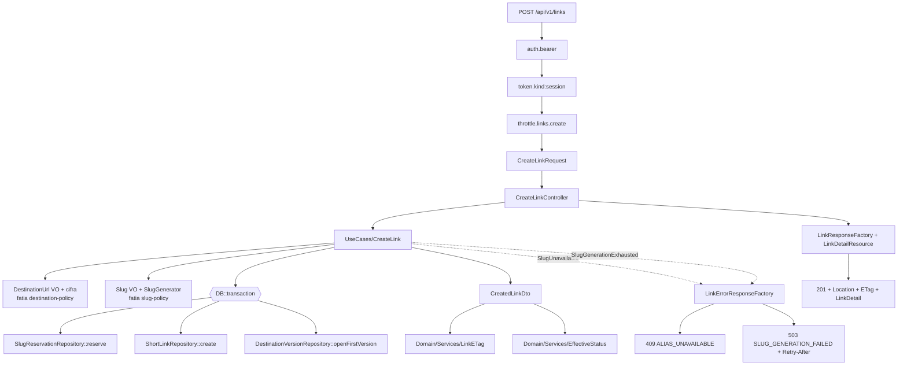

# Links — Criação de link · Design

**Spec:** [spec.md](./spec.md)  
**Context:** [context.md](./context.md)  
**Status:** Draft — aguardando confirmação da abordagem (§ Approach Exploration)  
**Decisões de projeto aplicáveis:** AD-003 (Makefile), AD-009 (Pint + Larastan 6 + PHPMD + Pest Arch + PCOV), AD-011 (`fake_link_testing`), AD-012 (UUID v7 em todas as entidades), AD-016 (Spectral + contract tests em `Tests/Contract/`)

---

## Approach Exploration

Todas as abordagens entregam exatamente o escopo da spec. A diferença é **onde vive a fronteira transacional** que amarra reserva + link + primeira versão (LNK-31).

| # | Abordagem | Fronteira transacional | Prós | Contras |
| --- | --- | --- | --- | --- |
| **A ⭐ Recomendada** | UseCase `CreateLink` orquestra e abre a transação; repositórios participam da transação corrente | `UseCases/CreateLink` | Espelha o Auth (`RegisterUser` é o orquestrador); mantém `Domain` puro; casa com o contrato já fechado em slug-policy ("o serviço de reserva participa da transação aberta pelo chamador"); testável por integração sem HTTP | UseCase conhece `DB::transaction` — acoplamento leve a Laravel na camada de aplicação |
| B | Transação no repositório: `ShortLinkRepository::createWithReservationAndDestination(...)` | Infrastructure/Persistence | Aplicação totalmente livre de infra; uma chamada só | Repositório vira serviço de domínio disfarçado; a política de retentativa de slug (5 tentativas) teria de descer para a persistência, contrariando slug-policy |
| C | Agregado `ShortLink::create()` + Unit of Work explícito | `Contracts/UnitOfWork` implementado em Infrastructure | Máxima pureza; fronteira reutilizável nas fatias 5 e 7 | Introduz um padrão que o projeto ainda não usa; custo alto para a primeira rota do módulo; a fatia 5 (idempotência) precisará envolver o UseCase de qualquer forma |

**Recomendação: A.** É a única que respeita a decisão já fechada em slug-policy (reserva participa da transação do chamador) sem inventar padrão novo na primeira rota do módulo. C continua disponível se as fatias 5 e 7 provarem que a fronteira precisa ser reutilizável — nesse momento vira um `AD-NNN`, não agora.

> Confirme a abordagem antes do detalhamento virar tarefas. As seções abaixo assumem **A**.

---

## Architecture Overview



Ordem dentro da transação: **reserva → link → versão de destino**. A reserva vem primeiro porque é a única autoridade de disponibilidade (o `INSERT` decide, sem check-then-insert) e falhar cedo evita trabalho descartado. A validação e a cifra do destino acontecem **antes** de abrir a transação — não há motivo para segurar conexão durante parsing e criptografia.

---

## Code Reuse Analysis

### Componentes existentes a aproveitar

| Componente | Localização | Como usar |
| --- | --- | --- |
| `ApiFormRequest` | `app/Http/Requests/ApiFormRequest.php` | Estender; hoje emite `code: 'INVALID'` fixo — precisa de um mapa opcional de códigos (ver Tech Decisions) |
| `ApiResponse` | `app/Http/Responses/ApiResponse.php` | `validationError()` para o `422` |
| `AuthenticateBearer` / `RequireTokenKind` | `modules/Auth/Infrastructure/Http/Middleware/` | Aliases `auth.bearer` e `token.kind:session` já registrados em `bootstrap/app.php` |
| `AuthenticatedPrincipal` | `modules/Auth/Contracts/Authentication/` | Origem do `user_id`; resolvido via container, como em `UpdateCurrentUserController` |
| `ThrottlePrivateAuthWrite` | `modules/Auth/Infrastructure/Http/Middleware/` | Padrão copiado para `ThrottleLinkCreation` (`tooManyAttempts` → `hit` → `next`) |
| `HmacRateLimitKeyFactory` | `modules/Auth/Infrastructure/RateLimit/` | Precedente do formato; `Links` ganha o seu próprio, com chave HMAC própria |
| `AuthResponseFactory` / `AuthErrorResponseFactory` | `modules/Auth/Infrastructure/Http/Responses/` | Padrão de factory de resposta com `Cache-Control: private, no-store` e `X-Request-ID` |
| `AuthServiceProvider` | `modules/Auth/ServiceProviders/` | Padrão de `$bindings` + `singleton` + `Route::prefix('api/v1')->middleware('api')` |
| `Tests/Support/OpenApi/*` | `modules/Auth/Tests/Support/OpenApi/` | `OpenApiDocument` / `OpenApiSchemaAssert` para o contract test (AD-016) |
| `Slug`, `SlugGenerator`, `SlugReservationRepository` | fatia [slug-policy](../slug-policy/spec.md) | Consumidos como está; esta fatia **não** redefine política de slug |
| `DestinationUrl` + porta de cifra | fatia [destination-policy](../destination-policy/spec.md) | Consumidos como está |

### Pontos de integração

| Sistema | Integração |
| --- | --- |
| Módulo Auth | Identidade autenticada e tipo de token via middlewares e `AuthenticatedPrincipal` |
| PostgreSQL | `short_links`, `slug_reservations`, `link_destination_versions` (esquema da fatia foundation) |
| Redis | Contador do rate limit via `RateLimiter` (fail-open em indisponibilidade) |
| `docs/openapi.yaml` | Contract test valida request e respostas; lint Spectral no gate |

---

## Components

### `ThrottleLinkCreation`

- **Purpose**: aplicar 60 tentativas/60 s por conta antes de qualquer validação.
- **Location**: `backend/modules/Links/Infrastructure/Http/Middleware/ThrottleLinkCreation.php`
- **Interfaces**: `handle(Request $request, Closure $next): Response`
- **Dependencies**: `AuthenticatedPrincipal`, `LinkRateLimitKeyFactory`, `LinkErrorResponseFactory`, `RateLimiter`
- **Reuses**: `ThrottlePrivateAuthWrite` (estrutura), `config('links.rate_limits.create.*')`
- **Nota**: em exceção do driver de rate limit, captura, emite métrica e segue (fail-open).

### `LinkRateLimitKeyFactory`

- **Purpose**: produzir a chave HMAC do contador sem expor `user_id` em Redis, log ou métrica.
- **Location**: `backend/modules/Links/Infrastructure/RateLimit/LinkRateLimitKeyFactory.php`
- **Interfaces**: `forLinkCreation(UserId $userId): string`
- **Dependencies**: `config('links.rate_limit_hmac_key')`
- **Reuses**: `HmacRateLimitKeyFactory` (formato `hash_hmac('sha256', 'links:create:'.$id, $key)`)

### `CreateLinkRequest`

- **Purpose**: validar o payload fechado e produzir o DTO de entrada.
- **Location**: `backend/modules/Links/Infrastructure/Http/Requests/CreateLinkRequest.php`
- **Interfaces**: `rules(): array`, `withValidator(Validator): void`, `toDto(): CreateLinkInput`
- **Dependencies**: VOs `DestinationUrl` e `Slug` (validação delegada), mapa de códigos por campo
- **Reuses**: `ApiFormRequest`, padrão `ALLOWED_FIELDS` + `$submittedKeys` de `UpdateCurrentUserRequest`

### `CreateLink` (UseCase)

- **Purpose**: orquestrar destino, slug e persistência em uma transação única.
- **Location**: `backend/modules/Links/UseCases/CreateLink.php`
- **Interfaces**: `execute(UserId $userId, CreateLinkInput $input): CreatedLinkDto`
- **Dependencies**: `DestinationUrlFactory`, `DestinationCipher`, `SlugAllocator`, os três repositórios, `Clock`, `LinkIdGenerator`
- **Reuses**: padrão de UseCase do Auth (`RegisterUser`)
- **Falhas**: propaga `SlugUnavailable` e `SlugGenerationExhausted` tipadas

### `LinkETag`

- **Purpose**: derivar o ETag forte e opaco do estado do recurso.
- **Location**: `backend/modules/Links/Domain/Services/LinkETag.php`
- **Interfaces**: `for(ShortLinkState $state): string` → `"<hex>"`
- **Dependencies**: chave HMAC de aplicação injetada por contrato (nunca `config()` direto no `Domain`)
- **Reuses**: —

### `EffectiveStatus`

- **Purpose**: derivar `blocked` → `expired` → `inactive` → `active`.
- **Location**: `backend/modules/Links/Domain/Services/EffectiveStatus.php`
- **Interfaces**: `for(?DateTimeImmutable $blockedAt, ?DateTimeImmutable $expiresAt, bool $isEnabled, DateTimeImmutable $now): LinkStatus`
- **Dependencies**: `Clock` injetável
- **Reuses**: — (será reusado pelas fatias 6, 7 e 9)

### `CreateLinkController`

- **Purpose**: adaptar HTTP ao UseCase; sem regra de negócio.
- **Location**: `backend/modules/Links/Infrastructure/Http/Controllers/CreateLinkController.php`
- **Interfaces**: `__invoke(CreateLinkRequest $request): Response`
- **Dependencies**: `AuthenticatedPrincipal`, `CreateLink`, `LinkResponseFactory`, `LinkErrorResponseFactory`
- **Reuses**: `UpdateCurrentUserController` (estrutura de try/catch e factories)

### `LinkDetailResource` + `LinkResponseFactory`

- **Purpose**: serializar `LinkDetail` e montar a resposta `201` com headers.
- **Location**: `backend/modules/Links/Infrastructure/Http/Resources/`, `.../Http/Responses/`
- **Interfaces**: `LinkDetailResource::toArray(CreatedLinkDto): array`, `LinkResponseFactory::created(CreatedLinkDto, string $etag): JsonResponse`
- **Dependencies**: `config('links.short_url.base_url')`
- **Reuses**: `AuthUserResource::formatUtc()` (formato ISO 8601 `Z`), `AuthResponseFactory` (headers)

### `LinkErrorResponseFactory`

- **Purpose**: respostas de erro estáveis do módulo.
- **Location**: `backend/modules/Links/Infrastructure/Http/Responses/LinkErrorResponseFactory.php`
- **Interfaces**: `aliasUnavailable()`, `slugGenerationFailed(int $retryAfter)`, `rateLimitExceeded(int $retryAfter)`, `serviceUnavailable()`
- **Reuses**: `AuthErrorResponseFactory` (formato de corpo e headers)

---

## Data Models

Esquema criado pela fatia [foundation](../foundation/spec.md); esta fatia apenas escreve. Estado produzido pela criação:

```
short_links
  id            uuid v7      (gerado na aplicação — AD-012)
  user_id       uuid v7      do principal autenticado; imutável
  slug          varchar(48)  FK → slug_reservations.slug; minúsculo; imutável
  slug_source   text         'custom' | 'automatic'
  title         varchar(160) nullable (trim; "" → null)
  is_enabled    boolean      true
  blocked_at    timestamptz  null
  expires_at    timestamptz  nullable, futuro estrito quando presente
  version       bigint       1
  created_at / updated_at    timestamptz UTC

slug_reservations
  slug          varchar(48)  PK
  reserved_at   timestamptz

link_destination_versions
  id               uuid v7
  short_link_id    uuid v7 → short_links.id
  destination_url  text     envelope AES-256-GCM (nonce + ciphertext + tag)
  key_id           varchar  keyring de destinos
  valid_from       timestamptz  = instante da criação
  valid_to         null         (índice parcial único garante versão vigente única)
```

DTO de saída:

```
CreatedLinkDto {
  id, slug, slugSource, destinationUrl (normalizada, em memória),
  title, isEnabled, expiresAt, blockedAt, createdAt, updatedAt, status
}
```

`version` e `blockedAt` existem no DTO para alimentar o `ETag`, mas **não** são serializados no `LinkDetail`.

---

## Error Handling Strategy

| Cenário | Tratamento | Resposta ao cliente |
| --- | --- | --- |
| Bearer ausente/inválido | Middleware `auth.bearer` | `401 UNAUTHENTICATED` |
| Token `verification` | Middleware `token.kind:session` | `403 TOKEN_RESTRICTED` |
| Conta suspensa / em exclusão | Middleware `auth.bearer` | `403 ACCOUNT_SUSPENDED` / `403 ACCOUNT_PENDING_DELETION` |
| Limite excedido | `ThrottleLinkCreation` | `429 RATE_LIMIT_EXCEEDED` + `Retry-After` |
| Payload inválido | `CreateLinkRequest` → `ApiResponse::validationError` | `422 VALIDATION_FAILED` + `errors[campo][{code,message}]` |
| Alias válido e ocupado | `SlugUnavailable` no UseCase → factory | `409 ALIAS_UNAVAILABLE`, idêntico para reserva com link e órfã |
| Geração automática esgotada | `SlugGenerationExhausted` → factory | `503 SLUG_GENERATION_FAILED` + `Retry-After` |
| Falha de cifra do destino | Exceção do keyring → rollback | `503 SERVICE_UNAVAILABLE`, sem link |
| PostgreSQL indisponível | Rollback implícito; sem retentativa | `503 SERVICE_UNAVAILABLE` |
| Redis do rate limit fora | Captura + métrica; segue (fail-open) | Resposta normal do endpoint |
| Falha inesperada | `catch (Throwable)` no Controller | `500 INTERNAL_ERROR` sem detalhes |

Nenhuma resposta de erro ecoa `destination_url`, alias, título, query ou fragmento.

---

## Risks & Concerns

| Concern | Localização | Impacto | Mitigação |
| --- | --- | --- | --- |
| `ApiFormRequest` emite `code: 'INVALID'` fixo para toda falha de validação | `app/Http/Requests/ApiFormRequest.php:26-40` | A spec exige códigos estáveis por campo (`REQUIRED`, `INVALID_ALIAS`, `TITLE_TOO_LONG`, `EXPIRES_AT_NOT_IN_FUTURE`, `INVALID_DATETIME`, `UNKNOWN_FIELD`); sem mudança, o contract test e o BFF futuro recebem sempre `INVALID` | T3 acrescenta um `errorCodes(): array` **opcional** na base, com default `'INVALID'` — Auth não muda de comportamento e ganha regressão explícita |
| `request_id` é o literal `'stub-request-id'` em todas as respostas | `app/Http/Responses/ApiResponse.php:20,32`; `AuthResponseFactory.php:17` | `X-Request-ID` existe mas não é único por requisição; correlação de log é ilusória hoje | Fora do escopo desta fatia: Links **conforma** ao comportamento atual (header presente, valor da base compartilhada). Registrado em Deferred Ideas do context; quando a base ganhar request id real, Links herda sem alteração |
| `phpunit.xml` só declara suítes e `<source>` de `modules/Auth` | `backend/phpunit.xml:9-30` | Testes de `modules/Links` não rodariam e a cobertura do módulo não seria medida | Dependência dura da fatia [foundation](../foundation/spec.md) (LNK-05). T14 inclui o registro das suítes de `Links` caso a foundation ainda não o tenha feito |
| Gate de cobertura é específico do Auth | `backend/scripts/check-auth-coverage-gate.php` | 90%/85% de `modules/Links` (`docs/testing.md` §4) não seria verificado | Foundation (LNK-05) é dona do gate equivalente; esta fatia consome. Se ausente no Execute, vira tarefa de bloqueio, não improviso |
| PCOV não mede branches em PHP | `docs/testing.md` §4 | O gate de 85% branches da spec não tem métrica nativa | Convenção já documentada do projeto: **cobertura de métodos** substitui branches em módulos backend |
| Duas fatias-dependência ainda em Seed (`foundation`, `destination-policy`) | `.specs/features/links/` | Este design assume assinaturas (`DestinationUrl`, cifra, `key_id`, esquema) que ainda não estão fechadas | As interfaces consumidas estão isoladas atrás de contratos; qualquer divergência afeta T7/T9 e não a superfície HTTP. Não iniciar Execute desta fatia antes de fechar as duas |
| Rate limit fail-open | decisão desta fatia | Redis fora remove o teto de criação temporariamente | Métrica dedicada + a decisão é explícita na spec (AC 9 de auth/limite); fail-closed transformaria indisponibilidade de contador em indisponibilidade de produto |

---

## Tech Decisions

| Decisão | Escolha | Racional |
| --- | --- | --- |
| Fronteira transacional | UseCase `CreateLink` abre a transação; repositórios participam da corrente | Único arranjo compatível com a decisão já fechada em slug-policy; espelha `RegisterUser` |
| Ordem dentro da transação | reserva → link → versão | O `INSERT` da reserva é a autoridade de disponibilidade; falhar cedo evita trabalho descartado |
| Validação e cifra do destino | Antes de abrir a transação | Não segurar conexão durante parsing e criptografia |
| Códigos de erro por campo | `errorCodes()` opcional em `ApiFormRequest`, default `'INVALID'` | Convenção nova de projeto — **candidata a `AD-019`** se aprovada, pois passa a valer para todos os módulos |
| Chave HMAC do rate limit | `links.rate_limit_hmac_key`, separada da chave do Auth | `docs/security.md` §11: chaves separadas por finalidade |
| Chave HMAC do `ETag` | Contrato injetável no `Domain`, lido de `config('links.etag_hmac_key')` pelo adaptador | Mantém `Domain` sem `config()` (gate Pest Arch, AD-009) |
| `EffectiveStatus` no `Domain` | Serviço próprio desde já | Fatias 6, 7 e 9 dependem da mesma precedência; duplicar seria divergência garantida |
| Formato de data | `AuthUserResource::formatUtc()` como referência, replicado em `Links` | Módulos não importam Resources uns dos outros; a regra de formato é do contrato, não do Auth |

> Se a linha `errorCodes()` for aprovada, ela vira `AD-019` em `.specs/STATE.md` — é convenção que futuras rotas de todos os módulos vão seguir.
