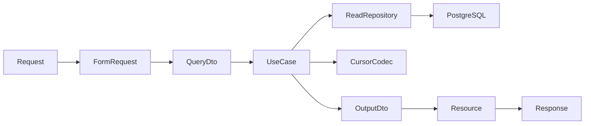

# Links — Consultas de link Design

**Spec**: `.specs/features/links/link-queries/spec.md`  
**Status**: Approved — 2026-09-18

---

## Architecture Overview

As consultas permanecem no módulo `Links` e seguem a fronteira HTTP → FormRequest → DTO → UseCase → Contract → adaptador Eloquent → DTO de saída → Resource. Um `CursorCodec` de infraestrutura assina e valida cursores; ele não é uma entidade persistida. O repositório de leitura seleciona a projeção mínima da lista e só carrega/decripta a versão de destino atual no detalhe já autorizado.

O `EffectiveStatus` existente continua sendo a definição única da precedência. Para a lista, a mesma expressão é transposta para a consulta SQL usando o `now()` capturado pelo UseCase; o DTO de saída recebe o estado já calculado. Para o detalhe, o UseCase calcula o estado com o mesmo serviço após obter a projeção autorizada e a versão de destino atual.

---

## Code Reuse Analysis

| Componente | Localização | Uso |
| --- | --- | --- |
| `EffectiveStatus` | `backend/modules/Links/Domain/Services/EffectiveStatus.php` | Única regra de precedência para detalhe; expressão equivalente na query de lista |
| `LinkETag` | `backend/modules/Links/Domain/Services/LinkETag.php` | Calcula o `ETag` do detalhe com a mesma tupla da criação |
| `DestinationCipher` e `DestinationKeyring` | `backend/modules/Links/Contracts/Services/` e `Infrastructure/Crypto/` | Decriptação autorizada do destino atual |
| `LinkDetailResource` | `backend/modules/Links/Infrastructure/Http/Resources/LinkDetailResource.php` | Extrair formato compartilhado ou adaptá-lo para DTO de leitura |
| `ApiFormRequest` | `backend/app/Http/Requests/ApiFormRequest.php` | Erros de validação com códigos estáveis, incluindo `INVALID_CURSOR` |
| Rotas e middleware de criação | `backend/modules/Links/Infrastructure/Http/routes/links.php` | Acrescentar reads com `auth.bearer`, `token.kind:session` e throttle específico |
| Testes Links existentes | `backend/modules/Links/Tests/{Unit,Integration,Feature,Contract}/` | Fixtures, segurança do banco, asserts OpenAPI e padrão Pest |

| Integração | Método |
| --- | --- |
| PostgreSQL | Novo read repository, projeções por `short_links` e versão de destino atual; migration de índices/`pg_trgm` |
| Auth | Middleware existente fornece o principal; UseCases nunca recebem `user_id` do request |
| OpenAPI | Contrato já descreve endpoints e schemas; tests verificam runtime contra o documento |
| Rate limiting | Novo middleware/chave limitada por token, com o valor do contrato de 300/min |

---

## Components

### Cursor codec

- **Purpose**: Criar e verificar cursor versionado, assinado e escopado para busca/status.
- **Location**: `Infrastructure/Pagination/` e `Contracts/Services/`.
- **Interfaces**:
  - `encode(CursorAnchor, LinkQueryScope): string`
  - `decode(string, LinkQueryScope): CursorAnchor`
- **Dependencies**: chave HMAC exclusiva configurada fora da persistência.
- **Reuses**: padrão de keyring/configuração criptográfica do módulo.

### ListLinks

- **Purpose**: Coordenar normalização já validada, instante UTC, cursor, consulta paginada e emissão de próxima âncora.
- **Location**: `UseCases/ListLinks.php`, `DTOs/Input/ListLinksQuery.php`, `DTOs/Output/LinkPage.php`.
- **Interfaces**: `handle(UserId, ListLinksQuery): LinkPage`.
- **Dependencies**: read repository, cursor codec e relógio injetável.
- **Reuses**: `EffectiveStatus` como semântica da expressão SQL.

### GetLink

- **Purpose**: Obter o detalhe do proprietário, decriptar a versão vigente e computar `ETag`.
- **Location**: `UseCases/GetLink.php`, DTO de saída compartilhado de leitura.
- **Interfaces**: `handle(UserId, ShortLinkId): LinkDetailDto|null`.
- **Dependencies**: read repository, `DestinationCipher`, `EffectiveStatus`, `LinkETag` e relógio.
- **Reuses**: `LinkETag` e formato UTC do resource atual.

### Read repository

- **Purpose**: Encapsular a consulta de lista, o filtro SQL e a busca autorizada por ID.
- **Location**: `Contracts/Repositories/LinkQueryRepository.php` e adaptador Eloquent correspondente.
- **Interfaces**:
  - `listForOwner(UserId, ListLinksQuery, CursorAnchor|null, DateTimeImmutable): LinkPageRecords`
  - `findForOwner(UserId, ShortLinkId): PersistedLinkDetail|null`
- **Dependencies**: Eloquent exclusivamente na infraestrutura.
- **Reuses**: modelos e mappers de persistência existentes, sem ampliar o repositório de escrita.

### HTTP adapters

- **Purpose**: Validar query/path, adaptar para UseCases e serializar `LinkSummary`/`LinkDetail`.
- **Location**: `Infrastructure/Http/{Requests,Controllers,Resources}/`.
- **Interfaces**: controllers invocáveis para listagem e detalhe.
- **Dependencies**: UseCases concretos e `ApiResponse`.
- **Reuses**: recursos, middleware e padrão de controllers da criação.

---

## Data Models

Não há novas entidades de domínio. A migration adiciona somente estruturas de consulta:

- extensão PostgreSQL `pg_trgm`;
- índice GIN trigram sobre título normalizado para substring case-insensitive;
- índice B-tree composto para owner e ordenação keyset por criação/ID;
- índice para prefixo de slug no valor canônico minúsculo, escolhido conforme `EXPLAIN` no PostgreSQL de testes.

O cursor contém apenas versão, âncora e escopo normalizado. Ele é autenticado por HMAC, não criptografado, não persistido e não é aceito como fonte de `user_id`.

---

## Error Handling Strategy

| Cenário | Tratamento | Resposta |
| --- | --- | --- |
| Query inválida | FormRequest com mapa de `errorCodes()` | `422 VALIDATION_FAILED` |
| Cursor inválido | Codec lança exceção de aplicação mapeada na borda | `422`, `errors.cursor[0].code = INVALID_CURSOR` |
| Link inexistente ou alheio | Repositório retorna `null` após scope por owner | `404 RESOURCE_NOT_FOUND` uniforme |
| Destino ilegível | Falha de cifra mapeada globalmente, sem payload parcial | `503 SERVICE_UNAVAILABLE` |
| Banco indisponível | Exceção de infraestrutura propaga ao handler global | `503`/`504` aplicável |
| Limite de leitura | Middleware antes do controller | `429 RATE_LIMIT_EXCEEDED` com `Retry-After` |

---

## Risks & Concerns

| Concern | Location | Impact | Mitigation |
| --- | --- | --- | --- |
| `ShortLinkRepository` é apenas de escrita | `Contracts/Repositories/ShortLinkRepository.php` | Ampliá-lo misturaria dois motivos de mudança | Criar `LinkQueryRepository` específico |
| `LinkDetailResource` recebe apenas `CreatedLinkDto` | `Infrastructure/Http/Resources/LinkDetailResource.php` | Detalhe de leitura não pode reutilizar a assinatura atual | Extrair DTO/formatador de leitura sem acoplar UseCase a HTTP |
| Busca substring sem índice dedicado | `short_links.title` | Pode degradar com o portfólio | Migration com `pg_trgm` e teste de schema/`EXPLAIN` no PostgreSQL |
| Contrato OpenAPI já lista endpoints ainda ausentes | `docs/api.md` §1.1 | Runtime pode divergir do contrato durante a entrega | Contract tests em cada tarefa HTTP e lint Spectral |
| Telemetria externa não é exercida na suíte PHP | infraestrutura observável | Evidência falsa de redação | Testar a seam da aplicação com sentinelas e registrar coleta externa como verificação operacional |

---

## Tech Decisions

| Decision | Choice | Rationale |
| --- | --- | --- |
| Paginação | Keyset `(created_at, id)` autenticado por HMAC | Estável e eficiente, sem fragilidade de offset |
| Leitura x escrita | Repositório de consulta separado | Mantém `ShortLinkRepository` mínimo e coeso |
| Estado na lista | Expressão SQL equivalente a `EffectiveStatus` | Filtra antes de paginar sem persistir estado derivado |
| Cursor scope | Incluir `search` e `status`, excluir `per_page` | Preserva conjunto lógico e permite alterar tamanho |
| Índices | Introduzidos na fatia de consulta | YAGNI na criação, necessários agora |

Nenhuma decisão acima cria convenção global nova; portanto não há AD a registrar.
