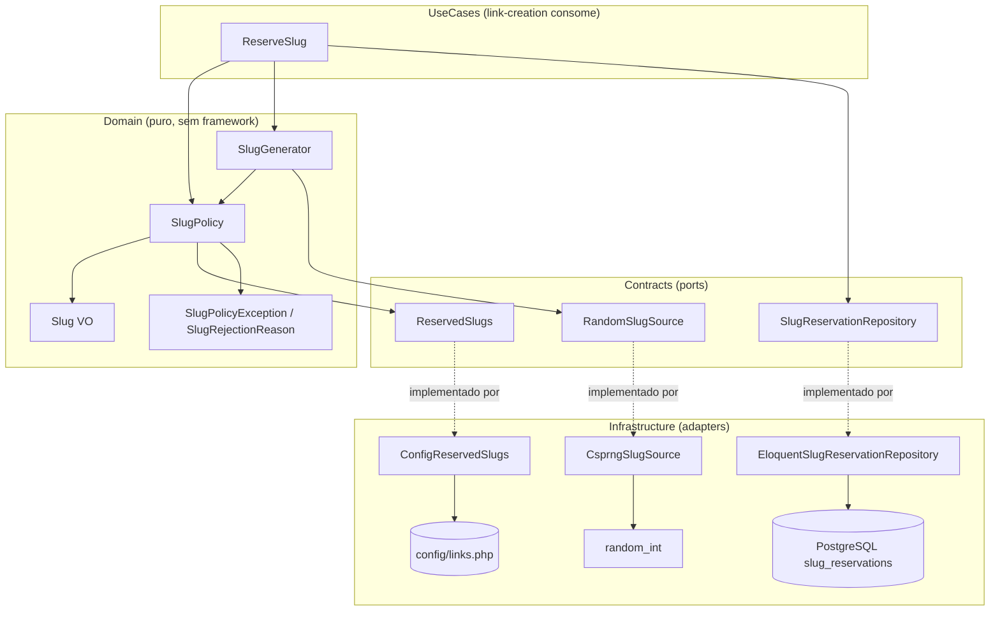

# Links — Política de slug · Design

**Spec**: `.specs/features/links/slug-policy/spec.md`  
**Context**: `.specs/features/links/slug-policy/context.md`  
**Status**: Draft — aguardando aprovação do mantenedor  
**Depende de**: [foundation](../foundation/spec.md) — **não implementada** (ver `## Pré-requisito bloqueante`)

---

## Pré-requisito bloqueante

`backend/modules/` contém hoje **apenas** `Auth/`. Os módulos `Links` e `Redirects`, as migrations `slug_reservations` / `short_links` e o registro das suítes em `backend/phpunit.xml` são entregas da fatia [foundation](../foundation/spec.md) (LNK-01, LNK-03, LNK-05) e **não existem**.

Este design assume esses artefatos como dados. As tasks desta fatia não podem começar antes de a foundation estar verificada. Nada aqui duplica trabalho da foundation — em particular, esta fatia **não** cria migration, **não** registra suíte nova em `phpunit.xml` e **não** cria o script de gate de cobertura do módulo.

---

## Decisões de projeto ativas aplicáveis (`.specs/STATE.md`)

Lidas antes de qualquer escolha arquitetural. Todas **conformadas**, nenhuma superseded.

| AD | Constraint | Como este design conforma |
| --- | --- | --- |
| AD-009 | Pint + Larastan nível 6 + strict-rules + PHPMD + Pest Arch; gates só via Docker/Makefile | Todos os gates das tasks são alvos `make`; nenhum comando fora do container |
| AD-011 | Testes com I/O de banco usam exclusivamente `fake_link_testing` | Reserva e concorrência ficam em `Tests/Integration`, sob `phpunit.xml` que já fixa `DB_DATABASE=fake_link_testing` |
| AD-012 | Todas as entidades de domínio e FKs usam UUID v7 | `slug_reservations` tem PK `varchar(48)` (o próprio slug) — é a exceção documentada em `docs/data-model.md` §4, não uma entidade de domínio com identidade sintética. Nenhum UUID é introduzido aqui |
| AD-016 | OpenAPI via Spectral; contract tests em `modules/{Module}/Tests/Contract/` | Esta fatia não expõe HTTP; o contract test do `503 SLUG_GENERATION_FAILED` nasce em [link-creation](../link-creation/spec.md) |

**Nova decisão proposta (AD-019)** — só é gravada em `.specs/STATE.md` na aprovação deste design: *"Código de erro estável `SLUG_GENERATION_FAILED` (`503`) para exaustão de tentativas de geração de slug; registrado em `docs/api.md` §7 e mapeado na OpenAPI pela fatia que expõe o endpoint."*

---

## Architecture Overview

Três camadas com uma única direção de dependência. O `Domain` não conhece Laravel, `config()`, Eloquent nem PostgreSQL; recebe denylist e aleatoriedade por contrato.



**Fluxo de alias personalizado**: `ReserveSlug` → `SlugPolicy::fromCustomAlias('Foo')` → normaliza, valida, checa denylist → `Slug('foo')` → `SlugReservationRepository::reserve()` → `INSERT`; violação de PK ⇒ `SlugUnavailable`. **Sem retentativa** — alias é escolha do usuário.

**Fluxo de slug automático**: `ReserveSlug` → `SlugGenerator::generate()` (descarta candidato em denylist, teto 5) → `reserve()`; colisão ⇒ novo candidato, teto 5. Esgotou qualquer teto ⇒ `SlugGenerationExhausted`.

---

## Approach Exploration

Todas as opções entregam exatamente o escopo da spec. A escolha é onde a denylist entra sem sujar o `Domain`.

### Opção A — `SlugPolicy` como fábrica única do VO ⭐ recomendada

`Slug` é um VO imutável com validação **estrutural** pura (comprimento, allowlist, fronteiras, hífens consecutivos). `SlugPolicy` é o serviço de domínio que recebe `ReservedSlugs` por construtor e é o **único** caminho de construção de `Slug` nos dois fluxos, aplicando a denylist depois da validação estrutural.

- ✅ `Domain` sem `config()`; `Slug` testável sem nenhuma dependência.
- ✅ Denylist verificada em um ponto só (D1 do contexto), compartilhado por alias e gerado.
- ✅ Denylist injetada nos testes sem tocar em config global — o sensor de discriminação fica trivial.
- ⚠️ Duas classes em vez de uma; call sites usam `SlugPolicy`, não `Slug::fromString()`.

### Opção B — Denylist como parâmetro do factory do VO

`Slug::fromCustomAlias(string $raw, ReservedSlugs $reserved)`.

- ✅ Uma classe a menos.
- ❌ VO passa a exigir um serviço em toda construção, inclusive em mapper de leitura, onde a denylist é irrelevante (uma reserva antiga pode conter palavra que só depois entrou na lista — reconstruí-la falharia).
- ❌ Quebra o padrão `fromString(string): self` já estabelecido em `EmailAddress`, `UserId`, `AuthTokenId`.

### Opção C — Denylist verificada na camada de reserva

O repositório rejeita a palavra reservada antes do `INSERT`.

- ✅ Nenhuma mudança no VO.
- ❌ Política de negócio vaza para `Infrastructure`, contrariando `docs/architecture.md` §4 e o gate Pest Arch.
- ❌ Códigos de falha ficam repartidos entre duas camadas; `reserved_word` chegaria como erro de persistência.

**Recomendação: Opção A.** Custa uma classe e paga em pureza de domínio, testabilidade e um único ponto de verdade para a denylist.

---

## Code Reuse Analysis

### Componentes existentes a aproveitar

| Componente | Local | Como usar |
| --- | --- | --- |
| `EmailAddress` | `backend/modules/Auth/Domain/ValueObjects/EmailAddress.php` | Padrão de VO `final readonly` com construtor privado, `fromString()`, `value()`, `equals()`; `Slug` replica a forma (mas com normalização ASCII explícita, não `strtolower`) |
| `InviteAllowlist` + `JsonFileInviteAllowlist` | `modules/Auth/Contracts/Services/`, `modules/Auth/Infrastructure/Allowlist/` | Precedente exato de lista operacional atrás de contrato, com adaptador lendo `config()`; `ReservedSlugs` + `ConfigReservedSlugs` copiam o padrão (arquivo PHP em vez de JSON, por ser lista fechada e pequena) |
| `PasswordPolicy` / `PasswordPolicyRule` | `modules/Auth/Domain/Services/PasswordPolicy.php`, `modules/Auth/Infrastructure/Http/Rules/PasswordPolicyRule.php` | Precedente de política de domínio com **códigos de falha estáveis** por categoria; `SlugRejectionReason` segue a mesma ideia |
| `EloquentUserRepository` | `modules/Auth/Infrastructure/Persistence/Eloquent/Repositories/` | Já captura `Illuminate\Database\UniqueConstraintViolationException` e converte em exceção de domínio — exatamente o que a reserva precisa (linha 85) |
| `UsersPersistenceConstraintsTest` | `modules/Auth/Tests/Integration/` | Padrão de teste de constraint real em PostgreSQL |
| `HashingConfigTest` | `modules/Auth/Tests/Unit/` | Precedente de teste que assere valores de arquivo de config |
| `ModularMonolithTest` | `backend/tests/Architecture/` | Já itera `Links` e `Redirects` no array `$domainModules`; as regras passam a valer sem edição quando o código aparecer |
| `Pest.php` | `backend/tests/Pest.php` | Registro de `RefreshDatabase` por diretório — precisa de entradas para `modules/Links/Tests/{Integration,Feature}` |

### Pontos de integração

| Sistema | Integração |
| --- | --- |
| `slug_reservations` (foundation) | `INSERT` participando da transação corrente; leitura para detectar reserva órfã |
| `short_links` (foundation) | Somente `LEFT JOIN` na consulta de reserva órfã; esta fatia não escreve na tabela |
| [link-creation](../link-creation/spec.md) | Consome `ReserveSlug` dentro da sua transação e mapeia as duas exceções para `409` / `503` |
| [resolution-contract](../resolution-contract/spec.md) | Consome `existsWithoutLink()` para decidir `410` |

---

## Components

### `Slug` (VO)

- **Purpose**: representar um slug válido, normalizado e imutável.
- **Location**: `backend/modules/Links/Domain/ValueObjects/Slug.php`
- **Interfaces**:
  - `public static function fromCustomAlias(string $raw): self` — trim + lowercase ASCII, valida comprimento 3–48, allowlist `[a-z0-9-]`, fronteiras alfanuméricas, hífens não consecutivos; origem `custom`.
  - `public static function fromGenerated(string $raw): self` — valida exatamente 8 caracteres `[a-z0-9]`; origem `automatic`.
  - `public function value(): string`, `public function source(): SlugSource`, `public function equals(self $other): bool`
- **Dependencies**: nenhuma. Sem `config()`, sem framework, sem `intl`.
- **Reuses**: forma de `EmailAddress`.
- **Nota**: a normalização usa `strtr` com mapa ASCII `A-Z`→`a-z` (não `strtolower`/`mb_strtolower`), para independência de locale (SLG-10).

### `SlugSource` (enum) e `SlugRejectionReason` (enum)

- **Purpose**: `automatic|custom` para `short_links.slug_source`; códigos estáveis de rejeição.
- **Location**: `backend/modules/Links/Domain/Enums/`
- **Interfaces**: `SlugRejectionReason` = `too_short`, `too_long`, `invalid_characters`, `invalid_boundary`, `consecutive_hyphens`, `reserved_word`.
- **Reuses**: padrão de `UserStatus` / `PasswordPolicyRule`.

### `SlugPolicy` (Domain Service)

- **Purpose**: único caminho de construção de `Slug`, aplicando validação estrutural e denylist.
- **Location**: `backend/modules/Links/Domain/Services/SlugPolicy.php`
- **Interfaces**:
  - `public function __construct(private readonly ReservedSlugs $reserved)`
  - `public function fromCustomAlias(string $raw): Slug` — lança `SlugPolicyException` com `SlugRejectionReason`.
  - `public function fromGenerated(string $candidate): Slug`
  - `public function isReserved(string $normalized): bool`
- **Dependencies**: `ReservedSlugs`.

### `SlugGenerator` (Domain Service)

- **Purpose**: produzir candidato Base36 de 8 caracteres, descartando os que caem na denylist.
- **Location**: `backend/modules/Links/Domain/Services/SlugGenerator.php`
- **Interfaces**:
  - `public function __construct(RandomSlugSource $random, SlugPolicy $policy, int $length = 8, int $maxDenylistDiscards = 5)`
  - `public function generate(): Slug` — lança `SlugGenerationExhausted` ao esgotar os descartes.
- **Dependencies**: `RandomSlugSource`, `SlugPolicy`.

### `ReservedSlugs` (port) + `ConfigReservedSlugs` (adapter)

- **Purpose**: expor a denylist ao `Domain` sem acoplá-lo a `config()`.
- **Location**: `modules/Links/Contracts/Services/ReservedSlugs.php`, `modules/Links/Infrastructure/Slug/ConfigReservedSlugs.php`
- **Interfaces**: `public function contains(string $normalizedSlug): bool`
- **Dependencies**: `config('links.slug.reserved_words')`; normaliza e indexa a lista em `array<string,true>` no construtor; lista vazia é configuração válida (não é erro).
- **Reuses**: `JsonFileInviteAllowlist`.

### `RandomSlugSource` (port) + `CsprngSlugSource` (adapter)

- **Purpose**: aleatoriedade criptográfica isolável nos testes.
- **Location**: `modules/Links/Contracts/Services/RandomSlugSource.php`, `modules/Links/Infrastructure/Slug/CsprngSlugSource.php`
- **Interfaces**: `public function candidate(int $length, string $alphabet): string`
- **Dependencies**: `random_int()` — índice sorteado em `[0, strlen($alphabet) - 1]`, **sem** `% strlen()` sobre bytes brutos (evita viés de módulo, SLG-02).

### `SlugReservationRepository` (port) + `EloquentSlugReservationRepository`

- **Purpose**: reserva permanente e consulta de reserva órfã.
- **Location**: `modules/Links/Contracts/Repositories/`, `modules/Links/Infrastructure/Persistence/Eloquent/Repositories/`
- **Interfaces**:
  - `public function reserve(Slug $slug): void` — `INSERT`; `UniqueConstraintViolationException` ⇒ `SlugUnavailable`.
  - `public function existsWithoutLink(Slug $slug): bool`
  - **Deliberadamente ausente**: qualquer `delete`, `forceDelete`, `truncate` ou `update` (SLG-15).
- **Dependencies**: `SlugReservationModel`; participa da transação aberta pelo chamador (`DB::transaction` não é chamado aqui).
- **Reuses**: captura de `UniqueConstraintViolationException` de `EloquentUserRepository:85`.

### `ReserveSlug` (UseCase Service)

- **Purpose**: orquestrar alias vs. automático e a política de retentativa.
- **Location**: `backend/modules/Links/UseCases/ReserveSlug.php`
- **Interfaces**:
  - `public function forAlias(string $rawAlias): Slug` — sem retentativa; propaga `SlugUnavailable`.
  - `public function automatic(): Slug` — até `maxCollisionAttempts` (5) `INSERT`s; esgotou ⇒ `SlugGenerationExhausted`.
- **Dependencies**: `SlugPolicy`, `SlugGenerator`, `SlugReservationRepository`, config de tentativas.

### `LinksServiceProvider` (extensão)

- **Purpose**: bindings dos três ports e `config/links.php` como fonte dos parâmetros.
- **Location**: `backend/modules/Links/ServiceProviders/LinksServiceProvider.php` (criado pela foundation; esta fatia acrescenta bindings).

---

## Data Models

### `slug_reservations` (schema da foundation, consumido aqui)

| Campo | Tipo | Regra |
| --- | --- | --- |
| `slug` | `varchar(48)` | PK, ASCII minúsculo — é a autoridade contra colisão |
| `reserved_at` | `timestamptz` | Instante da primeira reserva; nunca atualizado |

Sem `user_id`, sem FK para o link, sem `deleted_at`. A ausência de proprietário é o que impede o vazamento na colisão (SLG-18).

### `config/links.php` (novo)

```php
return [
    'slug' => [
        'length' => 8,
        'alphabet' => 'abcdefghijklmnopqrstuvwxyz0123456789',
        'min_alias_length' => 3,
        'max_alias_length' => 48,
        'max_collision_attempts' => 5,
        'max_denylist_discards' => 5,
        'reserved_words' => [
            'admin', 'api', 'login', 'register', 'docs',
            'health', 'status', 'support', 'terms', 'privacy',
        ],
    ],
];
```

---

## Error Handling Strategy

| Cenário | Tratamento | Impacto para o usuário (nesta fatia) |
| --- | --- | --- |
| Alias fora das regras estruturais | `SlugPolicyException` com `SlugRejectionReason` | Falha tipada; `422 VALIDATION_FAILED` é montado em link-creation |
| Alias na denylist | `SlugPolicyException(reserved_word)` | Idem — indistinguível de "indisponível" na resposta pública |
| Alias já reservado (com link ou órfão) | `SlugUnavailable`, mensagem uniforme sem dados do ocupante | `409 ALIAS_UNAVAILABLE` em link-creation |
| Colisão de slug automático | Novo candidato, até 5 `INSERT`s | Invisível |
| 5 colisões / 5 descartes por denylist | `SlugGenerationExhausted` | `503 SLUG_GENERATION_FAILED` + `Retry-After` em link-creation |
| PostgreSQL indisponível | `QueryException` propagada sem captura | `503` genérico do chamador; **não** consome orçamento de tentativas |
| Rollback da transação do chamador | Reserva daquela transação desfeita pelo banco | Invisível |

---

## Risks & Concerns

| Concern | Local | Impacto | Mitigação |
| --- | --- | --- | --- |
| Fatia bloqueada: módulo `Links` inexistente | `backend/modules/` (só `Auth/`) | Nenhuma task executa | Executar [foundation](../foundation/spec.md) antes; este design não duplica nada dela |
| `Pest.php` só registra `RefreshDatabase` para `modules/Auth/Tests/{Feature,Integration}` | `backend/tests/Pest.php:19-27` | Testes de integração de Links rodariam sem `RefreshDatabase` e sujariam `fake_link_testing` entre execuções | T9 acrescenta as entradas de `modules/Links/Tests/Integration` (se a foundation ainda não o fez) |
| `phpunit.xml` `<source>` inclui só `app` e `modules/Auth` | `backend/phpunit.xml:24-29` | Código de `Links` fica fora da cobertura, e o gate 90/85 mediria vazio | Entrega da foundation (LNK-05); verificado como pré-condição na T1, não reimplementado aqui |
| Gate de cobertura só existe para Auth (`check-auth-coverage-gate.php`, 80/80) | `docs/testing.md` §4 | 90/85 de Links não é aplicado automaticamente | Script equivalente para Links é entrega da foundation; a T14 só confere que o gate está ativo antes de fechar a fatia |
| `strtolower` do PHP é ASCII-only por padrão, mas depende de locale em versões/extensões antigas | novo código | `İ`/`I` poderiam colapsar de forma inesperada, quebrando SLG-10 | Usar `strtr` com mapa ASCII explícito e testar `İstanbul` como `invalid_characters` |
| Viés de módulo se o candidato for gerado por `random_bytes` + `%` | novo código | Distribuição não uniforme reduz entropia efetiva do slug | `random_int(0, strlen($alphabet) - 1)` por posição; teste de alcance dos 36 símbolos |
| Nenhum teste de concorrência real existe no repositório hoje | `modules/Auth/Tests/Integration/` | O caso mais crítico (SLG-17) poderia virar teste sequencial disfarçado | T13 usa duas conexões PostgreSQL distintas com transações sobrepostas, e o teste falha se a segunda confirmar |
| `RefreshDatabase` + transações aninhadas podem mascarar o `INSERT` concorrente | T13 | Falso verde no teste de concorrência | T13 roda fora de `RefreshDatabase` transacional (limpeza explícita), documentado no próprio teste |

---

## Tech Decisions

| Decisão | Escolha | Racional |
| --- | --- | --- |
| Fábrica do VO | `SlugPolicy` como único ponto de construção (Opção A) | Mantém `Slug` sem dependências e a denylist em um só lugar |
| Normalização de caixa | `strtr` com mapa ASCII explícito | Independência de locale (SLG-10); `strtolower` evitado por precaução |
| Formato da denylist | Array em `config/links.php` (não JSON externo como o Auth) | Lista fechada, pequena e versionada; sem I/O de arquivo nem modo de falha "arquivo ausente" |
| Aleatoriedade | `random_int` por posição, atrás de `RandomSlugSource` | Sem viés de módulo e injetável para forçar colisão determinística nos testes |
| Escopo transacional | O repositório participa da transação do chamador | `docs/data-model.md` §4; link-creation é dono do `DB::transaction` |
| Detecção de colisão | `UniqueConstraintViolationException` do Laravel | Já usado em `EloquentUserRepository:85`; evita parsear SQLSTATE na mão |
| Ausência de método de remoção | Port sem `delete`, reforçado por teste arquitetural | Torna SLG-15 verificável e não apenas convencionado |
| Reserva órfã | `existsWithoutLink()` por `LEFT JOIN` em `short_links` | Evita coluna redundante e mantém a reserva sem referência ao link |

---

## Referências

- `.specs/features/links/slug-policy/spec.md` — ACs e IDs (`LNK-10`…`LNK-16`, `SLG-01`…`SLG-18`)
- `.specs/features/links/slug-policy/context.md` — D1…D5
- `docs/data-model.md` §4 · `docs/api.md` §4.4, §4.6, §7 · `docs/security.md` §8.2 · `docs/testing.md` §3.1, §4, §6.3, §7 · `docs/architecture.md` §4, §6.1
- `LARAVEL_CODE_DESIGN.md` — padrões hexagonais
