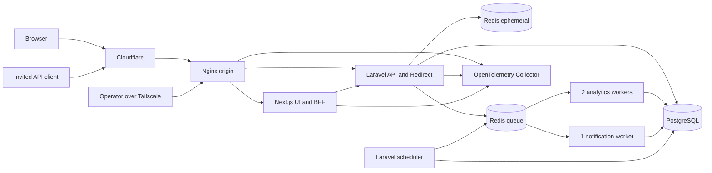
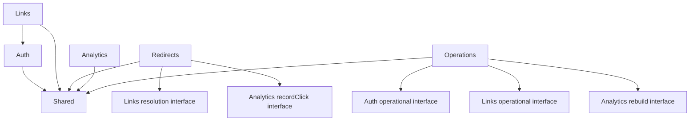

# Arquitetura

## 1. Contexto e escopo

Fake Link é um portfólio com mentalidade de produção e acesso somente por convite. A arquitetura é um monólito modular executado em uma única VM por Docker Compose. Laravel fornece a API e os redirects; Next.js fornece a interface e o BFF do navegador oficial.

Microsserviços e Kubernetes estão explicitamente fora do desenho. A separação em containers e módulos existe para isolar responsabilidades operacionais e de domínio, não para antecipar distribuição. PostgreSQL é a fonte de verdade; Redis acelera caminhos efêmeros e transporta jobs sem se tornar autoridade de domínio.

Objetivos do desenho:

- manter redirect disponível sem persistência síncrona de analytics;
- limitar estado obsoleto por TTL e permitir degradação previsível;
- preservar transações locais e regras de ownership claras;
- minimizar dados pessoais antes de filas, logs e telemetria;
- operar, observar, restaurar e atualizar a aplicação em uma única VM;
- sustentar o benchmark de referência antes do lançamento.

## 2. Princípios e limites

- PostgreSQL é a fonte de verdade para Users, Short Links, versões de destino, tokens, eventos, agregados, operações e auditoria.
- Eloquent é uma implementação interna de cada módulo, confinada à camada `Infrastructure`. Contracts de persistência existem apenas quando orientados a um caso de uso concreto; não há `Repository` genérico, Active Record compartilhado nem interfaces artificiais sobre persistência.
- Interfaces existem somente em seams reais entre módulos ou infraestrutura substituível.
- `Shared` contém apenas contratos cross-cutting sem owner natural. Não contém `BaseService`, `BaseRepository`, helpers genéricos ou regras emprestadas de outros módulos.
- Comunicação entre módulos ocorre no mesmo processo por interfaces explícitas, UseCases públicos e eventos internos; não há chamadas de rede internas.
- O caminho de redirect não espera analytics nem notificações.
- Falha de analytics reduz cobertura de métricas, não disponibilidade do redirect.
- Aliases são globais, únicos e permanentemente reservados, inclusive após exclusão de conta.
- Alterações de destino preservam histórico.
- PostgreSQL pode substituir Redis em cache miss, mas Redis nunca substitui PostgreSQL como fonte de verdade.
- O SLO interno é 99,9%; não há SLA público.

## 3. Topologia pública e privada

Existem dois domínios registráveis públicos, com nomes exatos ainda não definidos:

| Host | Superfície permitida |
| --- | --- |
| App host | Interface Next.js, BFF, `/api/v1` e `/docs` |
| Short host | `/`, `/robots.txt`, `GET /{slug}`, `HEAD /{slug}` e páginas de erro |

O Short host não publica API, autenticação, dashboard, assets desnecessários nem métodos mutáveis. Todo o produto usa `noindex`; seu `robots.txt` também usa `Disallow: /`.

Cloudflare é o único ingresso HTTP público dos dois hosts. TLS opera em modo `Full (strict)`, o cache de edge é ignorado no Short host e o origin usa certificado Let's Encrypt emitido por DNS-01. O origin aceita tráfego público somente dos ranges oficiais da Cloudflare. Tailscale é o plano privado de administração, deploy e acesso operacional.

HSTS permanece ausente de forma permanente por decisão de produto. O risco aceito é que uma primeira navegação explícita por HTTP possa sofrer downgrade antes do redirect HTTPS; essa exceção não autoriza conteúdo, cookies ou API por HTTP.

O desenvolvimento local também exige HTTPS, em `app.localhost` e `go.localhost`, com CA de desenvolvimento confiada localmente. Flags de cookie ou controles de transporte não são relaxados no ambiente local.

## 4. Módulos do backend

### 4.0 Organização física e camadas

Os módulos de negócio do backend ficam em `backend/modules/{Module}/`, com namespace raiz `Modules\{Module}`. A pasta `backend/app/` permanece reservada a componentes globais da aplicação (bootstrap HTTP, envelope de resposta, FormRequest base e tratamento centralizado de exceções).

Cada módulo segue arquitetura hexagonal conforme `LARAVEL_CODE_DESIGN.md`:

| Camada | Namespace (ex.: Auth) | Responsabilidade |
| --- | --- | --- |
| `Domain` | `Modules\Auth\Domain\...` | Entities, Value Objects, regras puras |
| `UseCases` | `Modules\Auth\UseCases\...` | Intenções da aplicação |
| `Contracts` | `Modules\Auth\Contracts\...` | Portas de saída e integrações |
| `DTOs` | `Modules\Auth\DTOs\...` | Transporte entre HTTP e UseCases |
| `Infrastructure` | `Modules\Auth\Infrastructure\...` | HTTP, Eloquent, filas, e-mail, providers |
| `ServiceProviders` | `Modules\Auth\ServiceProviders\...` | Composição e registro do módulo |
| `Tests` | `Modules\Auth\Tests\...` | Testes do módulo (preferencial) |

Autoload PSR-4: `"Modules\\": "modules/"` em `backend/composer.json`. Migrations globais continuam em `backend/database/migrations/` até haver decisão contrária documentada.

Um módulo **não** deve importar Models Eloquent, Entities de domínio ou detalhes de `Infrastructure` de outro módulo. A comunicação ocorre por contratos públicos, DTOs estáveis ou eventos internos.

### 4.1 Auth

Possui convite, registro, verificação de e-mail, login, recuperação de senha, Users, tokens Bearer e revogação. Expõe identidade autenticada e policies necessárias aos outros módulos. O modelo inicial distingue somente token de sessão e token de verificação; abilities de integração ficam adiadas.

### 4.2 Links

Possui criação de Short Link, reserva de slug, destino atual, histórico de destinos, expiração e consultas privadas. Também possui a resolução efetiva de slug. Seu contrato de leitura retorna exatamente um destes resultados:

- snapshot válido e mínimo para redirect;
- ausente;
- indisponível por estado de negócio, como bloqueio, suspensão, inatividade ou expiração.

O contrato não conhece HTTP, Redis, headers ou templates de erro. Essa fronteira garante que todas as regras que tornam um link utilizável permaneçam em `Links`.

### 4.3 Redirects

Possui a superfície HTTP do Short host, semântica de `GET` e `HEAD`, cache de resolução, headers, status e orçamento de tempo. Em cache miss, chama a interface de resolução de `Links`. Após decidir uma resposta válida, entrega o contexto efêmero ao contrato profundo de analytics em modo best-effort.

### 4.4 Analytics

Possui `recordClick`, sanitização e classificação do contexto bruto, publicação na fila, consumo idempotente, eventos detalhados, unicidade e agregados. `recordClick` é uma interface profunda: recebe contexto efêmero suficiente para a classificação, executa localmente depois da resposta e não devolve conceitos internos ao módulo chamador.

O módulo descarta IP, user-agent e referenciador bruto antes da fila. Classificação de cliente usa Matomo DeviceDetector localmente, sem serviço de terceiros.

### 4.5 Operations

Possui comandos operacionais explícitos e auditáveis:

- suspender e reativar User;
- bloquear e desbloquear Short Link;
- iniciar e reconciliar exclusão assíncrona de conta;
- reconstruir analytics a partir dos eventos detalhados.

Esses workflows coordenam módulos sem assumir seus modelos. O scheduler reconcilia o estado desejado persistido no PostgreSQL para recuperar falhas parciais. Toda ação operacional relevante gera auditoria append-only com retenção de 366 dias. Bloqueio e suspensão não enviam notificação ao User.

### 4.6 Shared

Contém somente contratos sem owner de domínio, como clock, request ID, envelope de erro e primitives técnicas realmente comuns. Um contrato com vocabulário de Link, User, Redirect ou Click pertence ao módulo correspondente, mesmo quando consumido pelos demais.

## 5. Dependências e comunicação

Mudanças que afetam resolução publicam um evento interno após o commit. Um listener síncrono tenta invalidar cache positivo e negativo. A invalidação é best-effort: sua falha é observada, mas não desfaz a transação. TTL limita o período máximo de estado obsoleto.

Não são eventos de integração distribuídos e não exigem outbox. Workflows operacionais que precisam sobreviver a falhas persistem estado no PostgreSQL e são reconciliados pelo scheduler.

## 6. Fluxos críticos

### 6.1 Criação e alteração de link

1. A API autentica o User, aplica rate limit e valida o request em `FormRequest`.
2. Um UseCase de `Links` normaliza e valida o destino, reserva o slug e persiste a versão inicial em uma transação.
3. A restrição `UNIQUE` do PostgreSQL decide colisões; slugs automáticos têm poucas novas tentativas limitadas.
4. Mudanças futuras encerram a vigência anterior e criam uma nova versão na mesma transação.
5. O commit publica o evento interno de invalidação síncrona best-effort.
6. A API responde com o Resource correspondente.

Exclusão não libera slug. A reserva mínima sobrevive sem owner nem destino.

### 6.2 Redirect

1. Nginx aceita somente uma requisição permitida do Short host, substitui o request ID e encaminha ao Laravel.
2. `Redirects` consulta o cache criptografado pelo slug.
3. Em hit válido, usa o snapshot até seu TTL; não há stale-while-revalidate.
4. Em miss, indisponibilidade do Redis ou payload corrompido, chama a resolução de `Links` no PostgreSQL.
5. Um snapshot válido produz `302 Found` e `Cache-Control: no-store`; `HEAD` produz os mesmos status e headers sem corpo.
6. Depois de enviar a resposta, `Analytics::recordClick` sanitiza, classifica e tenta publicar o evento.

O orçamento total da aplicação para redirect é 1 segundo. Se PostgreSQL estiver indisponível, hits existentes e decifráveis continuam funcionando até o TTL; misses retornam `503 Service Unavailable`. Falha de Redis apenas força PostgreSQL. Payload de cache corrompido é descartado e força banco. Falha persistente ao decifrar o destino vindo da fonte de verdade retorna `503`, nunca uma URL incerta.

### 6.3 Analytics

1. `recordClick` recebe timestamp UTC e contexto bruto somente em memória após a resposta.
2. Canonicaliza o IP, classifica tráfego como `human`, `bot`, `preview` ou `unknown` e deriva uma categoria ampla de device com Matomo DeviceDetector local.
3. Para tráfego humano, calcula a unicidade diária como `HMAC(day_key, link_id + canonical_ip + device)`.
4. Descarta IP e user-agent brutos; referenciador é reduzido somente ao dado sanitizado permitido antes de enfileirar.
5. O worker grava cada evento, sua unicidade e os agregados afetados em uma única transação PostgreSQL por evento.

Bots, previews e tráfego desconhecido podem ser contados por categoria, mas nunca entram em human uniques. Não são persistidas categorias de browser ou sistema operacional. O payload de fila não contém dados brutos. A perda de publicação após a resposta é aceita, medida e alertada; Redis counters foram rejeitados por criarem outra fonte de verdade e uma janela adicional de perda.

## 7. Cache de redirect

O Redis efêmero armazena um payload mínimo cifrado com AES-256-GCM e keyring dedicado. O payload contém somente o necessário para produzir status e `Location`; não contém analytics, owner, histórico ou dados de API.

| Resultado | TTL base | Regra adicional |
| --- | --- | --- |
| Snapshot ativo | 5 minutos | Nunca ultrapassa a expiração do link |
| Slug ausente | 30 segundos | Cache negativo |
| Link indisponível | 30 segundos | Sem revelar a causa publicamente |

Todos os TTLs recebem jitter uniforme de mais ou menos 10% e são sempre limitados pela expiração de domínio. Não há distributed lock no preenchimento; leituras concorrentes ocasionais no PostgreSQL são preferíveis à complexidade e ao risco de lock. Nenhuma resposta usa conteúdo além do TTL.

O keyring diferencia chaves atuais e anteriores para rotação controlada. Falhas de autenticação GCM são tratadas como corrupção, nunca como cache miss confiável silencioso: geram métrica, remoção best-effort e fallback para a fonte de verdade.

## 8. BFF e acesso à API

O BFF Next.js é o único gateway de browser para endpoints autenticados. O browser oficial nunca chama diretamente a API Laravel privada. O BFF expõe somente operações conhecidas, não um proxy genérico.

A API em `/api/v1` continua publicamente alcançável para Users convidados e para uso pelo Swagger. Clientes diretos enviam Bearer; Laravel armazena somente seu hash. A atualização de `last_used_at` é limitada a uma gravação a cada 15 minutos por token.

Fluxo da sessão oficial:

1. Next autentica contra Laravel e recebe um Bearer.
2. O BFF cifra o Bearer com AES-256-GCM e chave externa ao Redis.
3. O browser recebe um ID opaco aleatório de 256 bits em cookie `__Host-`, `HttpOnly`, `Secure`, `SameSite=Lax` e `Path=/`.
4. A chave Redis usa HMAC do ID de sessão; o ID bruto não é chave nem valor pesquisável no Redis.
5. Rotas mutáveis exigem `Origin` exata e double-submit CSRF vinculado à sessão por HMAC.
6. O BFF decifra o Bearer e chama a rota Laravel explicitamente permitida.

Sessões completas expiram em 7 dias absolutos ou 24 horas de inatividade. Sessões de User ainda não verificado expiram em 24 horas absolutas ou 1 hora de inatividade. Perda do Redis encerra todas as sessões BFF. Logout sempre apaga cookie e estado local, mesmo quando a revogação no Laravel falha.

O orçamento da API privada, incluindo chamadas BFF para Laravel, é 10 segundos.

## 9. Redis e filas

Há duas instâncias independentes:

| Instância | Usos | Persistência | Política de memória |
| --- | --- | --- | --- |
| `redis-ephemeral` | Cache, rate limiting e sessões BFF | Desativada | Eviction habilitado e configurado |
| `redis-queue` | Filas Laravel | AOF | `noeviction` |

As filas são:

- `analytics`, consumida por dois workers;
- `notifications`, consumida por um worker.

Workers usam `queue:work`, timeout explícito, encerramento gracioso e limites compatíveis com o orçamento do job. Horizon não é usado.

Jobs de analytics têm cinco tentativas, com backoff de 5 segundos, 30 segundos, 2 minutos e 10 minutos. Depois disso, permanecem em `failed_jobs` por 30 dias para inspeção e replay controlado. Jobs de notificação têm payload criptografado, cinco tentativas distribuídas por aproximadamente 21 minutos e tokens armazenados somente como hash no PostgreSQL.

Profundidade, idade, tempo até persistência, falha final e perda de publicação são métricas distintas. Analytics deve atingir `p95 < 60 s` entre redirect e persistência e drenar o backlog de referência em menos de 5 minutos.

## 10. Persistência e retenção

- Todos os timestamps de domínio são UTC.
- Eventos detalhados usam partições diárias, retidas por 90 dias.
- Partições são pré-criadas com 7 dias de antecedência; ausência de partição futura gera alerta antes de afetar ingestão.
- Agregados horários são retidos por 31 dias.
- Agregados diários são retidos por 366 dias.
- Auditoria operacional append-only é retida por 366 dias.
- `Analytics` fornece comando de rebuild a partir das partições detalhadas ainda disponíveis.
- O scheduler remove partições e agregados vencidos e reconcilia workflows operacionais pendentes.
- Conexões PostgreSQL são limitadas por processo; PgBouncer não é usado inicialmente.

Um rebuild nunca promete recuperar publicação perdida antes da fila nem períodos já removidos. Esses limites devem aparecer no runbook operacional.

## 11. Docker Compose e capacidade inicial

A referência de produção é uma VM com 4 vCPU, 8 GB de RAM e SSD de 200 GB criptografado pelo provider. Não há dependência de arquitetura específica do host porque as imagens publicadas são multiarch `linux/amd64` e `linux/arm64`.

Serviços principais:

- `nginx`;
- `frontend`;
- `backend`;
- `scheduler`;
- dois `analytics-worker`;
- um `notification-worker`;
- `postgres`;
- `redis-ephemeral`;
- `redis-queue`.

O profile padrão inicia a aplicação e suas dependências. Profiles adicionais habilitam observabilidade, documentação e carga em desenvolvimento. Produção habilita a stack completa de observabilidade: OpenTelemetry Collector, Prometheus, Tempo, Loki e Grafana.

Containers possuem health checks, budgets de CPU/memória e encerramento gracioso. PostgreSQL, Redis e backends de observabilidade não são publicados na internet.

## 12. Observabilidade

OpenTelemetry deve estar completo e ativo também durante o benchmark, para que a meta inclua seu custo real.

### 12.1 Coleta e retenção

- Collector centraliza métricas, traces e logs.
- Tail sampling conserva todos os erros e requests lentos, 10% dos sucessos privados e 1% dos redirects bem-sucedidos.
- Métricas e logs ficam por 30 dias; traces, por 7 dias.
- Grafana é acessível somente por túnel SSH sobre Tailscale.
- Better Stack verifica uptime externamente.
- Não há status page pública.

### 12.2 Minimização

Nginx gera ou sobrescreve request ID e remove trace headers recebidos. A aplicação não propaga contexto de trace controlado pelo cliente.

Uma allowlist estrita define atributos de telemetria; o Collector aplica uma segunda camada de redação. URL, query string, IP, user-agent, token, e-mail, destino e body nunca entram em métricas, logs ou traces. Somente route templates e IDs internos explicitamente aprovados podem aparecer em logs e traces. Nenhum ID, slug, e-mail ou outro valor de alta cardinalidade pode ser label de métrica.

Métricas mínimas incluem:

- taxa, erro e latência `p50`, `p95` e `p99` por route template;
- cache hit, miss, corrupção, falha de decrypt e fallback PostgreSQL;
- disponibilidade e conexões do PostgreSQL e dos dois Redis;
- publicação, perda, profundidade, idade, retries e falhas de cada fila;
- tempo até persistência de analytics e duração de rebuild;
- workflows operacionais pendentes e falhos;
- uso de CPU, RAM, disco e crescimento por retenção.

## 13. Provisionamento, entrega e segredos

- Ansible provisiona e endurece o host de forma reproduzível.
- GitHub exige pull request e checks; releases seguem SemVer.
- GitHub Actions constrói imagens multiarch, gera SBOM, assina com Cosign e publica no GHCR.
- Deploy usa tags imutáveis e digests verificados, nunca tags mutáveis como fonte de verdade.
- O deploy pelo plano Tailscale admite interrupção máxima de 60 segundos e inclui rollback por digest anterior.
- Segredos são versionados cifrados com SOPS e age, com recovery dividido entre vault e GitHub.
- Nenhum segredo entra em imagem, Git, logs, traces, argumentos de build ou artefatos públicos.

Keyrings persistentes, keyring do cache, chave de sessão BFF e HMACs têm materiais e finalidades separados. Dados persistentes e cache usam AES-256-GCM com versionamento de chave. Rotacionar a chave BFF encerra sessões. Chaves HMAC são rotacionadas somente em boundaries definidos para não misturar períodos de unicidade ou rate limiting.

## 14. Backup e recuperação

Um `pg_dump` diário em formato custom é cifrado e enviado ao Cloudflare R2. A credencial presente na VM pode criar objetos, mas não apagá-los. A política conserva 14 backups diários e 3 mensais.

- RPO: 24 horas.
- RTO: 4 horas.
- Restore completo é obrigatório antes do lançamento e trimestralmente depois dele.
- O runbook valida decrypt, download, restore, migrations, integridade, login e resolução de amostras.
- Redis e backends OpenTelemetry não são incluídos em backup.
- Criptografia de volume pelo provider é requisito de produção, não substituto do backup cifrado.

O backup migra de lógico para físico antes de o banco atingir 20 GB ou antes de backup mais restore somarem 2 horas, o que ocorrer primeiro.

## 15. SLO e benchmark de referência

A referência de 1 milhão de redirects por dia é um benchmark de capacidade, não SLA ou previsão de tráfego. O cenário nominal concentra aproximadamente dez vezes a média desse volume e é executado contra o origin por rede privada, sem Cloudflare, mas com TLS, logs, traces, métricas, filas e Collector ativos.

### Redirect

- Dataset: 100 mil links.
- Distribuição: 80% do tráfego concentrado em 20% dos links.
- Carga: 120 RPS por 15 minutos.
- Meta: `p95 < 100 ms`, `p99 < 250 ms` e erro `< 0,1%`.
- Analytics: atraso `p95 < 60 s` e backlog drenado em `< 5 min` após a carga.

### API privada

- Carga: 20 RPS por 10 minutos em operações representativas.
- Meta: `p95 < 300 ms`, `p99 < 750 ms` e erro inesperado `< 0,1%`.

Resultados, versão das imagens, digest, dataset e configuração da VM são arquivados como evidência de lançamento. Falhar a meta não dispara mudança automática para microsserviços; primeiro exige profiling, índices, limites de conexão e tuning dos processos existentes.

## 16. Requisitos de lançamento e runbooks

Antes do lançamento devem estar concluídos e exercitados:

- roteamento dos dois hosts e allowlist de métodos/caminhos;
- Cloudflare `Full (strict)`, bypass de edge cache e firewall do origin;
- HTTPS local e de produção, com verificação explícita de ausência de HSTS;
- restore pré-lançamento dentro do RTO;
- rotação de cada classe de chave e rollback documentado;
- perda de cada Redis, falha de PostgreSQL, cache corrompido e fila acumulada;
- suspensão/reativação, bloqueio/desbloqueio, exclusão e rebuild;
- deploy e rollback com interrupção de no máximo 60 segundos;
- alertas Better Stack e alertas internos sem dados sensíveis;
- benchmark completo com OpenTelemetry ativo;
- revisão humana de segurança, Termos de Uso e Política de Privacidade.

Decisões de produto e schemas de endpoint permanecem nos documentos próprios; este documento define fronteiras, dependências e comportamento operacional.
