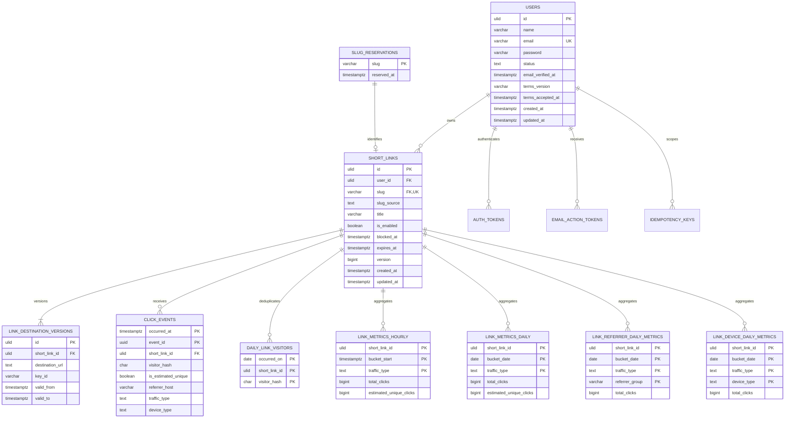

# Modelo de domínio e dados

## 1. Princípios

- PostgreSQL é a fonte de verdade. Redis é somente cache, broker de filas e armazenamento efêmero reconstruível.
- Identificadores das entidades de domínio usam ULID. Eventos de clique usam UUIDv7.
- Datas e horas são armazenadas como `timestamptz` em UTC; buckets diários usam a data UTC.
- Alterações de destino são versionadas e preservam o histórico enquanto o link existir.
- Slugs têm semântica global sem diferenciação de caixa, são persistidos em minúsculas e nunca são reutilizados.
- IP, user-agent, URL completa de referência, URL de destino e query strings potencialmente sensíveis nunca são persistidos em eventos de analytics.
- PostgreSQL não usa tipos `ENUM` nativos. Estados e categorias são `text` ou `varchar` com `CHECK`, espelhados por enums no código.
- Chaves estrangeiras usam `RESTRICT` por padrão. Exclusões são explícitas e ordenadas; somente tabelas pequenas e inseparáveis de tokens podem usar `CASCADE`.
- Dados sensíveis em destinos, cache e snapshots de idempotência usam criptografia de aplicação AES-256-GCM, com keyrings separados e rotação de chaves.

## 2. Relacionamentos



`audit_events` não possui chave estrangeira para as entidades auditadas. Essa independência permite preservar o registro operacional pelo prazo definido após a exclusão dos dados de domínio.

## 3. Contas, termos e tokens

### `users`

| Campo | Tipo conceitual | Regra |
| --- | --- | --- |
| `id` | ULID | Chave primária |
| `name` | varchar(120) | Obrigatório |
| `email` | varchar(254) | Obrigatório, normalizado para minúsculas e único |
| `password` | varchar | Hash Argon2id; nunca contém senha reversível |
| `status` | text | `CHECK` para `pending_verification`, `active`, `suspended` ou `deletion_pending` |
| `email_verified_at` | timestamptz, nullable | Instante da verificação do e-mail |
| `terms_version` | varchar | Versão dos termos aceitos |
| `terms_accepted_at` | timestamptz | Instante da aceitação dos termos |
| `created_at` | timestamptz | UTC |
| `updated_at` | timestamptz | UTC |

O e-mail é imutável no perfil. A unicidade é aplicada ao valor já normalizado, sem depender da collation do banco. Não existe histórico ou tombstone permanente contendo o e-mail após a exclusão; por isso, o mesmo endereço exato, inclusive quando convidado novamente, pode criar uma conta nova depois da conclusão da exclusão anterior.

### `auth_tokens`

Tokens Bearer seguem o armazenamento por hash do Laravel. O valor completo existe somente na emissão e não pode ser recuperado do banco.

| Campo | Tipo conceitual | Regra |
| --- | --- | --- |
| `id` | ULID | Chave primária |
| `user_id` | ULID | Conta associada |
| `token_hash` | char(64) | Hash do token, único; o valor bruto não é persistido |
| `token_kind` | text | `CHECK` para `verification` ou `session` |
| `expires_at` | timestamptz | Expiração absoluta obrigatória |
| `last_used_at` | timestamptz, nullable | Atualizado no máximo uma vez a cada 15 minutos |
| `created_at` | timestamptz | UTC |

Não há `device_name`, abilities ou tokens de integração. A atualização limitada de `last_used_at` evita uma escrita por requisição. Tokens são revogados na suspensão quando exigido pela política de segurança e removidos na exclusão da conta.

### `email_action_tokens`

Tokens enviados por e-mail são de uso único e contêm somente o necessário para executar a ação.

| Campo | Tipo conceitual | Regra |
| --- | --- | --- |
| `id` | ULID | Chave primária |
| `user_id` | ULID | Conta associada |
| `token_hash` | char(64) | Hash único; nunca o token bruto |
| `purpose` | text | Finalidade permitida, validada por `CHECK` e enum no código |
| `expires_at` | timestamptz | Expiração absoluta |
| `used_at` | timestamptz, nullable | Preenchido atomicamente no primeiro uso |
| `created_at` | timestamptz | UTC |

A validação exige finalidade correta, não expiração e `used_at IS NULL`; consumo e alteração da conta ocorrem na mesma transação. Payloads de jobs de notificação que precisem transportar o token bruto são criptografados e não o registram em logs ou falhas de fila.

### Exclusão de conta

1. A solicitação altera `users.status` para `deletion_pending`, revoga os tokens utilizáveis e registra o comando em `audit_events`.
2. Um job assíncrono e retomável remove em lotes todos os eventos, visitantes auxiliares, agregados, versões de destino, links, chaves de idempotência, tokens e, por último, o usuário; entradas correspondentes em cache também são invalidadas.
3. As remoções respeitam dependências e FKs `RESTRICT`; não há cascata ampla que possa ocultar trabalho incompleto.
4. `slug_reservations` permanece para sempre, sem proprietário ou referência ao link removido.
5. O evento de conclusão é registrado com identificadores opacos, sem e-mail ou URL, e permanece por 366 dias.

## 4. Links, slugs e destinos

### `short_links`

| Campo | Tipo conceitual | Regra |
| --- | --- | --- |
| `id` | ULID | Chave primária |
| `user_id` | ULID | FK imutável para `users.id`, com `RESTRICT` |
| `slug` | varchar(48) | FK para `slug_reservations.slug`, único, global, minúsculo e imutável |
| `slug_source` | text | `CHECK` para `automatic` ou `custom` |
| `title` | varchar(160), nullable | Nome privado para organização |
| `is_enabled` | boolean | Controle do proprietário para o redirect |
| `blocked_at` | timestamptz, nullable | Bloqueio administrativo persistente |
| `expires_at` | timestamptz, nullable | Expiração em UTC; o instante é limite exclusivo |
| `version` | bigint | Versão interna monotônica para controle de concorrência; não é gravável pelo cliente |
| `created_at` | timestamptz | UTC |
| `updated_at` | timestamptz | UTC |

Não existe endpoint para excluir um link. O estado efetivo não é persistido em uma coluna adicional; ele é derivado, nesta precedência:

1. `blocked`, quando `blocked_at IS NOT NULL`.
2. `expired`, quando não bloqueado e `expires_at <= now()`.
3. `inactive`, quando não bloqueado, não expirado e `is_enabled = false`.
4. `active`, nos demais casos.

O motivo de um bloqueio administrativo fica somente em `audit_events`, não no recurso. O proprietário pode editar título, destino, expiração e habilitação de um link bloqueado, mas essas alterações não limpam `blocked_at` nem tornam o redirect disponível.

### `slug_reservations`

| Campo | Tipo conceitual | Regra |
| --- | --- | --- |
| `slug` | varchar(48) | Chave primária, ASCII minúsculo |
| `reserved_at` | timestamptz | Instante da primeira reserva |

A reserva e o link são inseridos na mesma transação. A tabela não guarda proprietário nem referência ao link e uma reserva nunca é removida. A FK parte de `short_links.slug` para a reserva; a unicidade de `short_links.slug` permite no máximo um recurso associado. Quando uma reserva existe sem link, o acesso público ao slug responde `410 Gone`.

#### Slug automático

- Tem exatamente 8 caracteres Base36 minúsculos (`a-z` e `0-9`) gerados por fonte criptograficamente segura.
- É validado contra a denylist e inserido primeiro em `slug_reservations`.
- Uma colisão na chave primária gera nova tentativa até o limite de cinco tentativas; o banco decide a concorrência.

#### Alias personalizado

- A entrada é normalizada e persistida em ASCII minúsculo.
- O comprimento permitido é de 3 a 48 caracteres.
- Aceita somente letras `a-z`, números e hífen.
- Deve começar e terminar com letra ou número e não aceita hífens consecutivos.
- Não pode pertencer à denylist pequena de confiança e operação: `admin`, `api`, `login`, `register`, `docs`, `health`, `status`, `support`, `terms` e `privacy`.

Regex de referência após a normalização:

```regex
^[a-z0-9](?:[a-z0-9]|-(?!-)){1,46}[a-z0-9]$
```

Como toda entrada é convertida antes da validação e a chave persistida é minúscula, criação e resolução têm semântica global sem diferenciação de caixa.

### `link_destination_versions`

| Campo | Tipo conceitual | Regra |
| --- | --- | --- |
| `id` | ULID | Chave primária |
| `short_link_id` | ULID | FK para `short_links.id`, com `RESTRICT` |
| `destination_url` | text criptografado | Envelope AES-256-GCM da URL normalizada, limite de 2.048 caracteres antes da criptografia |
| `key_id` | varchar | Identifica a chave do keyring de destinos |
| `valid_from` | timestamptz | Início inclusivo da vigência |
| `valid_to` | timestamptz, nullable | Fim exclusivo; nulo somente para a versão atual |

Restrições e índices:

- Índice parcial único em `short_link_id WHERE valid_to IS NULL`, garantindo uma única versão atual.
- `CHECK (valid_to IS NULL OR valid_to > valid_from)`.
- Índice por `(short_link_id, valid_from DESC)` para leitura do histórico.

A primeira versão nasce na transação de criação do link. Para trocar o destino, a Action bloqueia o link e sua versão atual, encerra a vigência anterior e insere a nova versão na mesma transação. Concorrência usa locks explícitos e a constraint parcial como última defesa.

#### Validação e normalização do destino

- O comprimento máximo é 2.048 caracteres e o esquema deve ser `http` ou `https`.
- A URL deve ter hostname público válido. Literais IPv4/IPv6, endereços locais ou privados, nomes locais e o próprio host público do encurtador são bloqueados.
- Userinfo (`user:password@host`) é proibido.
- A autoridade é analisada por parser de URL, nunca por concatenação ou busca textual. Esquema e hostname são canonicalizados com segurança antes das verificações de bloqueio.
- Query, fragmento e portas personalizadas válidas são preservados. A normalização não decodifica e recodifica componentes de modo a alterar seu significado.
- O valor normalizado é validado antes da criptografia e novamente tratado como dado não confiável ao ser usado no redirect.

O envelope armazena nonce, ciphertext e tag autenticada no valor criptografado; `key_id` permite rotação sem misturar a chave ao dado. Busca por URL de destino não é suportada.

## 5. Eventos de clique e visitantes estimados

### `click_events`

Tabela particionada diariamente por `occurred_at`. Partições são pré-criadas com sete dias de antecedência e removidas ao completar 90 dias.

| Campo | Tipo conceitual | Regra |
| --- | --- | --- |
| `occurred_at` | timestamptz | Instante imutável recebido pelo redirect e chave de particionamento |
| `event_id` | UUIDv7 | Identificador imutável do evento |
| `short_link_id` | ULID | FK para `short_links.id`, com `RESTRICT` |
| `visitor_hash` | char(64), nullable | HMAC diário, preenchido somente para tráfego `human` |
| `is_estimated_unique` | boolean, nullable | Preenchido somente para tráfego `human` |
| `referrer_host` | varchar(253), nullable | Host público completo e normalizado; nulo para acesso direto ou referência inválida |
| `traffic_type` | text | `CHECK` para `human`, `bot`, `preview` ou `unknown` |
| `device_type` | text | `CHECK` para `desktop`, `mobile`, `tablet`, `other` ou `unknown` |

A chave primária é `(occurred_at, event_id)`, incluindo a chave de particionamento conforme exigido pelo PostgreSQL. O produtor mantém os dois valores em retries. Constraints garantem que `visitor_hash` e `is_estimated_unique` sejam ambos nulos para tráfego não humano. Para tráfego humano, ambos podem ser nulos quando não for possível derivar o identificador; quando houver hash, a estimativa também é obrigatória.

O evento nunca contém:

- IP bruto ou reversível;
- user-agent bruto;
- URL completa do referenciador;
- URL ou versão do destino;
- parâmetros de consulta sensíveis.

Somente um hostname público, completo e normalizado pode preencher `referrer_host`. Acesso direto é representado por nulo no evento e agrupado como `direct` nos agregados.

### Identificador diário de visitante

O identificador serve apenas para estimar visitantes únicos humanos por link e dia, sem representar uma identidade real:

```text
visitor_hash = HMAC-SHA-256(daily_key, short_link_id || canonical_ip || device_type)
```

- `daily_key` é derivada de segredo rotacionável e da data UTC.
- `canonical_ip` existe somente em memória durante o processamento e nunca é persistido ou enviado a logs.
- `device_type` é a categoria reduzida já gravada no evento; o user-agent original é descartado.
- Incluir `short_link_id` impede correlação do mesmo visitante entre links.
- A chave diária impede correlação longitudinal direta.
- NAT, VPN, bloqueios de privacidade e mudanças de rede tornam o resultado uma estimativa.

### `daily_link_visitors`

Tabela particionada diariamente por `occurred_on` e mantida por sete dias.

| Campo | Tipo conceitual | Regra |
| --- | --- | --- |
| `occurred_on` | date | Data UTC e chave de particionamento |
| `short_link_id` | ULID | FK para `short_links.id`, com `RESTRICT`, e parte da chave primária |
| `visitor_hash` | char(64) | Parte da chave primária |

A chave primária é `(occurred_on, short_link_id, visitor_hash)`. Para evento humano com hash disponível, o worker tenta inserir com `ON CONFLICT DO NOTHING`; inserção bem-sucedida define `is_estimated_unique = true` e conflito define `false`.

Um replay atrasado além dos sete dias consulta `click_events` para o mesmo link, dia e hash enquanto os eventos ainda estiverem dentro dos 90 dias de retenção. Evento recebido ou reprocessado depois dessa retenção é descartado, sem recriar partição expirada nem alterar agregados.

## 6. Agregados de analytics

Dashboards consultam agregados, não varrem eventos detalhados em operações comuns. Todos os contadores usam `bigint`, são não negativos e são atualizados na mesma transação que insere o evento. A inserção bem-sucedida da chave `(occurred_at, event_id)` autoriza as demais mutações; conflito encerra o processamento sem incrementar qualquer agregado. Assim, o evento é a chave idempotente de toda a atualização analítica.

`estimated_unique_clicks` só tem significado para `traffic_type = human`. Nas demais categorias seu valor persistido e retornado pela API é `null`, nunca zero.

### `link_metrics_hourly`

Uma linha por link, hora UTC e tipo de tráfego.

| Campo | Tipo conceitual | Regra |
| --- | --- | --- |
| `short_link_id` | ULID | FK para `short_links.id`, com `RESTRICT`, e parte da chave primária |
| `bucket_start` | timestamptz | Hora UTC truncada, parte da chave primária |
| `traffic_type` | text | Parte da chave primária, com o mesmo `CHECK` dos eventos |
| `total_clicks` | bigint | Total de eventos da categoria |
| `estimated_unique_clicks` | bigint, nullable | Estimativa somente para `human` |
| `updated_at` | timestamptz | Última atualização |

Chave primária: `(short_link_id, bucket_start, traffic_type)`. Retenção de 31 dias.

### `link_metrics_daily`

Uma linha por link, dia UTC e tipo de tráfego, com os mesmos campos semânticos de `link_metrics_hourly`.

| Campo | Tipo conceitual | Regra |
| --- | --- | --- |
| `short_link_id` | ULID | FK para `short_links.id`, com `RESTRICT`, e parte da chave primária |
| `bucket_date` | date | Dia UTC, parte da chave primária |
| `traffic_type` | text | Parte da chave primária |
| `total_clicks` | bigint | Total de eventos da categoria |
| `estimated_unique_clicks` | bigint, nullable | Estimativa somente para `human` |
| `updated_at` | timestamptz | Última atualização |

Chave primária: `(short_link_id, bucket_date, traffic_type)`. Retenção de 366 dias.

### `link_referrer_daily_metrics`

Uma linha por link, dia UTC, tipo de tráfego e grupo de referência.

| Campo | Tipo conceitual | Regra |
| --- | --- | --- |
| `short_link_id` | ULID | FK para `short_links.id`, com `RESTRICT`, e parte da chave primária |
| `bucket_date` | date | Dia UTC, parte da chave primária |
| `traffic_type` | text | Parte da chave primária |
| `referrer_group` | varchar(253) | Host público completo e normalizado ou o valor reservado `direct` |
| `total_clicks` | bigint | Total de eventos; não calcula únicos |
| `updated_at` | timestamptz | Última atualização |

Chave primária: `(short_link_id, bucket_date, traffic_type, referrer_group)`. A consulta de top referências retorna os hosts mais frequentes, mantém `direct` como grupo explícito e soma o restante em `other` na resposta; `other` não precisa ser uma linha persistida. Retenção de 366 dias.

### `link_device_daily_metrics`

Uma linha por link, dia UTC, tipo de tráfego e categoria de dispositivo.

| Campo | Tipo conceitual | Regra |
| --- | --- | --- |
| `short_link_id` | ULID | FK para `short_links.id`, com `RESTRICT`, e parte da chave primária |
| `bucket_date` | date | Dia UTC, parte da chave primária |
| `traffic_type` | text | Parte da chave primária |
| `device_type` | text | Parte da chave primária, com o mesmo `CHECK` dos eventos |
| `total_clicks` | bigint | Total de eventos; não calcula únicos |
| `updated_at` | timestamptz | Última atualização |

Chave primária: `(short_link_id, bucket_date, traffic_type, device_type)`. Retenção de 366 dias.

## 7. Idempotência de comandos

O header `Idempotency-Key` é opcional. Quando enviado, deve ter entre 16 e 128 caracteres no conjunto ASCII `[A-Za-z0-9._:-]`. O valor bruto nunca é persistido nem registrado.

### `idempotency_keys`

| Campo | Tipo conceitual | Regra |
| --- | --- | --- |
| `user_id` | ULID | FK para `users.id`, com `RESTRICT`, e parte da chave única |
| `key_hash` | char(64) | HMAC do valor recebido e parte da chave única; nunca a chave bruta |
| `request_fingerprint` | char(64) | HMAC do comando normalizado, incluindo operação e payload |
| `response_snapshot` | bytea criptografado | Snapshot exato do status, headers originais e bytes do corpo original |
| `key_id` | varchar | Identifica a chave do keyring exclusivo de idempotência |
| `created_at` | timestamptz | UTC |
| `expires_at` | timestamptz | Exatamente 24 horas após a criação |

A constraint única é `(user_id, key_hash)`. O fingerprint usa HMAC com chave de aplicação separada e uma representação canônica do comando, evitando comparação de hashes sem chave e diferenças irrelevantes de serialização.

A primeira execução reserva a chave e conclui o comando na unidade transacional definida pela Action. Repetição com o mesmo fingerprint descriptografa e reproduz exatamente status, headers e corpo originais, mesmo que o recurso tenha mudado depois. A mesma chave com fingerprint diferente retorna `409 Conflict`. Registros expirados são removidos pelo scheduler; não se reconstrói resposta a partir do estado atual do recurso.

## 8. Auditoria operacional

### `audit_events`

Tabela append-only para comandos executados por Operations e ações administrativas relevantes.

| Campo | Tipo conceitual | Regra |
| --- | --- | --- |
| `id` | ULID | Chave primária |
| `action` | varchar | Ação estável, definida no código |
| `target_type` | varchar | Tipo lógico do alvo |
| `target_id` | varchar | Identificador opaco, sem FK |
| `operator_id` | varchar | Identificador opaco do operador ou serviço, sem dado de contato |
| `reason` | varchar, nullable | Justificativa operacional sanitizada |
| `occurred_at` | timestamptz | Instante UTC e imutável |

Auditoria inclui solicitação e conclusão de exclusão de conta, bloqueio e desbloqueio administrativo e reconstrução de agregados. Não armazena e-mail, URL, token, IP, payload completo nem outros dados que permitam recuperar esses valores. Eventos não são atualizados; correções são novos eventos. Retenção de 366 dias.

## 9. Consistência, acesso e índices

- O isolamento padrão é `READ COMMITTED`, combinado com constraints, transações curtas e locks explícitos nos fluxos concorrentes.
- Conexões diretas ao PostgreSQL são limitadas aos serviços e workers autorizados. Clientes públicos nunca acessam o banco.
- Criação de link insere chave de idempotência, reserva, link e primeira versão de destino conforme a mesma fronteira transacional do comando.
- Troca de destino bloqueia a versão atual e preserva exatamente uma versão aberta.
- Persistência do evento, deduplicação diária e todos os agregados aplicáveis ocorre em uma transação idempotente por evento.
- Redis acelera a resolução pública, mas misses e perda total do cache são recuperáveis pelo PostgreSQL.
- FKs usam `RESTRICT`; o job de exclusão apaga explicitamente folhas antes dos pais. Cascata é admitida apenas para pequenas tabelas de tokens inseparáveis da conta.
- O cursor de paginação é um artefato opaco da API e não uma entidade ou tabela do banco.

### Busca de links

- Busca exige pelo menos dois caracteres após normalização.
- Prefixo de slug consulta o valor já persistido em minúsculas e usa índice apropriado para prefixo.
- Substring de título usa `pg_trgm` com índice GIN sobre a expressão normalizada para caixa.
- Comparação de slug e título não diferencia caixa, mas diferencia acentos; não há remoção de diacríticos.

## 10. Criptografia e proteção física

- Destinos usam envelopes AES-256-GCM e keyring próprio, identificado por `link_destination_versions.key_id`.
- Snapshots de idempotência usam outro keyring AES-256-GCM; comprometimento de uma finalidade não expõe a outra.
- Valores sensíveis mantidos em cache usam um terceiro keyring AES-256-GCM e TTL limitado. A chave não reside no Redis.
- Nonces são únicos por chave, tags são verificadas antes do uso e rotação pode recriptografar registros sem alterar seu significado.
- Chaves ficam fora do PostgreSQL, Redis, imagens de container e repositório.
- Criptografia de volume fornecida pela infraestrutura protege PostgreSQL, Redis persistente quando habilitado e discos de workers.
- Backups são cifrados antes do upload, também usam a proteção do provider, têm acesso restrito e seguem as políticas de retenção e descarte definidas para o R2.

Criptografia física complementa, mas não substitui, a criptografia de aplicação de destinos, cache e snapshots.

## 11. Particionamento e retenção

| Dado | Particionamento | Retenção |
| --- | --- | --- |
| Contas, links e destinos | Não obrigatório inicialmente | Até a conclusão da exclusão da conta |
| Reservas de slug | Não | Permanente |
| `click_events` | Diário por `occurred_at`; sete dias pré-criados | 90 dias |
| `daily_link_visitors` | Diário por `occurred_on` | 7 dias |
| `link_metrics_hourly` | Conforme volume; buckets horários | 31 dias |
| `link_metrics_daily` | Conforme volume; buckets diários | 366 dias |
| `link_referrer_daily_metrics` | Conforme volume; buckets diários | 366 dias |
| `link_device_daily_metrics` | Conforme volume; buckets diários | 366 dias |
| `idempotency_keys` | Não | 24 horas |
| `audit_events` | Conforme volume | 366 dias |
| Logs operacionais | Fora do modelo transacional | 30 dias |
| Jobs com falha | Fora do modelo transacional | 30 dias, com payload sanitizado ou criptografado quando necessário |
| Traces distribuídos | Fora do modelo transacional | 7 dias |

O scheduler pré-cria e valida partições futuras, alerta sobre ausência de partição e remove partições vencidas em vez de apagar eventos linha a linha. A exclusão de conta não espera a retenção: remove explicitamente todos os eventos e agregados pertencentes aos links da conta, preservando apenas reservas e auditoria opaca dentro de seus respectivos prazos.
